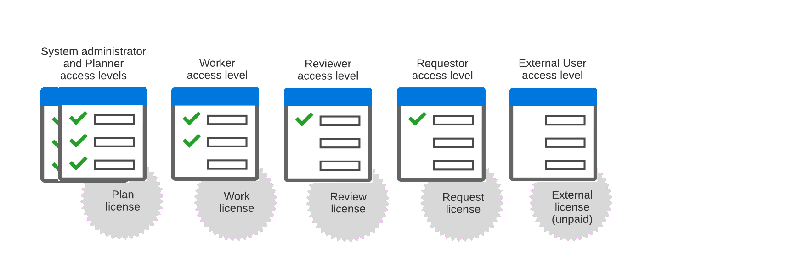

# Overzicht van toegangsniveaus

<!-- Audited: 12/2023 -->

Als beheerder van Adobe Workfront, wijst u een toegangsniveau aan een gebruiker voor twee doeleinden toe:

* Elke gebruiker moet een toegangsniveau hebben om zich aan te melden en in Workfront te werken.
* Met het toegangsniveau kunt u bepalen wat een gebruiker kan zien en doen met bepaalde Workfront-objecten en -gebieden.

Elk van de zes ingebouwde toegangsniveaus is verbonden aan één van de vijf Workfront vergunningen: Plan, het Werk, het Overzicht, het Verzoek, en Extern.

External is een niet-betaalde licentie die voornamelijk is ontworpen voor het delen van documenten met medewerkers die geen Workfront gebruiken.

Raadpleeg de volgende artikelen voor informatie over verwante onderwerpen:

<table style="table-layout:auto"> 
 <col> 
 <col> 
 <thead> 
  <tr> 
   <th>Onderwerp</th> 
   <th>Artikelen</th> 
  </tr> 
 </thead> 
 <tbody> 
  <tr> 
   <td>
<strong>Licenties</strong>
</td> 
   <td> 
De vergunning verbonden aan een toegangsniveau bepaalt hoe het toegangsniveau kan worden gevormd.
 
Zie voor meer informatie <a href="../../../administration-and-setup/add-users/access-levels-and-object-permissions/wf-licenses.md" class="MCXref xref">Overzicht van licenties</a>.
 
<strong>Tip</strong>: U kunt zien welk toegangsniveau en welke vergunning aan elke gebruiker door een gebruikerslijst of een rapport wordt toegewezen te bekijken. Zie voor instructies <a href="../../../administration-and-setup/add-users/access-levels-and-object-permissions/list-access-levels-and-licenses-for-your-users.md" class="MCXref xref">De toegangsniveaus en licenties van uw gebruikers weergeven</a>.
 </td> 
  </tr> 
  <tr> 
   <td><strong>Ingebouwde toegangsniveaus</strong></td> 
   <td> 
Voor meer informatie over de 6 ingebouwde toegangsniveaus die in het beeld hierboven worden getoond, zie <a href="../../../administration-and-setup/add-users/access-levels-and-object-permissions/default-access-levels-in-workfront.md" class="MCXref xref">Ingebouwde toegangsniveaus in Adobe Workfront</a>.
 </td> 
  </tr> 
  <tr> 
   <td><strong>Toegangsniveaus toewijzen</strong></td> 
   <td> 
Voor instructies over hoe te om een toegangsniveau aan een gebruiker toe te wijzen, zie <a href="../../../administration-and-setup/add-users/create-and-manage-users/edit-a-users-profile.md" class="MCXref xref">Gebruikersprofiel bewerken</a>.
 </td> 
  </tr> 
  <!--
  <tr> 
   <td>Access levels and proofing</td> 
   <td> 
Your users' access levels can affect proofing for each permission profile. For more information, see the section in the article .
 </td> 
  </tr> 
  -->
 </tbody> 
</table>
