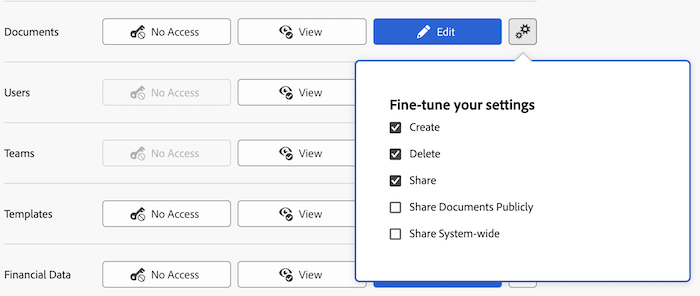

# Toegang tot documenten verlenen

Als beheerder van Adobe Workfront, kunt u een toegangsniveau gebruiken om de toegang van een gebruiker tot documenten te bepalen, zoals die in [ het overzicht van de Niveaus van de Toegang ](../../../administration-and-setup/add-users/access-levels-and-object-permissions/access-levels-overview.md) wordt verklaard.

Deze toegang geldt ook voor documentmappen.

Voor informatie over het gebruiken van de niveaus van de douanetoegang om gebruikers&#39; toegang tot andere objecten types in Workfront te beheren, zie [ tot douanetoegangsniveaus leiden of wijzigen ](../../../administration-and-setup/add-users/configure-and-grant-access/create-modify-access-levels.md).

## Toegangsvereisten

+++ Breid uit om de toegangseisen voor de functionaliteit in dit artikel weer te geven.

U moet de volgende toegang hebben om de stappen in dit artikel uit te voeren:

<table style="table-layout:auto"> 
 <col> 
 <col> 
 <tbody> 
  <tr> 
   <td role="rowheader">Adobe Workfront-plan</td> 
   <td>Alle</td> 
  </tr> 
  <tr> 
   <td role="rowheader">Adobe Workfront-licentie</td> 
   <td>Plan</td> 
  </tr> 
  <tr> 
   <td role="rowheader">Configuraties op toegangsniveau</td> 
   <td> 
U moet een Workfront-beheerder zijn.&gt;.
 
<b> NOTA </b>: Als u nog geen toegang hebt, vraag uw beheerder van Workfront als zij extra beperkingen in uw toegangsniveau plaatsen. Voor informatie over hoe een beheerder van Workfront uw toegangsniveau kan wijzigen, zie <a href="../../../administration-and-setup/add-users/configure-and-grant-access/create-modify-access-levels.md" class="MCXref xref" data-mc-variable-override=""> tot douanetoegangsniveaus </a> leiden of wijzigen.
 </td> 
  </tr> 
 </tbody> 
</table>

+++

## Gebruikerstoegang tot documenten configureren met behulp van een aangepast toegangsniveau

1. Beginnen creërend of het uitgeven van het toegangsniveau, zoals die in [ wordt verklaard creeer of wijzig douanetoegangsniveaus ](../../../administration-and-setup/add-users/configure-and-grant-access/create-modify-access-levels.md).
1. Klik het tandwielpictogram  op de **Mening** of **geef** knoop aan het recht van Documenten uit, dan selecteer de capaciteiten u onder **wilt verlenen - verbeter uw montages**.

   

   U kunt gebruikers toestaan het volgende te doen op projecten, taken, en kwesties die zij toegang hebben tot:

   <table style="table-layout:auto"> 
    <col> 
    <col> 
    <tbody> 
     <tr> 
      <td role="rowheader">Maken</td> 
      <td>Documenten uploaden.</td> 
     </tr> 
     <tr> 
      <td role="rowheader">Verwijderen</td> 
      <td> 
Geüploade documenten verwijderen.
 
De <b> creeer </b> optie wordt automatisch toegelaten wanneer deze optie wordt toegelaten.
 </td> 
     </tr> 
     <tr> 
      <td role="rowheader">Delen</td> 
      <td>Deel documenten met specifieke gebruikers, baanrollen, teams.</td> 
     </tr> 
     <tr> 
      <td role="rowheader">Documenten openbaar delen</td> 
      <td>Documenten delen met externe gebruikers (geen Workfront-licentie).</td> 
     </tr> 
     <tr> 
      <td role="rowheader">Delen in het hele systeem</td> 
      <td> 
Documenten beschikbaar stellen voor iedereen in uw Workfront-exemplaar.
 
Iedereen in het systeem kan een document zien op deze manier wordt gedeeld als:
 
       <ul> 
        <li> 
U verzendt hen een verbinding aan de pagina van Documenten waar het wordt geupload.
 </li> 
        <li> 
Ze zoeken ernaar in Workfront
 </li> 
       </ul> 
De <b> optie van het Aandeel </b> wordt automatisch toegelaten wanneer deze optie wordt toegelaten.
 </td> 
     </tr> 
    </tbody> 
   </table>

   >[!NOTE]
   >
   >Wanneer u een toegangsniveau het plaatsen voor een bepaald type van voorwerp vormt, beïnvloedt die configuratie niet de toegang van de gebruikers tot voorwerpen met een lagere rang. Bijvoorbeeld, kunt u gebruikers van het schrappen van projecten in hun toegangsniveau beperken, maar dit beperkt hen niet van het schrappen van documenten, die lager-rangschikkend zijn dan projecten.Voor meer informatie over de hiërarchie van voorwerpen, zie de sectie [ Interdependentie en hiërarchie van voorwerpen ](../../../workfront-basics/navigate-workfront/workfront-navigation/understand-objects.md#understanding-interdependency-and-hierarchy-of-objects) in het artikel [ voorwerpen in Adobe Workfront ](../../../workfront-basics/navigate-workfront/workfront-navigation/understand-objects.md) begrijpen.

1. (Facultatief) om geërfte toestemmingen voor documenten van hogere het rangschikken voorwerpen te beperken, klik **Plaats extra beperkingen**, dan uitgezocht **neemt nooit documenttoegang van projecten, taken, kwesties, enz. over**.
1. (Facultatief) om toegangsmontages voor andere voorwerpen en gebieden in het toegangsniveau te vormen u aan werkt, ga met één van de artikelen voort die in [ worden vermeld toegang tot Adobe Workfront ](../../../administration-and-setup/add-users/configure-and-grant-access/configure-access.md), zoals [ toegang van de Verlening tot taken ](../../../administration-and-setup/add-users/configure-and-grant-access/grant-access-tasks.md) en [ toegang van de Verlening tot financiële gegevens ](../../../administration-and-setup/add-users/configure-and-grant-access/grant-access-financial.md).
1. Wanneer u wordt gebeëindigd, klik **sparen**.

   Nadat het toegangsniveau wordt gecreeerd, kunt u het aan een gebruiker toewijzen. Voor meer informatie, zie [ het profiel van een gebruiker ](../../../administration-and-setup/add-users/create-and-manage-users/edit-a-users-profile.md) uitgeven.

## Toegang tot documenten per licentietype

Voor meer informatie over welke gebruikers in elk toegangsniveau met documenten kunnen doen, zie de sectie [ Documenten ](../../../administration-and-setup/add-users/access-levels-and-object-permissions/functionality-available-for-each-object-type.md#document) in de artikel [ Functionaliteit beschikbaar voor elk objecten type ](../../../administration-and-setup/add-users/access-levels-and-object-permissions/functionality-available-for-each-object-type.md).

## Toegang tot gedeelde documenten

Nadat u een document aan Workfront uploadt, kunt u het met andere gebruikers delen door hen toestemmingen aan het te verlenen, zoals die in [ worden verklaard deel een document ](../../../workfront-basics/grant-and-request-access-to-objects/document-permissions.md).

<!--
If you make changes here, make them also in the "Grant access to" articles where this snippet had to be converted to text:
* reports, dashboards, and calendars
* financial data<
* issue
-->

Wanneer u een object met een andere gebruiker deelt, worden de rechten van de ontvanger op het object bepaald door een combinatie van twee dingen:

* De machtigingen die u aan de ontvanger toekent voor het object
* De instellingen van het toegangsniveau van de ontvanger voor het objecttype
