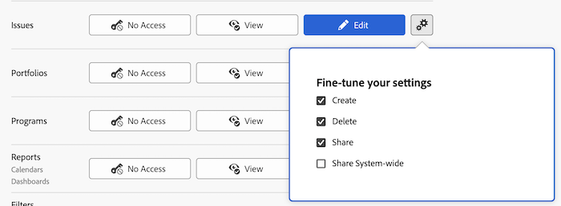

# Toegang verlenen tot kwesties

Als beheerder van Adobe Workfront, kunt u een toegangsniveau gebruiken om de toegang van een gebruiker tot kwesties te bepalen, zoals die in [&#x200B; het overzicht van de Niveaus van de Toegang &#x200B;](../../../administration-and-setup/add-users/access-levels-and-object-permissions/access-levels-overview.md) wordt verklaard.

Voor informatie over het gebruiken van de niveaus van de douanetoegang om gebruikers&#39; toegang tot andere objecten types in Workfront te beheren, zie [&#x200B; tot douanetoegangsniveaus leiden of wijzigen &#x200B;](../../../administration-and-setup/add-users/configure-and-grant-access/create-modify-access-levels.md).

## Toegangsvereisten

+++ Breid uit om de toegangseisen voor de functionaliteit in dit artikel weer te geven.

U moet de volgende toegang hebben om de stappen in dit artikel uit te voeren:

<table style="table-layout:auto"> 
 <col> 
 <col> 
 <tbody> 
  <tr> 
   <td role="rowheader">Adobe Workfront-plan</td> 
   <td>Alle</td> 
  </tr> 
  <tr> 
   <td role="rowheader">Adobe Workfront-licentie</td> 
   <td>Plan</td> 
  </tr> 
  <tr> 
   <td role="rowheader">Configuraties op toegangsniveau</td> 
   <td> 
U moet een Workfront-beheerder zijn.
 
<b> NOTA </b>: Als u nog geen toegang hebt, vraag uw beheerder van Workfront als zij extra beperkingen in uw toegangsniveau plaatsen. Voor informatie over hoe een beheerder van Workfront uw toegangsniveau kan wijzigen, zie <a href="../../../administration-and-setup/add-users/configure-and-grant-access/create-modify-access-levels.md" class="MCXref xref" data-mc-variable-override=""> tot douanetoegangsniveaus </a> leiden of wijzigen.
 </td> 
  </tr> 
 </tbody> 
</table>

+++

## Gebruikerstoegang verlenen voor problemen met behulp van een aangepast toegangsniveau

1. Beginnen creërend of het uitgeven van het toegangsniveau, zoals die in [&#x200B; wordt verklaard creeer of wijzig douanetoegangsniveaus &#x200B;](../../../administration-and-setup/add-users/configure-and-grant-access/create-modify-access-levels.md).
1. Klik het tandwielpictogram  op de **Mening** of **geef** knoop aan het recht van Kwesties uit, dan selecteer de capaciteiten u onder **wilt verlenen - verbeter uw montages**.

   

1. (Facultatief) om geërfte toestemmingen voor kwesties van hogere het rangschikken voorwerpen te beperken, klik **Plaats extra beperkingen**, dan uitgezocht **neemt nooit documenttoegang van projecten, taken, kwesties, enz. over**.

1. (Facultatief) om toegangsmontages voor andere voorwerpen en gebieden in het toegangsniveau te vormen u aan werkt, ga met één van de artikelen voort die in [&#x200B; worden vermeld toegang tot Adobe Workfront &#x200B;](../../../administration-and-setup/add-users/configure-and-grant-access/configure-access.md), zoals [&#x200B; toegang van de Verlening tot taken &#x200B;](../../../administration-and-setup/add-users/configure-and-grant-access/grant-access-tasks.md) en [&#x200B; toegang van de Verlening tot financiële gegevens &#x200B;](../../../administration-and-setup/add-users/configure-and-grant-access/grant-access-financial.md).
1. Wanneer u wordt gebeëindigd, klik **sparen**.

   Nadat het toegangsniveau wordt gecreeerd, kunt u het aan een gebruiker toewijzen. Voor meer informatie, zie [&#x200B; het profiel van een gebruiker &#x200B;](../../../administration-and-setup/add-users/create-and-manage-users/edit-a-users-profile.md) uitgeven.

## Toegang tot uitgiften per licentietype

Voor informatie over welke gebruikers in elk toegangsniveau met kwesties kunnen doen, zie de sectie [&#x200B; Kwesties &#x200B;](../../../administration-and-setup/add-users/access-levels-and-object-permissions/functionality-available-for-each-object-type.md#issues) in de artikel [&#x200B; Functionaliteit beschikbaar voor elk objecten type &#x200B;](../../../administration-and-setup/add-users/access-levels-and-object-permissions/functionality-available-for-each-object-type.md).

## Toegang tot gedeelde problemen

Als eigenaar of schepper van een kwestie, kunt u met andere gebruikers delen door hen toestemmingen aan het te verlenen, zoals die in [&#x200B; worden verklaard deel een kwestie &#x200B;](../../../workfront-basics/grant-and-request-access-to-objects/share-an-issue.md).

<!--

If you make changes here, make them also in the "Grant access to" articles where this snippet had to be converted to text:

* reports, dashboards, and calendars

* financial data

* issue

-->

Wanneer u een object met een andere gebruiker deelt, worden de rechten van de ontvanger op het object bepaald door een combinatie van twee dingen:

* De machtigingen die u aan de ontvanger toekent voor het object
* De instellingen van het toegangsniveau van de ontvanger voor het objecttype

Ook, als toegestaan door hun toegangsniveau, kunnen de gebruikers tot een kwestie door objecten hiërarchie toegang krijgen: als een gebruiker reeds toestemming op het ouderproject of de taak van een kwestie heeft, hebben zij ook toestemming op de kwestie (zie Stap 3 hierboven). Wanneer u een uitgave deelt, kunt u een lijst van de gebruikers zien die toestemmingen aan het hebben geërft.

