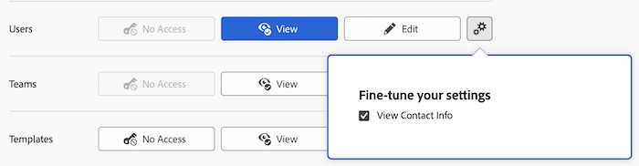

# Toegang verlenen aan gebruikers

Als beheerder van Adobe Workfront, kunt u een toegangsniveau gebruiken om de toegang van een gebruiker tot andere gebruikers in Workfront te bepalen, zoals die in [ wordt verklaard het niveauoverzicht van de Toegang ](../../../administration-and-setup/add-users/access-levels-and-object-permissions/access-levels-overview.md).

## Toegangsvereisten

+++ Breid uit om de toegangseisen voor de functionaliteit in dit artikel weer te geven.

U moet de volgende toegang hebben om de stappen in dit artikel uit te voeren:

<table style="table-layout:auto"> 
 <col> 
 <col> 
 <tbody> 
  <tr> 
   <td role="rowheader">Adobe Workfront-plan</td> 
   <td>Alle</td> 
  </tr> 
  <tr> 
   <td role="rowheader">Adobe Workfront-licentie</td> 
   <td>Plan</td> 
  </tr> 
  <tr> 
   <td role="rowheader">Configuraties op toegangsniveau</td> 
   <td> 
U moet een Workfront-beheerder zijn.
 
<b> NOTA </b>: Als u nog geen toegang hebt, vraag uw beheerder van Workfront als zij extra beperkingen in uw toegangsniveau plaatsen. Voor informatie over hoe een beheerder van Workfront uw toegangsniveau kan wijzigen, zie <a href="../../../administration-and-setup/add-users/configure-and-grant-access/create-modify-access-levels.md" class="MCXref xref" data-mc-variable-override=""> tot douanetoegangsniveaus </a> leiden of wijzigen.
 </td> 
  </tr> 
 </tbody> 
</table>

+++

## Toegang tot gebruikers configureren

U kunt beheren welke informatie gebruikers voor andere gebruikers kunnen bekijken en uitgeven gebruikend een standaardtoegangsniveau of een niveau van de douanetoegang dat u creeert. Gebruikers met het standaardabonnement en de werkvergunningen kunnen de contactinformatie van andere gebruikers bekijken. Een van de volgende gebruikers kan andere gebruikers maken en bewerken:

* Een Workfront-beheerder.

  Voor meer informatie, zie [ een gebruiker volledige administratieve toegang verlenen ](../../../administration-and-setup/add-users/configure-and-grant-access/grant-a-user-full-administrative-access.md).

* Een gebruiker met een standaardplanvergunning die ook toegang tot gebruikers heeft, zoals die in dit artikel wordt verklaard.

  De gebruikers die beperkt zijn om slechts gebruikers van hun bedrijf of het primaire bedrijf te zien hebben toegang om slechts de gebruikers uit te geven zij kunnen zien. Voor meer informatie, zie [ tot douanetoegangsniveaus ](../../../administration-and-setup/add-users/configure-and-grant-access/create-modify-access-levels.md) leiden of wijzigen.

* Een gebruiker met een standaardplanvergunning die ook als manager van een andere gebruiker wordt gespecificeerd.

  De gebruikers die Edit toegang tot gebruikers in hun toegangsniveau worden verleend kunnen gebruikers beheren die aan hen rapporteren. Voor informatie over het beheren van een gebruiker, zie [ Mening de organisatorische grafiek ](../../../people-teams-and-groups/work-directly-with-others/view-the-org-chart.md).

* Een gebruiker met een standaardlicentie voor abonnementen die een gebruiker heeft gemaakt, kan de gemaakte gebruiker deactiveren, verwijderen of bewerken. Voor informatie over het creëren van nieuwe gebruikers, zie [ gebruikers ](../../../administration-and-setup/add-users/create-and-manage-users/add-users.md) toevoegen.

## De toegang van gebruikers tot het bewerken van gebruikers configureren met behulp van een aangepast toegangsniveau

1. Beginnen creërend of het uitgeven van het toegangsniveau, zoals die in [ wordt verklaard creeer of wijzig douanetoegangsniveaus ](../../../administration-and-setup/add-users/configure-and-grant-access/create-modify-access-levels.md).
1. U wijzigt als volgt de mogelijkheid voor gebruikers met een abonnement- of werkvergunning om de profielen van andere gebruikers weer te geven:

   1. Klik het tandwielpictogram  op de **2&rbrace; knoop van de Mening &lbrace;aan het recht van** Gebruikers **.**

   1. Schakel **Info van het Contact van de Mening** uit, dan klik X om **te sluiten verfijnen uw montages** doos.

      

1. Om de capaciteit van gebruikers met een de vergunningstoegang van het Plan te wijzigen om andere gebruikers uit te geven, klik het tandwielpictogram  op **geef** knoop aan het recht van **Gebruikers** uit, dan selecteer de capaciteiten u wilt verlenen:

   <table style="table-layout:auto"> 
    <col> 
    <col> 
    <tbody> 
     <tr> 
      <td role="rowheader"><strong> creeer </strong> </td> 
      <td> 
Hiermee kunnen gebruikers gebruikers maken.  Deze optie wordt toegelaten door gebrek.
 
     
<b> NOTA </b>: Dit is niet beschikbaar als uw organisatie aan Adobe Admin Console is bezet. Zie uw netwerk of beheerder van IT als u meer informatie nodig hebt.

        </td>  
     </tr> 
     <tr> 
      <td role="rowheader"><strong> Schrapping </strong> </td> 
      <td> 
 Hiermee kunnen gebruikers de gebruikers verwijderen die ze zelf hebben gemaakt.  Deze optie wordt toegelaten door gebrek.
 
<b> NOTA </b>: Dit is niet beschikbaar als uw organisatie aan Adobe Admin Console is bezet. Zie uw netwerk of beheerder van IT als u meer informatie nodig hebt.
 </td> 
     </tr> 
     <tr> 
      <td role="rowheader"><strong> Admin van de Gebruiker (Alle Gebruikers) </strong> </td> 
      <td> 
Hiermee kunnen gebruikers het volgende doen voor alle gebruikers in Workfront:
 
       <ul> 
        <li>De gebruiker bewerken, verwijderen of deactiveren</li> 
        <li>Aanmelden als gebruiker
<b> NOTA </b>: U kunt niet login als om het even welke gebruiker die een systeembeheerder is.
</li> 
        <li>Het wachtwoord van de gebruiker opnieuw instellen</li> 
       </ul> 
Deze optie is standaard uitgeschakeld.
 </td> 
     </tr> 
     <tr> 
      <td role="rowheader"><strong> Admin van de Gebruiker (de Gebruikers van de Groep) </strong> </td> 
      <td> 
Hiermee kunnen gebruikers het volgende doen voor elke gebruiker in een groep die ze beheren: 
        <ul>
         <li>
De gebruiker bewerken, verwijderen of deactiveren
</li>
         <li>Aanmelden als gebruiker</li>
         <li>
Het wachtwoord van de gebruiker opnieuw instellen

<b> NOTA </b>: Een groepsbeheerder kan niet login als of het wachtwoord van een beheerder van Workfront terugstellen.
</li>
        </ul>
Deze optie is standaard uitgeschakeld.

 </td> 
     </tr> 
    </tbody> 
   </table>

   >[!TIP]
   >
   >Als u groepbeheerders geen toegang tot alle leden van de groepen wilt verlenen die zij beheren, maak beide hierboven opties van Admin van de Gebruiker onbruikbaar. De beheerders van de groep zullen nog tot groepsleden kunnen toegang hebben die zij aan Workfront toevoegen, of die aan hen in Workfront rapporteren.

1. (Facultatief) om toegangsmontages voor andere voorwerpen en gebieden in het toegangsniveau te vormen u aan werkt, ga met één van de artikelen voort die in [ worden vermeld toegang tot Adobe Workfront ](../../../administration-and-setup/add-users/configure-and-grant-access/configure-access.md), zoals [ toegang van de Verlening tot taken ](../../../administration-and-setup/add-users/configure-and-grant-access/grant-access-tasks.md) en [ toegang van de Verlening tot financiële gegevens ](../../../administration-and-setup/add-users/configure-and-grant-access/grant-access-financial.md).
1. Wanneer u wordt gebeëindigd, klik **sparen**.

## Toegang tot gebruikers per licentietype

Voor informatie over welke gebruikers in elk toegangsniveau met gebruikers kunnen doen, zie de sectie [ Gebruikers ](../../../administration-and-setup/add-users/access-levels-and-object-permissions/functionality-available-for-each-object-type.md#users) in de artikel [ Functionaliteit beschikbaar voor elk objecten type ](../../../administration-and-setup/add-users/access-levels-and-object-permissions/functionality-available-for-each-object-type.md).
