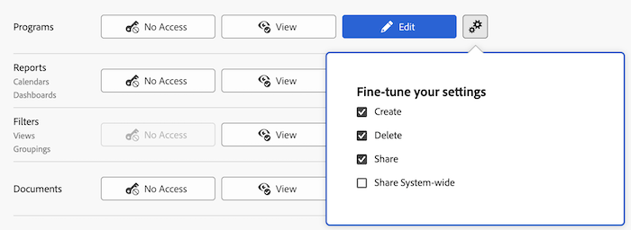

# Toegang verlenen tot programma&#39;s

Als beheerder van Adobe Workfront, kunt u een toegangsniveau gebruiken om de toegang van een gebruiker tot programma&#39;s te bepalen, zoals die in [&#x200B; het overzicht van de Niveaus van de Toegang &#x200B;](../../../administration-and-setup/add-users/access-levels-and-object-permissions/access-levels-overview.md) wordt verklaard.

Voor informatie over het gebruiken van de niveaus van de douanetoegang om gebruikers&#39; toegang tot andere objecten types in Workfront te beheren, zie [&#x200B; tot douanetoegangsniveaus leiden of wijzigen &#x200B;](../../../administration-and-setup/add-users/configure-and-grant-access/create-modify-access-levels.md).

## Toegangsvereisten

+++ Breid uit om de toegangseisen voor de functionaliteit in dit artikel weer te geven.

<table style="table-layout:auto"> 
 <col> 
 <col> 
 <tbody> 
  <tr> 
   <td role="rowheader">Adobe Workfront-pakket</td> 
   <td>Alle</td> 
  </tr> 
  <tr> 
   <td role="rowheader">Adobe Workfront-licentie</td> 
   <td>
Standard

   
Plan
</td> 
  </tr> 
  <tr> 
   <td role="rowheader">Configuraties op toegangsniveau</td> 
   <td> 
U moet een Workfront-beheerder zijn.
 </td> 
  </tr> 
 </tbody> 
</table>

Voor meer detail over de informatie in deze lijst, zie [&#x200B; vereisten van de Toegang in de documentatie van Workfront &#x200B;](/help/quicksilver/administration-and-setup/add-users/access-levels-and-object-permissions/access-level-requirements-in-documentation.md).

+++

## Gebruikerstoegang tot programma&#39;s configureren met behulp van een aangepast toegangsniveau

1. Beginnen creërend of het uitgeven van het toegangsniveau, zoals die in [&#x200B; wordt verklaard creeer of wijzig douanetoegangsniveaus &#x200B;](../../../administration-and-setup/add-users/configure-and-grant-access/create-modify-access-levels.md).
1. Klik het tandwielpictogram  op de **Mening** of **geef** knoop aan het recht van Programma&#39;s uit, dan selecteer de capaciteiten u onder **wilt verlenen - verbeter uw montages**.

   

   Voor informatie over welke gebruikers in elk toegangsniveau met programma&#39;s kunnen doen, zie de sectie [&#x200B; Programma&#39;s &#x200B;](../../../administration-and-setup/add-users/access-levels-and-object-permissions/functionality-available-for-each-object-type.md#programs) in de artikel [&#x200B; Functionaliteit beschikbaar voor elk objecten type &#x200B;](../../../administration-and-setup/add-users/access-levels-and-object-permissions/functionality-available-for-each-object-type.md).

   >[!NOTE]
   >
   >Wanneer u een toegangsniveau het plaatsen voor een bepaald type van voorwerp vormt, beïnvloedt die configuratie niet de toegang van de gebruikers tot voorwerpen met een lagere rang. Bijvoorbeeld, kunt u gebruikers van het schrappen van programma&#39;s in hun toegangsniveau beperken, maar dit beperkt hen niet van het schrappen van projecten, die lager-rangschikkend zijn dan programma&#39;s.Voor meer informatie over de hiërarchie van voorwerpen, zie de sectie [&#x200B; Interdependentie en hiërarchie van voorwerpen &#x200B;](../../../workfront-basics/navigate-workfront/workfront-navigation/understand-objects.md#understanding-interdependency-and-hierarchy-of-objects) in het artikel [&#x200B; voorwerpen in Adobe Workfront &#x200B;](../../../workfront-basics/navigate-workfront/workfront-navigation/understand-objects.md) begrijpen.

1. (Facultatief) om toegangsmontages voor andere voorwerpen en gebieden in het toegangsniveau te vormen u aan werkt, ga met één van de artikelen voort die in [&#x200B; worden vermeld toegang tot Adobe Workfront &#x200B;](../../../administration-and-setup/add-users/configure-and-grant-access/configure-access.md), zoals [&#x200B; toegang van de Verlening tot taken &#x200B;](../../../administration-and-setup/add-users/configure-and-grant-access/grant-access-tasks.md) en [&#x200B; toegang van de Verlening tot financiële gegevens &#x200B;](../../../administration-and-setup/add-users/configure-and-grant-access/grant-access-financial.md).
1. Wanneer u wordt gebeëindigd, klik **sparen**.

   Nadat het toegangsniveau wordt gecreeerd, kunt u het aan een gebruiker toewijzen. Voor meer informatie, zie [&#x200B; het profiel van een gebruiker &#x200B;](../../../administration-and-setup/add-users/create-and-manage-users/edit-a-users-profile.md) uitgeven.

## Toegang tot programma&#39;s per licentietype

Voor informatie over welke gebruikers in elk toegangsniveau met programma&#39;s kunnen doen, zie de sectie [&#x200B; Programma&#39;s &#x200B;](../../../administration-and-setup/add-users/access-levels-and-object-permissions/functionality-available-for-each-object-type.md#programs) in de artikel [&#x200B; Functionaliteit beschikbaar voor elk objecten type &#x200B;](../../../administration-and-setup/add-users/access-levels-and-object-permissions/functionality-available-for-each-object-type.md).

## Toegang tot gedeelde programma&#39;s

Als eigenaar of schepper van een programma, kunt u met andere gebruikers delen door hen toestemmingen aan het te verlenen, zoals die in [&#x200B; worden verklaard deel een programma &#x200B;](../../../workfront-basics/grant-and-request-access-to-objects/share-a-program.md).

<!--

If you make changes here, make them also in the "Grant access to" articles where this snippet had to be converted to text:

* reports, dashboards, and calendars

* financial data

* issue

-->

Wanneer u een object met een andere gebruiker deelt, worden de rechten van de ontvanger op het object bepaald door een combinatie van twee dingen:

* De machtigingen die u aan de ontvanger toekent voor het object
* De instellingen van het toegangsniveau van de ontvanger voor het objecttype
