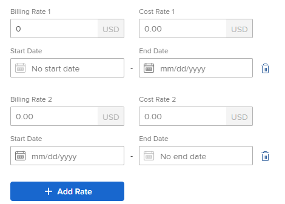

# Gebruikersprofiel bewerken

{{highlighted-preview}}

>[!IMPORTANT]
>
>De op deze pagina beschreven procedure is alleen van toepassing op organisaties die nog niet aan de Admin Console zijn geregistreerd. Als uw organisatie is aangemeld bij de Adobe Admin Console, moet u deze handeling uitvoeren via de Adobe Admin Console.
>
>Voor instructies over het bewerken van een gebruikersprofiel in de Adobe Admin Console raadpleegt u de sectie &quot;Gebruikersgegevens bewerken&quot; in het artikel [Gebruikers individueel beheren](https://helpx.adobe.com/enterprise/using/manage-users-individually.html) of neem contact op met uw Adobe Admin Console-beheerder.
>
>Ga voor een lijst met procedures die verschillen afhankelijk van de vraag of uw organisatie al dan niet is aangemeld bij de Adobe Admin Console naar [Platformgebaseerde verschillen in beheer (Adobe Workfront/Adobe Business Platform)](../../../administration-and-setup/get-started-wf-administration/actions-in-admin-console.md).

Als Adobe Workfront-beheerder kunt u gebruikers maken en de profielen van bestaande gebruikers beheren. Voor informatie over het maken van gebruikers raadpleegt u [Gebruikers toevoegen](../../../administration-and-setup/add-users/create-and-manage-users/add-users.md).

## Toegangsvereisten

U moet het volgende hebben om de stappen in dit artikel uit te voeren:

<table style="table-layout:auto"> 
 <col> 
 <col> 
 <tbody> 
  <tr> 
   <td role="rowheader">Adobe Workfront-plan</td> 
   <td>Alle</td> 
  </tr> 
  <tr> 
   <td role="rowheader">Adobe Workfront-licentie</td> 
   <td> 
Nieuw: Standaard

   of
   
Huidig: Plan
</td> 
  </tr> 
  <tr> 
   <td role="rowheader">Configuraties op toegangsniveau</td> 
   <td> 
U moet een van de volgende opties hebben:
 
    <ul> 
     <li> 
Het toegangsniveau voor systeembeheerders. Zie voor meer informatie <a href="../../../administration-and-setup/add-users/configure-and-grant-access/grant-a-user-full-administrative-access.md" class="MCXref xref">Volledige administratieve toegang verlenen aan een gebruiker</a>. 
 </li> 
     <li> 
De <b>Gebruikers</b> voorwerp in uw toegangsniveau dat aan wordt gevormd <b>Bewerken</b> toegang, met <b>Maken</b> en ten minste een van de volgende twee <b>Gebruikersbeheerder</b> opties ingeschakeld onder <b>Uw instellingen nauwkeurig afstellen</b> . 
 
     <ul><li> Gebruikersbeheerder (alle gebruikers)</li>
     <li>Gebruikersbeheerder (Groepgebruikers)</li></ul>
     
Indien  <b>Gebruikersbeheerder (Groepgebruikers)</b> wordt toegelaten, moet u een groepsbeheerder voor een groep zijn waar de gebruiker een lid is om de gebruiker te kunnen uitgeven.
 
     
Voor meer informatie over de <b>Gebruikers</b> het plaatsen in een toegangsniveau, zie <a href="../../../administration-and-setup/add-users/configure-and-grant-access/grant-access-other-users.md" class="MCXref xref">Toegang verlenen aan gebruikers</a>.
 </li> 
    </ul> </td> 
  </tr> 
 </tbody> 
</table> 
*Neem contact op met uw Workfront-beheerder om te weten te komen welk abonnement, licentietype of toegang u hebt.

## Een gebruikersprofiel bewerken

{{step-1-to-users}}

1. Selecteer de gebruiker en klik op de knop **Bewerken** pictogram .

   Het vak Gebruiker bewerken wordt weergegeven.

1. In de **Gebruiker bewerken** , wijzigt u de volgende gegevens en klikt u op **Wijzigingen opslaan** te allen tijde:

   <table style="table-layout:auto"> 
    <col> 
    <col> 
    <tbody> 
     <tr> 
      <td role="rowheader">Persoonlijke gegevens </td> 
      <td> 
       <ul> 
        <li>
<b>Voornaam</b>
</li>
        <li>
<b>Achternaam</b>
</li> 
        <li> 
<b>E-mailadres:</b> Het e-mailadres van een gebruiker is ook zijn gebruikersnaam in Workfront. Dit veld is hoofdlettergevoelig en moet uniek zijn. Als een gebruiker drie keer probeert een niet-uniek e-mailadres toe te voegen binnen een venster van 10 minuten, wordt een reCAPTCHA-reactie weergegeven.
 
 Selecteer de <b>Ik ben geen robot</b> instellen voordat u verdergaat.

Als u de e-maillijst van gewenste personen gebruikt en een e-maildomein invoert dat niet in de lijst voorkomt, ontvangt de gebruiker geen e-mailberichten. Voor meer informatie over de lijst van gewenste personen, zie <a href="../../../administration-and-setup/get-started-wf-administration/configure-your-email-allowlist.md" class="MCXref xref">Uw e-maillijst van gewenste personen configureren</a>.
 </li> 
        <li> 
<b>Wachtwoord opnieuw instellen</b>: Klik op deze koppeling om het wachtwoord van de gebruiker opnieuw in te stellen. U moet uw eigen wachtwoord invoeren voordat u het wachtwoord van een andere gebruiker opnieuw kunt instellen.
 
Als u het wachtwoord van een andere gebruiker opnieuw wilt instellen, moet u een Workfront-beheerder of een groepsbeheerder zijn.
 
<b>OPMERKING</b>:  
          <ul> 
           <li> 
Als u een groepsbeheerder bent, kunt u wachtwoorden slechts voor gebruikers in de groepen terugstellen waar u als beheerder wordt aangewezen. Ook, moet de toestemming van Admin van de Gebruiker (de Gebruikers van de Groep) op uw toegangsniveau worden toegelaten:
 
  
 
Deze instelling is standaard uitgeschakeld. Zie voor meer informatie <a href="../../../administration-and-setup/add-users/configure-and-grant-access/create-modify-access-levels.md" class="MCXref xref">Aangepaste toegangsniveaus maken of wijzigen</a>.
 </li> 
           <li> 
U kunt het wachtwoord van een Workfront-beheerder niet opnieuw instellen.
 </li> 
          </ul> 
 </li> 
        <li><b>&lt;sso configuration=""&gt; Gebruikersnaam</b>: Als uw Workfront-beheerder een SSO-integratie met Workfront heeft ingeschakeld, wordt de SSO-gebruikersnaam in dit veld weergegeven. Het type SSO-configuratie dat voor uw Workfront-instantie is ingeschakeld, is zichtbaar in dit veld. </li> 
        <li> 
<b>OnlyAllow &lt;sso configuration=""&gt; Verificatie</b>: Als uw Workfront-beheerder een SSO-integratie met Workfront heeft ingeschakeld en alle gebruikers voor SSO heeft bijgewerkt, is dit veld standaard geselecteerd. Het type SSO-configuratie dat voor uw Workfront-instantie is ingeschakeld, is zichtbaar in dit veld.
 
Wanneer dit veld is geselecteerd, moet de gebruiker zich bij Workfront aanmelden met de SSO-gegevens. Als deze optie wordt uitgeschakeld, kunnen ze zich met hun Workfront-gegevens aanmelden bij Workfront.
 
Voor meer informatie over het vormen van Workfront met een oplossing SSO, zie <a href="../../../administration-and-setup/add-users/single-sign-on/sso-in-workfront.md" class="MCXref xref">Overzicht van Single Sign-On in Adobe Workfront</a>
 
Voor meer informatie over het bijwerken van gebruikers voor SSO, zie <a href="../../../administration-and-setup/add-users/single-sign-on/update-users-sso.md" class="MCXref xref">Gebruikers bijwerken voor eenmalige aanmelding</a>.
 
        
<b>OPMERKING</b>:
 
        
 Als u een groepsbeheerder bent, kunt u het dialoogvenster &lt;sso configuration=""&gt; velden alleen voor gebruikers in de groepen waar u als zodanig bent aangewezen. Ook, moet de toestemming van Admin van de Gebruiker (de Gebruikers van de Groep) op uw toegangsniveau worden toegelaten.
        
Als u een groepsbeheerder bent en u de machtiging Gebruikersbeheer (Alle gebruikers) hebt ingeschakeld op uw toegangsniveau, kunt u de opdracht &lt;sso configuration=""&gt; voor alle gebruikers.
 </li> 
        <li><b>Taakgegevens:</b> Informatie over de taak, zoals de functie (in het gedeelte <b>Titel</b> (in het veld) en op welk expertisegebied de gebruiker verantwoordelijk is (in het vak <b>Over</b> veld).</li> 
        <li>
<b>Contactinfo</b>: Het telefoonnummer van de gebruiker (in het deelvenster <b>Telefoonnummer, Ext.</b>, en <b>Mobiel nummer</b> velden) en adres (in de <b>Adres, plaats, staat, postcode, land</b> velden ).

        
Als de gebruiker voor Verenigd Gebruikersbeheer (UUM) of het Systeem van Adobe Identity Management (IMS) wordt toegelaten, <b>Land</b> in het gedeelte Contactinfo worden alleen landcodewaarden geaccepteerd (bijvoorbeeld VS, GB, IN).
</li>
       </ul> </td> 
     </tr> 
     <tr> 
      <td role="rowheader">Voorkeuren </td> 
      <td> 
       <ul> 
      <li> 
<b>Tijdzone:</b> De tijdzone van de gebruiker.
 
Voor informatie over hoe u gebruikers kunt helpen in Workfront samen te werken in verschillende tijdzones raadpleegt u <a href="../../../workfront-basics/tips-tricks-and-troubleshooting/working-across-timezones.md" class="MCXref xref">Werken in tijdzones</a>.
 </li> 
       <li><b>Landinstelling e-mail</b>: De e-maillandinstelling van de voorkeur van de gebruiker. Dit is van invloed op de notatie van getallen en datums in de e-mails die van Workfront naar deze gebruiker komen.</li>

   <li><b>E-mails ontvangen van deze testomgeving</b>: Schakel deze optie in als u e-mailmeldingen wilt ontvangen vanuit de omgeving waarin u momenteel bent aangemeld.
      
<b>OPMERKING</b>

      
Deze optie is alleen beschikbaar in de omgeving van Voorvertoning en Sandbox. E-mailmeldingen zijn standaard ingeschakeld in de productieomgeving. 

      </li>

   <li><b>Percentage volledig tonen bij updatestatus</b>: Schakel deze optie in als u een procentuele volledige balk wilt weergeven in het gedeelte Bijwerken van de taken van deze gebruiker.</li> 
       <li><b>Werk dat ik toewees aan mezelf verzenden naar het tabblad Werken aan</b>: Schakel deze optie in als u wilt dat alles wat de gebruiker aan zichzelf toewijst, rechtstreeks wordt weergegeven in de lijst Werken aan in het gebied Start. Standaard wordt alles vermeld dat aan een gebruiker is toegewezen op de lijsten Ready to Start of Not Ready in het gebied Home.</li> 
       <li><b>Automatisch proefdrukken genereren bij het uploaden van documenten</b>: Schakel deze optie in als u wilt dat de documenten die de gebruiker uploadt, direct een proefdruk genereren. </li>
       </ul> </td> 
     </tr> 
     <tr> 
      <td role="rowheader">Meldingen</td> 
      <td> 
Selecteer de e-mailberichten die moeten worden ingeschakeld voor de nieuwe gebruiker.
 
U kunt zowel expresberichten als dagelijkse samenvattingsmeldingen selecteren.
 
Zie voor meer informatie <a href="../../../administration-and-setup/manage-workfront/emails/configure-event-notifications-for-everyone-in-the-system.md" class="MCXref xref">Gebeurtenismeldingen configureren voor iedereen in het systeem</a>.
 </td> 
     </tr> 
     <tr> 
      <td role="rowheader">Toegang</td> 
      <td> 
       <ul> 
      <li><b>Is actief:</b> Selecteer dit vakje om aan te geven dat de gebruiker actief is. Actieve gebruikers gebruiken een Workfront-licentie. Als u de doos wist, wordt de gebruiker gedeactiveerd en wordt voorkomen dat deze zich aanmeldt bij Workfront.</li> 
       <li> 
<b>Toegangsniveau:</b> Selecteer het toegangsniveau dat u aan deze gebruiker wilt toewijzen.
 
       
Wanneer u een toegangsniveau aan een gebruiker toewijst, kunt u een niveau gelijk aan of lager dan uw eigen toegangsniveau toewijzen.

       
Bijvoorbeeld, als uw toegangsniveau Plan is, kunt u niet het de toegangsniveau van de Beheerder toewijzen. Nochtans, kunt u geen toegangsniveau toewijzen dat door gebrek lager is dan uw eigen toegangsniveau als de beheerder van Workfront niet-standaardtoestemmingen op het toegangsniveau heeft toegelaten die niet ook in uw eigen toegangsniveau worden toegelaten. 

       
Bijvoorbeeld, als u een vergunning van het Plan zonder toegang hebt om taken te schrappen, kunt u niet iemand een vergunning van het Werk met toegang toewijzen om taken te schrappen, hoewel de vergunning van het Werk lager is dan de vergunning van het Plan. Zie voor meer informatie  <a href="../../../administration-and-setup/add-users/configure-and-grant-access/create-modify-access-levels.md" class="MCXref xref">Aangepaste toegangsniveaus maken of wijzigen</a>. 
 
       
Voor meer informatie over toegangsniveaus, zie <a href="../../../administration-and-setup/add-users/configure-and-grant-access/configure-access.md" class="MCXref xref">Toegang tot Adobe Workfront configureren</a>.

       
 <b>OPMERKING:</b>
 
       
 Als uw organisatie het nieuwe toegangsmodel (Norm/Licht/Medewerker) gebruikt, kunt u geen Standaard of Lichte gebruiker aan een niveau van de Toegang van de Medewerker opnieuw toewijzen als die gebruiker hun beslissingsgrens voor de maand reeds heeft bereikt. 

Voor meer informatie over het nieuwe toegangsmodel, zie <a href="../how-access-levels-work/access-level-overview.md" class="MCXref xref">Overzicht van nieuwe toegangsniveaus</a>. 

Voor informatie over de beslissingsgrenzen raadpleegt u <a href="/help/quicksilver/review-and-approve-work/proof-doc-decision-limits.md" class="MCXref xref">Overzicht van beperkte documenten en bewijsmiddelen voor niet-betaalde gebruikers</a>.
</li> 
       <li> 
<b>Lay-outsjabloon</b>: Kies een lay-outsjabloon voor de gebruiker. Deze lay-outsjabloon heeft voorrang op elke lay-outsjabloon die aan de thuisgroep, het thuisteam of de primaire rol van de gebruiker is toegewezen. Zie voor meer informatie over de toewijzingsprioriteit van lay-outsjablonen de <a href="../../../administration-and-setup/customize-workfront/use-layout-templates/create-and-manage-layout-templates.md" class="MCXref xref">Lay-outsjablonen maken en beheren</a>.
 
<b>OPMERKING</b>:  
In de volgende lijst wordt beschreven hoe de lijst met sjablonen die u in dit veld hebt, afhankelijk is van uw toegang:
 
       <ul> 
       <li>Als beheerder van Workfront, kunt u alle systeem-niveau en groep-vlakke Malplaatjes van de Lay-out zien.</li> 
       <li>Als groepsbeheerder, kunt u systeem-vlakke lay-outmalplaatje, evenals die zien verbonden aan de groepen die u beheert.</li> 
       <li>Als gebruiker met een licentie voor abonnementen en toegang tot het bewerken van gebruikers, kunt u alleen lay-outsjablonen op systeemniveau zien.</li> 
       </ul> 
Zie voor meer informatie over lay-outsjablonen op groepsniveau <a href="../../../administration-and-setup/customize-workfront/use-layout-templates/create-and-manage-layout-templates.md" class="MCXref xref">Lay-outsjablonen maken en beheren</a>.
 
 </li> 
       </ul> </td> 
     </tr> 
     <tr> 
      <td role="rowheader">Organisatie </td> 
      <td> 
       <ul> 
      <li><b>Bedrijf</b>: Het bedrijf van de gebruiker. Gebruikers kunnen slechts met één bedrijf worden geassocieerd. U moet een bedrijf creëren alvorens u het met een gebruiker kunt associëren. Alleen actieve bedrijven worden in de lijst weergegeven. Voor informatie over het creëren van bedrijven, zie <a href="../../../administration-and-setup/set-up-workfront/organizational-setup/create-and-edit-companies.md" class="MCXref xref">Bedrijven maken en bewerken</a>.</li> 
      <li><b>Rapporten aan:</b> Als u een bedrijf voor de gebruiker hebt opgegeven, kunt u in dit veld ook de directe manager van de gebruiker opgeven. Een gebruiker kan slechts één manager hebben. Dit veld wordt niet weergegeven als de gebruiker niet eerst aan een bedrijf is gekoppeld. </li> 
      <li><b>Directe rapporten:</b> Als u een bedrijf voor de gebruiker specificeerde, kunt u de directe rapporten van de gebruiker ook specificeren. Een gebruiker kan meerdere directe rapporten hebben. Dit veld wordt niet weergegeven als de gebruiker niet eerst aan een bedrijf is gekoppeld.</li> 
      <li><b>Thuisteam</b>: Geef het home team voor de gebruiker op. Gebruikers kunnen slechts één huisteam hebben. Het Team van het Huis is belangrijk wanneer het toewijzen van een lay-outmalplaatje of wanneer het bepalen van het Werk aan het knoop voor de taken en kwesties die aan de gebruiker worden toegewezen. </li> 
      <li><b>Andere teams</b>: Gebruikers kunnen tot meerdere teams behoren. Een gebruiker kan werkitems bekijken die zijn toegewezen aan een van de teams in het thuisgebied. </li> 
      <li> 
<b>Thuisgroep:</b> Selecteer een geschikte groep om de gebruiker toe te wijzen. Hierdoor heeft de gebruiker toegang tot objecten die met de groep worden gedeeld. U kunt lay-outsjablonen ook delen met de thuisgroep van de gebruiker.
 
Dit is een verplicht veld. Elke gebruiker moet met een homegroep worden geassocieerd. Als u geen selecteert, wordt uw groep toegewezen als homegroep van de nieuwe gebruiker.
 
<b>OPMERKING</b>:
 
      
 U kunt een groep alleen aan een gebruiker toewijzen als een van de volgende situaties true is:

      <ul><li>u bent een Workfront-beheerder</li>
      <li>u bent de beheerder van de groep</li>
      <li>de groep is openbaar .</li></ul> 
      <li> 
<b>Overige groepen</b>: Gebruikers kunnen tot meerdere groepen behoren. U kunt een groep alleen aan een gebruiker toewijzen als u een Workfront-beheerder, de beheerder van de groep of de groep openbaar is.
 
<b>BELANGRIJK</b>:
 
      
Als u een gebruiker toevoegt aan meer dan 100 groepen, kunnen er prestatieproblemen optreden in elk gebied van Workfront dat de lijst met groepen laadt.
 
Voor meer informatie over openbare groepen raadpleegt u <a href="../../../administration-and-setup/manage-groups/create-and-manage-groups/create-a-group.md" class="MCXref xref">Een groep maken</a>.
 
Zie voor meer informatie over groepen <a href="../../../administration-and-setup/manage-groups/groups-overview/groups.md" class="MCXref xref">Overzicht van groepen</a>.
 </li> 
       </ul> </td> 
     </tr> 
     <tr> 
      <td role="rowheader">Bronplanning </td> 
      <td> 
       <ul>
       <li>
       <b>Tijdstip</b>: Geeft het percentage aan van de FTE-tijd (Full Time Equivalent) dat de gebruiker beschikbaar is voor werkelijk werk, exclusief overhead. De Tijd van het werk moet een decimaal aantal tot 1 zijn, en het kan niet 0 zijn. Een beschikbaarheid van 20% voor werkelijk werk zou bijvoorbeeld 0,2 zijn.

   Het gebrek van het gebied is 1, erop wijzend dat een gebruiker hun volledige VTE op werkelijk besteedt, project-verwant werk.

   Het systeem gebruikt dit aantal om de beschikbaarheid van de gebruiker voor daadwerkelijke, op project betrekking hebbende werk te berekenen.

   Voor meer informatie over het maken van planningen in Workfront raadpleegt u <a href="../../set-up-workfront/configure-timesheets-schedules/create-schedules.md">Een schema maken</a>.

   De uitzonderingen van het programma en de onderbreking zouden de capaciteit van de gebruiker kunnen ook beïnvloeden.

   Workfront berekent de beschikbaarheid van een gebruiker afhankelijk van de voorkeuren voor het beheer van bronnen in uw installatiegebied. Zie voor meer informatie <a href="../../set-up-workfront/configure-system-defaults/configure-resource-mgmt-preferences.md">Voorkeuren voor beheer van bronnen configureren</a>.

   <b>TIP</b>

   Plaats de waarde van de Tijd van het Werk aan 1 om erop te wijzen dat de gebruiker voor project-verwant werk hun volledig-tijdequivalent beschikbaar is.
   </li> 
      <li> <b>Deactivering van schema</b>: Schakel dit selectievakje in als u wilt plannen dat deze gebruiker op een bepaalde datum en op een bepaald tijdstip wordt gedeactiveerd. </li> 
       <li><b>Geplande datum van deactivering</b>: De datum en tijd waarop de gebruiker wordt gedeactiveerd. Voor informatie over het plannen van gebruikers voor deactivering, zie <a href="../../../administration-and-setup/add-users/create-and-manage-users/deactivate-a-user.md#scheduling-users-for-deactivation" class="MCXref xref">Gebruikers plannen voor deactivering</a> in <a href="../../../administration-and-setup/add-users/create-and-manage-users/deactivate-a-user.md" class="MCXref xref">Een gebruiker deactiveren of opnieuw activeren</a>.</li> 
       <li> 
<b>Primaire rol</b>: Dit is de primaire taakrol die de gebruiker in Workfront kan vervullen. Elke taak en kwestie waaraan de gebruiker wordt toegewezen wordt ook toegewezen aan deze baanrol. Functies zijn essentieel voor het beheer van hulpbronnen. U kunt dit gebied slechts bijwerken als u een vergunning van het Plan met administratieve gebruikerstoegang hebt, of als u een beheerder van Workfront bent. Voor meer informatie over vestiging gebruikers met administratieve gebruikerstoegang, zie <a href="../../../administration-and-setup/add-users/configure-and-grant-access/grant-access-other-users.md" class="MCXref xref">Toegang verlenen aan gebruikers</a>.
 
Alleen actieve taakrollen worden in de lijst weergegeven. 
 </li> 
       <li>Als u een <b>Primaire rol</b>de <b>Percentage van de beschikbaarheid van VTE</b> wordt weergegeven. Geef op welk percentage van de tijd van de planning van de gebruiker aan deze taakrol wordt toegewezen. De standaardwaarde voor het Percentage van de Beschikbaarheid van VTE voor de Primaire Rol is 100%. </li> 
       <li> 
<b>Andere rollen</b>: Een gebruiker kan meerdere taakrollen hebben in Workfront. Functies zijn essentieel voor het beheer van hulpbronnen. Er is geen limiet voor het aantal taakrollen dat een gebruiker kan uitvoeren. Nochtans, adviseren wij om één gebruiker aan een bovenmatig groot aantal baanrollen niet toe te wijzen, omdat het middelbeheer voor deze gebruikers te complex zou kunnen worden.
Alleen actieve taakrollen worden in de lijst weergegeven. Voor meer informatie over baanrollen, zie <a href="../../../administration-and-setup/set-up-workfront/organizational-setup/create-manage-job-roles.md" class="MCXref xref">Taakrollen maken en beheren</a>.
 
U kunt dit gebied slechts bijwerken als u een vergunning van het Plan met administratieve gebruikerstoegang hebt, of als u een beheerder van Workfront bent.  Voor meer informatie over vestiging gebruikers met administratieve gebruikerstoegang, zie <a href="../../../administration-and-setup/add-users/configure-and-grant-access/grant-access-other-users.md" class="MCXref xref">Toegang verlenen aan gebruikers</a>.
 </li> 
       <li> 
(Voorwaardelijk) Als u een of meerdere <b>Andere rollen</b>de <b>Percentage van de beschikbaarheid van VTE</b> wordt voor elke rol weergegeven. Geef op welk percentage van de tijd van de planning van de gebruiker wordt toegewezen aan elke taakrol. De standaardwaarde voor het Percentage van VTE Beschikbaarheid voor de Andere Rollen is 0%.
 
<b>OPMERKING</b>: Als Andere Rollen een Beschikbaarheid van 0% FTE hebben, tonen zij niet in de Planner van het Middel, tenzij de gebruikers aan taken in deze rollen worden toegewezen.
 
  
 
<b>OPMERKING</b>: 
De som van alle <b>Percentage van de beschikbaarheid van FTE</b> voor alle rollen moet 100 % gelijk zijn . Elk percentage van FTE Beschikbaarheid berekent de Beschikbare Uren voor elke rol per gebruiker in de Planner van het Middel. De beschikbare uren voor elke rol per gebruiker hangt van de beschikbare tijd voor de gebruiker af.
 
De beschikbare tijd voor de gebruiker wordt door Workfront berekend afhankelijk van de methode die door de beheerder van Workfront is geselecteerd om FTE in de Voorkeur van het Beheer van het Middel te berekenen.
 
Voor informatie over het berekenen van beschikbaarheid voor de gebruiker, zie <a href="../../../resource-mgmt/resource-planning/calculate-hours-fte-for-users-roles-resource-planner.md" class="MCXref xref">Overzicht van het berekenen van uren en FTE voor gebruikers en rollen in de Planner van het Middel</a>.
 
Voor informatie over het vormen van de voorkeur van het Beheer van het Middel, zie <a href="../../../administration-and-setup/set-up-workfront/configure-system-defaults/configure-resource-mgmt-preferences.md" class="MCXref xref">Voorkeuren voor beheer van bronnen configureren</a>.
 

       
(Optioneel) Datumeffectieve taakrolltoewijzingen worden gebruikt in financiële berekeningen als de taakrol van de gebruiker tijdens een project verandert.

Klikken <b>Rollen op datum definiëren</b>, selecteert u de <b>Primaire rol</b> en <b>Andere rollen</b>en voert u het toewijzingspercentage voor elke rol in. De rollen zouden het zelfde als de bestaande rollen (gebruikend verschillende percentages), of nieuwe rollen kunnen zijn. Selecteer de <b>Begindatum</b> wanneer deze rollen actief worden. Dit kan een datum in de toekomst zijn. Wanneer de nieuwste rollen actief worden, kunt u klikken <b>Vorige rollen tonen</b> om de vorige, inactieve rollen te zien.
 </li>
       <li> 
<b>Schema</b>: Koppel een schema aan de gebruiker. Het programma van de gebruiker berekent de chronologie van de taken de gebruiker aan wordt toegewezen.
 
U moet een schema creëren alvorens u het met een gebruiker kunt associëren. Voor meer informatie over het creëren van programma's, zie <a href="../../../administration-and-setup/set-up-workfront/configure-timesheets-schedules/create-schedules.md" class="MCXref xref">Een schema maken</a>.
 
<b>OPMERKING</b>: Wij adviseren dat het programma u met de gebruiker associeert de Zone van de Tijd van de gebruiker aanpast.
 </li> 
       <li> 
<b>Tijdbladprofiel</b>: Koppel een tijdbladprofiel aan de gebruiker om ervoor te zorgen dat tijdbladen automatisch voor de gebruiker worden gegenereerd.
 
<b>OPMERKING</b>: De lijst met profielen die beschikbaar zijn in dit veld, is afhankelijk van uw toegang:
       <ul>
       <li>Als Workfront-beheerder kunt u alle tijdbladprofielen op systeemniveau en op groepsniveau zien.</li>
       <li>Als groepsbeheerder, kunt u systeem-vlakke Profielen van de Chronologie, evenals die zien verbonden aan de groepen die u beheert.</li>
       <li>Als gebruiker met een licentie voor abonnementen en toegang tot het bewerken van gebruikers, kunt u alleen tijdbladprofielen op systeemniveau zien. Zie voor meer informatie over tijdbladprofielen op groepsniveau de <a href="../../../timesheets/create-and-manage-timesheets/create-timesheet-profiles.md" class="MCXref xref">Werkbladprofielen maken, bewerken en toewijzen</a>.</li>
      </ul>
 </li> 
       <li><b>Standaarduurtype</b>: Selecteer het standaarduurtype voor de gebruiker. Dit is het uurtype dat door gebrek wordt gebruikt wanneer de gebruiker tijd registreert.</li> 
       <li><b>Beschikbare uurtypen</b>: Selecteer de uurtypen die beschikbaar moeten zijn voor de gebruiker. Deze uurtypen zijn overal zichtbaar in Workfront waar de gebruiker tijd kan registreren. Een gebruiker kan de uurtypes slechts zien die op het projectniveau evenals het gebruikersniveau worden toegelaten. Voor meer informatie over welke uurtypes aan gebruikers beschikbaar zijn, zie <a href="../../../timesheets/create-and-manage-timesheets/define-hour-types-and-availability.md" class="MCXref xref">Bepaal uurtypes en beschikbaarheid voor timesheets</a>.</li> 
       <li><b>Aanmeldtijd:</b> Selecteer of de gebruiker de tijd op het werk in uren of dagen zou moeten registreren. Zie voor meer informatie <a href="../../../timesheets/config-timesheet-prefs/config-time-logged-hrs-days.md" class="MCXref xref">Configureer of de tijd uren of dagen is aangemeld</a>.</li>

   <li> <b>FTE</b>: Dit is het voltijdequivalent van de gebruiker. Workfront gebruikt dit aantal om de beschikbaarheid van de gebruiker te berekenen die op het StandaardProgramma wordt gebaseerd slechts wanneer de Voorkeur van het Beheer van het Middel op het systeemniveau aan het StandaardProgramma wordt geplaatst.

   
FTE wijst op de hoeveelheid tijd die de gebruiker op het werk kan doorbrengen. Dit omvat overheadkosten, evenals tijd die aan projectwerk wordt doorgebracht. Bijvoorbeeld, tijd die in vergaderingen wordt doorgebracht, of de opleiding is ook inbegrepen in FTE.

   De FTE moet een decimaal getal tot en met 1 zijn en mag niet 0 zijn. Als de FTE-waarde bijvoorbeeld 0,5 is en de standaardplanning in Workfront 40 uur, is de gebruiker 20 uur per week beschikbaar.

   De standaardwaarde van het veld is 1.

   De uitzonderingen van het programma, de onderbreking, en de waarde van de Tijd van het Werk kunnen de beschikbaarheid van de gebruiker beïnvloeden.

   Workfront berekent de beschikbaarheid van een gebruiker afhankelijk van de voorkeuren voor het beheer van bronnen in uw installatiegebied.

   Als de Voorkeur van het Beheer van het Middel op het systeemniveau aan het Programma van de Gebruiker wordt geplaatst, wordt de waarde u hier specificeert genegeerd en de gebruiker wordt beschouwd als beschikbaar volgens wat in hun programma wordt gespecificeerd.

   Zie voor meer informatie <a href="../../set-up-workfront/configure-system-defaults/configure-resource-mgmt-preferences.md">Voorkeuren voor beheer van bronnen configureren</a>.

   Voor meer informatie over het maken van planningen in Workfront raadpleegt u <a href="../../set-up-workfront/configure-timesheets-schedules/create-schedules.md">Een schema maken</a>.
   </li>

   <li><b>Brongroepen</b>: Koppel de gebruiker aan bronnenpools. Zie voor meer informatie <a href="../../../resource-mgmt/resource-planning/resource-pools/associate-resource-pools-with-users.md" class="MCXref xref">Brongroepen koppelen aan gebruikers </a>.</li>

   <li><b>Kostenquote</b>: De hoeveelheid kosten per uur voor de gebruiker.
      
Voor kosteneffectieve datums klikt u op <strong>Snelheid toevoegen</strong>. Voer de waarde van de kostenvoet voor de tijdsperiode in en wijs zo nodig een begindatum en einddatum toe. Kostenpercentage 1 heeft geen begindatum en de laatste kostenvoet heeft geen einddatum.

Sommige datums worden automatisch toegevoegd. Bijvoorbeeld, als Kostentarief 1 geen einddatum heeft, en u Kostentarief 2 met een begindatum van 1 mei 2023 toevoegt, wordt een einddatum van 30 april, 2023 toegevoegd aan Kostentarief 1 zodat geen hiaten bestaan.
</li>

   <li><b>Factureringsgraad</b>: De hoeveelheid facturering per uur voor de gebruiker.
      
Voor effectieve factureringssnelheden klikt u op <strong>Snelheid toevoegen</strong>. Voer de waarde van de factureringssnelheid voor de tijdsperiode in en wijs zo nodig een begindatum en einddatum toe. Factureringsgraad 1 zal geen begindatum hebben en het laatste factureringstarief zal geen einddatum hebben.
 
Sommige datums worden automatisch toegevoegd. Bijvoorbeeld, als het Facturerings Tarief 1 geen einddatum heeft, en u voegt een tweede met een begindatum van 1 Mei, 2023 toe, wordt een einddatum van 30 April, 2023 toegevoegd aan het Facturerings Tarief 1 zodat geen hiaten bestaan.

  
</li>

   </ul> </td> 
     </tr> 
     <tr> 
      <td role="rowheader">Aangepaste Forms</td> 
      <td>
Koppel een bestaand aangepast gebruikersformulier aan deze gebruiker. U moet een aangepast formulier maken voordat u het aan een gebruiker kunt koppelen. Alleen actieve aangepaste formulieren worden in de lijst weergegeven. Velden die u niet kunt bewerken, worden niet weergegeven in een afzonderlijk aangepast formulier.
 
Zie voor informatie over het maken van aangepaste formulieren <a href="../../../administration-and-setup/customize-workfront/create-manage-custom-forms/create-or-edit-a-custom-form.md" class="MCXref xref">Een aangepast formulier maken of bewerken</a>.
</td> 
     </tr> 
     <tr> 
      <td role="rowheader">Opmerking</td> 
      <td>Typ de opmerking die u naar de gebruikers en naar het gedeelte Updates van hun gebruikersprofielen wilt verzenden.</td> 
     </tr> 
    </tbody> 
   </table>
