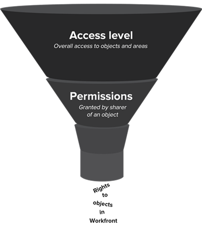

# Overzicht van nieuwe toegangsniveaus

Als beheerder van Adobe Workfront, wijst u een toegangsniveau aan een gebruiker voor twee doeleinden toe:

* Elke gebruiker moet een toegangsniveau hebben om zich aan te melden en in Workfront te werken.
* Met het toegangsniveau kunt u bepalen wat een gebruiker kan zien en doen met bepaalde Workfront-objecten en -gebieden.

## Nieuwe ingebouwde toegangsniveaus in Adobe Workfront {#built-in-access}

Workfront heeft vijf nieuwe ingebouwde toegangsniveaus:

* Systeembeheerder
* Standaard
* Licht
* Medewerker
* Extern

Afhankelijk van het toegangsniveau zijn maximaal drie machtigingen beschikbaar voor de meeste Workfront-objecttypen:

<table style="table-layout:auto">
    <tr>
        <td>Bewerken</td>
        <td>Gebruikers kunnen het Workfront-object maken, bewerken, verwijderen en delen</td>
    </tr>
    <tr>
        <td>Weergave</td>
        <td>Gebruikers kunnen het Workfront-object bekijken en delen</td>
    </tr>
    <tr>
        <td>Geen toegang</td>
        <td>Gebruikers hebben geen toegang tot het Workfront-object</td>
    </tr>
</table>

Als u een aangepast toegangsniveau nodig hebt, kunt u het ingebouwde toegangsniveau kopiëren en de hoeveelheid toegang aanpassen die u voor de verschillende Workfront-objecttypen wilt gebruiken. Voor informatie over het creëren van een niveau van de douanetoegang, zie [Aangepaste toegangsniveaus maken of wijzigen](../../../administration-and-setup/add-users/configure-and-grant-access/create-modify-access-levels.md).

>[!IMPORTANT]
>
>Wij adviseren sterk dat u de ingebouwde toegangsniveaus onveranderd laat zodat u naar hen kunt verwijzen nadat u opstelling uw gebruikers.

### Toegangsniveau van systeembeheerder

Dit ingebouwde toegangsniveau is gekoppeld aan de standaardlicentie en is ontworpen voor een gebruiker die het Adobe Workfront-systeem beheert. U kunt dit ingebouwde toegangsniveau niet wijzigen.

Gebruikers met het toegangsniveau voor systeembeheerders kunnen alles doen in Workfront. Ze kunnen alle Workfront-objecten en informatie die door alle andere gebruikers in Workfront is ingevoerd, weergeven en bewerken.

Zij hebben ook toegang tot het volledige gebied van de Opstelling, waar zij om het even welk plaatsen op het systeemniveau kunnen veranderen, en zij kunnen tot alle gebieden in het Belangrijkste Menu toegang hebben.

Zie voor meer informatie [Volledige administratieve toegang verlenen aan een gebruiker](../../../administration-and-setup/add-users/configure-and-grant-access/grant-a-user-full-administrative-access.md).

### Standaardtoegangsniveau

Dit toegangsniveau is ook gekoppeld aan de standaardlicentie en is bedoeld voor gebruikers die:

* Alle projecten op één locatie plannen, maken en traceren
* Automatische routinematige processen
* Bronnen beheren
* Bijhouden en samenwerken aan verzoeken
* Spoor en rapporteer de projectfinanciën
* Kickoff binnenkomende werkverzoeken
* Samenwerken aan projecten, taken en problemen

>[!NOTE]
>
>U kunt een aangepaste versie van het standaard ingebouwde toegangsniveau maken en de mate van toegang aanpassen die dit toestaat voor de verschillende Workfront-objecttypen. Voor informatie over het creëren van een niveau van de douanetoegang, zie [Aangepaste toegangsniveaus maken of wijzigen](../../../administration-and-setup/add-users/configure-and-grant-access/create-modify-access-levels.md).

#### **Toegangsgegevens**

Hieronder ziet u de hoogste toegangsinstellingen die beschikbaar zijn voor objecten op het niveau Standaard:

| Workfront-objecttype | Geen toegang | Toegang weergeven | Toegang bewerken |
|---|---|---|---|
| Projecten |   |   | ✓ |
| Taken |   |   | ✓ |
| Problemen |   |   | ✓ |
| Portfolio&#39;s |   |   | ✓ |
| Programma&#39;s |   |   | ✓ |
| Rapporten (inclusief dashboards en kalenderrapporten) |   |   | ✓ |
| Filters, weergaven en groepen |   |   | ✓ |
| Documenten |   |   | ✓ |
| Gebruikers |   |   | ✓ |
| Sjablonen |   |   | ✓ |
| Financiële gegevens |   |   | ✓ |
| Bronbeheer |   |   | ✓ |
| Scenario Planner |   |   | ✓ (De standaardinstelling is Geen toegang.) |
| Borden |   |   | ✓ |
| Home |   |   | ✓ |
| Doelen |   |   | ✓ |

{style="table-layout:auto"}

### Lichttoegangsniveau

Dit toegangsniveau is gekoppeld aan de Lichte licentie en is ontworpen voor gebruikers die:

* Alle items en updates weergeven die zijn gekoppeld aan werk
* Projecten, taken en problemen goedkeuren
* dashboards en rapporten weergeven
* De tijd van het spoor en keurt chronologie goed
* Problemen maken en beheren
* Updates op het werk maken

Gebruikers met het toegangsniveau Licht:

* Kan aan werkitems worden toegewezen, maar deze kunnen niet worden voltooid.
* Kan aanvragen en documenten openen in het hoofdmenu.
* Heb beperkte capaciteit om tot voorwerp-zij tot stand te brengen geen projecten, portefeuilles, programma&#39;s, of rapporten kunnen leiden.

>[!NOTE]
>
>U kunt een aangepaste versie maken van het ingebouwde toegangsniveau Licht en de mate van toegang aanpassen die dit toestaat voor de verschillende Workfront-objecttypen. Voor informatie over het creëren van een niveau van de douanetoegang, zie [Aangepaste toegangsniveaus maken of wijzigen](../../../administration-and-setup/add-users/configure-and-grant-access/create-modify-access-levels.md).

#### **Toegangsgegevens**

Hieronder ziet u de hoogste toegangsinstellingen die beschikbaar zijn voor objecten in het toegangsniveau Licht:

<table style="table-layout:auto"> 
 <col> 
 <col> 
 <col> 
 <col> 
 <thead> 
  <tr> 
   <th>Workfront-objecttype</th> 
   <th>Geen toegang</th> 
   <th>Toegang weergeven</th> 
   <th>Toegang bewerken</th> 
  </tr> 
 </thead> 
 <tbody> 
  <tr> 
   <td>Projecten</td> 
   <td> </td> 
   <td>✓</td> 
   <td> </td> 
  </tr> 
  <tr> 
   <td>Taken</td> 
   <td> </td> 
   <td>✓</td> 
   <td> </td> 
  </tr> 
  <tr> 
   <td>Problemen</td> 
   <td> </td> 
   <td> </td> 
   <td>✓</td> 
  </tr> 
  <tr> 
   <td>Portfolio's</td> 
   <td> </td> 
   <td>✓ (De standaardinstelling is Geen toegang.)</td> 
   <td> </td> 
  </tr> 
  <tr> 
   <td>Programma's</td> 
   <td> </td> 
   <td>✓ (De standaardinstelling is Geen toegang.)</td> 
   <td> </td> 
  </tr> 
  <tr> 
   <td>Rapporten (inclusief dashboards en kalenderrapporten)</td> 
   <td> </td> 
   <td>✓</td> 
   <td> </td> 
  </tr> 
  <tr> 
   <td>Filters, weergaven en groepen</td> 
   <td> </td> 
   <td> </td> 
   <td>✓</td> 
  </tr> 
  <tr> 
   <td>Documenten</td> 
   <td> </td> 
   <td> </td> 
   <td>✓</td> 
  </tr> 
  <tr> 
   <td>Gebruikers</td> 
   <td> </td> 
   <td>✓</td> 
   <td> </td> 
  </tr> 
    <tr> 
   <td>Teams</td> 
   <td> </td> 
   <td>✓</td> 
   <td> </td> 
  </tr>
  <tr> 
   <td>Sjablonen</td> 
   <td>✓</td> 
   <td> </td> 
   <td> </td> 
  </tr> 
  <tr> 
   <td>Financiële gegevens</td> 
   <td>✓</td> 
   <td> 
 
 </td> 
   <td> </td> 
  </tr> 
  <tr> 
   <td>Bronbeheer</td> 
   <td> </td> 
   <td>✓</td> 
   <td> </td> 
  </tr> 
  <tr> 
   <td>Scenario Planner </td> 
   <td> </td> 
   <td> </td> 
   <td>✓ (De standaardinstelling is Geen toegang.)</td> 
  </tr> 
  <tr> 
   <td>Borden </td> 
   <td> </td> 
   <td> </td> 
   <td>✓</td> 
     <tr> 
   <td>Home </td> 
   <td> </td> 
   <td> </td> 
   <td>✓</td> 
  </tr> 
  <tr>   
   <td>Doelen </td> 
   <td> </td> 
   <td> </td> 
   <td>✓</td> 
 </tbody> 
</table>

### Toegangsniveau van contribuant

Dit toegangsniveau is gekoppeld aan de bijdragelicentie en is bedoeld voor gebruikers die:

* Verzoeken verzenden
* Aanvragen bijhouden
* Aanvragen voor bijwerken en controleren
* Aanvragen goedkeuren

Gebruikers met dit ingebouwde toegangsniveau:

* Kan verzoeken indienen en deze aanvragen bijwerken
* Documenten uploaden en goedkeuren
* Kan de status van de verzonden problemen bekijken
* Kan worden toegewezen aan werkitems maar kan deze niet voltooien
* U hebt alleen toegang tot aanvragen via het hoofdmenu. Voor meer informatie over verzoekrijen, zie [Een aanvraagwachtrij maken](../../../manage-work/requests/create-and-manage-request-queues/create-request-queue.md).

>[!NOTE]
>
>U kunt een aangepaste versie van het ingebouwde toegangsniveau van de Medewerker maken en de mate van toegang aanpassen die het toestaat voor de verschillende Workfront-objecttypen. Voor informatie over het creëren van een niveau van de douanetoegang, zie [Aangepaste toegangsniveaus maken of wijzigen](../../../administration-and-setup/add-users/configure-and-grant-access/create-modify-access-levels.md).

#### **Toegangsgegevens**

Hieronder ziet u de hoogste toegangsinstellingen die beschikbaar zijn voor objecten op het toegangsniveau van de Contribute-medewerker:

| Workfront-objecttype | Geen toegang | Toegang weergeven | Toegang bewerken |
|---|---|---|---|
| Project |   | ✓ |   |
| Taak |   | ✓ |   |
| Probleem |   |   | ✓ |
| Portfolio&#39;s | ✓ |   |   |
| Programma&#39;s | ✓ |   |   |
| Rapporten (inclusief dashboards en kalenderrapporten) |   | ✓ (Alleen het tabblad Details) |   |
| Filters, weergaven en groepen |   |   | ✓ |
| Document |   |   | ✓ |
| Gebruiker |   | ✓ |   |
| Teams |   | ✓ |   |
| Sjabloon | ✓ |   |   |
| Financiële gegevens | ✓ |   |   |
| Bronbeheer | ✓ |   |   |
| Scenario Planner | ✓ |   |   |
| Borden |   |   | ✓ (eenvoudige kaarten) |
| Home |   | ✓ (Mijn updates) |   |
| Doelen |   |   | ✓ |

{style="table-layout:auto"}

### Toegangsniveau externe gebruiker

Dit toegangsniveau is niet gekoppeld aan een betaalde Workfront-licentie. Het is het meest restrictieve toegangsniveau, dat hoofdzakelijk voor medewerkers zoals externe adviseurs wordt ontworpen die zich niet bij Workfront aanmelden, maar moet, af en toe documenten herzien downloaden of bekijken.

Workfront-gebruikers kunnen taken toewijzen aan externe gebruikers, ook al kunnen externe gebruikers zich niet aanmelden bij het systeem. Maar wij raden ons hiertegen aan, omdat dat werk in het systeem onopgelost zou blijven.

Gebruikers met het toegangsniveau voor externe gebruikers:

* Alleen documenten en kalenderrapporten weergeven die met hen worden gedeeld
* Gebruikers weergeven die documenten en kalenderrapporten met hen delen
* De documenten goedkeuren die met hen worden gedeeld

U kunt dit toegangsniveau niet wijzigen.

>[!IMPORTANT]
>
>De externe Gebruiker is beschikbaar slechts als de optie &quot;met mensen zonder de rekeningen van Workfront samenwerken door hun e-mailadres te gebruiken&quot;in het gebied van de Voorkeur van het Systeem in Opstelling wordt toegelaten. Zie voor meer informatie [Systeembeveiligingsvoorkeuren configureren](/help/quicksilver/administration-and-setup/manage-workfront/security/configure-security-preferences.md).

#### **Toegangsgegevens**

Hieronder ziet u de hoogste toegangsinstellingen die beschikbaar zijn voor objecten op het toegangsniveau van de externe gebruiker.

| Workfront-objecttype | Geen toegang | Toegang weergeven | Toegang bewerken |
|---|---|---|---|
| Project | ✓ |   |   |
| Taak | ✓ |   |   |
| Probleem | ✓ |   |   |
| Portfolio&#39;s | ✓ |   |   |
| Programma&#39;s | ✓ |   |   |
| Rapporten (inclusief dashboards en kalenderrapporten) |   | ✓ (Alleen voor kalenderrapporten; geen mogelijkheid om rapporten te delen) |   |
| Filters, weergaven en groepen | ✓ |   |   |
| Document |   | ✓ (kan geen documenten delen) |   |
| Gebruiker |   | ✓ |   |
| Teams | ✓ |   |   |
| Sjabloon | ✓ |   |   |
| Financiële gegevens | ✓ |   |   |
| Bronbeheer | ✓ |   |   |
| Scenario Planner | ✓ |   |   |
| Borden | ✓ |   |   |
| Home | ✓ |   |   |
| Doelen | ✓ |   |   |

## Hoe de toegangsniveaus en de toestemmingen samenwerken

De niveaus van de toegang bepalen wat de gebruikers kunnen zien en doen met algemene objecten types en gebieden in het systeem, zoals projecten, taken, en kwesties. De toestemmingen bepalen wat u tot op specifieke voorwerpen toegang hebt die door andere mensen in het systeem als een project worden gecreeerd om een marketing campagne in werking te stellen.

In de volgende tabel wordt de algemene toegang van een gebruiker tot objecten (gedefinieerd door het toegangsniveau van de gebruiker) tot machtigingen voor een specifiek gezamenlijk object vergeleken:

<table style="table-layout:auto"> 
 <col> 
 <col> 
 <col> 
 <thead> 
  <tr> 
   <th> </th> 
   <th>Toegangsniveau </th> 
   <th>Machtigingen </th> 
  </tr> 
 </thead> 
 <tbody> 
  <tr> 
   <td>Door een Workfront-beheerder toegekend op het toegangsniveau van een gebruiker</td> 
   <td>✓</td> 
   <td> </td> 
  </tr> 
  <tr> 
   <td>Toegewezen door een gebruiker die een object op objectniveau deelt</td> 
   <td> </td> 
   <td>✓</td> 
  </tr> 
  <tr> 
   <td> 
Overgenomen van een gezamenlijk object met een hogere positie 
   </td> 
   <td> </td> 
   <td>✓</td> 
  </tr> 
 </tbody> 
</table>

De activiteiten een gebruiker met een voorwerp kan doen worden bepaald door een combinatie van hun toegangsniveau en de toestemmingen die aan hen worden gegeven.

### Rechten verlenen via het delen van objecten

Gebruikers krijgen toegang tot afzonderlijke objecten wanneer andere gebruikers bepaalde machtigingen voor die objecten delen en verlenen.

>[!NOTE]
>
>* Als een gebruiker een object deelt met bepaalde machtigingen en dat object onderliggende objecten eronder heeft, erft de ontvanger dezelfde machtigingen voor die onderliggende objecten.
>* Als een toegangsniveau gebruikers beperkt om bepaalde voorwerpen te schrappen, houdt dit hen niet van het schrappen van kindvoorwerpen die in die voorwerpen bevat zijn.

Een gebruiker kan de ontvanger een van de volgende machtigingen verlenen aan het afzonderlijke object:

* **Weergave**: Met dit machtigingsniveau kan de ontvanger het object op een van de volgende manieren delen:

   * In het hele systeem, zodat alle gebruikers het kunnen zien (niet beschikbaar voor alle objecten)
   * Met externe gebruikers zonder Workfront-licentie (niet beschikbaar voor alle objecten)
   * Met een e-mailadres (alleen beschikbaar voor documenten en kalenders)

* **Contribute**: (niet beschikbaar voor alle objecten)
* **Beheren**: Wanneer iemand een object deelt, worden de rechten van de ontvanger op het object bepaald door een combinatie van het toegangsniveau van de ontvanger en de machtigingen voor het object die door de deler zijn verleend. De laagste toegangsgraad beschikbaar in die combinatie is wat bepaalt wat de ontvanger met het voorwerp kan doen.

### Voorbeeldscenario&#39;s

#### **Scenario 1**

Als het de toegangsniveau van de ontvanger project het uitgeven niet toestaat, kan die persoon geen project uitgeven of schrappen zelfs als de aandeelhouder toestemmingen verleende om het te beheren.

Of, als het de toegangsniveau van de ontvanger project het uitgeven toestaat, maar aandeelhouder verleende mening-slechts toestemmingen aan een project, kan de gebruiker niet het project uitgeven of schrappen.

#### **Scenario 2**

Wanneer Olivia een Workfront-project deelt met Tony, wordt de toegang van Tony tot het project bepaald door een combinatie van twee dingen:

* Tony&#39;s toegangsniveau, toegewezen door de beheerder van Workfront
* Tony&#39;s machtigingen voor het project, gespecificeerd door Olivia

Tony&#39;s acties met betrekking tot het project kunnen verder worden beperkt op het project, maar ze kunnen niet onbeperkt zijn tot wat op zijn toegangsniveau is toegestaan:

* Als het toegangsniveau van Tony hem niet toestaat om taken tot stand te brengen, kan hij geen taken aan het project toevoegen, zelfs als Olivia hem toestemmingen gaf om taken aan het toe te voegen.
* Als het de toegangsniveau van Tony hem toestaat om taken tot stand te brengen, maar Olivia verleende geen toestemmingen om taken aan het project toe te voegen, kan hij geen taken aan dat project toevoegen, maar hij kan taken aan andere projecten toevoegen waar hij toestemmingen heeft gekregen om dit te doen.
