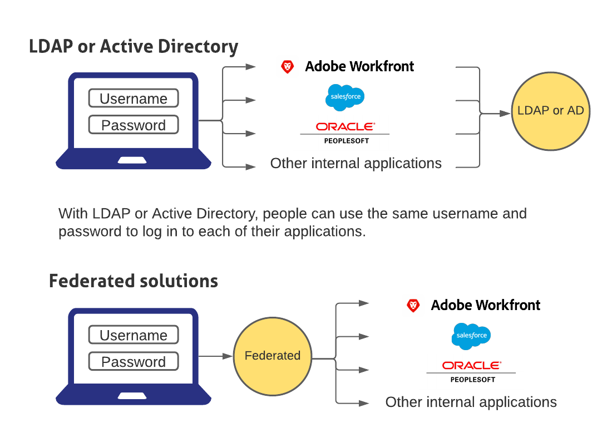

# Overzicht van Single Sign-On in Adobe Workfront

{{important-admin-console-onboard}}

Workfront biedt een centraal beheerde SSO-configuratie (Single Sign-On) die Workfront eenvoudig kan integreren met uw bestaande SSO-oplossing. Deze configuratie is eenvoudig in te stellen en te beheren en is beschikbaar voor zowel OnDemand- als OnPremise Enterprise-klanten.

Als u de SSO-functionaliteit in Workfront wilt gebruiken, moet uw organisatie een SSO-toepassing instellen. Vervolgens kunt u Workfront zo configureren dat deze kan communiceren met uw SSO-oplossing.

Met federatieve oplossingen kunnen gebruikers zich aanmelden bij al hun toepassingen door hun gebruikersnaam en wachtwoord in te voeren in een gecentraliseerd aanmeldingsportal.

## Uw firewall configureren

Wanneer Workfront een SSO-oplossing gebruikt, wordt een verbinding met de server op de opgegeven poort tot stand gebracht.

Als u zich op verzoek abonneert op Workfront en als u uw firewall- of mailserver zodanig hebt geconfigureerd dat alleen bepaalde leveranciers toegang krijgen, moet u bepaalde Workfront IP-adressen toevoegen aan de lijst van gewenste personen van uw firewall. Zie voor meer informatie [De lijst van gewenste personen van uw firewall configureren](../../../administration-and-setup/get-started-wf-administration/configure-your-firewall.md).

## Single Sign-On configureren

Workfront integreert met de volgende SSO-oplossingen:

* Federale oplossingen die SAML 2.0 ondersteunen

   Voor informatie over het integreren van Workfront met SAML 2.0 raadpleegt u [Adobe Workfront configureren met SAML 2.0](../../../administration-and-setup/add-users/single-sign-on/configure-workfront-saml-2.md).

* Federale oplossingen die SAML 2.0 ondersteunen met ADFS

   Voor informatie over het integreren van Workfront met SAML 2.0 met behulp van ADFS raadpleegt u [Adobe Workfront configureren met SAML 2.0 met behulp van ADFS](../../../administration-and-setup/add-users/single-sign-on/configure-workfront-saml-2-adfs.md).
