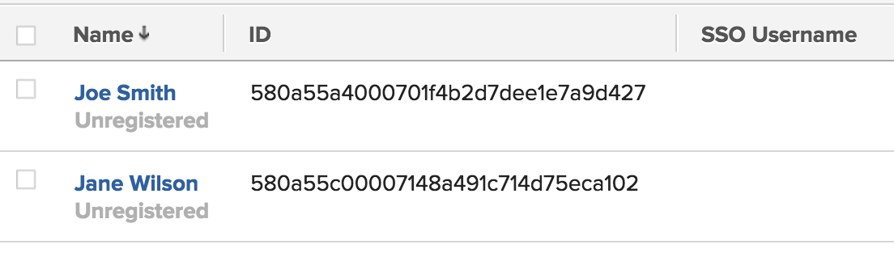

# Gebruikers bijwerken voor eenmalige aanmelding

<!-- Audited: 1/2024 -->

{{important-admin-console-onboard}}

Wanneer SSO (Single Sign-On) is ingeschakeld in uw Adobe Workfront-instantie, kunnen uw gebruikers zich aanmelden bij Workfront met hun SSO-referenties.

Als u een bestaand systeem hebt dat al is gevuld met gebruikers die zijn gekoppeld aan SSO-referenties, kunt u de gebruikers-id&#39;s importeren in Workfront door een CSV-bestand (comma-separated values, door komma&#39;s gescheiden waarden) te importeren in Workfront.

Voor meer informatie over het integreren van Workfront met een SSO-systeem raadpleegt u [Overzicht van Single Sign-On in Adobe Workfront](../../../administration-and-setup/add-users/single-sign-on/sso-in-workfront.md).

## Toegangsvereisten

U moet de volgende toegang hebben om de stappen in dit artikel uit te voeren:

<table style="table-layout:auto"> 
 <col> 
 <col> 
 <tbody> 
  <tr> 
   <td role="rowheader">Adobe Workfront-plan</td> 
   <td>Alle</td> 
  </tr> 
  <tr> 
   <td role="rowheader">Adobe Workfront-licentie</td> 
   <td>
Nieuw: Standaard

of

Huidig: Plan
</td> 
  </tr> 
  <tr> 
   <td role="rowheader">Configuraties op toegangsniveau</td> 
   <td> 
U moet een Workfront-beheerder zijn.
  </td> 
  </tr> 
 </tbody> 
</table>

Zie voor meer informatie over de informatie in deze tabel [Toegangsvereisten in Workfront-documentatie](/help/quicksilver/administration-and-setup/add-users/access-levels-and-object-permissions/access-level-requirements-in-documentation.md).

## SSO-gebruikersnamen

Afhankelijk van welke oplossing SSO u gebruikt, kan de gebruikersbenaming in uw milieu SSO om het even welke volgend worden genoemd:

* SSO-gebruikersnaam
* Federatie-id
* Federation-gebruikersnaam

Ongeacht wat de gebruikersbenaming in uw milieu SSO wordt geroepen, wordt de waarde van het gebied opgeslagen op het gebied van de Gebruikersnaam SSO, op het voorwerp van de Gebruiker.

Uw gebruikers kunnen zich alleen aanmelden bij Workfront als hun SSO-gebruikersgegevens zijn bijgewerkt met hun profiel en hun SSO-gebruikersnaam en Workfront-gebruikersnaam worden opgenomen.

Als Workfront-beheerder kunt u het veld SSO-gebruikersnaam voor uw Workfront-gebruikers bulksgewijs bijwerken door een lijst met gebruikersnamen te importeren in Workfront. Deze lijst moet:

* Bevat de Workfront-gebruikersnaam (GUID) en de bijbehorende SSO-gebruikersnaam voor elke gebruiker
* Opslaan als CSV- of TSV-bestand.

Dit proces werkt bestaande SSO-gebruikersnamen in Workfront bij of voegt een nieuwe SSO-gebruikersnaam toe als deze ontbreekt voor gebruikers.

## Het importbestand voorbereiden {#prepare-the-import-file}

U kunt uw importbestand voorbereiden door een rapport van alle gebruikers in Workfront op te stellen waarin de velden voor SSO-gebruikersnaam moeten worden bijgewerkt.

1. Bouw een gebruikersrapport in Workfront.

   Zie voor instructies over het samenstellen van gebruikersrapporten in Workfront [Een aangepast rapport maken](../../../reports-and-dashboards/reports/creating-and-managing-reports/create-custom-report.md).

1. Selecteer de volgende gebieden in uw rapport:

   | Veld | Toelichting |
   |---|---|
   | Naam | De volledige naam van de Workfront-gebruiker. |
   | ID | De id is de alfanumerieke GUID van Workfront. |
   | SSO-gebruikersnaam | Door het veld SSO-gebruikersnaam toe te voegen, weet u zeker dat u geen gebruikersnamen overschrijft met het importeren. Dit veld moet leeg zijn voor alle gebruikers als uw gebruikers nog niet zijn bijgewerkt voor SSO. |

   

1. Sla het rapport op.
1. Klikken **Exporteren** boven aan het rapport en exporteer het rapport naar Excel.
1. Open het geëxporteerde Excel-bestand en voeg uw SSO-gebruikersnamen voor elke gebruiker toe in het rapport in de kolom Gebruikersnaam van SSO.

   >[!IMPORTANT]
   >
   >SSO-gebruikersnamen zijn hoofdlettergevoelig.

1. Alle kolommen in het Excel-bestand verwijderen, behalve de kolommen **ID** en de **SSO-gebruikersnaam** kolommen.

1. Schrap de kolomkopballen en zorg ervoor er geen lege rijen bij de bovenkant van het rapport zijn.

   Het bestand dat u gebruikt voor het bijwerken van uw Workfront-gebruikers met de SSO-gebruikersnamen **moet** bevat slechts twee kolommen, in deze volgorde:

   * In de eerste kolom moet de Workfront-gebruikersnaam worden weergegeven (de gebruiker GUID in Workfront).
   * De tweede kolom moet de Sso- Gebruikersnaam bevatten, aangezien het in uw SSO systeem toont.
   * De kolommen mogen geen kopteksten hebben en er mogen geen lege rijen boven aan de lijst met namen staan.

     

1. Sla het rapport op als een CSV- of TSV-bestand op uw computer.

## Uw gebruikers bijwerken voor SSO {#update-your-users-for-sso}

Het proces om gebruikers voor SSO bij te werken of voegt het gebied van de Gebruikersnaam SSO aan uw gebruikers van Workfront toe als men niet aanwezig is, of werkt de waarde op dat gebied bij als er een waarde reeds verbonden aan de gebruikers is.

1. Klik op de knop **[!UICONTROL Main Menu]** pictogram  in de rechterbovenhoek van Adobe Workfront of (indien beschikbaar) op de knop **[!UICONTROL Main Menu]** pictogram  in de linkerbovenhoek klikt u op **Instellen** .

1. Klik, **Systeem** Selecteer vervolgens **Gebruikers voor SSO bijwerken**.

1. Klikken **Bestand kiezen** om te bladeren naar het bestand dat u hebt voorbereid.

   Ga voor meer informatie over het voorbereiden van dit bestand naar [Het importbestand voorbereiden](#prepare-the-import-file).

1. Selecteer het bestand van de locatie waar het op de computer is opgeslagen en klik op **Openen**.

   Hiermee worden de SSO-gegevens ingevoegd in Workfront, zodat alle gebruikers zich met hun SSO-gegevens kunnen aanmelden bij Workfront.

   De **Alleen toestaan `<SSO Configuration>` Verificatie** Deze instelling wordt ingeschakeld voor alle gebruikers die zijn opgenomen in de CSV. Dit zorgt ervoor dat de gebruikers zich door SSO moeten aanmelden.

## Verifieer SSO tegen de gebruikersnamen van Workfront van uw gebruikers

Voor instructies bij het bouwen van een gebruikersrapport dat SSO-gebruikersgegevens bevat, raadpleegt u [Het importbestand voorbereiden](#prepare-the-import-file).

1. Voer een gebruikersrapport met SSO-gebruikersnaam in.

   Bericht dat de kolom van de Gebruikersnaam SSO voor elke gebruiker wordt bevolkt.

1. Zorg ervoor dat de waarden voor de kolom Gebruikersnaam SSO overeenkomen met de gebruikersnaam van SSO op uw SSO-server.
1. Als de kolom Gebruikersnaam SSO leeg is, werkt u de SSO-gebruikersnamen van uw gebruikers bij.

   

   Voor instructies over het bijwerken van uw gebruikers voor SSO, zie [Uw gebruikers bijwerken voor SSO](#update-your-users-for-sso).
