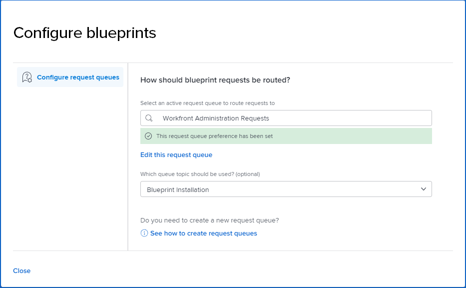

# Toegang tot blauwdrukken configureren

Alle gebruikers van [!DNL Adobe Workfront] kunnen door de catalogus met blauwdrukken bladeren.

Als systeembeheerder kunt u:

* Voeg [!UICONTROL Blueprints] toe aan het hoofdmenu in lay-outsjablonen en wijs de lay-outsjabloon toe aan gebruikers of groepen. Voor meer informatie, zie [ [!UICONTROL Main Menu] aanpassen gebruikend een lay-outmalplaatje ](/help/quicksilver/administration-and-setup/customize-workfront/use-layout-templates/customize-main-menu.md) en [ wijs gebruikers aan een lay-outmalplaatje ](/help/quicksilver/administration-and-setup/customize-workfront/use-layout-templates/assign-users-to-layout-template.md) toe.

  >[!NOTE]
  >
  >* Gebruikers waaraan geen lay-outsjabloon is toegewezen, zien het pictogram [!UICONTROL Blueprints] in [!UICONTROL Main Menu] .
  >* Wanneer u een nieuwe lay-outsjabloon maakt, wordt het pictogram [!UICONTROL Blueprints] standaard opgenomen in de [!UICONTROL Active Items] lijst voor de [!UICONTROL Main Menu] .

* Laat toegang voor gebruikers toe om installatie van blauwdrukken te verzoeken door opstelling een verzoekrij om de verzoeken op te slaan. Hier hebt u één locatie om aanvragen bij te houden en bij te werken. Volg onderstaande procedure voor meer informatie.
* Installeer blauwdrukken. Voor informatie, zie [ een blauwdruk ](../../administration-and-setup/blueprints/blueprints-install.md) installeren.

## Toegangsvereisten

+++ Breid uit om de toegangseisen voor de functionaliteit in dit artikel weer te geven.

<table style="table-layout:auto"> 
 <col> 
 <col> 
 <tbody> 
  <tr> 
   <td role="rowheader">Adobe Workfront-pakket</td> 
   <td>Alle</td> 
  </tr> 
  <tr> 
   <td role="rowheader">Adobe Workfront-licentie</td> 
   <td>
   
Standard

   
Plan
</td> 
  </tr> 
  <tr> 
   <td role="rowheader">Configuraties op toegangsniveau</td> 
   <td>Workfront-beheerder </td> 
  </tr> 
 </tbody> 
</table>

Voor meer detail over de informatie in deze lijst, zie [ vereisten van de Toegang in de documentatie van Workfront ](/help/quicksilver/administration-and-setup/add-users/access-levels-and-object-permissions/access-level-requirements-in-documentation.md).

+++

## Vereisten {#prerequisites}

* U moet een bestaande verzoekrij gebruiken om blauwdrukverzoeken op te slaan. Het project moet als verzoekrij worden bewaard en het moet in [!UICONTROL Current] status zijn.
* De verzoekrij moet openbaar zijn. In de details van de verzoekrij, &quot;[!UICONTROL Who can add requests to this queue?]&quot;moet aan **[!UICONTROL Anyone]** worden geplaatst.

>[!TIP]
>
>Als u een nieuwe verzoekrij voor blauwdrukverzoeken wilt tot stand brengen, zou u het moeten bouwen alvorens de toegang van blauwdrukken te vormen. Voor informatie bij het creëren van een verzoekrij, zie [ een Rij van het Verzoek ](../../manage-work/requests/create-and-manage-request-queues/create-request-queue.md) creëren.

## Selecteer de aanvraagwachtrij om verzoeken voor afdrukken op te slaan

Voordat gebruikers kunnen aanvragen dat ze blauwdrukken installeren, moet u een aanvraagwachtrij voor deze aanvragen selecteren. Totdat de aanvraagwachtrij is gedefinieerd, kunnen gebruikers alleen door de blauwdrukcatalogus bladeren.

{{step1-to-blueprints}}

1. Klik op **[!UICONTROL Configure blueprint requests]** rechtsboven in het catalogusscherm.

   <!--
   <li value="3" data-mc-conditions="QuicksilverOrClassic.Draft mode"> 
In the <strong>Configure blueprints</strong> dialog, ensure that the <strong>Configure request queues</strong> tab is selected.
 </li>
   -->

1. Typ in het dialoogvenster **[!UICONTROL Configure blueprints]** de naam van een actieve aanvraagwachtrij en selecteer deze wanneer deze wordt weergegeven in de zoekresultaten.

   >[!IMPORTANT]
   >
   >Alleen openbare aanvraagrijen worden in deze lijst weergegeven. Om uw verzoekrij openbaar te maken, zie de [ sectie van Eerste vereisten ](#prerequisites) hierboven.

   De voorkeur van de verzoekrij wordt geplaatst, en de gebruikers kunnen nu om blauwdrukinstallatie verzoeken.

   

1. (Optioneel) Als u wijzigingen wilt aanbrengen in de feitelijke wachtrij met aanvragen, klikt u op **[!UICONTROL Edit this request queue]** .

   Het project van de verzoekrij opent in een nieuw browser lusje en u kunt het bijwerken zoals nodig.

1. (Facultatief) als de verzoekrij onderwerpgroepen of rijonderwerpen bevat, kunt u hen van de lijst selecteren.
1. Klik op **[!UICONTROL Close]** om terug te keren naar de blauwdrukcatalogus.

>[!NOTE]
>
>Wanneer u een gewenste blauwdruk installeert, moet u de status van de uitgave wijzigen in **[!UICONTROL Closed]** of **[!UICONTROL Resolved]** in de aanvraagwachtrij zodat de aanvrager op de hoogte wordt gesteld. Voor informatie over het installeren van een blauwdruk, zie [ een blauwdruk ](../../administration-and-setup/blueprints/blueprints-install.md) installeren.
