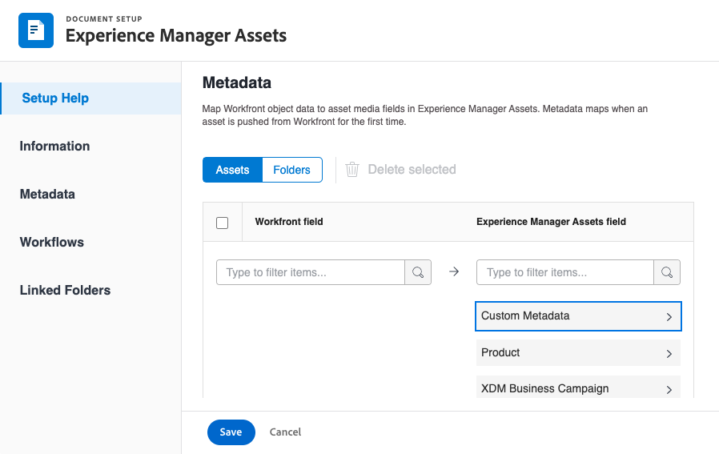

# Vorm [!UICONTROL Experience Manager Assets as a Cloud Service] integratie

>[!IMPORTANT]
>
>Deze functionaliteit is alleen beschikbaar voor organisaties die aan de [!DNL Adobe Admin Console].

U kunt uw werk in [!DNL Experience Manager Assets]&#x200B;:

* Elementen en metagegevens verschuiven vanuit [!DNL Adobe Workfront] tot [!DNL Experience Manager Assets]&#x200B;
* Elementen koppelen van [!DNL Experience Manager Assets] aan uw projecten en taken in [!DNL Workfront&#x200B;]
* Gebruiksgevallen voor versioning vereenvoudigen
* Mappen maken die zijn gekoppeld aan [!DNL Experience Manager Assets]
* Metagegevens bijhouden voor elementen en mappen
* Projectmetagegevens synchroniseren tussen [!DNL Workfront] en [!DNL Experience Manager Assets]

>[!NOTE]
>
>U kunt ook verbinding maken met verschillende [!DNL Experience Manager Assets] repository&#39;s naar één [!UICONTROL Workfront] milieu, of verscheidene [!DNL Workfront] omgevingen naar één [!DNL Experience Manager Assets] opslagplaats voor alle organisatie-id&#39;s. Volg de configuratieinstructies in dit artikel voor elke integratie u opstelling zou willen.

## Toegangsvereisten

U moet het volgende hebben:

<table>
  <tr>
   <td><strong>[!DNL Adobe Workfront] plan*</strong>
   </td>
   <td>Alle
   </td>
  </tr>
  <tr>
   <td><strong>[!DNL Adobe Workfront] licenties*</strong>
   </td>
   <td>[!UICONTROL Plan]
   </td>
  </tr>
  <tr>
   <td><strong>[!DNL Experience Manager] licentie</strong>
   </td>
   <td>[!UICONTROL Standard]
   </td>
  </tr>
  <tr>
   <td><strong>Product</strong>
   </td>
   <td>U moet [!DNL Experience Manager Assets as a Cloud Service]en u moet als gebruiker aan het product worden toegevoegd.
   </td>
  </tr>
  <tr>
   <td>Configuraties op toegangsniveau*
   </td>
   <td>U moet een [!DNL Workfront] beheerder. Voor informatie over [!DNL Workfront] beheerders, zie <strong>Volledige administratieve toegang verlenen aan een gebruiker</strong>.
   </td>
  </tr>
</table>

*Neem contact op met uw Workfront-beheerder om te weten te komen welk abonnement, licentietype of toegang u hebt.

## Vereisten

Voordat u begint,

* U moet [!DNL Workfront] en [!DNL Adobe Experience Manager Assets] gekoppeld aan een organisatie-id in het dialoogvenster [!DNL Adobe Admin Consol]e. Zie voor meer informatie [Verschillen in beheer op basis van platforms ([!DNL Adobe Workfront]/[!DNL Adobe Business Platform])](/help/quicksilver/administration-and-setup/get-started-wf-administration/actions-in-admin-console.md).

## De integratiegegevens instellen

1. Klik op de knop **[!UICONTROL Main Menu]** in de rechterbovenhoek van Adobe Workfront en klik vervolgens op **[!UICONTROL Setup]** .
1. Selecteren **[!UICONTROL Documents]** in het linkerdeelvenster selecteert u vervolgens **[!UICONTROL [!DNL Experience Manager] Integration]**.

   >[!NOTE]
   >
   >Dit configuratiegebied wordt alleen weergegeven als uw [!DNL Workfront] milieu is opgenomen onder een [!DNL Adobe Admin Console].

1. Selecteren **[!UICONTROL Add [!DNL Experience Manager] Integration]**.
1. In de **[!UICONTROL Name]** Voer in het veld de naam in die gebruikers moeten zien wanneer ze in Workfront en Experience Manager Assets met deze integratie werken.
1. In de **[!UICONTROL Navigation URL]** wordt automatisch de navigatie-URL ingevuld. Deze alleen-lezen URL wordt gebruikt om een koppeling te maken naar de [!DNL Experience Manager] van de [!UICONTROL Main Menu] voor snelle toegang.
1. Kies een opslagplaats in het menu **[!UICONTROL [!DNL Experience Manager] Assets repository]** vervolgkeuzelijst. Het systeem vult alle [!DNL Experience Manager] opslagplaatsen die zijn gekoppeld aan de organisatie-id waaraan uw gebruikersprofiel is toegewezen.
   

1. Klikken **[!UICONTROL Save]** of ga naar de [Metagegevens instellen (optioneel)](#set-up-metadata-optional) in dit artikel.

   >[!NOTE]
   >
   >Vanwege de complexiteit van de integratie kunt u de repository niet wijzigen nadat u de eerste configuratie hebt opgeslagen.

## Metagegevens instellen (optioneel)

U kunt een kaart toewijzen [!DNL Workfront] objectgegevens naar elementmediavelden in [!DNL Experience Manager] Elementen.

>[!IMPORTANT]
>
>U kunt metagegevens slechts in één richting toewijzen: van [!DNL Workfront] tot [!DNL Experience Manager]. Metagegevens voor documenten die zijn gekoppeld aan [!DNL Workfront] van [!DNL Experience Manager] kan niet worden overgedragen aan [!DNL Workfront].

### Metagegevensvelden configureren

Voordat u metagegevensvelden gaat toewijzen, moet u metagegevensvelden zowel in Workfront als in Experience Manager Assets configureren.

U kunt als volgt metagegevensvelden configureren:

1. Een metagegevensschema configureren in [!DNL Experience Manager Assets] zoals uiteengezet in [Metagegevenstoewijzing tussen Adoben configureren [!DNL Workfront] en [!DNL Experience Manager Assets]](https://experienceleague.adobe.com/docs/experience-manager-cloud-service/content/assets/integrations/configure-asset-metadata-mapping.html?lang=en).

1. Aangepaste formuliervelden configureren in Workfront. [!DNL Workfront] beschikt over veel ingebouwde aangepaste velden die u kunt gebruiken. U kunt echter ook uw eigen aangepaste velden maken, zoals wordt uitgelegd in [Een aangepast formulier maken of bewerken](/help/quicksilver/administration-and-setup/customize-workfront/create-manage-custom-forms/create-or-edit-a-custom-form.md).

+++ **Uitbreiden voor meer informatie over ondersteunde Workfront- en Experience Manager Assets-velden**

**Experience Manager Assets-tags**

U kunt elk door Workfront ondersteund veld toewijzen aan een tag in Experience Manager Assets. Hiervoor moet u ervoor zorgen dat de tagwaarden in Experience Manager Assets overeenkomen met die in Workfront.

* Tags en Workfront-veldwaarden moeten exact overeenkomen in spelling en opmaak.
* Workfront-veldwaarden die zijn toegewezen aan de tags voor de elementen van Manager moeten allemaal in kleine letters worden weergegeven, zelfs als de tag in Experience Manager Assets hoofdletters lijkt te bevatten.
* Workfront-veldwaarden mogen geen spaties bevatten.
* De veldwaarde in Workfront moet ook de mapstructuur van de Experience Manager Assets-tag bevatten.
* Als u meerdere tekstvelden met één regel wilt toewijzen aan labels, voert u een door komma&#39;s gescheiden lijst met de tagwaarden in aan de Workfront-zijde van de metagegevenstoewijzing, en `xcm:keywords` aan de zijde van Experience Manager Assets. Elke veldwaarde wordt toegewezen aan een afzonderlijke tag. U kunt een berekend veld gebruiken om meerdere Workfront-velden te combineren tot één door komma&#39;s gescheiden tekstveld.
* U kunt waarden toewijzen uit vervolgkeuzelijsten, keuzerondjes of selectievakjes door een lijst met door komma&#39;s gescheiden waarden in te voeren in het veld.

>[!INFO]
>
>**Voorbeeld**: Als u de code in de mapstructuur hier wilt laten overeenkomen, wordt de veldwaarde in Workfront ingesteld op `landscapes:trees/spruce`. Noteer de kleine letters in de veldwaarde van Workfront.
>
>Als u wilt dat het label het meest linkse item in de codestructuur is, moet het worden gevolgd door een dubbele punt. In dit voorbeeld wordt de veldwaarde in Workfront als volgt toegewezen aan de landschapstag `landscapes:`.
>
>

Nadat u de tags in Experience Manager Assets hebt gemaakt, worden deze weergegeven onder de vervolgkeuzelijst Codes in de sectie Metagegevens. Als u een veld wilt koppelen aan een tag, selecteert u `xcm:keywords` in de vervolgkeuzelijst Experience Manager Assets-veld in het gebied voor metagegevenstoewijzing.

Ga voor meer informatie over tags in Experience Manager Assets, waaronder het maken en beheren van tags naar [Tags beheren](https://experienceleague.adobe.com/docs/experience-manager-64/administering/contentmanagement/tags.html).

**Aangepaste Experience Manager Assets-metagegevensschemavelden**

U kunt zowel ingebouwde als aangepaste Workfront-velden toewijzen aan aangepaste metagegevensschemavelden in Experience Manager Assets.

Aangepaste metagegevensvelden die zijn gemaakt in Experience Manager Assets, worden in hun eigen sectie geordend in het instellingsgebied voor metagegevens.

<!-- 
link to documentation about creating schema - waiting on response from Anuj about best article to link to
-->

**Workfront-velden**

U kunt ingebouwde en aangepaste Workfront-velden toewijzen aan Experience Manager Assets. De volgende veldwaarden moeten in beide gevallen overeenkomen met de spelling tussen Workfront en Experience Manager Assets:

* Vervolgkeuzelijsten
* Meerdere velden selecteren

>[!TIP]
>
> Als u wilt controleren of de veldwaarden exact overeenkomen, gaat u naar
>
> * Setup > Custom Forms in Workfront of het veld in het object
> * Middelen > Metagegevensschema&#39;s in Experience Manager Assets

+++

### Metagegevens toewijzen voor elementen

Metagegevens worden toegewezen wanneer een element wordt verplaatst van [!DNL Workfront] voor het eerst. Documenten met de ingebouwde of aangepaste velden worden automatisch toegewezen aan de opgegeven velden wanneer een element voor het eerst wordt verzonden naar [!DNL Experience Manager Assets].

Metagegevens toewijzen voor elementen:

<!--
1. Select **[!UICONTROL Assets]** above the metadata table.
-->
1. In de **[!UICONTROL [!DNL Workfront] field]** kiest u een ingebouwd of aangepast Workfront-veld.

   >[!NOTE]
   >
   >U kunt één kaart toewijzen [!DNL Workfront] veld naar meerdere [!UICONTROL Experience Manager Assets] velden. U kunt niet meerdere toewijzingen toewijzen [!DNL Workfront] velden naar één [!DNL Experience Manager Assets] veld.
   ><!--To map a Workfront field to an Experience Manager Assets tag, see -->

1. In de [!DNL Experience Manager Assets] , doorzoeken in de vooraf ingevulde categorieën of ten minste twee letters invoeren in het zoekveld voor toegang tot extra categorieën.
1. Herhaal stap 2 en 3 zo nodig.
   
1. Klikken [!UICONTROL Save] of ga naar de [Workflows instellen](#set-up-workflows-optional) in dit artikel.

<!--

### Map metadata for folders

When users create a linked folder on a project, the associated project, portfolio, and program data is mapped to folder metadata fields in [!DNL Experience Manager Assets].

>[!NOTE]
>
>This integration does not support custom metadata from [!DNL Adobe Experience Manager].

To map metadata for folders: 

1. Select **[!UICONTROL Folders]** above the metadata table.
1. In the **[!UICONTROL [!DNL Workfront] field]** column, choose a built-in or custom Workfront field.

    >[!NOTE]
    >
    >You can map a single Workfront field to multiple Experience Manager Assets fields. You can't map multiple [!DNL Workfront] fields to a single [!DNL Experience Manager Assets] field.

1. In the **[!DNL Experience Manager Assets]** field, search through the pre-populated categories or enter at least two letters in the search field to access additional categories.
1. Repeat steps 2 and 3 as needed.

1. Click **[!UICONTROL Save]** or move on to the [Project metadata sync](#project-metadata-sync) section in this article.

### Object metadata sync

An [!DNL Experience Manager] fields that is mapped to [!DNL Workfront] portfolio, program, project, task, issue, and document fields update automatically when the field is changed in [!DNL Workfront].

When this option is enabled, any asset that has been pushed to Adobe Experience manager includes a card on the Document Details page that displays a real-time view of the document's Adobe Experience Manager metadata.

>[!IMPORTANT]
>
>Users must have write access in [!DNL Experience Manager] for assets living in the object in order for the metadata to sync when it's updated.

1. Enable the **[!UICONTROL Sync object metadata]** field.
1. Click **Save** or move on to the [Set up workflows (Optional)](#set-up-workflows-optional) section in this article.-->

## Workflows instellen (optioneel)

Een werkstroom is een reeks acties die Workfront verbinden met Adobe Experience Manager as a Cloud Service. Als Workfront-beheerder kunt u workflows configureren in Workfront en deze vervolgens toewijzen aan projectsjablonen. Wanneer een Project wordt gecreeerd gebruikend een Malplaatje van het Project waaraan een werkschema wordt toegewezen, worden de acties die in het werkschema worden bepaald teweeggebracht.

De standaardwerkschemawaarden die u in de integratie plaatst kunnen op de niveaus van het Malplaatje en van het Project worden met voeten getreden.

### Een workflow instellen voor het maken van aan Adobe Experience Manager gekoppelde mappen

1. Schakelen tussen **[!UICONTROL Create Linked folder]** op.
1. Kies een mappad om aan te geven waar u alle gekoppelde mappen aan deze integratie wilt koppelen.
   
1. De optie **Portfolio- en programmanamen toevoegen** automatisch namen van Portfolio&#39;s en programma&#39;s opnemen aan het einde van de naam van de gekoppelde map.
1. Klikken **Opslaan** of ga naar de [Gekoppelde mappen instellen (optioneel)](#set-up-linked-folders-optional) in dit artikel.

## Gekoppelde mappen instellen (optioneel)

U kunt gebruikers toestaan om mappen te maken die zijn gekoppeld aan [!DNL Experience Manager] while in een [!DNL Workfront] project. Wanneer een map is gekoppeld, worden alle aan de map toegevoegde middelen automatisch in beide weergegeven [!DNL Workfront] en [!DNL Experience Manager]. Wanneer een middel aan de verbonden omslag in wordt toegevoegd [!DNL Workfront] voor het eerst worden de metagegevens van het element doorgegeven aan [!DNL Experience Manager Assets].

In de onderstaande stappen geeft u aan waar u de gekoppelde mappen wilt maken. Elke integratie kan slechts één locatie voor alle gekoppelde mappen hebben.

Gekoppelde mappen instellen:

1. Schakelen tussen **[!UICONTROL Enable Linked folder]** op.
1. Kies een mappad om aan te geven waar u alle gekoppelde mappen aan deze integratie wilt koppelen.

   >[!NOTE]
   >
   >Gebruikers hebben schrijftoegang nodig in [!DNL Adobe Experience Manager Assets] naar de opgegeven map om een gekoppelde map te maken.

1. Klik op **[!UICONTROL Save]**.
