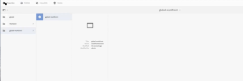

# [!DNL Workfront] configureren met [!DNL Adobe Experience Manager] verouderde connector

<!-- Audited: 4/2025 -->

Als [!DNL Adobe Workfront] beheerder kunt u [!DNL Workfront] met [!UICONTROL Adobe Experience Manager (AEM) Assets] integreren en uw organisatie een uitgebreide oplossing voor inhoudsbeheer bieden voor het maken, delen en onderhouden van elementen in uw workflow.

## Toegangsvereisten

+++ Breid uit om de toegangseisen voor de functionaliteit in dit artikel weer te geven.

<table>
  <tr>
   <td>Adobe Workfront-pakket
   </td>
   <td> <p>Prime of Ultimate</p>
    <p>Workflow Ultimate</p>
   </td>
  </tr>
  <tr>
   <td>Adobe Workfront-licenties
   </td>
   <td><p>Standard</p>
   <p>Plan</p>
   </td>
  </tr>
   <tr>
   <td>Configuraties op toegangsniveau
   </td>
   <td>U moet een [!DNL Workfront] beheerder zijn.
   </td>
  </tr>
</table>

Voor informatie, zie [&#x200B; vereisten van de Toegang in de documentatie van Workfront &#x200B;](/help/quicksilver/administration-and-setup/add-users/access-levels-and-object-permissions/access-level-requirements-in-documentation.md).

## [!DNL Workfront for AEM Assets]

Met [!DNL Workfront for AEM Assets connector] kan uw organisatie het volgende doen:

* Creatieve inhoud samenstellen en beheren door AEM-elementen en -mappen te koppelen aan projecten, taken, problemen en aanvragen in [!DNL Workfront] .

  Voor meer informatie over het vormen van documentintegratie met derdetoepassingen, zie [&#x200B; documentintegratie &#x200B;](../../administration-and-setup/configure-integrations/configure-document-integrations.md) vormen.

* Integreer met de gegevensopslagruimte [!DNL AEM Digital Asset Managemen] t (DAM), zodat u [!DNL Workfront] kunt gebruiken voor het beheren en delen van digitale elementen die zijn opgeslagen in de DAM.

  Zie voor meer informatie over het koppelen van documenten en mappen met elementen de   [&#x200B; de documenten van de Verbinding van externe toepassingen &#x200B;](../../documents/adding-documents-to-workfront/link-documents-from-external-apps.md).

* Combineer en pas meta-gegevens van beide toepassingen op activa toe.
* Een allesomvattende communicatiestream voor een element weergeven. Updates en opmerkingen die in [!DNL Workfront] of [!UICONTROL AEM Assets] op een element zijn aangebracht, worden gesynchroniseerd met de andere toepassing en geven een uitgebreide geschiedenis van de communicatie die met het element is gemaakt.

  Voor meer informatie over het maken van commentaren in [!DNL Workfront], zie [&#x200B; een update aan een document &#x200B;](../../documents/managing-documents/add-update-documents.md) toevoegen.

## Vereisten voor de installatie van de [!DNL AEM Assets] -connector

Voordat u de [!DNL Workfront] -connector voor [!UICONTROL AEM Assets] kunt installeren, moet u controleren of aan de volgende voorwaarden is voldaan:

* [!UICONTROL AEM Assets] is geïnstalleerd en geconfigureerd, versie 6.5 of hoger. Voor informatie over het installeren van [!UICONTROL AEM Assets], zie de [[!DNL Adobe Experience Manager]  documentatie &#x200B;](https://experienceleague.adobe.com/nl/docs/experience-manager).
* (Voorwaardelijk) als uw firewallregels verkeer niet zoals verwacht toestaan, voeg het IP van uw cluster adres en/of domein aan uw lijst van gewenste personen toe. Voor meer informatie, zie [&#x200B; de lijst van gewenste personen van uw firewall &#x200B;](../../administration-and-setup/get-started-wf-administration/configure-your-firewall.md) vormen.

## Installeer het aansluitingspakket [!DNL Workfront for AEM Assets] {#install-the-workfront-for-aem-assets-connector-package}

>[!IMPORTANT]
>
>De volgende instructies zijn voor a [!DNL Workfront with AEM Assets] erfenisschakelaar, die door de [[!DNL Workfront for Experience Manager]  verbeterde schakelaar &#x200B;](../../documents/workfront-and-experience-manager-integrations/workfront-for-experience-manager-enhanced-connector/workfront-for-aem-enhanced-connector.md) is vervangen. Neem contact op met uw accountvertegenwoordiger voor meer informatie.

Als u de [!DNL Workfront for AEM Assets] -connector wilt installeren, moet u de connector als pakket importeren in AEM met behulp van [!UICONTROL CRX Package Manager] .

1. Download het installatiebestand van de [!DNL Workfront for AEM Assets] connector op een werkstation waarop u AEM al hebt geïnstalleerd.

   U kunt de [!DNL Workfront for AEM Assets] -connector ophalen van uw [!DNL Workfront] -vertegenwoordiger.

1. Meld u met een beheerdersaccount aan bij AEM.
1. Klik op **[!UICONTROL Tools]** > **[!UICONTROL Deployment]** > **[!UICONTROL Packages]**. De lus [!UICONTROL CRX Package Manager] wordt geopend.

1. Klik op **[!UICONTROL Upload Package].**

1. Blader in het dialoogvenster **[!UICONTROL Upload Package]** naar het **[!UICONTROL Workfront Connector]** -pakket en selecteer het. Klik vervolgens op **[!UICONTROL OK]** . Het pakket wordt weergegeven in de map [!UICONTROL CRX Package Manager] .

1. Klik op **[!UICONTROL Install].**

1. In het dialoogvenster **[!UICONTROL Package]** negeert u de geavanceerde instellingen en klikt u op **[!UICONTROL Install]** .
1. (Optioneel) Als u wilt bevestigen dat de aansluiting is geïnstalleerd, controleert u of de volgende instructie wordt weergegeven in de [!UICONTROL Activity Log] :

   ```
   Package installed in <time>
   ```

1. Sluit de lus [!UICONTROL CRX Package Manager] . De connector is geïnstalleerd en u kunt [!DNL AEM Assets] nu configureren voor integratie met [!DNL Workfront] .

1. Ga met [&#x200B; voort vormen  [!DNL AEM Assets]  om met  [!DNL Workfront]](#configure-aem-assets-to-integrate-with-workfront) te integreren.

## [!DNL AEM Assets] configureren voor integratie met [!DNL Workfront] {#configure-aem-assets-to-integrate-with-workfront}

Nadat u de connector hebt geïnstalleerd, importeert u het aansluitingspakket naar AEM en configureert u AEM voor koppeling met documenten in [!DNL Workfront] .

Voor informatie bij het installeren van de schakelaar, zie [&#x200B; het  [!DNL Workfront for AEM Assets]  schakelaarpakket &#x200B;](#install-the-workfront-for-aem-assets-connector-package) installeren.

* [Vereisten](#prerequisites)
* [AEM integreren met  [!DNL Workfront]](#integrate-aem-with-workfront)
* [De [!UICONTROL AEM Externalizer] configureren](#configure-the-aem-externalizer)

### Vereisten {#prerequisites}

Voordat u begint, moet u machtigingen inschakelen voor workfront-service:

1. Ga in AEM naar **[!UICONTROL Tools]** > **[!UICONTROL Security]** > **[!UICONTROL Permissions]** .
1. Kies in de linkerbovenhoek de optie **[!UICONTROL Users]** &#x200B; in het keuzemenu en typ *[!UICONTROL workfront-service]* in het &#x200B; **[!UICONTROL Search]** . Selecteer de gebruiker [!UICONTROL workfront-service] .
1. Selecteer **[!UICONTROL Add ACE]** aan de rechterkant van het scherm om nieuwe items te maken.
1. Selecteer in het venster &#x200B;**[!UICONTROL Add New Entry]** &#x200B; het pictogram van het selectievakje in het veld **[!UICONTROL Path]** &#x200B; en kies de map: */conf*
1. Op het **Bevoegdheden** gebied, ga binnen: *jcr:read*
1. In de hoger-juiste hoek, uitgezocht **voeg** toe.
1. (Optioneel) Herhaal bovenstaande stappen om meer items te maken.

### AEM integreren met [!DNL Workfront] {#integrate-aem-with-workfront}

1. Meld u als beheerder aan bij AEM Assets.
1. Klik op **[!UICONTROL Tools]** > **[!UICONTROL Cloud Services]** > **[!UICONTROL Workfront Integration Configuration]** > **[!UICONTROL Global-Workfront].** &#x200B;**&#x200B;**

1. (Voorwaardelijk) Als u dit nog niet hebt gedaan, maakt u een [!DNL Workfront] cloudconfiguratiebestand:

   1. Klik in de rechterbovenhoek van de pagina [!DNL Global-Workfront] op **[!UICONTROL Create]** .
   1. Geef in het vak **[!UICONTROL Workfront URL]** de URL voor de instantie [!DNL Workfront] op.

      Bijvoorbeeld, [!DNL https]:// `<account>` .my.workfront.com, waar `<account>` de rekening is u voor integratie met AEM gebruikt.

   1. Selecteer in het veld &#x200B; **[!UICONTROL Base Folder]** het pictogram van het selectievakje.
   1. Selecteer in het vervolgkeuzemenu het pad waar de documenten die aan [!DNL Workfront] -objecten zijn gekoppeld, worden opgeslagen.
   1. In het modaal AEM dat verschijnt, volg de weg aan de omslag met de documenten die met [!DNL Workfront] voorwerpen worden verbonden. Kies de map en druk op **[!UICONTROL Select]** &#x200B; in de rechterbovenhoek.

      U kunt koppelen naar elke map onder de hoofdmap /content/dam/.

   1. Geef in het vak **[!UICONTROL Workfront API Key]** de [!UICONTROL Workfront] API-sleutel op.

      Uw API-sleutel van [!DNL Workfront] ophalen:

      1. Open een browsertabblad en meld u als [!DNL Workfront] beheerder aan bij uw [!DNL Workfront] -account.

      {{step-1-to-setup}}

      1. Klik op **[!UICONTROL System]** > **[!UICONTROL Customer Info]** .

         Als u reeds een API sleutel hebt geproduceerd, uw [!DNL Workfront] API Zeer belangrijke vertoningen onder het **Sleutel van de Gebruiker API van Uw Gebruiker** etiket.

      1. (Voorwaardelijk) Als u nog geen API-sleutel hebt gegenereerd, moet u een sleutel genereren:

         1. In de **[!UICONTROL API Key Settings]** sectie, zorg ervoor dat de **[!UICONTROL After Creation, API keys expire in]** optie aan **niets** wordt geplaatst.

            Als u een vervalperiode selecteert, zal de schakelaar ophouden werkend nadat de Sleutel van API verloopt. Vervolgens moet u een API-sleutel opnieuw genereren en de configuratie van [!DNL Workfront] bijwerken.

         1. Klik onder het label **[!UICONTROL Your User's API Key]** op **[!UICONTROL Generate API Key]** . Een API-sleutel voor [!DNL Workfront] wordt gegenereerd en weergegeven.
      1. Kopieer de API-sleutel naar het klembord.
      1. Open het browsertabblad voor AEM Connector en plak in het vak **[!DNL Workfront API Key]** de gekopieerde API-sleutel.
   1. (Voorwaardelijk) klik het **[!UICONTROL Advanced]** lusje in de upper-left hoek van de [!UICONTROL [!DNL Workfront] Integration Configuration] pagina, en selecteer de volgende opties indien van toepassing:

      **[!UICONTROL Allow Collection Browsing]:** &#x200B; Selecteer deze optie als uw organisatie [!DNL Workfront] -gebruikers toestaat AEM Assets-verzamelingen te koppelen aan [!DNL Workfront] -objecten.

      **[!UICONTROL User Federated ID]:** selecteer deze optie als uw organisatie Federated IDs of Enige Sign-On (SSO) wanneer het programma opent aan Workfront gebruikt.

      **[!UICONTROL Ignore Email Domain]:** selecteer deze optie als uw AEM-gebruikers de domeinnaam niet in hun gebruikers-id gebruiken.

      **[!UICONTROL Restrict Access]:** selecteer deze optie om de aangewezen [!DNL Workfront] IP adressen te specificeren die aan de lijst van gewenste personen moeten worden toegevoegd. Voor meer informatie over de lijst van gewenste personen, zie [&#x200B; de lijst van gewenste personen van uw firewall &#x200B;](../../administration-and-setup/get-started-wf-administration/configure-your-firewall.md) vormen.

   1. Klik in de linkerbovenhoek van de pagina Workfront Integration Configuration op de tab **[!UICONTROL Basic]** en klik vervolgens op **[!UICONTROL Connect]** .

      >[!NOTE]
      >
      >Het kan enige tijd duren om wijzigingen toe te passen. Door de bundel opnieuw te starten, kan het proces worden versneld.


1. (Voorwaardelijk) Als u al een [!DNL Workfront] cloudconfiguratiebestand hebt gemaakt, selecteert u **[!UICONTROL Global-[!DNL Workfront]]** en klikt u vervolgens linksboven op **[!UICONTROL Properties]** .

1. Genereer de AEM API-sleutel door op **[!UICONTROL Generate Key]te klikken.** Kopieer vervolgens de AEM API-sleutel naar het klembord.

   U hebt de AEM API-sleutel later nodig wanneer u [!UICONTROL Workfront] configureert voor integratie met [!UICONTROL AEM Assets] . Voor meer informatie, zie [&#x200B; Workfront vormen om met de activa van AEM &#x200B;](#configure-workfront-to-integrate-with-aem-assets) te integreren.

1. Klik in de rechterbovenhoek op **[!UICONTROL Save]** . Het venster [!UICONTROL Global-[!DNL Workfront]] wordt weergegeven.

   

1. (Optioneel) Bidirectionele communicatie tussen AEM en [!DNL Workfront] synchroniseren:

   1. Klik op **[!UICONTROL Global-[!DNL Workfront]].**
   1. Klik in de linkerbovenhoek van het venster op **[!UICONTROL Properties]** . De pagina **[!UICONTROL [!DNL Workfront] Integration Configuration]** wordt weergegeven.

      

   1. (Optioneel) Als u de synchronisatie van opmerkingen tussen [!UICONTROL AEM Assets] en [!DNL Workfront] wilt inschakelen, klikt u op **[!UICONTROL Enable Comment Sync]** .

      >[!IMPORTANT]
      >
      >U moet [!UICONTROL Document Sync] inschakelen om de elementen te synchroniseren.

   1. (Optioneel) Klik op **[!UICONTROL Disable Comment Sync]om synchronisatie van opmerkingen uit te schakelen.**

      of

      Verwijder het [!UICONTROL NOTE CREATE] -gebeurtenisabonnement dat op uw AEM-exemplaar is geregistreerd.

      Voor informatie over gebeurtenisabonnementen, zie [&#x200B; Abonnement API van de Gebeurtenis &#x200B;](../../wf-api/general/event-subs-api.md).

1. Ga met [&#x200B; verder vormen [!UICONTROL AEM Externalizer]](#configure-the-aem-externalizer).

### De [!UICONTROL AEM Externalizer] configureren {#configure-the-aem-externalizer}

Met [!UICONTROL AEM Externalizer] kan AEM URL&#39;s doorgeven in een indeling die kan worden gebruikt in [!DNL Workfront] . Als deze optie niet correct is geconfigureerd, kan [!DNL Workfront] geen aanroepen uitvoeren naar de AEM API en werken de URL&#39;s die AEM-documenten koppelen in Workfront niet.

1. Klik in AEM op **[!UICONTROL Tools]** > **[!UICONTROL Operations]** > **[!UICONTROL Web Console]** .

1. Klik op **[!UICONTROL OSGI]** en vervolgens op **[!UICONTROL Configuration]** in de vervolgkeuzelijst.

1. In de configuratielijst, uitgezochte &#x200B; **[!UICONTROL Day CQ Link Externalizer].** De pagina **[!UICONTROL Externalizer]** wordt weergegeven.

1. Controleer in de sectie **[!UICONTROL Domains]** of het domein dat in het veld **[!UICONTROL Author]** wordt vermeld, de domeinnaam is die extern toegankelijk is voor AEM-gebruikers.

   De domeinnaam in het veld [!UICONTROL author] moet overeenkomen met het domein dat wordt vermeld in de URL-regel van uw AEM-instantie.

   ![[!DNL Extenalizer].png &#x200B;](assets/extenalizer-350x128.png)

1. (Voorwaardelijk) Werk indien nodig het domein in het veld **[!UICONTROL Author]** bij.
1. Klik op **[!UICONTROL Save]**. [!UICONTROL AEM Assets] is nu geconfigureerd voor het koppelen van documenten met [!DNL Workfront] .

1. Ga met [&#x200B; voort vormen  [!DNL Workfront]  om met  [!DNL AEM assets]](#configure-workfront-to-integrate-with-aem-assets) te integreren.

## [!DNL Workfront] configureren voor integratie met [!DNL AEM assets] {#configure-workfront-to-integrate-with-aem-assets}

Nadat u de [!UICONTROL Workfront for AEM Assets] Schakelaar installeert (zoals die in [&#x200B; wordt beschreven installeer het [!UICONTROL Workfront for AEM Assets] schakelaarpakket &#x200B;](#install-the-workfront-for-aem-assets-connector-package)) en vorm [!UICONTROL AEM Assets] (zoals die in [&#x200B; wordt beschreven vormt [!UICONTROL &#x200B; AEM Assets] om met  [!DNL Workfront]](#configure-aem-assets-to-integrate-with-workfront) te integreren), moet u [!DNL Workfront] vormen om documenten tussen [!DNL Workfront] en [!DNL AEM Assets] te verbinden.

1. Meld u als beheerder aan bij Workfront.

   >[!TIP]
   >
   >[!UICONTROL Workfront] raadt u aan een [!UICONTROL Workfront] -beheerder te maken die uitsluitend is bestemd voor uw AEM-integratie. Voor meer informatie over het toewijzen van het [!UICONTROL Workfront] niveau van de beheerdertoegang tot een gebruiker, zie [&#x200B; gebruikers administratieve toegang van de Verlening tot bepaalde gebieden &#x200B;](../../administration-and-setup/add-users/configure-and-grant-access/grant-users-admin-access-certain-areas.md).

{{step-1-to-setup}}

1. Klik op **[!UICONTROL Documents]** > **[!UICONTROL Custom Integration].**

1. Klik op **[!UICONTROL Add Custom Integration]**.
1. Voer in het vak **[!UICONTROL Name]** de naam in van de aangepaste integratie.

   Dit is de naam die gebruikers zien wanneer ze de integratie binnen [!UICONTROL Workfront] gebruiken.

1. Voer in het vak **[!UICONTROL Base API URL]** de URL voor uw AEM-instantie in.

   De basis-API-URL bestaat uit de URL voor uw AEM-instantie, gevolgd door het pad: /bin/webhooks/api/

   

1. Selecteer **[!UICONTROL Authentication Type]** in de vervolgkeuzelijst **[!UICONTROL ApiKey].**

1. Plak in het vak &#x200B; **[!UICONTROL API Key]** de AEM API-sleutel die u hebt gekopieerd bij het configureren van [!UICONTROL AEM Assets] .
1. Klik op **[!UICONTROL Save]**.
1. (Optioneel) Zorg ervoor dat de integratie is gemarkeerd met [!UICONTROL Active] .\
   

   [!DNL Workfront] is nu geconfigureerd om te werken met [!DNL AEM Assets] .

   Voor toegang tot middelen in AEM moet elke [!DNL Workfront] -gebruiker die de connector moet gebruiken, zijn ingesteld als een gebruiker in AEM. Voor informatie bij het creëren van gebruikers, zie [&#x200B; de gebruikers van de Opstelling om de schakelaar &#x200B;](#set-up-users-to-use-the-connector) te gebruiken.

## De gebruikers van de opstelling om de schakelaar te gebruiken {#set-up-users-to-use-the-connector}

Gebruikers hebben alleen toegang tot de aansluiting als ze een gebruikersprofiel in AEM hebben en behoren tot een [!DNL Workfront] -groep met toegangsniveaus die de machtigingen [!UICONTROL Create] en [!UICONTROL Delete] bevatten.

Voor meer informatie over [!DNL Workfront] toestemmingen, zie [&#x200B; tot douanetoegangsniveaus &#x200B;](../../administration-and-setup/add-users/configure-and-grant-access/create-modify-access-levels.md) leiden of wijzigen.

* [Gebruikers instellen in  [!DNL AEM assets]](#set-up-users-in-aem-assets)

### Gebruikers instellen in [!DNL AEM assets] {#set-up-users-in-aem-assets}

1. Meld u aan bij [!DNL AEM Assets] als Workfront-beheerder.
1. Klik op **[!UICONTROL Tools]** > **&#x200B;** &#x200B; **[!UICONTROL Security]** > **[!UICONTROL Users]** .

1. (Voorwaardelijk) Als de gebruiker geen gebruikersprofiel in AEM heeft, maakt u een AEM-gebruikersprofiel.

   1. Klik op **[!UICONTROL Create User].**
   1. Voer de persoonlijke gegevens van de gebruiker in.

      

      Het enige vereiste gebied is het **identiteitskaart** gebied. De AEM-id van de gebruiker moet overeenkomen met de [!DNL Workfront] -id. Dit is het e-mailadres van de gebruiker [!DNL Workfront] .

      Als u bij de configuratie van AEM voor integratie met **[!UICONTROL Ignore Email Domain]** de optie [!DNL Workfront] hebt geselecteerd, komt de AEM-id niet overeen met het e-mailadres van [!DNL Workfront] .

1. (Voorwaardelijk) Als de gebruiker een AEM-profiel heeft, opent u het AEM-profiel van de gebruiker:

   1. Klik op &#x200B;**[!UICONTROL User]**. De pagina **[!UICONTROL User Management]** wordt weergegeven.

   1. Klik op de gebruiker die u wilt toevoegen en klik vervolgens op **[!UICONTROL Properties]** . De instellingenpagina van de gebruiker wordt weergegeven.

1. Klik op de tab **[!UICONTROL Groups]** .

   

1. Zorg ervoor dat de gebruiker tot minstens één [!DNL Workfront] -groep behoort die toegangsniveaus heeft die de machtigingen **[!UICONTROL Create]** en **[!UICONTROL Delete]** bevatten.

   1. Als u de gebruiker aan een bestaande groep wilt toevoegen, typt u eerst de groepsnaam in het vak **[!UICONTROL Type Group Name]** en selecteert u vervolgens de groep wanneer deze wordt weergegeven in het keuzemenu.

      of

      Als u een groep wilt selecteren waartoe de gebruiker lid is, selecteert u een groep in de sectie **[!UICONTROL Groups that this user is a member of]** .

1. Klik op **[!UICONTROL Save].**
