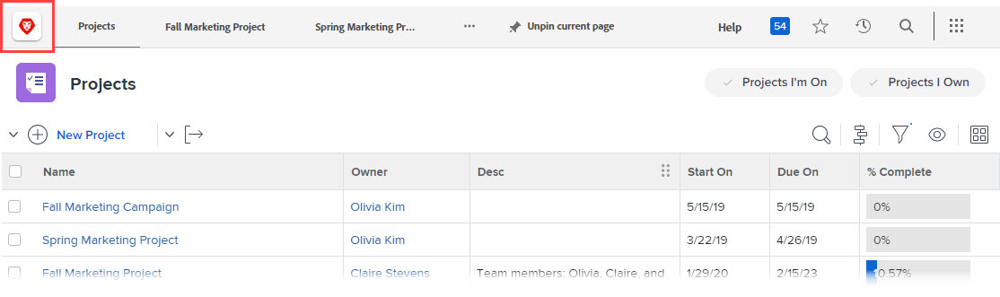

# Adobe Workfront-exemplaar merkbaar

<!--
**DON'T DELETE, DRAFT OR HIDE THIS ARTICLE. IT IS LINKED TO THE PRODUCT, THROUGH THE CONTEXT SENSITIVE HELP LINKS. **
-->

>[!IMPORTANT]
>
>De op deze pagina beschreven procedure is alleen van toepassing op organisaties die nog niet zijn aangemeld bij [!DNL Adobe Experience Cloud] .
>
> Als uw organisatie is aangemeld bij [!DNL Adobe Experience Cloud] , is branding niet beschikbaar.

Als Workfront-beheerder kunt u Workfront op de volgende plaatsen voorzien van logo&#39;s:

* Aanmeldingsscherm

  

* Bovenste navigatiegebied

  

* Hoofdmenu

  

U kunt ook de achtergrondafbeelding en -kleur van het aanmeldingsscherm wijzigen:

>[!NOTE]
>
>* Het wijzigen van de achtergrondafbeelding en -kleur van de aanmelding is niet beschikbaar als de Workfront-instantie van uw organisatie een aangepast SSO-portaal gebruikt. Zie uw netwerk of beheerder van IT als u meer informatie nodig hebt.
><!--
>or is enabled with Adobe IMS  >
>  >
>-->
>
>* Een Workfront-beheerder of groepsbeheerder kan Workfront ook markeren voor bepaalde groepen en gebruikers met behulp van een lay-outsjabloon. Branding in een lay-outmalplaatje treedt de systeem-vlakke branding met voeten die in dit artikel wordt verklaard. Voor instructies op branding in een lay-outmalplaatje, zie [&#x200B; merk Adobe Workfront gebruikend een lay-outmalplaatje &#x200B;](../../../administration-and-setup/customize-workfront/use-layout-templates/brand-wf-using-a-layout-template.md).

## Toegangsvereisten

+++ Breid uit om de toegangseisen voor de functionaliteit in dit artikel weer te geven.

<table style="table-layout:auto"> 
 <col> 
 <col> 
 <tbody> 
  <tr> 
   <td>Adobe Workfront-pakket</td> 
   <td>
Alle
</td> 
  </tr> 
  <tr> 
   <td>Adobe Workfront-licentie</td> 
   <td>
Standard

       
Plan
</td>
  </tr> 
  <tr> 
   <td>Configuraties op toegangsniveau</td> 
   <td>Systeembeheerder</td> 
  </tr> 
 </tbody> 
</table>

Voor informatie, zie [&#x200B; vereisten van de Toegang in de documentatie van Workfront &#x200B;](/help/quicksilver/administration-and-setup/add-users/access-levels-and-object-permissions/access-level-requirements-in-documentation.md).

+++

## Het aanmeldingsscherm verfijnen

{{step-1-to-setup}}

1. Klik **Systeem** > **Brandend**.

1. Breng een van de volgende wijzigingen aan om Workfront aan te passen aan uw brandingafbeeldingen.

   <table style="table-layout:auto"> 
    <col> 
    <col> 
    <tbody> 
     <tr> 
      <td role="rowheader"> 
Brand het pictogram van het Huis  (vertoningen bij uiterst links van het hoogste navigatiegebied) 
 </td> 
      <td> 
In het <strong> Hoogste navigatiegebied </strong> sectie, onder <strong> pictogram van het Huis </strong>, klik overal in de doos, dan vind en selecteer uw embordbeeld. Of sleep een afbeelding naar het vak.
 
Als u de afbeelding wilt uitsnijden, gebruikt u de besturingselementen voor schuiven en sleept u de afbeelding naar de gewenste positie binnen de voorgeschreven ruimte.
 
We raden een afbeelding van 120 x 120 aan. De notatie kan de volgende notaties hebben: GIF, JPG, PNG, SVG.
 
Dit pictogram wordt ook weergegeven in rapporten, lijsten, dashboards en geleverde rapporten die gebruikers exporteren als PDF-bestanden.
 </td> 
     </tr> 
     <tr> 
      <td role="rowheader"> 
Merk het Hoofdmenu  embleem  (vertoningen in de hoger-juiste hoek van het Hoofdmenu) 
 </td> 
      <td> 
In het <strong> Hoogste navigatiegebied </strong> sectie, onder <strong> het Belangrijkste embleem van het Menu </strong>, klik overal in de doos, dan vind en selecteer uw embordbeeld. Of sleep een afbeelding naar het vak.
 
Als u de afbeelding wilt uitsnijden, gebruikt u de besturingselementen voor schuiven en sleept u de afbeelding naar de gewenste positie binnen de voorgeschreven ruimte.
 
We raden een afbeelding van 300 x 120 pixels aan. De notatie kan de volgende notaties hebben: GIF, JPG, PNG, SVG.
 </td> 
     </tr> 
     <tr> 
      <td role="rowheader">Merk het login het schermembleem  (vertoningen in top-left van de doos waar de gebruikers login geloofsbrieven typen) </td> 
      <td> 
Onder <strong> Login het Scherm </strong>, klik overal in de doos, dan vind en selecteer uw embleembeeld. Als u de afbeelding wilt uitsnijden, gebruikt u de besturingselementen voor schuiven en sleept u de afbeelding naar de gewenste positie binnen de voorgeschreven ruimte.
 
We raden een afbeelding van 300 x 120 pixels aan. De notatie kan de volgende notaties hebben: GIF, JPG, PNG, SVG.
 </td> 
     </tr> 
     <tr> 
      <td role="rowheader">Merk de achtergrondkleur van het login scherm  (vertoningen achter de doos waar de gebruikers login geloofsbrieven typen) </td> 
      <td> 
Onder <strong> Login het Scherm </strong>, plaats a <strong> Achtergrondkleur </strong>. 
 
U kunt RGB- of HEX-kleurcodes gebruiken.
 
De achtergrondkleur is alleen zichtbaar als de achtergrond van het aanmeldingsscherm groter is dan de achtergrondafbeelding van het aanmeldingsscherm (zie de volgende rij in deze tabel) of als de afbeelding transparant is.
 </td> 
     </tr> 
     <tr> 
      <td role="rowheader">Merk het login scherm achtergrondbeeld  (vertoningen achter de doos waar de gebruikers hun login geloofsbrieven typen) </td> 
      <td> 
       <ol style="list-style-type: lower-alpha;"> 
        <li value="1"> 
 In het <strong> gebied van het het Login Scherm van de 1&rbrace; Login, onder </strong> Achtergrondbeeld <strong>, klik de doos, dan vind en selecteer uw beeld of beelden van JPG of van PNG (tot 20).</strong> 
 
Meerdere achtergrondafbeeldingen worden in willekeurige volgorde weergegeven, waarbij gebruikers hun aanmeldingspagina telkens vernieuwen. We raden afbeeldingen aan die niet groter zijn dan 2 MB.
 </li> 
        <li value="2"> 
Houd de muisaanwijzer boven elke achtergrondafbeelding die u hebt geüpload, klik op het pictogram Instellingen (versnelling) en gebruik een van de volgende opties om op te geven waar en hoe u de afbeelding wilt weergeven op de achtergrond van het aanmeldingsscherm:
 
         <ul> 
          <li> 
<strong> het Scherm van de Vulling </strong>: Past het beeld aan de login het schermachtergrond aan, die het beeld kan vergroten. Gebruik een afbeelding met hoge resolutie (maximaal 2 MB) voor de beste resultaten.
 
Als u deze optie gebruikt, bedekt de Workfront-banner, die niet aanpasbaar is, een deel van de afbeelding.
 </li> 
          <li> 
<strong> Tegel </strong>: Tegels uw beeld over het login het achtergrondgebied van het scherm, in zijn originele grootte. Dit is handig als u een patroon wilt maken. Selecteer een blauwe uitlijningsoptie om de verdeling te starten vanuit de linkerbovenhoek, het midden boven of de rechterbovenhoek van het achtergrondgebied.
 </li> 
          <li> 
<strong> Positie </strong>: Plaatst uw beeld in zijn originele grootte in de positie u het gebruiken van één van de blauwe groeperingsopties kiest: top-left, top-center, of top-right van het login scherm achtergrondgebied.
 
De achtergrondkleur vult de rest van het achtergrondgebied van het aanmeldingsscherm. Zie de vorige rij in deze tabel voor meer informatie over de achtergrondkleur.
 </li> 
         </ul> </li> 
       </ol> </td> 
     </tr> 
     <tr> 
      <td role="rowheader">Standaardbranding herstellen</td> 
      <td> 
Als u de standaardbranding herstelt, verwijdert u alle foto's en afbeeldingen die u hebt geüpload.
 
Klik <strong> terugstellen allen brandend aan de gebreken van Workfront </strong> in de laag-juiste hoek van het scherm, dan klik ja <strong> </strong>.
 </td> 
     </tr> 
    </tbody> 
   </table>

   >[!NOTE]
   >
   >Dit is niet beschikbaar als het Workfront-exemplaar van uw organisatie een aangepast SSO-portaal gebruikt.
   ><!--   >
   >or is enabled with Adobe IMS   >
   >   >
   >-->
   >
   >Zie uw netwerk of beheerder van IT als u meer informatie nodig hebt.

1. Klik **sparen**.
