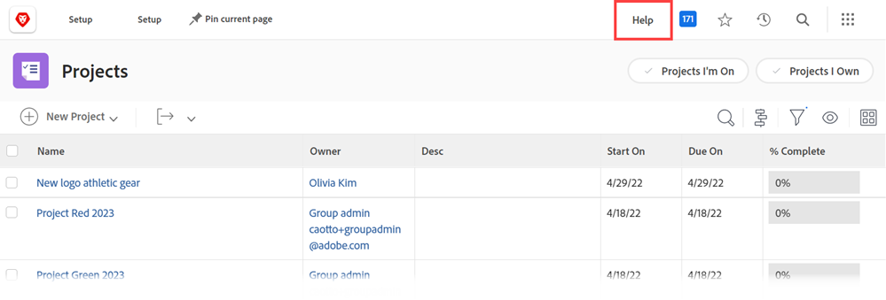

# Een aangepaste Help-URL configureren

Als u een aangepaste interne Help-site maakt die informatie bevat over hoe uw organisatie Workfront gebruikt, kunt u het pictogram Hoofdmenu Help configureren om naar die site te gaan.

Dit heeft geen invloed op de hoofdkoppeling van de Help in het hoofdmenu en de contextgevoelige koppelingen in Workfront, die gebruikers naar de Help-site van Workfront leiden.

Voor informatie over hoe de gebruikers tot zowel een douaneHulp URL toegang hebben die u in Workfront en de regelmatige de hulpplaats van Workfront vormt, zie [ Toegang tot de Hulp van Workfront in de nieuwe ervaring van Adobe Workfront ](/help/quicksilver/workfront-basics/navigate-workfront/workfront-navigation/access-workfront-help.md).

## Toegangsvereisten

U moet de volgende toegang hebben om de stappen in dit artikel uit te voeren:

<table style="table-layout:auto"> 
 <col> 
 <col> 
 <tbody> 
  <tr> 
   <td role="rowheader">Adobe Workfront-plan</td> 
   <td>Alle</td> 
  </tr> 
  <tr> 
   <td role="rowheader">Adobe Workfront-licentie</td> 
   <td>Plan</td> 
  </tr> 
  <tr> 
   <td role="rowheader">Configuraties op toegangsniveau</td> 
   <td> 
U moet een Workfront-beheerder zijn.
 
<b> NOTA </b>: Als u nog geen toegang hebt, vraag uw beheerder van Workfront als zij extra beperkingen in uw toegangsniveau plaatsen. Voor informatie over hoe een beheerder van Workfront uw toegangsniveau kan wijzigen, zie <a href="../../../administration-and-setup/add-users/configure-and-grant-access/create-modify-access-levels.md" class="MCXref xref"> tot douanetoegangsniveaus </a> leiden of wijzigen.
 </td> 
  </tr> 
 </tbody> 
</table>

## Een aangepaste Help-URL configureren

1. Klik op het pictogram Hoofdmenu  in de rechterbovenhoek van Adobe Workfront en klik vervolgens op Instellen.
1. Klik **Systeem** > **Voorkeur**.
1. In de **Algemene sectie van de Voorkeur**, op het **gebied van de Hulp URL van de Douane van de Hulp**, typ URL waar uw plaats van de douanehulp wordt gevestigd.

   Als voor uw aangepaste Help-locatie aanmeldingsgegevens zijn vereist, zijn deze vereist voor gebruikers die vanuit Workfront toegang willen krijgen tot de site. Mogelijk moeten de referenties naar uw aangepaste Help-site afzonderlijk van de Workfront-referenties worden beheerd als u SSO (Single Sign-On) niet gebruikt.

1. Klik **sparen**.
