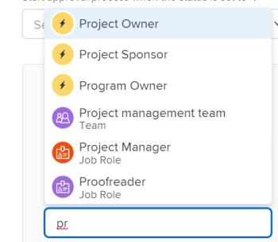

# Een goedkeuringsproces voor werkitems maken

<!-- Audited: 12/2023 -->

<!--see below the "hidden" content for the redesigned tabs - August 2023-->

U kunt een goedkeuringsproces tot stand brengen dat de gebruikers aan een het werkpunt (project, taak, kwestie, malplaatje, of malplaatjetaak), een document, of een proef kunnen vastmaken. Een goedkeuringsproces zorgt ervoor dat de aangewezen wijzen op het voorwerp bepaalde veranderingen vóór het voorwerp in het systeem evalueren.

Dit artikel beschrijft hoe te om een systeem-niveau of groep-vlakke globale goedkeuringsprocessen voor het werkpunten (project, taak, kwestie, malplaatje, of malplaatjetaak) tot stand te brengen.

Zie de volgende artikelen voor informatie over goedkeuringen die zijn gekoppeld aan documenten of proefdrukken:

* [ het documentgoedkeuringen van het Verzoek ](../../../review-and-approve-work/manage-approvals/request-document-approvals.md)
* [Geautomatiseerd workflowoverzicht](../../../review-and-approve-work/proofing/proofing-overview/automated-workflow.md)

>[!NOTE]
>
>Gebruikers kunnen ook goedkeuringsproces voor één gebruik maken voor een project, taak, uitgave, sjabloon of sjabloontaak waarvoor zij beheermachtigingen hebben.
>
>In dit artikel wordt de term &quot;wereldwijd goedkeuringsproces&quot; gebruikt om een onderscheid te maken tussen goedkeuringsproces voor eenmalig gebruik. Een algemeen goedkeuringsproces kan herhaaldelijk worden gebruikt.
>
>Op groepsniveau is een algemeen goedkeuringsproces beperkt tot werkitems en statussen die tot de groep behoren.
>
>Voor informatie over enig-gebruik goedkeuringsprocessen, zie [ overzicht van het het procesproces van de Goedkeuring ](../../../review-and-approve-work/manage-approvals/approval-process-in-workfront.md) en [ associëren een nieuw of bestaand goedkeuringsproces met het werk ](../../../review-and-approve-work/manage-approvals/associate-approval-with-work.md).

## Toegangsvereisten

+++ Breid uit om de toegangseisen voor de functionaliteit in dit artikel weer te geven.

U moet de volgende toegang hebben om de stappen in dit artikel uit te voeren:

<table style="table-layout:auto"> 
 <col> 
 <col> 
 <tbody> 
  <tr> 
   <td role="rowheader">Adobe Workfront-plan</td> 
   <td>
Systeem- en werkitemniveau: alle

   
Groepsniveau: Premier of Ultimate
</td> 
  </tr> 
  <tr> 
   <td role="rowheader">Adobe Workfront-licentie</td> 
   <td> 
Nieuw: Standaard 

 
of
 

Huidig: Plan 
 
</td> 
  </tr> 
  <tr> 
   <td role="rowheader">Configuraties op toegangsniveau</td> 
   <td> 
Als u een systeembeheerder bent of administratieve toegang tot goedkeuringsprocessen hebt, kunt u een systeem-vlakke goedkeuringsproces, of een groep-vlakke goedkeuringsproces voor een bepaalde groep tot stand brengen.
 
   
Als u een groepsbeheerder bent, kunt u goedkeuringsprocessen op groepsniveau voor groepen tot stand brengen die u beheert.
 </td> 
  </tr> 
 </tbody> 
</table>

Voor meer detail over de informatie in deze lijst, zie [ vereisten van de Toegang in de documentatie van Workfront ](/help/quicksilver/administration-and-setup/add-users/access-levels-and-object-permissions/access-level-requirements-in-documentation.md).

+++

## Een algemeen goedkeuringsproces op systeemniveau of groepsniveau voor werkitems maken

{{step-1-to-setup}}

1. (Voorwaardelijk) als u een systeem-vlakke goedkeuringsproces creeert, klik **Processen** > **goedkeurt** in het linkerpaneel.

   of

   Als u een groep-vlakke goedkeuringsproces creeert, klik **Groepen** , klik de naam van de groep, dan klik **goedkeurt**.

   <!--hidden for the new tab redesign - August 2023: 
   
   -->

1. Kies of de **Goedkeuringen van het Project**, **Taak goedkeurt**, of **Goedkeuringen van de Uitgave** tabel.

1. Klik **Nieuw Proces van de Goedkeuring**.
1. Geef de volgende informatie op in het vak dat wordt weergegeven:

   <table style="table-layout:auto"> 
    <col> 
    <col> 
    <tbody> 
     <tr> 
      <td role="rowheader">Naam goedkeuringsproces</td> 
      <td>
Typ een beschrijvende naam voor het goedkeuringsproces. De gebruikers zien deze naam wanneer het toepassen van het goedkeuringsproces op een voorwerp, zoals die in <a href="../../../review-and-approve-work/manage-approvals/associate-approval-with-work.md" class="MCXref xref"> wordt beschreven associëren een nieuw of bestaand goedkeuringsproces met het werk </a>.
</td> 
     </tr> 
     <tr> 
      <td role="rowheader">Beschrijving</td> 
      <td>
Typ een beschrijving van het goedkeuringsproces. Dit toont in de <b> goedkeurt </b> sectie in het <b> gebied van de Opstelling </b> naast de naam van het goedkeuringsproces.
</td> 
     </tr> 
     <tr> 
      <td role="rowheader">Is actief</td> 
      <td> 
Houd deze optie ingeschakeld als u wilt dat andere gebruikers het goedkeuringsproces kunnen koppelen aan projecten, taken en problemen die zij maken. 
 
Deze optie is standaard ingeschakeld.
 
 Tip: een goedkeuringsproces inactief markeren is handig wanneer uw organisatie het niet langer hoeft te gebruiken, maar u historische informatie over het gebruik ervan wilt behouden.
 </td> 
     </tr> 
     <tr data-mc-conditions=""> 
      <td role="rowheader">Dit goedkeuringsproces kan worden gebruikt door </td> 
      <td> 
Als u het goedkeuringsproces beschikbaar voor projecten, taken, kwesties, en malplaatjes wilt die tot slechts tot een bepaalde groep behoren, begin de naam van de groep te typen, dan selecteer de naam wanneer het verschijnt:
 
       <ul> 
       <li>Als u een systeembeheerder bent of administratieve toegang tot goedkeuringsprocessen hebt, kunt u om het even welke groep in het systeem zien wanneer u zijn naam typt. <b> Alle groepen </b> wordt geselecteerd door gebrek. </li> 
       <li>Als u een groepsbeheerder zonder administratieve toegang tot goedkeuringsprocessen bent, kunt u het goedkeuringsproces aan om het even welke groep toewijzen u beheert wanneer u zijn naam typt. De <b> Alle Groepen </b> optie is niet beschikbaar.</li> 
       </ul> 
       
Deze optie is niet beschikbaar voor goedkeuringsprocedures voor eenmalig gebruik.
 
       
<b> WAARSCHUWING </b>: Wanneer u veranderingen in het groep-specifieke goedkeuringsproces aanbrengt, zouden de bestaande goedkeuringsprocessen die reeds met het werkpunten zijn geassocieerd kunnen veranderen. Voor informatie over deze veranderingen, zie <a href="../../../administration-and-setup/customize-workfront/configure-approval-milestone-processes/how-changes-affect-group-approvals.md" class="MCXref xref"> hoe de groep en de veranderingen van het goedkeuringsproces toegewezen goedkeuringsprocessen </a> beïnvloeden.
 
       
Voor informatie over het een lijst maken van en het beheren van de goedkeuringsprocessen van uw groep van de pagina van uw groep, zie <a href="../../../administration-and-setup/manage-groups/work-with-group-objects/create-and-modify-groups-approval-processes.md" class="MCXref xref"> groep-vlakke goedkeuringsprocessen </a>. 
 
       
Voor informatie over administratieve toegang tot goedkeuringsprocessen, zie <a href="../../../administration-and-setup/add-users/configure-and-grant-access/grant-users-admin-access-certain-areas.md" class="MCXref xref"> gebruikers administratieve toegang van de Verlening tot bepaalde gebieden </a>.
 </td> 
     </tr> 
    </tbody> 
   </table>

1. Vorm een weg voor het goedkeuringsproces gebruikend de volgende opties.

   In een pad geeft u op wat er moet gebeuren tijdens het goedkeuringsproces. U maakt fasen in een pad om aan te geven wie de goedkeuring moet uitvoeren en in welke volgorde.

   <table style="table-layout:auto"> 
    <col> 
    <col> 
    <tbody> 
     <tr> 
      <td role="rowheader"> 
Goedkeuringsproces starten wanneer de status is ingesteld op
 </td> 
      <td> 
Selecteer de status die het goedkeuringsproces voor werkitems activeert. Wanneer iemand een tijdelijk onderdeel aan deze status bijwerkt, wordt het goedkeuringsproces gestart. 
 
Dezelfde status kan niet worden geselecteerd voor meerdere goedkeuringsprocespaden.
 
De beschikbare statussen zijn gebaseerd op wat onder de optie <b> wordt geselecteerd Deze goedkeuring kan door </b> worden gebruikt (verklaard in de lijst hierboven):
 
       <ul> 
       <li> Als <b> Alle groepen </b> wordt geselecteerd, slechts zijn de status voor het hele systeem beschikbaar
       <li> 
Als een specifieke groep is geselecteerd, zijn alleen de statussen beschikbaar voor die groep
 </li> 
       </ul> 
Voor informatie over hoe het goedkeuringsproces met statussen werkt, zie de sectie <a href="../../../review-and-approve-work/manage-approvals/approval-process-in-workfront.md#how2" class="MCXref xref"> hoe de goedkeuringsprocessen zich op statussen </a> in het het procesoverzicht van het artikel <a href="../../../review-and-approve-work/manage-approvals/approval-process-in-workfront.md" class="MCXref xref"> goedkeuringsproces </a> baseren.
 </td> 
     </tr> 
     <tr> 
      <td role="rowheader">Werkgebiednaam</td> 
      <td>(Optioneel) Typ een naam die de eerste fase van het pad beschrijft. Als u geen werkgebiednaam specificeert, is de standaardnaam <b> Stadium 1 </b>.</td> 
     </tr> 
     <tr> 
      <td role="rowheader">Fiatteurs</td> 
      <td> 
Typ de naam van de gebruiker, het team of de taakrol die u wilt toewijzen als fiatteur voor dit werkgebied en klik vervolgens op de naam wanneer deze wordt weergegeven in de vervolgkeuzelijst. U kunt slechts actieve gebruikers,  baanrollen , en teams toevoegen. 

   
<b> TIP </b>:

   
Wanneer u een gebruiker toevoegt als fiatar, ziet u de avatar, de primaire rol van de gebruiker of hun e-mailadres om onderscheid te maken tussen gebruikers met identieke namen. Gebruikers moeten aan ten minste één taakrol zijn gekoppeld om deze te kunnen bekijken terwijl u ze toevoegt.

      
De instelling Contactinfo weergeven moet zijn ingeschakeld op uw toegangsniveau zodat gebruikers de e-mails van gebruikers kunnen bekijken. Voor informatie, zie <a href="../../add-users/configure-and-grant-access/grant-access-other-users.md"> toegang van de Verlening tot gebruikers </a>. 

   
<b> NOTA </b>:

   Als u een gebruiker, team of rol als fiatteur toevoegt, geeft u deze niet automatisch machtigingen voor het object dat aan die goedkeuring is gekoppeld. Ze ontvangen machtigingen voor het object wanneer de goedkeuringsstap wordt geactiveerd. Anders moeten de objecten met hen worden gedeeld voordat ze een goedkeuringsbesluit kunnen nemen. 
 
U kunt een persoon ook als fiatteur aanwijzen door de rol van het individu op te geven. U kunt bijvoorbeeld een projecteigenaar, projectsponsor, eigenaar van Portfolio, programmaeigenaar of beheerder toewijzen als fiatteur. Deze opties worden automatisch weergegeven wanneer u begint te typen.

   
<b> BELANGRIJK </b>:  
       <ul> 
       <li> 
Wanneer u een goedkeuring toewijst aan de projectsponsor en niemand als sponsor van een project is aangewezen, wordt de goedkeuring opnieuw toegewezen aan de eigenaar van het project. Als niemand als eigenaar van het project wordt aangewezen, wordt de goedkeuring toegewezen aan de beheerder van Workfront. 
 </li> 
      </ul> 
       <ul> 
       <li> 
Wanneer u een goedkeuring aan een rol toewijst en <b> Approver niet op het projectteam (voor goedkeuringsprocessen moet zijn die een rol omvatten) </b> is gehandicapt maar er zijn geen rollen in het projectteam die de rol op de goedkeuring aanpassen, wordt de goedkeuring opnieuw toegewezen aan de Eigenaar van het Project. Voor informatie over goedkeuringsmontages, zie <a href="../../../administration-and-setup/customize-workfront/configure-approval-milestone-processes/establish-approval-settings.md" class="MCXref xref"> globale goedkeuringsmontages </a> vormen.
 </li> 
       </ul> 
       <ul> 
       <li> 
Wanneer u een goedkeuring toewijst aan de Eigenaar van het Project en niemand als eigenaar van een project wordt aangewezen, wordt de goedkeuring opnieuw toegewezen aan de belangrijkste beheerder van Workfront zoals die in de sectie van de Info van de Klant in het gebied van de Opstelling wordt vermeld. Voor informatie, zie <a href="../../../administration-and-setup/get-started-wf-administration/configure-basic-info.md" class="MCXref xref"> basisinformatie voor uw systeem </a> vormen.  
 </li> 
       </ul> 
  
 
 
U kunt dit proces herhalen om meerdere fiatteurs toe te voegen aan het werkgebied. Eén fase kan een combinatie van gebruikers, teams en taakrollen als fiatteurs bevatten. Er is geen limiet voor het aantal fiatteurs dat u aan een werkgebied kunt toevoegen.
 
<b> BELANGRIJK </b>:  
Wanneer u baanrollen als fiatteurs toewijst, kunnen alle gebruikers verbonden aan die baanrol die ook op het projectteam is een besluit over de goedkeuring nemen. 
 
Wanneer u een team als fiatteur toewijst, kan om het even welke gebruiker in dat team een besluit over de goedkeuring nemen. 
 
Voor meer informatie over het projectteam, zie <a href="../../../manage-work/projects/planning-a-project/project-team-overview.md" class="MCXref xref"> Overzicht van het Team van het Project </a>. Voor meer informatie over het goedkeuren van het werk, zie <a href="../../../review-and-approve-work/manage-approvals/approving-work.md" class="MCXref xref"> het goedkeuren van het werk </a>.
 
 </td> 
     </tr> 
     <tr> 
      <td role="rowheader">Er is slechts één beslissing vereist     (Wordt alleen weergegeven als u meerdere fiatteurs aan het werkgebied toevoegt) </td> 
      <td> 
Selecteer deze optie als een van de fiatteurs in het werkgebied het werkitem tijdens dit werkgebied kan goedkeuren of afwijzen. Hierdoor kan het werkitem het werkgebied verlaten. 
 
Als deze optie niet is geselecteerd, moeten alle geïdentificeerde fiatteurs het werkgebied (in willekeurige volgorde) goedkeuren of afwijzen voordat het item het werkgebied verlaat. Als een van de fiatteurs het werkgebied afwijst, wordt het proces onderbroken en begint het opnieuw, zodat de vereiste wijzigingen kunnen worden aangebracht. Daarna kunnen de fiatteurs het werkgebied opnieuw goedkeuren of afwijzen.
 
Wanneer een team als fiatteur wordt aangewezen, kan om het even welk lid van het team een stadium verlenen of verwerpen.
 </td> 
     </tr> 
     <tr> 
      <td role="rowheader"> 
Werkgebied toevoegen
 </td> 
      <td>
(Optioneel) Voeg nog een werkgebied aan het pad toe met de opties die in de drie bovenstaande rijen worden beschreven. U kunt zo veel fasen aan het pad toevoegen als u nodig hebt.
</td> 
     </tr> 
     <tr> 
      <td role="rowheader">Kiezen wat er gebeurt wanneer de goedkeuring wordt geweigerd
 </td> 
      <td> 
Selecteer de actie die u wilt uitvoeren als het werkitem in een van de fasen van het pad wordt afgewezen:
 
       <ul> 
       <li><b> creeer een Kwestie </b>: (Beschikbaar slechts voor project en taakgoedkeuringsprocessen) Een kwestie wordt gecreeerd in het project of de taak waar het goedkeuringsproces loopt. De standaard toegewezen bron op de taak, of de eigenaar van het project wordt toegewezen aan de kwestie. Door gebrek, wordt de naam van de gecreeerde kwestie <b> Afgewezen Goedkeuring (&lt;Project of Naam van de Taak&gt;) </b>. Dit is een afwijzingsprobleem dat onder de taak of het project is aangegaan, afhankelijk van het goedkeuringsproces waarbij de afkeuring heeft plaatsgevonden.</li> 
       <li> 
<b> plaats Status aan </b>: Kies één van het volgende:
 
       <ul> 
       <li><b> Vorige Status </b>: Het verworpen project, de taak, of de kwestie keert aan de status voorafgaand aan de status terug die het goedkeuringsproces activeert.</li> 
       <li>
<b> om het even welke andere status in de lijst </b>: De verworpen objecten bewegingen aan de status u, zoals op Greep kiest. U kunt een van de standaardstatussen kiezen of een aangepaste status die u aan uw Workfront-systeem hebt toegevoegd.

       
Als u een status selecteert die aan een goedkeuringsproces is gekoppeld als de afwijzingsstatus, wordt het afgewezen object naar de geselecteerde status verplaatst en wordt deze gemarkeerd als "In afwachting van goedkeuring".
 
       
 Als u bijvoorbeeld In de wachtstand selecteert voor de afwijzingsstatus en de status In de wachtstand is gekoppeld aan een goedkeuringsproces, wordt het geweigerde object in de status "In de wachtstand gezet voor goedkeuring" geplaatst, waarvoor goedkeuring is vereist.

   </tr> 
    </tbody> 
   </table>

1. (Facultatief) klik **toevoegen weg** om een andere weg aan het goedkeuringsproces toe te voegen, verwijzend naar de lijst van opties in de vorige stap.

   Het nieuwe pad moet aan een andere status zijn gekoppeld. Het pad wordt geactiveerd wanneer het item wordt bijgewerkt om deze status weer te geven. U kunt voor dezelfde status geen twee paden hebben.

1. Klik **sparen**.
1. Nadat het goedkeuringsproces is gemaakt, gaat u door met een van de volgende handelingen:

   * Associeer het goedkeuringsproces met specifieke projecten, taken, of kwesties door uw systeem, zoals die in [ wordt beschreven associeer een nieuw of bestaand goedkeuringsproces met het werk ](../../../review-and-approve-work/manage-approvals/associate-approval-with-work.md).
   * Buiten Workfront, breng gebruikers op de hoogte dat het goedkeuringsproces voor hen beschikbaar is om met hun projecten, taken, of kwesties te associëren, zoals die in [ worden beschreven associeer een nieuw of bestaand goedkeuringsproces met het werk ](../../../review-and-approve-work/manage-approvals/associate-approval-with-work.md).
   * Maak een ander goedkeuringsproces dat wordt geactiveerd als dit goedkeuringsproces wordt geweigerd en het onderdeel een andere status krijgt. Op deze manier kunt u goedkeuringsprocessen aan elkaar koppelen.

Voor informatie over het uitgeven van een goedkeuringsproces, zie [ een goedkeuringsproces ](../../../administration-and-setup/customize-workfront/configure-approval-milestone-processes/edit-an-approval-process.md) uitgeven.

## Een goedkeuringsproces koppelen aan een tijdelijk onderdeel

Wanneer u een goedkeuringsproces voor een het werkpunt (project, taak, of kwestie) wilt tot stand brengen, u

1. Maak eerst het goedkeuringsproces
1. Het werkitem maken
1. Het goedkeuringsproces koppelen aan het werkitem

Voor instructies bij het associëren van een goedkeuringsproces met een het werkpunt, zie [ een nieuw of bestaand goedkeuringsproces met het werk ](../../../review-and-approve-work/manage-approvals/associate-approval-with-work.md) associëren.

>[!NOTE]
>
>Elke Workfront-gebruiker met beheermachtigingen voor een project, taak of uitgave kan goedkeuringsprocessen voor eenmalig gebruik maken die alleen kunnen worden gebruikt op het object waar ze zijn gemaakt. Voor meer informatie, zie [ een nieuw of bestaand goedkeuringsproces met het werk ](../../../review-and-approve-work/manage-approvals/associate-approval-with-work.md) associëren.

## Toelatend gebruikers om globale goedkeuringsprocessen voor één enkel het werkpunt te wijzigen

Door gebrek, kunnen de gebruikers die toestemmingen op projecten, taken, en kwesties leiden tot enig-gebruiksgoedkeuringsprocessen op hen tot stand brengen. Voor informatie over het toevoegen van enig-gebruiks goedkeuringsprocessen aan projecten, taken, en kwesties, zie de sectie [ een enig-gebruiks goedkeuringsproces met een project, een taak, een kwestie, een malplaatje, of malplaatjetaak ](../../../review-and-approve-work/manage-approvals/associate-approval-with-work.md#creating-a-single-use-approval-process) in het artikel [ associëren een nieuw of bestaand goedkeuringsproces met het werk ](../../../review-and-approve-work/manage-approvals/associate-approval-with-work.md).

Gebruikers kunnen ook instellingen wijzigen voor algemene goedkeuringsprocessen die aan een tijdelijk onderdeel zijn gekoppeld. Deze veranderingen beïnvloeden slechts het project, de taak, of de kwestie verbonden aan het systeem-vlakke goedkeuringsproces. Voor meer informatie, zie de sectie [ een globaal goedkeuringsproces voor gebruik op een specifiek voorwerp ](../../../review-and-approve-work/manage-approvals/associate-approval-with-work.md#modifying-a-global-approval-process) in het artikel [ associëren een nieuw of bestaand goedkeuringsproces met het werk ](../../../review-and-approve-work/manage-approvals/associate-approval-with-work.md)).
