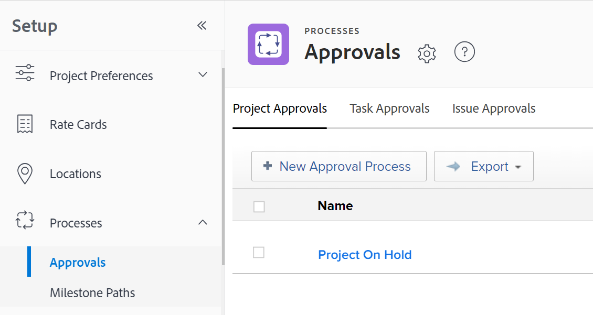

# Een goedkeuringsproces voor werkitems maken

<!--see below the "hidden" content for the redesigned tabs - August 2023-->

U kunt een goedkeuringsproces tot stand brengen dat de gebruikers aan een het werkpunt (project, taak, kwestie, malplaatje, of malplaatjetaak), een document, of een proef kunnen vastmaken. Een goedkeuringsproces zorgt ervoor dat de aangewezen wijzen op het voorwerp bepaalde veranderingen vóór het voorwerp in het systeem evalueren.

Dit artikel beschrijft hoe te om een systeem-niveau of groep-vlakke globale goedkeuringsprocessen voor het werkpunten (project, taak, kwestie, malplaatje, of malplaatjetaak) tot stand te brengen.

Zie de volgende artikelen voor informatie over goedkeuringen die zijn gekoppeld aan documenten of proefdrukken:

* [Documentgoedkeuring aanvragen](../../../review-and-approve-work/manage-approvals/request-document-approvals.md)
* [Geautomatiseerd workflowoverzicht](../../../review-and-approve-work/proofing/proofing-overview/automated-workflow.md)

>[!NOTE]
>
>Gebruikers kunnen ook goedkeuringsproces voor één gebruik maken voor een project, taak, uitgave, sjabloon of sjabloontaak waarvoor zij beheermachtigingen hebben.
>
>In dit artikel wordt de term &quot;wereldwijd goedkeuringsproces&quot; gebruikt om een onderscheid te maken tussen goedkeuringsproces voor eenmalig gebruik. Een algemeen goedkeuringsproces kan herhaaldelijk worden gebruikt.
>
>Op groepsniveau is een algemeen goedkeuringsproces beperkt tot werkitems en statussen die tot de groep behoren.
>
>Voor informatie over goedkeuringsprocessen voor eenmalig gebruik, zie [Overzicht van goedkeuringsproces](../../../review-and-approve-work/manage-approvals/approval-process-in-workfront.md) en [Een nieuw of bestaand goedkeuringsproces koppelen aan werk](../../../review-and-approve-work/manage-approvals/associate-approval-with-work.md).

## Toegangsvereisten

U moet het volgende hebben:

<table style="table-layout:auto"> 
 <col> 
 <col> 
 <tbody> 
  <tr> 
   <td role="rowheader">Adobe Workfront-abonnement*</td> 
   <td>Alle</td> 
  </tr> 
  <tr> 
   <td role="rowheader">Adobe Workfront-licentie*</td> 
   <td> 
Nieuw abonnement: standaard 

 
of
 

Huidig plan: Plan 
 
</td> 
  </tr> 
  <tr> 
   <td role="rowheader">Configuraties op toegangsniveau*</td> 
   <td> 
Als u een beheerder van Workfront bent of u administratieve toegang tot goedkeuringsprocessen hebt, kunt u een systeem-vlakke goedkeuringsproces, of een groep-vlakke goedkeuringsproces voor een bepaalde groep tot stand brengen.
 
   
Als u een groepsbeheerder bent, kunt u goedkeuringsprocessen op groepsniveau voor groepen tot stand brengen die u beheert.
 
<b>OPMERKING</b>: Als u nog steeds geen toegang hebt, vraag dan aan de Workfront-beheerder of deze aanvullende beperkingen op uw toegangsniveau heeft ingesteld. Voor informatie over hoe een beheerder van Workfront uw toegangsniveau kan wijzigen, zie <a href="../../../administration-and-setup/add-users/configure-and-grant-access/create-modify-access-levels.md" class="MCXref xref">Aangepaste toegangsniveaus maken of wijzigen</a>.
 </td> 
  </tr> 
 </tbody> 
</table>

&#42;Neem contact op met uw Workfront-beheerder om te weten te komen welk plan, licentietype of toegang u hebt.

## Een algemeen goedkeuringsproces op systeemniveau of groepsniveau voor werkitems maken

{{step-1-to-setup}}

1. (Voorwaardelijk) Als u een goedkeuringsproces op systeemniveau maakt, klikt u op **Processen** > **Goedkeuringen** in het linkerdeelvenster.

   of

   Als u een goedkeuringsproces op groepsniveau maakt, klikt u op **Groepen** klikt u op de naam van de groep en vervolgens klikt u op **Goedkeuringen**.

   <!--hidden for the new tab redesign - August 2023: 
   
   -->

1. Kies **Goedkeuring van project**, **Taakgoedkeuringen**, of **Goedkeuring afgeven** tab.

1. Klikken **Nieuw goedkeuringsproces**.
1. Geef de volgende informatie op in het vak dat wordt weergegeven:

   <table style="table-layout:auto"> 
    <col> 
    <col> 
    <tbody> 
     <tr> 
      <td role="rowheader">Naam goedkeuringsproces</td> 
      <td>
Typ een beschrijvende naam voor het goedkeuringsproces. Gebruikers zien deze naam wanneer ze het goedkeuringsproces op een object toepassen, zoals wordt beschreven in <a href="../../../review-and-approve-work/manage-approvals/associate-approval-with-work.md" class="MCXref xref">Een nieuw of bestaand goedkeuringsproces koppelen aan werk</a>.
</td> 
     </tr> 
     <tr> 
      <td role="rowheader">Beschrijving</td> 
      <td>
Typ een beschrijving van het goedkeuringsproces. Dit wordt weergegeven in het dialoogvenster <b>Goedkeuringen</b> in de <b>Instellen</b> naast de naam van het goedkeuringsproces.
</td> 
     </tr> 
     <tr> 
      <td role="rowheader">Is actief</td> 
      <td> 
Houd deze optie ingeschakeld als u wilt dat andere gebruikers het goedkeuringsproces kunnen koppelen aan projecten, taken en problemen die zij maken. 
 
Deze optie is standaard ingeschakeld.
 
 Tip: een goedkeuringsproces inactief markeren is handig wanneer uw organisatie het niet langer hoeft te gebruiken, maar u historische informatie over het gebruik ervan wilt behouden.
 </td> 
     </tr> 
     <tr data-mc-conditions=""> 
      <td role="rowheader">Dit goedkeuringsproces kan worden gebruikt door </td> 
      <td> 
Als u het goedkeuringsproces beschikbaar voor projecten, taken, kwesties, en malplaatjes wilt die tot slechts tot een bepaalde groep behoren, begin de naam van de groep te typen, dan selecteer de naam wanneer het verschijnt:
 
       <ul> 
       <li>Als u een systeembeheerder bent of administratieve toegang tot goedkeuringsprocessen hebt, kunt u om het even welke groep in het systeem zien wanneer u zijn naam typt. <b>Alle groepen</b> is standaard geselecteerd. </li> 
       <li>Als u een groepsbeheerder zonder administratieve toegang tot goedkeuringsprocessen bent, kunt u het goedkeuringsproces aan om het even welke groep toewijzen u beheert wanneer u zijn naam typt. De <b>Alle groepen</b> is niet beschikbaar.</li> 
       </ul> 
       
Deze optie is niet beschikbaar voor goedkeuringsprocedures voor eenmalig gebruik.
 
       
<b>WAARSCHUWING</b>: Wanneer u wijzigingen aanbrengt in het groepsspecifieke goedkeuringsproces, kunnen de bestaande goedkeuringsprocessen die al aan werkitems zijn gekoppeld, veranderen. Voor informatie over deze wijzigingen raadpleegt u <a href="../../../administration-and-setup/customize-workfront/configure-approval-milestone-processes/how-changes-affect-group-approvals.md" class="MCXref xref">De invloed van wijzigingen in groep- en goedkeuringsproces op toegewezen goedkeuringsprocessen</a>.
 
       
Ga voor meer informatie over het aanbieden en beheren van de goedkeuringsprocedures van uw groep vanaf de pagina van uw groep naar <a href="../../../administration-and-setup/manage-groups/work-with-group-objects/create-and-modify-groups-approval-processes.md" class="MCXref xref">Goedkeuringsprocessen op groepsniveau</a>. 
 
       
Voor informatie over administratieve toegang tot goedkeuringsprocessen raadpleegt u <a href="../../../administration-and-setup/add-users/configure-and-grant-access/grant-users-admin-access-certain-areas.md" class="MCXref xref">Gebruikers administratieve toegang verlenen tot bepaalde gebieden</a>.
 </td> 
     </tr> 
    </tbody> 
   </table>

1. Vorm een weg voor het goedkeuringsproces gebruikend de volgende opties.

   In een pad geeft u op wat er moet gebeuren tijdens het goedkeuringsproces. U maakt fasen in een pad om aan te geven wie de goedkeuring moet uitvoeren en in welke volgorde.

   <table style="table-layout:auto"> 
    <col> 
    <col> 
    <tbody> 
     <tr> 
      <td role="rowheader"> 
Goedkeuringsproces starten wanneer de status is ingesteld op
 </td> 
      <td> 
Selecteer de status die het goedkeuringsproces voor werkitems activeert. Wanneer iemand een tijdelijk onderdeel aan deze status bijwerkt, wordt het goedkeuringsproces gestart. 
 
Dezelfde status kan niet worden geselecteerd voor meerdere goedkeuringsprocespaden.
 
De beschikbare statussen zijn gebaseerd op wat er onder de optie is geselecteerd <b>Deze goedkeuring kan worden gebruikt door</b> (in de bovenstaande tabel toegelicht):
 
       <ul> 
       <li> Indien <b>Alle groepen</b> is geselecteerd, zijn alleen statussen voor het hele systeem beschikbaar
       <li> 
Als een specifieke groep is geselecteerd, zijn alleen de statussen beschikbaar voor die groep
 </li> 
       </ul> 
Zie de sectie voor informatie over hoe het goedkeuringsproces werkt met statussen <a href="../../../review-and-approve-work/manage-approvals/approval-process-in-workfront.md#how2" class="MCXref xref">Hoe goedkeuringsprocessen op statussen vertrouwen</a> in het artikel <a href="../../../review-and-approve-work/manage-approvals/approval-process-in-workfront.md" class="MCXref xref">Overzicht van goedkeuringsproces</a>.
 </td> 
     </tr> 
     <tr> 
      <td role="rowheader">Werkgebiednaam</td> 
      <td>(Optioneel) Typ een naam die de eerste fase van het pad beschrijft. Als u geen naam voor het werkgebied opgeeft, wordt standaard de naam <b>Fase 1</b>.</td> 
     </tr> 
     <tr> 
      <td role="rowheader">Fiatteurs</td> 
      <td> 
Typ de naam van de gebruiker, het team of de taakrol die u wilt toewijzen als fiatteur voor dit werkgebied en klik vervolgens op de naam wanneer deze wordt weergegeven in de vervolgkeuzelijst. U kunt alleen actieve gebruikers toevoegen, taakrollenen teams. 

   
<b>TIP</b>:

   
Wanneer u een gebruiker toevoegt als fiatar, ziet u de avatar, de primaire rol van de gebruiker of hun e-mailadres om onderscheid te maken tussen gebruikers met identieke namen. Gebruikers moeten aan ten minste één taakrol zijn gekoppeld om deze te kunnen bekijken terwijl u ze toevoegt.

      
De instelling Contactinfo weergeven moet zijn ingeschakeld op uw toegangsniveau zodat gebruikers de e-mails van gebruikers kunnen bekijken. Zie voor meer informatie <a href="../../add-users/configure-and-grant-access/grant-access-other-users.md">Toegang verlenen aan gebruikers</a>. 

   
<b>OPMERKING</b>:

   Als u een gebruiker, team of rol als fiatteur toevoegt, geeft u deze niet automatisch machtigingen voor het object dat aan die goedkeuring is gekoppeld. Ze ontvangen machtigingen voor het object wanneer de goedkeuringsstap wordt geactiveerd. Anders moeten de objecten met hen worden gedeeld voordat ze een goedkeuringsbesluit kunnen nemen. 
 
U kunt een persoon ook als fiatteur aanwijzen door de rol van het individu op te geven. U kunt bijvoorbeeld een projecteigenaar, projectsponsor, eigenaar van Portfolio, programmaeigenaar of beheerder toewijzen als fiatteur. Deze opties worden automatisch weergegeven wanneer u begint te typen.

   
<b>BELANGRIJK</b>:  
       <ul> 
       <li> 
Wanneer u een goedkeuring toewijst aan de projectsponsor en niemand als sponsor van een project is aangewezen, wordt de goedkeuring opnieuw toegewezen aan de eigenaar van het project. Als niemand als eigenaar van het project wordt aangewezen, wordt de goedkeuring toegewezen aan de beheerder van Workfront. 
 </li> 
      </ul> 
       <ul> 
       <li> 
Wanneer u een goedkeuring aan een rol toewijst en <b>Fiatteur niet vereist om op het projectteam (voor goedkeuringsprocessen te zijn die een rol omvatten)</b> is gehandicapt maar er zijn geen rollen in het projectteam die de rol op de goedkeuring aanpassen, wordt de goedkeuring opnieuw toegewezen aan de Eigenaar van het Project. Zie voor informatie over goedkeuringsinstellingen <a href="../../../administration-and-setup/customize-workfront/configure-approval-milestone-processes/establish-approval-settings.md" class="MCXref xref">Algemene goedkeuringsinstellingen configureren</a>.
 </li> 
       </ul> 
       <ul> 
       <li> 
Wanneer u een goedkeuring toewijst aan de Eigenaar van het Project en niemand als eigenaar van een project wordt aangewezen, wordt de goedkeuring opnieuw toegewezen aan de belangrijkste beheerder van Workfront zoals die in de sectie van de Info van de Klant in het gebied van de Opstelling wordt vermeld. Zie voor meer informatie <a href="../../../administration-and-setup/get-started-wf-administration/configure-basic-info.md" class="MCXref xref">Basisinformatie voor uw systeem configureren</a>.  
 </li> 
       </ul> 
  
 
 
U kunt dit proces herhalen om meerdere fiatteurs toe te voegen aan het werkgebied. Eén fase kan een combinatie van gebruikers, teams en taakrollen als fiatteurs bevatten. Er is geen limiet voor het aantal fiatteurs dat u aan een werkgebied kunt toevoegen.
 
<b>BELANGRIJK</b>:  
Wanneer u baanrollen als fiatteurs toewijst, kunnen alle gebruikers verbonden aan die baanrol die ook op het projectteam is een besluit over de goedkeuring nemen. 
 
Wanneer u een team als fiatteur toewijst, kan om het even welke gebruiker in dat team een besluit over de goedkeuring nemen. 
 
Voor meer informatie over het projectteam, zie <a href="../../../manage-work/projects/planning-a-project/project-team-overview.md" class="MCXref xref">Overzicht van het projectteam</a>. Ga voor meer informatie over het goedkeuren van werk naar <a href="../../../review-and-approve-work/manage-approvals/approving-work.md" class="MCXref xref">Goedkeuring van de werkzaamheden </a>.
 
 </td> 
     </tr> 
     <tr> 
      <td role="rowheader">Slechts één besluit is vereist    (Wordt alleen weergegeven als u meerdere fiatteurs aan het werkgebied toevoegt) </td> 
      <td> 
Selecteer deze optie als een van de fiatteurs in het werkgebied het werkitem tijdens dit werkgebied kan goedkeuren of afwijzen. Hierdoor kan het werkitem het werkgebied verlaten. 
 
Als deze optie niet is geselecteerd, moeten alle geïdentificeerde fiatteurs het werkgebied (in willekeurige volgorde) goedkeuren of afwijzen voordat het item het werkgebied verlaat. Als een van de fiatteurs het werkgebied afwijst, wordt het proces onderbroken en begint het opnieuw, zodat de vereiste wijzigingen kunnen worden aangebracht. Daarna kunnen de fiatteurs het werkgebied opnieuw goedkeuren of afwijzen.
 
Wanneer een team als fiatteur wordt aangewezen, kan om het even welk lid van het team een stadium verlenen of verwerpen.
 </td> 
     </tr> 
     <tr> 
      <td role="rowheader"> 
Werkgebied toevoegen
 </td> 
      <td>
(Optioneel) Voeg nog een werkgebied aan het pad toe met de opties die in de drie bovenstaande rijen worden beschreven. U kunt zo veel fasen aan het pad toevoegen als u nodig hebt.
</td> 
     </tr> 
     <tr> 
      <td role="rowheader">Kiezen wat er gebeurt wanneer de goedkeuring wordt geweigerd
 </td> 
      <td> 
Selecteer de actie die u wilt uitvoeren als het werkitem in een van de fasen van het pad wordt afgewezen:
 
       <ul> 
       <li><b>Een probleem maken</b>: (Beschikbaar slechts voor project en taakgoedkeuringsprocessen) Een kwestie wordt gecreeerd in het project of de taak waar het goedkeuringsproces loopt. De standaard toegewezen bron op de taak, of de eigenaar van het project wordt toegewezen aan de kwestie. Standaard wordt de naam van het gemaakte probleem <b>Goedkeuring geweigerd (&lt;project or="" task="" name=""&gt;)</b>. Dit is een afwijzingsprobleem dat onder de taak of het project is aangegaan, afhankelijk van het goedkeuringsproces waarbij de afkeuring heeft plaatsgevonden.</li> 
       <li> 
<b>Status instellen op</b>: Kies een van de volgende opties:
 
       <ul> 
       <li><b>Vorige status</b>: Het afgewezen project, de afgewezen taak of de geweigerde uitgave keert terug naar de status voorafgaand aan de status die het goedkeuringsproces activeert.</li> 
       <li>
<b>Een andere status in de lijst</b>: Het geweigerde object wordt verplaatst naar de status die u kiest, bijvoorbeeld In wachtstand. U kunt een van de standaardstatussen kiezen of een aangepaste status die u aan uw Workfront-systeem hebt toegevoegd.

       
Als u een status selecteert die aan een goedkeuringsproces is gekoppeld als de afwijzingsstatus, wordt het afgewezen object naar de geselecteerde status verplaatst en wordt deze gemarkeerd als "In afwachting van goedkeuring".
 
       
 Als u bijvoorbeeld In de wachtstand selecteert voor de afwijzingsstatus en de status In de wachtstand is gekoppeld aan een goedkeuringsproces, wordt het geweigerde object in de status "In de wachtstand gezet voor goedkeuring" geplaatst, waarvoor goedkeuring is vereist.

   </tr> 
    </tbody> 
   </table>

1. (Optioneel) Klik op **Pad toevoegen** om een ander pad aan het goedkeuringsproces toe te voegen, met verwijzing naar de lijst met opties in de vorige stap.

   Het nieuwe pad moet aan een andere status zijn gekoppeld. Het pad wordt geactiveerd wanneer het item wordt bijgewerkt om deze status weer te geven. U kunt voor dezelfde status geen twee paden hebben.

1. Klikken **Opslaan**.
1. Nadat het goedkeuringsproces is gemaakt, gaat u door met een van de volgende handelingen:

   * Koppel het goedkeuringsproces aan specifieke projecten, taken of problemen in uw systeem, zoals beschreven in [Een nieuw of bestaand goedkeuringsproces koppelen aan werk](../../../review-and-approve-work/manage-approvals/associate-approval-with-work.md).
   * Buiten Workfront, deelt gebruikers mee dat het goedkeuringsproces voor hen beschikbaar is om met hun projecten, taken, of kwesties, zoals die in [Een nieuw of bestaand goedkeuringsproces koppelen aan werk](../../../review-and-approve-work/manage-approvals/associate-approval-with-work.md).
   * Maak een ander goedkeuringsproces dat wordt geactiveerd als dit goedkeuringsproces wordt geweigerd en het onderdeel een andere status krijgt. Op deze manier kunt u goedkeuringsprocessen aan elkaar koppelen.

Voor informatie over het bewerken van een goedkeuringsproces raadpleegt u [Een goedkeuringsproces bewerken](../../../administration-and-setup/customize-workfront/configure-approval-milestone-processes/edit-an-approval-process.md).

## Een goedkeuringsproces koppelen aan een tijdelijk onderdeel

Wanneer u een goedkeuringsproces voor een het werkpunt (project, taak, of kwestie) wilt tot stand brengen, u

1. Maak eerst het goedkeuringsproces
1. Het werkitem maken
1. Het goedkeuringsproces koppelen aan het werkitem

Voor instructies over het koppelen van een goedkeuringsproces aan een het werkpunt, zie [Een nieuw of bestaand goedkeuringsproces koppelen aan werk](../../../review-and-approve-work/manage-approvals/associate-approval-with-work.md).

>[!NOTE]
>
>Elke Workfront-gebruiker met beheermachtigingen voor een project, taak of uitgave kan goedkeuringsprocessen voor eenmalig gebruik maken die alleen kunnen worden gebruikt op het object waar ze zijn gemaakt. Zie voor meer informatie [Een nieuw of bestaand goedkeuringsproces koppelen aan werk](../../../review-and-approve-work/manage-approvals/associate-approval-with-work.md).

## Toelatend gebruikers om globale goedkeuringsprocessen voor één enkel het werkpunt te wijzigen

Door gebrek, kunnen de gebruikers die toestemmingen op projecten, taken, en kwesties leiden tot enig-gebruiksgoedkeuringsprocessen op hen tot stand brengen. Voor informatie over het toevoegen van enig-gebruiksgoedkeuringsprocessen aan projecten, taken, en kwesties, zie de sectie [Koppel een goedkeuringsproces voor één gebruik aan een project, taak, uitgave, sjabloon of sjabloontaak](../../../review-and-approve-work/manage-approvals/associate-approval-with-work.md#creating-a-single-use-approval-process) in het artikel [Een nieuw of bestaand goedkeuringsproces koppelen aan werk](../../../review-and-approve-work/manage-approvals/associate-approval-with-work.md).

Gebruikers kunnen ook instellingen wijzigen voor algemene goedkeuringsprocessen die aan een tijdelijk onderdeel zijn gekoppeld. Deze veranderingen beïnvloeden slechts het project, de taak, of de kwestie verbonden aan het systeem-vlakke goedkeuringsproces. Zie de sectie voor meer informatie [Een algemeen goedkeuringsproces wijzigen voor gebruik op een specifiek object](../../../review-and-approve-work/manage-approvals/associate-approval-with-work.md#modifying-a-global-approval-process) in het artikel [Een nieuw of bestaand goedkeuringsproces koppelen aan werk](../../../review-and-approve-work/manage-approvals/associate-approval-with-work.md)).
