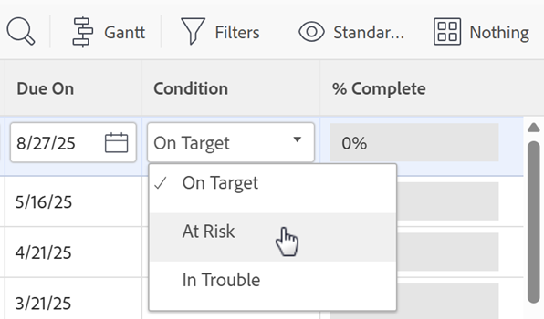

# De weergavevolgorde van voorwaarden wijzigen

U kunt de volgorde wijzigen waarin voorwaarden worden weergegeven in projecten, taken en uitgaven:

* Wanneer een gebruiker een project bewerkt

  

* Wanneer een gebruiker de voorwaarde voor een taak of kwestie wijzigt

  

  >[!NOTE]
  >
  >In de standaardmening van de Voorwaarde, is het **1&rbrace; gebied van de Voorwaarde een type van gebied dat niet inline kan worden uitgegeven.** Wanneer u het **gebied van de Voorwaarde** aan een mening afzonderlijk toevoegt, is het editable. Voor informatie over gealigneerde het uitgeven, zie [&#x200B; gealigneerd punten in een lijst in Adobe Workfront &#x200B;](/help/quicksilver/workfront-basics/navigate-workfront/use-lists/inline-edit-objects.md) uitgeven.

## Toegangsvereisten

+++ Breid uit om de toegangseisen voor de functionaliteit in dit artikel weer te geven.

<table style="table-layout:auto"> 
 <col> 
 <col> 
 <tbody> 
  <tr> 
   <td>Adobe Workfront-pakket</td> 
   <td>
Alle
</td> 
  </tr> 
  <tr> 
   <td>Adobe Workfront-licentie</td> 
   <td>
Standard

       
Plan
</td>
  </tr> 
  <tr> 
   <td>Configuraties op toegangsniveau</td> 
   <td>Systeembeheerder</td> 
  </tr> 
 </tbody> 
</table>

Voor informatie, zie [&#x200B; vereisten van de Toegang in de documentatie van Workfront &#x200B;](/help/quicksilver/administration-and-setup/add-users/access-levels-and-object-permissions/access-level-requirements-in-documentation.md).

+++

## De weergavevolgorde van voorwaarden wijzigen

{{step-1-to-setup}}

1. Klik **Voorkeur van het Project** > **Voorwaarden**.

1. Selecteer de **Projecten**, **Taken**, of **Kwesties** tabel.

1. De belemmering  de voorwaarden om hun orde te veranderen.

   De nieuwe volgorde wordt automatisch opgeslagen.

Voor meer informatie over het aanpassen van voorwaarden, zie [&#x200B; de voorwaarden van de Douane &#x200B;](../../../administration-and-setup/customize-workfront/create-manage-custom-conditions/custom-conditions.md).
