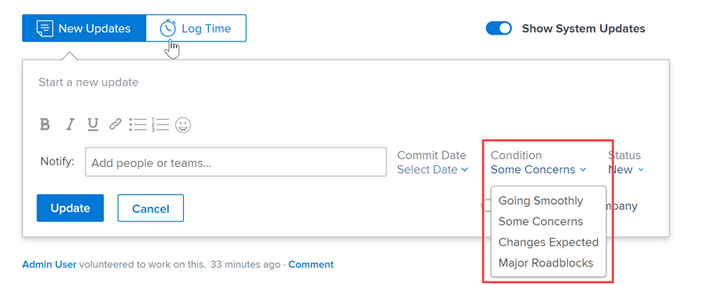

# Een aangepaste voorwaarde maken of bewerken

Als Adobe Workfront-beheerder kunt u een aangepaste voorwaarde maken of bewerken voor projecten, taken en uitgaven die aansluiten op de behoeften van uw organisatie.

## Toegangsvereisten

+++ Breid uit om de toegangseisen voor de functionaliteit in dit artikel weer te geven.

<table style="table-layout:auto"> 
 <col> 
 <col> 
 <tbody> 
  <tr> 
   <td>Adobe Workfront-pakket</td> 
   <td>
Alle
</td> 
  </tr> 
  <tr> 
   <td>Adobe Workfront-licentie</td> 
   <td>
Standard

       
Plan
</td>
  </tr> 
  <tr> 
   <td>Configuraties op toegangsniveau</td> 
   <td>Systeembeheerder</td> 
  </tr> 
 </tbody> 
</table>

Voor informatie, zie [&#x200B; vereisten van de Toegang in de documentatie van Workfront &#x200B;](/help/quicksilver/administration-and-setup/add-users/access-levels-and-object-permissions/access-level-requirements-in-documentation.md).

+++

## Een aangepaste voorwaarde maken of bewerken

{{step-1-to-setup}}

1. Klik **Voorkeur van het Project** > **Voorwaarden**.

1. Klik het lusje van het objecten type (**Project**, **Taak**, of **Uitgave**) dat u met de voorwaarde wilt associëren.

1. Om een nieuwe voorwaarde tot stand te brengen, klik **voeg een nieuwe voorwaarde** toe.

   of

   Om een bestaande voorwaarde uit te geven, **geeft** naast de voorwaardennaam uit.

    uit

1. Configureer uw aangepaste voorwaarde met behulp van de volgende opties:

   <table style="table-layout:auto"> 
    <col> 
    <col> 
    <tbody> 
     <tr> 
      <td>Naam voorwaarde</td> 
      <td>(Vereist) Typ een beschrijvende naam voor de voorwaarde.</td> 
     </tr> 
     <tr> 
      <td>Beschrijving</td> 
      <td>(Optioneel) Typ een beschrijving van het doel van de voorwaarde voor de gebruikers.</td> 
     </tr> 
     <tr> 
      <td>Kleur</td> 
      <td>(Optioneel) Klik op het kleurpictogram en kies de kleur die u voor de voorwaarde wilt gebruiken wanneer deze wordt weergegeven in projecten, taken of problemen. U kunt ook een hexadecimaal getal typen.</td> 
     </tr> 
     <tr> 
      <td>Vergelijkt met </td> 
      <td>
(Vereist, alleen voor projecten) Klik op de optie in de vervolgkeuzelijst die de functie van de nieuwe voorwaarde het best beschrijft. Bijvoorbeeld, voor een voorwaarde genoemd het Volgen goed, zou u op Doel klikken. Dit bepaalt hoe uw standaardvoorwaarden werken. Elke voorwaarde die u maakt, moet overeenkomen met een van de opties in het keuzemenu.

      
Voor informatie over standaardvoorwaarden, zie <a href="../../../administration-and-setup/customize-workfront/create-manage-custom-conditions/set-custom-condition-default-projects.md" class="MCXref xref"> Plaats een douanetoewijzing als gebrek voor projecten </a> en <a href="../../../administration-and-setup/customize-workfront/create-manage-custom-conditions/set-custom-condition-default-tasks-issues.md" class="MCXref xref"> plaats een douanetoewijzing als gebrek voor taken en kwesties </a>.

      
Deze optie kan niet worden gewijzigd nadat u de voorwaarde hebt gemaakt.
</td> 
     </tr> 
     <tr> 
      <td>Sleutel</td> 
      <td>
(Vereist) Typ voor een projectvoorwaarde een alfanumerieke afkorting die gebruikers kunnen herkennen. Typ voor een taak- of uitgiftevoorwaarde een numerieke code van twee cijfers tussen 01 en 99. 

      
Deze sleutel, die wordt gebruikt in de API en kan worden gebruikt voor rapportagedoeleinden, moet uniek zijn voor elk object.

      
U kunt de sleutel voor een voorwaarde niet wijzigen nadat u de voorwaarde hebt opgeslagen. 
</td> 
     </tr> 
     <tr> 
      <td>Voorwaarde verbergen</td> 
      <td>
(Optioneel) Deze optie is beschikbaar voor aangepaste voorwaarden die u niet langer wilt gebruiken, maar die u om historische redenen wilt behouden. 

      
Als u een aangepaste voorwaarde verbergt die is gebruikt voor werkitems, wordt deze op die werkitems weergegeven nadat u deze hebt verborgen. 
</td> 
     </tr> 
    </tbody> 
   </table>

   >[!TIP]
   >
   >U kunt de terminologie en de kleuren van voorwaarden standaardiseren voor alle drie de objecttypen. Om dit te doen, kopieer de voorwaardenNaam en de hexadecimale code van de Kleur van één lusje (Project, Taak, Kwestie) aan de overeenkomstige voorwaarde op de andere twee lusjes.

1. (Facultatief) sleep  om het even welke voorwaarde aan een nieuwe positie om de lijst opnieuw in orde te brengen.

   Dit verandert de orde waarin de voorwaarden in projecten, taken en kwesties tonen:

   * Wanneer een gebruiker een project bewerkt

     

   * Wanneer een gebruiker de voorwaarde voor een taak of kwestie in een lijstmening wijzigt:

     

     >[!NOTE]
     >
     >In de standaardmening van de Voorwaarde, is het **1&rbrace; gebied van de Voorwaarde een type van gebied dat niet inline kan worden uitgegeven.** Wanneer u het **gebied van de Voorwaarde** aan een mening afzonderlijk toevoegt, is het editable. Voor informatie over gealigneerde het uitgeven, zie [&#x200B; gealigneerd punten in een lijst in Adobe Workfront &#x200B;](/help/quicksilver/workfront-basics/navigate-workfront/use-lists/inline-edit-objects.md) uitgeven.

1. Klik **sparen**.

U kunt uw douanevoorwaarde als standaardvoorwaarde voor projecten of voor taken en kwesties plaatsen. Voor meer informatie, zie [&#x200B; Plaats een douanetoewijzing als gebrek voor projecten &#x200B;](../../../administration-and-setup/customize-workfront/create-manage-custom-conditions/set-custom-condition-default-projects.md) en [&#x200B; plaats een douanetoewijzing als gebrek voor taken en kwesties &#x200B;](../../../administration-and-setup/customize-workfront/create-manage-custom-conditions/set-custom-condition-default-tasks-issues.md).

Voor meer informatie over douanevoorwaarden, zie [&#x200B; de voorwaarden van de Douane &#x200B;](../../../administration-and-setup/customize-workfront/create-manage-custom-conditions/custom-conditions.md).

<!-- THIS WAS ORIGINALLY BETWEEN THE OTHER TWO BULLETS.
   * When a user is changing the condition for a task or issue on the Updates tab:

     
   -->
