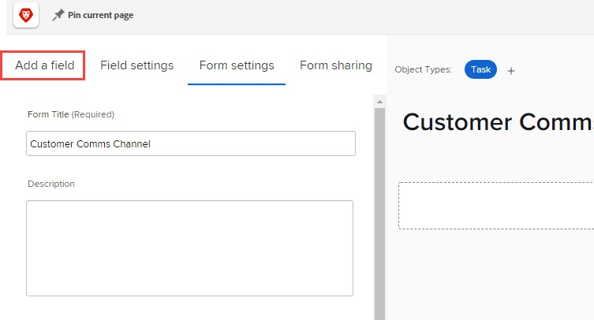

# Een aangepast veld toevoegen aan een aangepast formulier met de oudere formulierbuilder

Wanneer u aan een aangepast formulier werkt, kunt u een nieuw aangepast veld maken en dit toevoegen aan een aangepast formulier.

U kunt ook een aangepast veld toevoegen dat al aan een ander aangepast formulier is toegevoegd. Zie voor instructies [Een aangepast veld of aangepaste widget opnieuw gebruiken in een aangepast formulier](../../../administration-and-setup/customize-workfront/create-manage-custom-forms/reuse-an-existing-field.md).

Voor informatie over het toevoegen van een middelenwidget aan een aangepast formulier, een proces dat vergelijkbaar is met het toevoegen van een aangepast veld, raadpleegt u [Een middelenwidget toevoegen of bewerken in een aangepast formulier](../../../administration-and-setup/customize-workfront/create-manage-custom-forms/add-widget-or-edit-its-properties-in-a-custom-form.md).

>[!NOTE]
>
>In een aangepast formulier met veel aangepaste velden of veel opties voor meerdere selecties in aangepaste velden kunnen gebruikers trager werken wanneer ze waarden toevoegen of wijzigen in die velden. Een formulier met 100 aangepaste velden of meerdere geselecteerde aangepaste velden met meer dan 200 opties kan bijvoorbeeld langzamer zijn wanneer gebruikers ermee werken.

## Toegangsvereisten

U moet het volgende hebben om de stappen in dit artikel uit te voeren:

<table style="table-layout:auto"> 
 <col> 
 <col> 
 <tbody> 
  <tr data-mc-conditions=""> 
   <td role="rowheader"> 
Adobe Workfront-abonnement*
 </td> 
   <td>Alle</td> 
  </tr> 
  <tr> 
   <td role="rowheader">Adobe Workfront-licentie*</td> 
   <td>Plan</td> 
  </tr> 
  <tr data-mc-conditions=""> 
   <td role="rowheader">Configuraties op toegangsniveau*</td> 
   <td> 
Administratieve toegang tot aangepaste formulieren
 
Ga voor informatie over hoe Workfront-beheerders deze toegang verlenen naar <a href="../../../administration-and-setup/add-users/configure-and-grant-access/grant-users-admin-access-certain-areas.md" class="MCXref xref">Gebruikers administratieve toegang verlenen tot bepaalde gebieden</a>.
 </td> 
  </tr>  
 </tbody> 
</table>

&#42;Neem contact op met uw Workfront-beheerder om te weten te komen welk plan, type licentie of configuraties op toegangsniveau u hebt.

## Een aangepast veld toevoegen aan een aangepast formulier

1. Beginnen met het maken of bewerken van een aangepast formulier, zoals beschreven in [Een aangepast formulier maken of bewerken](../../../administration-and-setup/customize-workfront/create-manage-custom-forms/create-or-edit-a-custom-form.md).
1. Open de **Veld toevoegen** tab.

   

1. Met **Nieuw veld**  Selecteer een van de onderstaande veldtypen:

   <table style="table-layout:auto"> 
    <col> 
    </col> 
    <col> 
    </col> 
    <tbody> 
     <tr> 
      <td role="rowheader">Tekstveld met één regel</td> 
      <td>Hiermee kunnen gebruikers één regel tekst in het veld typen.</td> 
     </tr> 
     <tr> 
      <td role="rowheader">Alineatekstveld</td> 
      <td>Hiermee kunnen gebruikers meerdere tekstregels in het veld typen.</td> 
     </tr> 
     <tr data-mc-conditions=""> 
      <td role="rowheader">Tekstveld met opmaak</td> 
      <td>Hiermee kunnen gebruikers meerdere tekstregels in het veld typen en de tekst opmaken met vet, cursief, onderstrepen, opsommingstekens, nummering, hyperlinks en blokopties. Dit is beschikbaar in Home, het gebied van Updates, lijsten, en het gebied van Details voor de voorwerpen van Workfront. Een tekenlimiet van 15.000 staat voor veel tekst en opmaak toe.
 
Voor informatie over toegang tot dit veld via de API raadpleegt u <a href="../../../administration-and-setup/customize-workfront/create-manage-custom-forms/rich-text-field-storage-in-the-api.md" class="MCXref xref">Opslag van rijke tekstvelden in de API</a>.
 
<b>OPMERKING</b>: Tekstvelden met opmaak zijn niet beschikbaar voor mobiele Workfront-toepassingen (beschikbaar in komende versies). 
 </td> 
     </tr> 
     <tr> 
      <td role="rowheader">Vervolgkeuzelijst</td> 
      <td>Bevat een lijst met keuzemogelijkheden.</td> 
     </tr> 
     <tr> 
      <td role="rowheader">Typeahead </td> 
      <td>Hiermee kunnen gebruikers de naam typen van een object dat in Workfront bestaat. Er wordt een lijst met suggesties weergegeven wanneer de gebruiker begint te typen.
      Dit veldtype ondersteunt de volgende objecten:
      <ul><li>Gebruiker</li>
      <li>Groep</li>
      <li>Functie</li>
      <li>Portfolio</li>
      <li>Programma</li>
      <li>Project</li>
      <li>Team</li>
      <li>Sjabloon</li>
      <li>Bedrijf</li>
      </ul>      
      </td> 
     </tr> 
     <tr> 
      <td role="rowheader">Berekend</td> 
      <td>Hiermee kunt u een expressie definiëren en het resultaat weergeven op het aangepaste formulier. Zie voor meer informatie <a href="../../../administration-and-setup/customize-workfront/create-manage-custom-forms/add-calculated-data-to-custom-form.md" class="MCXref xref">Berekende gegevens toevoegen aan een aangepast formulier</a>.</td> 
     </tr> 
     <tr> 
      <td role="rowheader">Datum</td> 
      <td>Hiermee geeft u een kalender weer waarin gebruikers een datum en tijd kunnen selecteren.</td> 
     </tr> 
     <tr> 
      <td role="rowheader">Selectievakjes</td> 
      <td>Hiermee kunnen gebruikers meerdere keuzen selecteren.</td> 
     </tr> 
     <tr> 
      <td role="rowheader">Keuzerondjes</td> 
      <td>Gebruikers hoeven slechts één keuze te maken.</td> 
     </tr> 
     <tr> 
      <td role="rowheader">Beschrijvende tekst</td> 
      <td>Hiermee kunt u instructies en koppelingen naar pagina's buiten Workfront opnemen.</td> 
     </tr> 
     <tr> 
      <td role="rowheader">Sectie-einde</td> 
      <td>Een sectie-einde is in feite geen veld. U kunt een sectie-einde gebruiken om uw aangepaste velden en widgets in secties te ordenen en, indien nodig, verschillende weergave- en bewerkingsmachtigingen voor elke sectie te configureren. Voor informatie over het toevoegen en configureren van sectie-einden raadpleegt u <a href="../../../administration-and-setup/customize-workfront/create-manage-custom-forms/add-a-section-break-to-a-custom-form.md" class="MCXref xref">Een sectie-einde toevoegen aan een aangepast formulier</a>.</td> 
     </tr> 
    </tbody> 
   </table>

1. Op de **Veldinstellingen** kunt u de opties configureren die beschikbaar zijn voor het type aangepast veld dat u toevoegt:

   <table style="table-layout:auto"> 
    <col> 
    </col> 
    <col> 
    </col> 
    <tbody> 
     <tr> 
      <td role="rowheader">Label</td> 
      <td> 
(Vereist) Typ een beschrijvend label dat boven het aangepaste veld wordt weergegeven. U kunt het label op elk gewenst moment wijzigen.
 
<b>BELANGRIJK</b>: Gebruik geen speciale tekens in dit label. Ze worden niet correct weergegeven in rapporten.
 </td> 
     </tr> 
     <tr> 
      <td role="rowheader">Naam</td> 
      <td> 
(Vereist) Met deze naam identificeert het systeem het aangepaste veld wanneer u het toevoegt aan verschillende gebieden in Workfront, zoals rapporten, Home- en API-interacties.
 
Wanneer u het aangepaste veld voor het eerst configureert en u typt het label, wordt het veld Naam automatisch aangepast. Maar de gebieden van het Etiket en van de Naam zijn niet gesynchroniseerd-dit geeft u de vrijheid om het etiket te veranderen dat uw gebruikers zien zonder het moeten de naam veranderen die het systeem ziet.
 
      
<b>BELANGRIJK</b>:   
      <ul> 
      <li>Hoewel dit mogelijk is, raden we u aan deze naam niet te wijzigen nadat u of andere gebruikers het aangepaste formulier in Workfront hebben gebruikt. Als u dat doet, herkent het systeem het aangepaste veld niet meer waar er nu naar wordt verwezen in andere gebieden van Workfront. 
Bijvoorbeeld, als u het douanegebied aan een rapport toevoegt en later zijn naam verandert, herkent Workfront het niet in het rapport en het zal daar ophouden correct te werken tenzij u het aan het rapport gebruikend de nieuwe naam opnieuw toevoegt.
 </li>
      <li> 
We raden u aan geen naam te typen die al wordt gebruikt voor ingebouwde Workfront-velden.
 </li>
      <li>
We raden u aan het teken punt/punt niet te gebruiken in de aangepaste veldnaam om fouten te voorkomen bij het gebruik van het veld in verschillende gebieden van Workfront.
</li>
      </ul> 
Elke aangepaste veldnaam moet uniek zijn in het Workfront-exemplaar van uw organisatie. Op deze manier kunt u een formulier hergebruiken dat al voor een ander aangepast formulier is gemaakt. Zie voor meer informatie <a href="#Add" class="MCXref xref">Een aangepast veld toevoegen aan een aangepast formulier</a> in dit artikel.
 </td>
     </tr> 
     <tr> 
      <td role="rowheader">Instructies</td> 
      <td> 
Typ eventuele aanvullende informatie over het aangepaste veld. Wanneer gebruikers het aangepaste formulier invullen, kunnen ze de muisaanwijzer boven het pictogram van het vraagteken plaatsen om knopinfo weer te geven met de informatie die u hier typt.
 
      
  

      </td> 
     </tr> 
     <tr> 
      <td role="rowheader">Indeling</td> 
      <td> 
Selecteer het type gegevens dat in het aangepaste veld wordt vastgelegd. U kunt de indelingsselectie wijzigen nadat u het formulier hebt opgeslagen, maar de nieuwe indeling moet de ingevoerde waarde ondersteunen.

   
<strong>Voorbeeld:</strong> Als u een numerieke waarde opslaat voor een veld met de tekstopmaak op ten minste één object en de notatie later wijzigt in Getal of Valuta, treedt er geen fout op. 

      
Als u echter een alfanumerieke waarde opslaat in een veld met tekstindeling op ten minste één object en vervolgens probeert de indeling te wijzigen in Getal of Valuta, treedt er een fout op omdat de opgeslagen alfanumerieke waarde niet compatibel is met de notatie Getal of Valuta. 

   </td> 
     </tr> 
     <tr> 
      <td role="rowheader">Weergavetype</td> 
      <td>(Alleen vervolgkeuzelijst, selectievakjes en keuzerondjes) Wijzig het gewenste type optie voor het veld.</td> 
     </tr> 
     <tr> 
      <td role="rowheader">Grootte</td> 
      <td>(Alleen tekstvelden) Selecteer een breedte voor het veld.</td> 
     </tr> 
     <tr> 
      <td role="rowheader">Tijd van dag weergeven</td> 
      <td>(Alleen datumvelden) Selecteer deze optie als u de tijd van de dag en de datum in het veld wilt weergeven.</td> 
     </tr> 
     <tr> 
      <td role="rowheader">Type object waarnaar wordt verwezen</td> 
      <td> 
(Alleen Typeahead-velden) Selecteer het objecttype dat u aan het veld wilt koppelen.
 
Nadat u op Toepassen of Opslaan+Sluiten hebt geklikt, kunt u het objecttype voor het veld niet meer wijzigen.
 
<b>OPMERKING</b>:   
        <ul> 
         <li>Als uw Workfront-beheerder de naam voor Portfolio, Programma's of Projecten heeft aangepast in de Workfront-gebruikersinterface, wordt de standaardnaam voor het object weergegeven in deze vervolgkeuzelijst, niet de aangepaste naam. Raadpleeg uw Workfront-beheerder als u hier hulp bij nodig hebt. </li> 
         <li>De volgende objecttypen worden ondersteund in de mobiele apps van iOS en Android Workfront: Gebruiker, Bedrijf, Groep, Functie, Portfolio, Programma, Project en Sjabloon.</li> 
        </ul> 
 </td> 
     </tr> 
     <tr data-mc-conditions=""> 
      <td role="rowheader">Filter toevoegen</td> 
      <td> 
(Alleen Typeahead-velden) Voeg een filter toe voor een objecttype om de objecten te beperken die gebruikers kunnen kiezen wanneer ze het veld gebruiken. 
 
U kunt bijvoorbeeld een veld zo instellen dat gebruikersnamen alleen kunnen worden geselecteerd als ze aan de volgende criteria voldoen:
 
       <ul> 
        <li>Ze behoren tot een of meer groepen die u opgeeft</li> 
        <li>Ze zijn gekoppeld aan een rol of functie die u opgeeft</li> 
        <li>Zij behoren tot dezelfde groep als de persoon die het veld gebruikt</li> 
       </ul> 
U moet het filter definiëren voor het objecttype dat u hebt geselecteerd met de syntaxis Tekstmodus. Zie de sectie voor informatie over het maken van een filter in de tekstmodus <a href="../../../reports-and-dashboards/reports/text-mode/understand-text-mode.md#editing2" class="MCXref xref">Tekstmodus in een filter bewerken</a> in het artikel <a href="../../../reports-and-dashboards/reports/text-mode/understand-text-mode.md" class="MCXref xref">Overzicht van de tekstmodus</a>. 
 
<b>OPMERKING</b>:   
        <ul> 
         <li>Als u een bestaand aangepast formulier bewerkt en u voegt een filter toe aan een Typeahead-veld, worden er geen objecten (buiten het bereik van het filter) verwijderd die gebruikers al met het veld hebben toegevoegd.</li> 
         <li>Dit filter is niet beschikbaar op mobiele apparaten. Als u het filter voor een Typeahead-veld gebruikt, wordt het veld weergegeven op mobiele apparaten van gebruikers waarop het filter geen invloed heeft.</li> 
        </ul> 
 </td> 
     </tr> 
     <tr> 
      <td role="rowheader">Beschrijvende tekst</td> 
      <td>(Alleen beschrijvende tekstvelden) Typ de tekst die u wilt weergeven voor instructies of een koppeling op het aangepaste formulier. </td> 
     </tr> 
     <tr> 
      <td role="rowheader">Hyperlink</td> 
      <td>(Alleen beschrijvende tekstvelden) Als u een hyperlink wilt toepassen op de beschrijvende tekst die u hebt getypt, voegt u deze hier toe.</td> 
     </tr> 
     <tr> 
      <td role="rowheader">Een vereist veld maken</td> 
      <td>Selecteer deze optie als u wilt dat het veld verplicht is zodat de gebruiker het aangepaste formulier kan invullen. </td> 
     </tr> 
     <tr> 
      <td role="rowheader">Wijzigingen in veld bijhouden in updateffeeds</td> 
      <td>
Klik op de vervolgkeuzelijst en selecteer de objecttypen waarin u de waardewijzigingen van het veld automatisch wilt bijhouden.
 
      
<b>OPMERKING</b>: Deze optie is niet beschikbaar voor:
 
      <ul> 
      <li>Aangepaste formulieren die zijn gekoppeld aan de volgende objecttypen: Kosten, Bedrijf, Iteratie, Factureringsrecord en Groep.</li> 
      <li>De volgende veldtypen: Berekende , Omschrijvende tekst en Sectie-einde</li> 
      </ul>
      
<b>BELANGRIJK</b>: Wanneer u een objecttype selecteert of deselecteert, heeft dit invloed op alle aangepaste formulieren die zijn gekoppeld aan het geselecteerde objecttype en die dit veld bevatten. Als u bijvoorbeeld hier een objecttype uitschakelt en het aangepaste formulier opslaat, worden de waardewijzigingen van het veld niet meer bijgehouden voor dat objecttype in een aangepast formulier dat het veld bevat.

       
Nadat u hier een objecttype voor een veld hebt geselecteerd en het aangepaste formulier hebt opgeslagen, wordt het veld weergegeven op het tabblad Aangepaste velden in het gebied feeds bijwerken in Setup.
 
       
Omgekeerd geldt dat als dit veld wordt verwijderd in het gedeelte feeds bijwerken in Setup, het objecttype voor deze instelling wordt uitgeschakeld voor alle aangepaste formulieren die zijn gekoppeld aan het objecttype en die dit veld bevatten.
 
       
Zie de sectie voor meer informatie <a href="../../../administration-and-setup/set-up-workfront/system-tracked-update-feeds/configure-system-updates.md#adding-fields-to-the-update-feeds" class="MCXref xref">Velden toevoegen die Workfront moet bijhouden</a> in het artikel <a href="../../../administration-and-setup/set-up-workfront/system-tracked-update-feeds/configure-system-updates.md" class="MCXref xref">Systeemupdates configureren</a>.
 </td> 
     </tr> 
     <tr> 
      <td role="rowheader">Logica toevoegen</td> 
      <td>Geef op welke velden op het formulier moeten worden weergegeven, op basis van selecties die gebruikers in bestaande velden maken. Zie voor meer informatie <a href="../../../administration-and-setup/customize-workfront/create-manage-custom-forms/display-or-skip-logic-custom-form.md" class="MCXref xref">Weergavelogica toevoegen en logica overslaan naar een aangepast formulier</a>.</td> 
     </tr> 
     <tr> 
      <td role="rowheader">Keuzen </td> 
      <td> 
(Alleen vervolgkeuzelijst, selectievakjes of keuzerondjes; optioneel)
 
       <ol> 
        <li> 
Klikken <b>Opties</b>Schakel vervolgens een van de volgende opties in:
 
           <ul> 
            <li><strong>Waarden tonen</strong>: geeft de waarden van elke keuze in het veld weer. Het label van elke keuze wordt standaard weergegeven.</li> 
            <li><strong>Keuzen A-Z sorteren</strong>: hiermee sorteert u de opties die u alfabetisch in het veld toevoegt.</li> 
           </ul> 
        </li> 
        <li> 
Klik voor elke keuze die u voor de gebruiker toevoegt op het tandwielpictogram Selecteer vervolgens een van de volgende opties:
 
           <ul> 
            <li><strong>Standaard selecteren</strong>: Selecteer de standaardinstelling in het veld.</li> 
            <li> 
<strong>Keuze verbergen</strong>: Verberg de keuze in het veld. Verborgen keuzen blijven beschikbaar in rapporten.
 </li> 
            <li> 
<strong>Keuze verwijderen</strong>: Verwijder de keuze uit het veld.
 
<b>WAARSCHUWING</b>: Als u de huidige objecten hebt die deze optie gebruiken, verwijdert u deze niet uit het veld. Als u deze regel verwijdert, gaan historische gegevens verloren. Selecteer in plaats daarvan de optie om deze te verbergen, zodat gebruikers deze optie in de toekomst niet meer kunnen selecteren.
 </li> 
           </ul> 
        </li> 
       </ol> </td> 
     </tr> 
    </tbody> 
   </table>

1. (Voorwaardelijk) Als u het weergavetype van een veld op het aangepaste formulier wilt wijzigen, klikt u op de knop **Weergavetype** en klikt u op het gewenste type.

   U kunt schakelen tussen de volgende weergavetypen voor velden:

   * **Selectietypen**: Selectievakjes, Vervolgkeuzelijst, keuzerondjes.
   * **Teksttekstvelden**: Tekstveld Eén regel, alineatekstveld. (U kunt een tekstveld met opmaak niet omzetten in een ander weergavetype. U kunt het veld echter verwijderen en een ander type veld toevoegen.)

   Als u bijvoorbeeld een veld Selectievakjes hebt gemaakt, kunt u dit wijzigen in een veld Vervolgkeuzelijst of Keuzerondjes. Als u een tekstveld Eén regel hebt gemaakt, kunt u dit wijzigen in een tekstveld Alineatekst.

   >[!NOTE]
   >
   >Houd rekening met het volgende wanneer u het weergavetype van een veld wilt wijzigen van een veld met selectievakje of een meerkeuzeveld (een vervolgkeuzelijst waarmee meerdere opties kunnen worden geselecteerd) in een veld met één selectie:
   >
   >* Als u overschakelt op Keuzerondjes, behoudt Workfront de eventueel door een gebruiker in het veld ingevoerde waarden totdat de gebruiker gegevens in een willekeurig deel van het formulier wijzigt en opslaat. Op dit punt worden alle waarden die zijn geselecteerd in het veld Meerdere selectietypen vervangen door de geselecteerde waarde voor Keuzerondje.
   >* Als u overschakelt naar een vervolgkeuzelijst met één keuze, behoudt Workfront de eventuele multi-select waarden die een gebruiker in het veld heeft ingevoerd, totdat de gebruiker de waarden in het veld wijzigt en opslaat. Op dit punt worden alle waarden die zijn geselecteerd in het veld Meerdere selecties vervangen door de geselecteerde vervolgkeuzelijst.

1. (Optioneel) Herhaal stap 2-6 om andere aangepaste velden toe te voegen.

   of

   Voeg velden toe die al voor uw organisatie zijn gemaakt, zoals wordt uitgelegd in [Een aangepast veld of aangepaste widget opnieuw gebruiken in een aangepast formulier](../../../administration-and-setup/customize-workfront/create-manage-custom-forms/reuse-an-existing-field.md#add).

   >[!NOTE]
   >
   >U kunt maximaal 500 velden en widgets toevoegen aan één aangepast formulier. De prestaties kunnen echter afnemen wanneer er meer dan 100 formulieren op een formulier staan, afhankelijk van de complexiteit ervan. Voorbeelden van complexe formulieren zijn formulieren met trapsgewijze parameters, berekende aangepaste gegevensvelden en opties voor meerdere waarden in één veld.

1. Klikken **Toepassen**.
1. Als u uw aangepaste formulier op andere manieren wilt blijven bouwen, gaat u verder naar een van de volgende artikelen:

   * [Aangepaste velden en widgets in een aangepast formulier plaatsen](../../../administration-and-setup/customize-workfront/create-manage-custom-forms/position-fields-in-a-custom-form.md)
   * [Een middelenwidget toevoegen of bewerken in een aangepast formulier](../../../administration-and-setup/customize-workfront/create-manage-custom-forms/add-widget-or-edit-its-properties-in-a-custom-form.md)
   * [Berekende gegevens toevoegen aan een aangepast formulier](../../../administration-and-setup/customize-workfront/create-manage-custom-forms/add-calculated-data-to-custom-form.md)
   * [Een sectie-einde toevoegen aan een aangepast formulier](../../../administration-and-setup/customize-workfront/create-manage-custom-forms/add-a-section-break-to-a-custom-form.md)
   * [Een bestaand berekend aangepast veld opnieuw gebruiken in een aangepast formulier](../../../administration-and-setup/customize-workfront/create-manage-custom-forms/use-existing-calc-field-new-custom-form.md)
   * [Weergavelogica toevoegen en logica overslaan naar een aangepast formulier](../../../administration-and-setup/customize-workfront/create-manage-custom-forms/display-or-skip-logic-custom-form.md)
   * [Een aangepast formulier voorvertonen en invullen](../../../administration-and-setup/customize-workfront/create-manage-custom-forms/preview-and-complete-a-custom-form.md)
