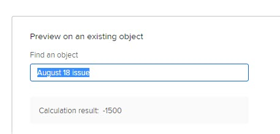

# Berekende gegevens toevoegen aan een aangepast formulier met de oudere formulierbuilder

<!--Audited: 01/2024-->

In een aangepast formulier kunt u een berekend aangepast veld toevoegen waarin bestaande gegevens worden gebruikt om nieuwe gegevens te genereren wanneer het aangepaste formulier aan een object wordt gekoppeld.

Hiertoe maakt u een instructie die gegevensexpressies en de namen van bestaande velden gebruikt. Dit kunnen aangepaste velden, berekende aangepaste gegevensvelden en ingebouwde Adobe Workfront-velden zijn.

Deze verklaring berekent de gegevens u ingaat en toont het resultaat in het nieuwe berekende douaneveld.

Een berekend aangepast veld kan het volgende bevatten:

* Een eenvoudige verwijzing naar één ingebouwd veld.

  >[!INFO]
  >
  > **Voorbeeld:** Om de opbrengst te berekenen die door projecten en taken wordt geproduceerd, kon u een berekend douanegebied tot stand brengen dat de ingebouwde Ware Inkomsten van het gebied bevat. Wanneer iemand de douaneformulier aan een project of een taak vastmaakt, toont de opbrengst voor het project of de taak op het gebied.

* Een expressie die naar een of meer velden verwijst. Dit kunnen aangepaste velden, andere berekende aangepaste velden en ingebouwde velden zijn.

  >[!INFO]
  >
  >**Voorbeeld:** Om de winst te berekenen die door projecten en taken wordt geproduceerd, kon u een berekend gebied tot stand brengen genoemd Winst die een wiskundige uitdrukking bevat die kosten van opbrengst aftrekt.
  >
  >Hiervoor kunt u de wiskundige expressie SUB (subtract) gebruiken met de ingebouwde velden Werkelijke kosten en Werkelijke inkomsten van Workfront.
  >
  >In de onderstaande stappen kunt u zien hoe dit voorbeeld kan worden uitgevoerd.

Voor informatie over het maken van aangepaste formulieren voor uw organisatie en het begrijpen van het type velden dat u ermee kunt koppelen, raadpleegt u [Een aangepast formulier maken of bewerken](../../../administration-and-setup/customize-workfront/create-manage-custom-forms/create-or-edit-a-custom-form.md).

## Toegangsvereisten

U moet het volgende hebben om de stappen in dit artikel uit te voeren:

<table style="table-layout:auto"> 
 <col> 
 <col> 
 <tbody> 
  <tr data-mc-conditions=""> 
   <td role="rowheader"> 
Adobe Workfront-plan
 </td> 
   <td>Alle</td> 
  </tr> 
  <tr> 
   <td role="rowheader">Adobe Workfront-licentie*</td> 
   <td>
Huidig: Plan

   of
   
Nieuw: Standaard

   </td> 
  </tr> 
  <tr> 
   <td role="rowheader">
Configuratie op toegangsniveau
</td> 
   <td> 
Administratieve toegang tot aangepaste formulieren
 
 </td> 
  </tr>  
 </tbody> 
</table>

*Neem contact op met uw Workfront-beheerder om te weten te komen welk plan, licentietype of configuratie op toegangsniveau u hebt. Voor meer informatie over toegangsvereisten, zie [Toegangsvereisten in Workfront-documentatie](/help/quicksilver/administration-and-setup/add-users/access-levels-and-object-permissions/access-level-requirements-in-documentation.md).

## Een berekend veld toevoegen aan een aangepast formulier {#add-a-calculated-field-to-a-custom-form}

U kunt zowel ingebouwde Workfront-velden als aangepaste velden gebruiken die u al hebt gemaakt in de expressie van een berekend aangepast veld.

>[!IMPORTANT]
>
>Voordat u een berekend aangepast veld maakt, identificeert u de bestaande velden die u wilt opnemen, zodat u zeker weet dat de gegevens die nodig zijn voor de berekening aanwezig zijn in Workfront.

1. Beginnen met het maken of bewerken van een aangepast formulier, zoals beschreven in [Een aangepast formulier maken of bewerken](../../../administration-and-setup/customize-workfront/create-manage-custom-forms/create-or-edit-a-custom-form.md).

1. Op de **Veld toevoegen** tabblad, klikt u op **Berekend**.

   In het weergavegebied rechts ziet u in het veld een vulwaarde van 12345. Dit is een indicator om u eraan te herinneren dat het veld een berekend aangepast veld is terwijl u het aangepaste formulier maakt of bewerkt. Wanneer het formulier aan een object is gekoppeld en gebruikers het invullen, zien ze in het veld het resultaat van de berekening en niet de waarde 12345.

1. Geef de volgende informatie op voor het berekende veld:

   <table style="table-layout:auto"> 
    <col> 
    </col> 
    <col> 
    </col> 
    <tbody> 
     <tr> 
      <td role="rowheader">Label</td> 
      <td>Typ een label voor het veld. Dit zien gebruikers wanneer ze het aangepaste formulier gebruiken. Het veld <b>Naam</b>In rapporten wordt door Workfront naar dit item verwezen. Dit vult automatisch in en komt overeen met het label. Dit is een verplicht veld.</td> 
     </tr>

   <tr> 
   <td role="rowheader">Naam</td> 
   <td>Standaard is de naam van een veld gelijk aan de naam van het veld. U kunt de naam van een veld echter wijzigen zodat deze anders is dan de naam van een veld. Het veld <b>Naam</b> Workfront verwijst hiernaar in rapporten. Dit is een verplicht veld.</td> 
   </tr>

   <tr> 
     <td role="rowheader" id="instructions">Instructies</td> 
      <td> 
Voeg tekst toe voor aanvullende informatie over het veld en de formule in het veld.

      
U kunt hier ook de formule plakken die wordt gebruikt in de berekening van het aangepaste veld. In dit geval raden we u aan eerst de berekening van het aangepaste veld bij te werken en vervolgens de laatste expressie uit het veld Berekening te kopiëren en deze in het veld Instructies te plakken. 

   Dit kan op de volgende manieren nuttig zijn:
   <ul> 
      <li> 
Als herinnering aan wat de formule is en hoe het werkt. Dit is vooral handig als u dit berekende aangepaste veld wilt gebruiken op meerdere formulieren.
 </li> 
       <li> 
Als knopinfo kunnen gebruikers zien wanneer ze de muisaanwijzer op het veld plaatsen. U kunt hier alle tekst toevoegen die u in de knopinfo wilt zien.
 </li> 
       </ul>
       
Als u niet wilt dat gebruikers de formule in tooltip zien, die voor hen verwarrend zou kunnen zijn, voeg het niet aan het gebied van Instructies toe. Gebruik in plaats daarvan de instelling "Weergaveformule in instructies" om de formule weer te geven of te verbergen, zoals verder wordt beschreven in dit artikel. <a href="#build-the-calculation-for-your-calculated-custom-field">De berekening maken voor het berekende aangepaste veld</a> in dit artikel.

   
Zie voor informatie over het gebruik van hetzelfde berekende aangepaste veld op een nieuw formulier <a href="../../../administration-and-setup/customize-workfront/create-manage-custom-forms/use-existing-calc-field-new-custom-form.md#using-an-existing-calculated-custom-field-on-a-new-form" class="MCXref xref">Een bestaand berekend aangepast veld opnieuw gebruiken in een aangepast formulier</a>.

   </td> 
     </tr> 
     <tr> 
      <td role="rowheader">Indeling</td> 
      <td> 
De indeling waarin u de resultaten van het veld wilt opslaan en weergeven.
 
Als u het veld wilt gebruiken in wiskundige berekeningen, moet u altijd een <strong>Getal</strong> of <strong>Valuta</strong> gebruiken. Als u Getal of Valuta selecteert, wordt het systeem automatisch gebruikt voor het afkappen van getallen die met 0 beginnen.
 
      
<b>BELANGRIJK</b>: 
Voordat u een indeling kiest, moet u rekening houden met de juiste indeling voor het nieuwe veld. Het indelingsveld kan niet worden bewerkt nadat het aangepaste formulier is opgeslagen. En het selecteren van het verkeerde formaat kon toekomstige berekeningen en samengevoegde waarden in rapport en lijstgroepen beïnvloeden.

      
<strong>OPMERKING:</strong> Berekende velden met de notatie Valuta mogen geen aanhalingstekens bevatten. (Gebruik bijvoorbeeld 800.00 en niet "800.00.") Het gebruik van aanhalingstekens kan onverwachte gevolgen hebben als gevolg van verschillen in de taalopmaak voor valutatypen.
</td> 
     </tr> 
    </tbody> 
   </table>

1. De aangepaste veldgegevens blijven bijwerken, zoals wordt beschreven in de sectie [De berekening maken voor het berekende aangepaste veld](#build-the-calculation-for-your-calculated-custom-field) in dit artikel.

## De berekening maken voor het berekende aangepaste veld {#build-the-calculation-for-your-calculated-custom-field}

1. Beginnen met het maken van het berekende aangepaste veld, zoals beschreven in de sectie [Een berekend veld toevoegen aan een aangepast formulier](#add-a-calculated-field-to-a-custom-form) in dit artikel.

1. Klikken **Maximaliseren** om de **Rekeneditor** en maak uw berekening.

   >[!INFO]
   >
   >**Voorbeeld:** Gebruikend het voorbeeld in de inleiding aan dit artikel, kon u een berekend gebied tot stand brengen van de douane genoemd Winst in een douaneformulier voor projecten en taken. Dit veld kan een berekening bevatten die het verschil weergeeft tussen de werkelijke en de werkelijke kosten:
   >
   >`SUB({actualRevenue},{actualCost})`
   >
   >In dit voorbeeld: `SUB` is de expressie en de velden waarnaar wordt verwezen, zijn `actualRevenue` en `actualCost`.

   Een berekening begint gewoonlijk met een expressie, gevolgd door haakjes die de velden bevatten waarnaar u wilt verwijzen wanneer het aangepaste formulier aan een object is gekoppeld. Zie voor informatie over de beschikbare expressies [Overzicht van berekende gegevensexpressies](../../../reports-and-dashboards/reports/calc-cstm-data-reports/calculated-data-expressions.md).

   Elk veld moet tussen accolades staan, zoals in de sectie wordt uitgelegd [Syntaxis vereist in berekende aangepaste velden](#syntax-required-in-calculated-custom-fields) in dit artikel. Wanneer u de naam van een veld begint te typen, doet het systeem suggesties en kunt u er een selecteren om het veld in de berekening in te voegen.

   >[!NOTE]
   >
   >   In een berekening kunt u niet verwijzen naar velden van de volgende typen: 
   >   
   >   * Tekstveld met opmaak
   >   * Beschrijvende tekst.
   >   
   >   Zie voor informatie over de aangepaste veldtypen [Een aangepast veld toevoegen aan een aangepast formulier](../../../administration-and-setup/customize-workfront/create-manage-custom-forms/add-a-custom-field-to-a-custom-form.md).

1. Klik in het grote tekstvak in het vak Rekeningeditor en klik vervolgens op Zoeken of Uitvouwen en klik op een optie in het menu **Expressies** en **Velden** aan de rechterkant van het tekstvak. Dit voegt ze toe aan de berekening.

   U kunt ook een expressie of veld in het grote tekstvak typen en deze selecteren wanneer deze wordt weergegeven. Elk item wordt weergegeven met een &#39;F&#39; voor een veld of een &#39;E&#39; voor een expressie.

   Als u een haakje openen typt, wordt het haakje sluiten automatisch toegevoegd.

   >[!TIP]
   >
   >U kunt een van de volgende handelingen uitvoeren om hulp te krijgen bij uw berekening:
   > 
   >* Houd de muisaanwijzer boven een expressie in uw berekening om een beschrijving te bekijken, een voorbeeld van het gebruik ervan en een koppeling Meer informatie in het artikel [Overzicht van berekende gegevensexpressies](../../../reports-and-dashboards/reports/calc-cstm-data-reports/calculated-data-expressions.md).
   >  
   >* Gebruik de kleurcodering om de componenten te identificeren die u hebt toegevoegd. Expressies worden in blauw weergegeven en velden in groen.
   >  
   >* Zoek rekenfouten die roze gemarkeerd zijn. U kunt de muisaanwijzer boven een gemarkeerde fout plaatsen om een korte beschrijving van de oorzaak ervan weer te geven.
   >  
   >* In de **Voorvertoning op een bestaand object** onder de berekening, typt u de naam van een Workfront-object en selecteert u het object wanneer het in de lijst wordt weergegeven. Zo kunt u zien hoe het veld eruitziet wanneer het formulier aan het object wordt gekoppeld.
   ><!--or by providing test values (NOT READY YET; CHANGE THIS SCREENSHOT WHEN IT IS)-->
   >  
   >* Verwijzingsexpressies in een lange berekening met behulp van de regelnummers die aan de linkerkant worden weergegeven.

1. Klikken **Minimaliseren** als u klaar bent met het maken van de berekening voor het berekende aangepaste veld.

   >[!NOTE]
   >
   >In het weergavegebied rechts ziet u in het veld een vulwaarde van 12345. Dit is een indicator om u eraan te herinneren dat het veld een berekend aangepast veld is terwijl u het aangepaste formulier maakt of bewerkt. Wanneer het formulier aan een object is gekoppeld en gebruikers het invullen, zien ze in het veld het resultaat van de berekening en niet de waarde 12345.

1. (Optioneel) Gebruik een van de volgende opties om het berekende aangepaste veld verder te configureren:

   <table style="table-layout:auto"> 
    <col> 
    <col> 
    <tbody> 
     <tr> 
      <td role="rowheader">Logica toevoegen</td> 
      <td>U kunt DisplayLogic toevoegen om te bepalen of het berekende veld wordt weergegeven op basis van ten minste één keuze die een gebruiker maakt in een voorafgaand meerkeuzeveld (vervolgkeuzelijst, Selectievakjes of Keuzerondjes) bij het invullen van het formulier. Zie voor meer informatie <a href="../../../administration-and-setup/customize-workfront/create-manage-custom-forms/display-or-skip-logic-custom-form.md" class="MCXref xref">Weergavelogica toevoegen en logica overslaan naar een aangepast formulier</a>. 
Dit is alleen beschikbaar als ten minste één selectievakje, keuzerondje of vervolgkeuzelijst voorafgaat aan het berekende aangepaste veld op het formulier. 
 
Logica overslaan is niet beschikbaar voor berekende aangepaste velden.
 </td> 
     </tr> 
     <tr> 
      <td role="rowheader">Vorige berekeningen bijwerken</td> 
      <td>Wanneer u een bestaand berekend aangepast veld bewerkt, kunt u deze optie selecteren om een update in de berekening te activeren wanneer u het aangepaste formulier opslaat. Dit gebeurt slechts eenmaal wanneer u het aangepaste formulier opslaat. De optie keert naar zijn gehandicapte staat terug nadat u dit doet.</td> 
     </tr> 
     <tr> 
      <td role="rowheader">Formule weergeven in instructies</td> 
      <td>Laat deze optie ingeschakeld als u wilt dat gebruikers die het aangepaste formulier invullen, de formule van het veld zien wanneer ze de muisaanwijzer op het veld plaatsen. Zie de informatie over <a href="#instructions" class="MCXref xref">Instructies</a> eerder in deze tabel.</td> 
     </tr> 
    </tbody> 
   </table>

1. Klikken **Gereed** wanneer alle wijzigingen zijn voltooid in het berekende aangepaste veld.

   Of klik op **Toepassen** om uw wijzigingen tot nu toe op het formulier toe te passen als u aangepaste velden wilt blijven toevoegen aan het formulier.

   Of klik op **Opslaan + Sluiten** als alle wijzigingen zijn voltooid op het aangepaste formulier.
1. Als u wilt controleren of het berekende aangepaste veld correct werkt, koppelt u het aangepaste formulier aan een object en bekijkt u het resultaat in het berekende aangepaste veld.

   Zie voor instructies over het bijvoegen van een aangepast formulier [Een aangepast formulier toevoegen aan een object](../../../workfront-basics/work-with-custom-forms/add-a-custom-form-to-an-object.md).

   Als u op andere manieren een aangepast formulier wilt maken, kunt u verdergaan met het samenstellen van een van de volgende artikelen:

   * [Een aangepast veld toevoegen aan een aangepast formulier](../../../administration-and-setup/customize-workfront/create-manage-custom-forms/add-a-custom-field-to-a-custom-form.md)
   * [Aangepaste velden en widgets in een aangepast formulier plaatsen](../../../administration-and-setup/customize-workfront/create-manage-custom-forms/position-fields-in-a-custom-form.md)
   * [Een middelenwidget toevoegen of bewerken in een aangepast formulier](../../../administration-and-setup/customize-workfront/create-manage-custom-forms/add-widget-or-edit-its-properties-in-a-custom-form.md)
   * [Een bestaand berekend aangepast veld opnieuw gebruiken in een aangepast formulier](../../../administration-and-setup/customize-workfront/create-manage-custom-forms/use-existing-calc-field-new-custom-form.md)
   * [Weergavelogica toevoegen en logica overslaan naar een aangepast formulier](../../../administration-and-setup/customize-workfront/create-manage-custom-forms/display-or-skip-logic-custom-form.md)
   * [Een aangepast formulier voorvertonen en invullen](../../../administration-and-setup/customize-workfront/create-manage-custom-forms/preview-and-complete-a-custom-form.md)

## Syntaxis vereist in berekende aangepaste velden

Voor elk veld dat wordt gebruikt in een aangepast berekend veld, moet de hieronder beschreven syntaxis worden gebruikt, met accolades rond elke veldnaam. Wanneer u de naam van een veld begint te typen, doet het systeem suggesties en kunt u er een selecteren om het veld in de berekening in te voegen. Als u gegevens onjuist invoert in een berekening, verschijnt er een waarschuwing. U kunt het formulier alleen opslaan als u de berekening bewerkt en geldige velden en een geldige berekende expressie opgeeft.

>[!NOTE]
>
>Momenteel doet het systeem alleen suggesties wanneer u de naam typt van een veld waarnaar u wilt verwijzen op een object waaraan het aangepaste formulier wordt gekoppeld, niet op het bovenliggende element van het object.

### Namen van ronde velden met accolades

* Als u wilt dat de berekening naar een ingebouwd veld verwijst, moet de naam van het veld tussen accolades staan en moet deze zijn opgemaakt zoals deze in de Workfront-database wordt weergegeven. U kunt de naam van de velden niet gebruiken zoals deze worden weergegeven in de Workfront-interface.

Bijvoorbeeld: `{actualRevenue}`

Veldnamen zijn hoofdlettergevoelig en moeten worden weergegeven in de indeling voor camelgevallen, zoals ze worden weergegeven in het Workfront-systeem.

* Als u wilt dat de berekening naar een aangepast veld verwijst, moet de naam van het veld tussen accolades staan en door `DE:` tussen de haakjes. Aangepaste velden zijn hoofdlettergevoelig en moeten worden opgemaakt zoals ze in de Workfront-interface worden weergegeven.

Bijvoorbeeld: `{DE:Profit}`

In het systeem worden alle aangepaste velden weergegeven waaruit u kunt kiezen wanneer u typt `DE:`.

* Als u wilt dat de berekening verwijst naar een veld dat gegevens van het bovenliggende object trekt wanneer het aangepaste formulier aan een object is gekoppeld, moet u de veldnaam voorafgaan aan het objecttype van het bovenliggende object, ook tussen accolades.

  Als het aangepaste formulier bijvoorbeeld is geconfigureerd voor taken en u wilt dat het veld de werkelijke inkomsten van het bovenliggende object berekent wanneer het formulier aan een taak is gekoppeld, moet u aangeven `project` als het objecttype van het veld:

  `{project}.{actualRevenue}`

  Of als het een aangepast veld is:

  `{project}.{DE:profit}`

  Als u niet zeker weet wat het objecttype van het bovenliggende object is omdat het aangepaste formulier is geconfigureerd voor meerdere objecttypen, kunt u de variabele jokertekenfilter gebruiken `$$OBJCODE` om de berekening voor elk van de mogelijke typen te laten werken. Zie voor meer informatie [Berekende aangepaste velden in aangepaste formulieren voor meerdere objecten](#calculated-custom-fields-in-multi-object-custom-forms) in dit artikel.

### Afzonderlijke items met perioden

Wanneer u in een berekend aangepast veld naar een verwant object verwijst, moet u namen en kenmerken van objecten scheiden met punten.

Als u bijvoorbeeld in een aangepast taaktype formulier de naam van de eigenaar van het Portfolio wilt weergeven in een berekend aangepast veld, typt u het volgende:

`{project}.{porfolio}.{owner}`

Dit systeem wint de informatie in de volgende stappen (in deze orde) terug:

1. Van het object van het aangepaste formulier (een taak), daarna
1. Heb toegang tot de ouder van de taak, of een ander verwant voorwerp (project), dan
1. Heb toegang tot de ouder, of een ander verwant voorwerp van het project (een portefeuille), en dan
1. Open het volgende gerelateerde object naar het portfolio (de eigenaar van het portfolio).

### Naamsyntaxis voor het verwijzen naar een aangepast veld

Wanneer u in een berekend aangepast veld naar een ander aangepast veld verwijst, moet u de naam van het veld invoeren die in de Workfront-interface wordt weergegeven.

Als u bijvoorbeeld wilt verwijzen naar de geselecteerde optie in een aangepast veld met de naam Executive sponsor, typt u het volgende:

`{DE:Executive sponsor}`

>[!NOTE]
>
>De syntaxis voor een Typeahead-veld is anders dan voor andere typen velden, omdat u het veld moet toevoegen `:name` aan het einde.
>
>Als u bijvoorbeeld wilt verwijzen naar de geselecteerde optie in een aangepast tekstveld met de naam &quot;Executive sponsor&quot;, typt u:
>
>`{DE:Executive sponsor:name}`

## Berekende aangepaste velden in aangepaste formulieren voor meerdere objecten {#calculated-custom-fields-in-multi-object-custom-forms}

In een aangepast formulier met meerdere objecten moeten de geselecteerde objecttypen compatibel zijn met alle velden waarnaar wordt verwezen in de berekende aangepaste velden van het formulier. Als er sprake is van incompatibiliteit, wordt u gewaarschuwd dat u aanpassingen moet aanbrengen.

>[!INFO]
>
>**Voorbeeld:**
>
>In een aangepast formulier dat is geconfigureerd om te werken met het taakobjecttype, maakt u een berekend aangepast veld met de naam In Charge. U configureert de methode om te verwijzen naar het ingebouwde veld, zodat de naam van de primaire ontvanger die de leiding heeft, wordt weergegeven wanneer het formulier aan een taak is gekoppeld:
>
>`{assignedTo}.{name}`
>
>Later voegt u het objecttype Project toe aan het aangepaste formulier. Een waarschuwingsbericht geeft aan dat het objecttype Project niet compatibel is met het berekende aangepaste veld.

Wanneer dit voorkomt, kunt u één van het volgende doen:

* Verwijder een van de twee incompatibele items uit het aangepaste formulier. Dit is het objecttype of het berekende aangepaste veld waarnaar wordt verwezen.
* Beide items behouden en de filtervariabele voor jokertekens gebruiken `$$OBJCODE` als een voorwaarde in een IF-expressie om twee verschillende versies van het veld In laden te maken. Hierdoor werkt het veld goed, ongeacht het type object waaraan het formulier is gekoppeld.

>[!INFO]
>
>**Voorbeeld:** Hoewel er geen Toegewezen aan is: Het gebied van de Naam in projecten, is er een ingebouwd gebied van de Eigenaar (dat automatisch met de naam van de persoon invult die het project creeerde, tenzij iemand manueel dit verandert).
>
>In het veld Aangepast in lading kunt u dus `$$OBJCODE` zoals hieronder wordt getoond om naar het gebied van de Eigenaar te verwijzen wanneer het douaneformulier aan een project in bijlage is, en het Toegewezen aan: gebied van de Naam wanneer het formulier aan een taak in bijlage is:
>
>`IF($$OBJCODE="PROJ",{owner}.{name},{assignedTo}.{name})`

Voor meer informatie over variabelen zoals `$$OBJCODE,` zie [Overzicht van jokertekenfiltervariabelen](../../../reports-and-dashboards/reports/reporting-elements/understand-wildcard-filter-variables.md).

## Automatische updates van berekende aangepaste velden

Berekende aangepaste velden op een object worden automatisch opnieuw berekend wanneer het volgende gebeurt:

* Er verandert iets op het object, zoals een dagelijkse tijdlijnberekening.
* Iemand bewerkt een ander veld waarnaar wordt verwezen door een berekend aangepast veld op het object.
* De berekende expressie is leeg en het veld bevat een waarde. Deze stelt de waarde in op null.

  >[!NOTE]
  >
  >In een douaneformulier in bijlage aan een voorwerp, worden de datum en de tijdverklaringen in berekende douanevelden berekend en opgeslagen volgens de Coordinated Universal Time (UTC), niet volgens de configuraties van de tijdzone die voor de instantie van uw organisatie en uw gebruikersprofiel worden geplaatst. Berekeningen in een aangepast formulier worden echter weergegeven op basis van de afzonderlijke tijdzone van elke gebruiker.
