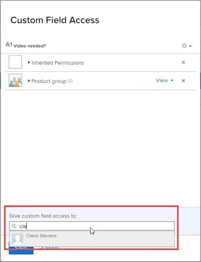

# Delen voor aangepaste velden en widgets configureren met de oudere formulierbuilder

Wanneer u een nieuw aangepast veld of een nieuwe aangepaste widget toevoegt aan een aangepast formulier, kan iedereen in het systeem die toegang heeft tot aangepaste formulieren standaard de eigenschappen voor dat item bewerken, zoals het label en de naam. U kunt dit wijzigen door te bepalen met wie het bestand kan worden gedeeld.

Zie voor informatie over aangepaste velden en widgets in aangepaste formulieren [Een aangepast veld toevoegen aan een aangepast formulier met de oudere formulierbuilder](../../../administration-and-setup/customize-workfront/create-manage-custom-forms/add-a-custom-field-to-a-custom-form.md) en [Een elementwidget toevoegen of bewerken in een aangepast formulier met de verouderde formulierbuilder](../../../administration-and-setup/customize-workfront/create-manage-custom-forms/add-widget-or-edit-its-properties-in-a-custom-form.md).

## Toegangsvereisten

U moet het volgende hebben om de stappen in dit artikel uit te voeren:

<table style="table-layout:auto"> 
 <col> 
 <col> 
 <tbody> 
  <tr data-mc-conditions=""> 
   <td role="rowheader"> 
Adobe Workfront-abonnement*
 </td> 
   <td>Alle</td> 
  </tr> 
  <tr> 
   <td role="rowheader">Adobe Workfront-licentie*</td> 
   <td>Plan</td> 
  </tr> 
  <tr data-mc-conditions=""> 
   <td role="rowheader">Configuraties op toegangsniveau*</td> 
   <td> 
Administratieve toegang tot aangepaste formulieren
 
Ga voor informatie over hoe Workfront-beheerders deze toegang verlenen naar <a href="../../../administration-and-setup/add-users/configure-and-grant-access/grant-users-admin-access-certain-areas.md" class="MCXref xref">Gebruikers administratieve toegang verlenen tot bepaalde gebieden</a>.
 </td> 
  </tr> 
 </tbody> 
</table>

&#42;Neem contact op met uw Workfront-beheerder om te weten te komen welk plan, type licentie of configuraties op toegangsniveau u hebt.

## Delen voor een aangepast veld of een aangepaste widget configureren

1. Klik op de knop **Hoofdmenu** pictogram  in de rechterbovenhoek van Adobe Workfront klikt u op **Instellen** .

1. Klik in het linkerdeelvenster op **Aangepaste Forms**.
1. Als u het delen voor een aangepast veld of een aangepaste widget configureert in de Workfront-instantie van uw organisatie, gaat u als volgt te werk:

   1. Klik op de knop **Velden** tab.
   1. Selecteer het punt u het delen voor wilt vormen, dan klik **Delen**.

   Of voer de volgende handelingen uit als u het delen configureert voor een aangepast veld of een aangepaste widget in een bestaand aangepast formulier:

   1. Selecteer het aangepaste formulier en klik op **Bewerken**.
   1. Selecteer in het formulierbewerkingsgebied aan de rechterkant het item waarvoor u het delen wilt configureren.
   1. Klik in het linkerdeelvenster op **Veld delen**.

1. In de **Aangepaste veldtoegang** vak waarin wordt weergegeven, geeft u aan met wie u het item wilt delen en hoe u het wilt delen:

   1. In de linkerbenedenhoek van het dialoogvenster **Aangepaste veldtoegang** onder **Aangepaste veldtoegang verlenen aan**, typt u de naam van een gebruiker, team, taakrol, groep of bedrijf waarmee u het item wilt delen, en klikt u vervolgens op de naam wanneer het item wordt weergegeven.

      

   1. Als u specifieker wilt zijn over hoe u het punt wilt delen, klik de drop-down lijst rechts van de naam, dan gebruik om het even welke volgende opties:

      

      <table style="table-layout:auto"> 
       <col> 
       <col> 
       <tbody> 
        <tr> 
         <td role="rowheader">Weergeven</td> 
         <td> 
U kunt op <strong>Geavanceerde instellingen</strong> om op te geven of de gebruiker of gebruikers toegang moeten kunnen gebruiken om het item toe te voegen aan een aangepast formulier of het te delen met andere gebruikers.
 </td> 
        </tr> 
        <tr> 
         <td role="rowheader">Beheren</td> 
         <td> 
Hiermee kunt u het aangepaste veld bewerken en weergeven in de veldbibliotheek en op de pagina waar u aangepaste formulieren maakt.
 
U kunt op <strong>Geavanceerde instellingen</strong> om op te geven of de gebruiker of gebruikers toegang moeten kunnen gebruiken om het item uit het systeem te verwijderen of het met andere gebruikers te delen.
 </td> 
        </tr> 
       </tbody> 
      </table>

1. (Optioneel) Herhaal de vorige stap om andere namen aan de lijst toe te voegen en de opties te configureren.
1. (Optioneel) Klik op het tandwielpictogram  in de rechterbovenhoek als u een optie voor het delen van het veld voor het hele systeem wilt kiezen.

   Niet alle volgende opties worden tegelijkertijd weergegeven in dit vervolgkeuzemenu. De tweede wordt bijvoorbeeld alleen weergegeven wanneer een van de andere twee is geselecteerd.

   * **Dit bewerkbaar maken voor het hele systeem, zodat iedereen in Workfront het kan bewerken** (de standaardoptie)

     Wanneer u een aangepast veld of een aangepaste widget toevoegt en u het delen ervan niet beperkt, kan iedereen in het systeem die toegang heeft tot aangepaste formulieren deze weergeven en de eigenschappen ervan bewerken.

   * **Toegang tot bewerken in het hele systeem verwijderen**

     Hiermee beperkt u de toegang tot alleen de personen die u aan de lijst hebt toegevoegd.

   * **Dit systeem zo zichtbaar maken dat iedereen in Workfront het kan zien**

1. Klikken **Opslaan** of **Opslaan + Sluiten**.

## Overgenomen toegang tot aangepaste velden en widgets wanneer een aangepast formulier wordt gedeeld

Wanneer iemand een aangepast formulier deelt met een groep, taakrol, team of bedrijf, nemen de ontvangers de toegang van de Weergave over aan aangepaste velden en widgets die zich in het formulier bevinden. Dit toegangsniveau tot deze items op het formulier blijft altijd behouden, zodat het formulier naar wens kan functioneren voor de ontvangers door de persoon die het heeft gemaakt. Dit geldt zelfs voor ontvangers die toegang tot het formulier hebben via Bewerken.

U kunt erachter komen wie toegang tot een aangepast veld of een aangepaste widget heeft geërfd en u kunt de toegang tot dit veld of deze widget verwijderen.

>[!NOTE]
>
>Als een ontvanger beheertoegang heeft tot een aangepast veld of een aangepaste widget op het gedeelde aangepaste formulier, blijft die toegang behouden voor de ontvanger.

* [Ontdek wie toegang tot een aangepast veld of een aangepaste widget heeft geërfd](#find-out-who-has-inherited-access-to-a-custom-field-or-widget)
* [Toegang tot een aangepast veld of aangepaste widget verwijderen in een aangepast formulier dat is gedeeld](#remove-access-to-a-custom-field-or-widget-in-a-custom-form-that-was-shared)

### Ontdek wie toegang tot een aangepast veld of een aangepaste widget heeft geërfd {#find-out-who-has-inherited-access-to-a-custom-field-or-widget}

1. Klik op de knop **Hoofdmenu** pictogram  in de rechterbovenhoek van Adobe Workfront klikt u op **Instellen** .

1. Klik in het linkerdeelvenster op **Aangepaste Forms**.
1. Klik op de knop **Velden** en selecteert u vervolgens het veld, de afbeelding of de toegangswidget.
1. Klik in het weergegeven vak op **Overgenomen machtigingen** en bekijk de namen die worden weergegeven.
1. Klikken **Annuleren**.

### Toegang tot een aangepast veld of aangepaste widget verwijderen in een aangepast formulier dat is gedeeld {#remove-access-to-a-custom-field-or-widget-in-a-custom-form-that-was-shared}

Als u de toegang tot een aangepast veld of een aangepaste widget in een gedeeld formulier moet verwijderen, moet u het delen van het formulier opheffen. Zie voor instructies in de sectie [Toegang tot een aangepast formulier verwijderen](../../../administration-and-setup/customize-workfront/create-manage-custom-forms/share-access-to-a-custom-form.md#unshare) in het artikel [Een aangepast formulier delen](../../../administration-and-setup/customize-workfront/create-manage-custom-forms/share-access-to-a-custom-form.md).
