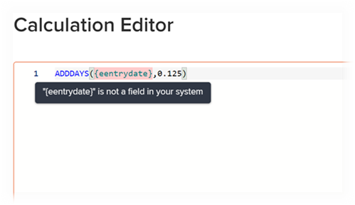

# Berekende velden toevoegen aan een formulier

{{preview-fast-release-general}}

<!-- Audited: 5/2025 -->

U kunt een berekend aangepast veld toevoegen waarin bestaande gegevens worden gebruikt om nieuwe gegevens te genereren wanneer het aangepaste formulier aan een object wordt gekoppeld.

Een berekend aangepast veld kan het volgende bevatten:

* Een eenvoudige verwijzing naar één ingebouwd veld.

  >[!INFO]
  >
  >**Voorbeeld:** om de opbrengst te berekenen die door projecten en taken wordt geproduceerd, kon u een berekend douanegebied tot stand brengen dat de ingebouwde Ware Inkomsten van het gebied bevat. Wanneer iemand de douaneformulier aan een project of een taak vastmaakt, toont de opbrengst voor het project of de taak op het gebied.

* Een expressie die naar een of meer velden verwijst. Dit kunnen aangepaste velden, andere berekende aangepaste velden en ingebouwde velden zijn.

  >[!INFO]
  >
  >**Voorbeeld:** om de winst te berekenen die door projecten en taken wordt geproduceerd, kon u een berekend gebied tot stand brengen genoemd Winst die een wiskundige uitdrukking bevat die kosten van opbrengst aftrekt.
  >
  >Hiervoor kunt u de wiskundige expressie SUB (subtract) gebruiken met de ingebouwde velden Werkelijke kosten en Werkelijke inkomsten van Workfront.
  >
  >In de onderstaande stappen kunt u zien hoe u een expressie zoals dit voorbeeld kunt maken.

>[!NOTE]
>
>Door wijzigingen in een direct veld wordt de waarde van het berekende veld automatisch bijgewerkt. (Directe velden zijn velden die beschikbaar zijn in de Workfront API Explorer of aangepaste velden in een aangepast formulier dat is gekoppeld aan een object.) Wijzigingen in een referentie of formule vereisen een handmatige herberekening van de veldwaarden.

## Toegangsvereisten

+++ Breid uit om de toegangseisen voor de functionaliteit in dit artikel weer te geven.

<table style="table-layout:auto"> 
 <col> 
 <col> 
 <tbody> 
  <tr> 
   <td>Adobe Workfront-pakket</td> 
   <td>
Alle
</td> 
  </tr> 
  <tr> 
   <td>Adobe Workfront-licentie</td> 
   <td>
Standard

       
Plan
</td>
  </tr> 
  <tr> 
   <td>Configuraties op toegangsniveau</td> 
   <td> 
Administratieve toegang tot aangepaste formulieren
 </td> 
  </tr>  
 </tbody> 
</table>

Voor informatie, zie [&#x200B; vereisten van de Toegang in de documentatie van Workfront &#x200B;](/help/quicksilver/administration-and-setup/add-users/access-levels-and-object-permissions/access-level-requirements-in-documentation.md).

+++

## Een bestaand berekend aangepast veld opnieuw gebruiken in een aangepast formulier

U kunt hetzelfde berekende aangepaste veld gebruiken voor aangepaste formulieren die bij verschillende objecten horen. U kunt bijvoorbeeld het berekende veld Winst gebruiken dat u voor het aangepaste formulier voor het project hebt gemaakt, op een aangepaste taakvorm.

Als u een bestaand berekend aangepast veld gebruikt, wordt de berekening niet overgedragen naar het nieuwe formulier. U moet de berekening opnieuw toevoegen in hetzelfde veld op het nieuwe aangepaste formulier.

U kunt ook een andere berekening voor hetzelfde veld uitvoeren op het nieuwe formulier. Als u dezelfde naam voor het berekende aangepaste veld behoudt, bent u verzekerd van consistentie en consistentie in de naamgevingsconventie.

>[!IMPORTANT]
>
>Door wijzigingen in berekende expressies kan de veldwaarde van objecten verouderd raken. Voer een van de volgende handelingen uit om ervoor te zorgen dat u altijd de bijgewerkte berekening in deze velden weergeeft:
>
>* Na het bewaren van een voorwerp waar u gegevens in een douanevorm in bijlage hebt uitgegeven, klik het Meer pictogram  op de belangrijkste pagina van de objecten, dan herberekenen de Uitdrukkingen van de Douane.
>* Selecteer de optie Aangepaste expressies opnieuw berekenen wanneer u objecten bulksgewijs bewerkt.
>* Selecteer de optie Vorige berekeningen bijwerken wanneer u een berekend aangepast veld op een aangepast formulier bewerkt.

Een bestaand berekend aangepast veld opnieuw gebruiken:

{{step-1-to-setup}}

1. In het linkerpaneel, klik **Aangepaste Forms**, toen **Forms**.

   <!-- >[!TIP]
    >
    >In the view that appears, you can review all custom forms and custom fields that have been created for your organization. You can also see who created each form and the fields that are associated with it. -->

1. Klik **Nieuwe Vorm van de Douane**.

1. In de **Nieuwe dialoog van de Vorm van de Douane**, selecteer welke objecten types u de douanevorm aan wilt vastmaken, dan **blijven** klikken.
1. Op de top-linkerkant van het scherm, klik **bibliotheek van het Gebied**.

   

1. Gebruik het onderzoeksvakje of breid **Berekende** sectie uit om van het berekende gebied de plaats te bepalen u nodig hebt, dan sleep het gebied waar u het in de douanevorm wilt verschijnen.

1.  (Voorwaardelijk) klik **Controle voor conflicten** om alle voorwerpen te herzien die door de formule op dit berekende gebied te veranderen zouden kunnen worden beïnvloed.

    als twee of meer vormen die het zelfde berekende gebied bevatten aan een voorwerp in bijlage zijn, dan moeten de formules op alle vormen identiek zijn. Het uitgeven van de formule wordt niet toegestaan als de verandering een conflict kon veroorzaken.

1. (Optioneel) Herhaal de vorige stap om andere velden toe te voegen.

   >[!NOTE]
   >
   >U kunt maximaal 500 velden en widgets toevoegen aan één aangepast formulier. De prestaties kunnen echter afnemen wanneer er meer dan 100 formulieren op een formulier staan, afhankelijk van de complexiteit ervan.
   >
   >
   >Voorbeelden van complexe formulieren zijn formulieren met trapsgewijze parameters, berekende aangepaste gegevensvelden en opties voor meerdere waarden in één veld.

1. Om uw veranderingen te bewaren, **van toepassing is** en zich op een andere sectie te bewegen om uw vorm verder te bouwen.

   of

   Klik **sparen en Sluiten**.

## Een nieuw berekend veld toevoegen

>[!IMPORTANT]
>
>Voordat u een nieuw berekend aangepast veld maakt, moet u de bestaande velden identificeren die u wilt opnemen, zodat u zeker weet dat de gegevens die nodig zijn voor de berekening aanwezig zijn in Workfront.

{{step-1-to-setup}}

1. In het linkerpaneel, klik **Aangepaste Forms**, toen **Forms**.

1. Klik **Nieuwe douanevorm**.

   <!-- >[!TIP]
    >
    >In the view that appears, you can review all custom forms and custom fields that have been created for your organization. You can also see who created each form and the fields that are associated with it. -->

1. In de **Nieuwe dialoog van de Vorm van de Douane**, selecteer welke objecten types u de douanevorm aan wilt vastmaken, dan **blijven** klikken.

1. Op de linkerkant van het scherm, vind **Berekend** en sleep het aan een sectie op het canvas.

   

1. Configureer rechts in het scherm de opties die beschikbaar zijn voor het type aangepast veld dat u toevoegt:

   <table style="table-layout:auto"> 
    <col> 
    </col> 
    <col> 
    </col> 
    <tbody> 
     <tr> 
      <td role="rowheader">Label</td> 
      <td>Typ een label voor het veld. Dit is wat gebruikers zien wanneer ze het aangepaste formulier gebruiken. Het gebied <b> Naam </b>, dat automatisch invult, wordt van verwijzingen voorzien door Workfront in rapporten.</td> 
     </tr> 
     <tr> 
      <td role="rowheader" id="instructions">Instructies</td> 
      <td> Standaard wordt de formule die u voor het veld maakt hier opgeslagen. U kunt tekst toevoegen voor aanvullende informatie over het veld en de formule in het veld. Dit kan op twee manieren nuttig zijn: 
       <ul> 
      <li>
Als herinnering aan wat de formule is en hoe het werkt. Dit is vooral handig als u dit berekende aangepaste veld wilt gebruiken op meerdere formulieren.
 </li> 
      <li> 
Als knopinfo kunnen gebruikers zien wanneer ze de muisaanwijzer op het veld plaatsen. U voegt hier alle tekst toe die u in de knopinfo wilt zien.
 
Als u niet wilt dat zij de formule in tooltip zien, wat voor hen verwarrend zou kunnen zijn, kunt u het verbergen.</li> 
       </ul> </td> 
     </tr> 
     <tr> 
      <td role="rowheader">Indeling</td> 
      <td> 
De indeling waarin u de resultaten van het veld wilt opslaan en weergeven.
 
Als het gebied in wiskundige berekeningen zal worden gebruikt, gebruik altijd a <strong> Aantal </strong> of a <strong> het formaat van de Valuta </strong>. Wanneer u <strong> Aantal </strong> of <strong> Valuta </strong> selecteert, kapt het systeem automatisch aantallen af die met 0 beginnen.
 
      
<b> BELANGRIJK </b>: Alvorens u een formaat kiest, overweeg het correcte formaat voor het nieuwe gebied. Het indelingsveld kan niet worden bewerkt nadat het aangepaste formulier is opgeslagen. En het selecteren van het verkeerde formaat kon toekomstige berekeningen en samengevoegde waarden in rapport en lijstgroepen beïnvloeden.

      
<strong> NOTA </strong>: Berekende gebieden met het formaat van de a <strong> Valuta </strong> zouden geen aanhalingstekens moeten omvatten. (Gebruik bijvoorbeeld 800.00 en niet "800.00.") Het gebruik van aanhalingstekens kan onverwachte gevolgen hebben als gevolg van verschillen in de taalopmaak voor valutatypen.
</td>
     </tr> 
     <tr>
      <td>Actief</td>
      <td>
Deze optie is standaard ingeschakeld.

Wanneer u een veld inactief instelt, wordt het uitgesloten van rapporten, filters en weergaven en is het niet meer beschikbaar in de veldbibliotheek voor aangepaste formulieren.
</td>
     </tr>
    </tbody> 
   </table>

1. In de **doos van de Berekening**, begin bouwend uw berekening:
   1. Klik **maximaliseren** om de Redacteur van de Berekening te openen en uw berekening te bouwen.

Een berekening begint gewoonlijk met een expressie, gevolgd door haakjes die de velden bevatten waarnaar u wilt verwijzen wanneer het aangepaste formulier aan een object is gekoppeld.

      Elk veld moet met accolades zijn omgeven. Wanneer u de naam van een veld begint te typen, doet het systeem suggesties en kunt u er een selecteren om het veld in de berekening in te voegen.

      +++ **breidt zich uit om syntaxis te zien die in berekende douanevelden wordt vereist**

      Voor elk veld moet de hieronder beschreven syntaxis worden gebruikt, met accolades rond elke veldnaam. Wanneer u de naam van een veld begint te typen, doet het systeem suggesties en kunt u er een selecteren om het veld in de berekening in te voegen. Als u onjuiste gegevens in een berekening invoert, verschijnt er een waarschuwingsbericht. U kunt het formulier alleen opslaan als u de berekening bewerkt en geldige velden en een geldige berekende expressie opgeeft.

      >[!NOTE]
      >
      >Het systeem doet momenteel alleen suggesties wanneer u de naam begint te typen van een veld waarnaar u wilt verwijzen op een object waaraan het aangepaste formulier wordt gekoppeld. Velden van het bovenliggende object worden niet voorgesteld.

      **de namen van het Surround gebied met krullende steunen**

      * Als u wilt dat de berekening naar een ingebouwd veld verwijst, moet de naam van het veld tussen accolades staan.

        Bijvoorbeeld: `{actualRevenue}`

        Veldnamen zijn hoofdlettergevoelig en moeten in de berekening precies worden weergegeven hoe ze in het Workfront-systeem worden weergegeven.

        Navigeer aan de [&#x200B; ontdekkingsreiziger van Workfront API &#x200B;](https://developer.adobe.com/workfront/api-explorer/) om de gebiedsnamen te identificeren die in berekeningen kunnen worden gebruikt.

      * Als u wilt dat de berekening naar een aangepast veld verwijst, moet de naam van het veld tussen accolades staan en door `DE:` tussen de haakjes worden voorafgegaan.

        Bijvoorbeeld: `{DE:Profit}`

        Het systeem bevat een lijst met alle aangepaste velden waaruit u kunt kiezen wanneer u `DE:` typt.

         * Als u de berekening een gebied wilt van verwijzingen voorzien dat gegevens van het *ouder* voorwerp zal trekken wanneer de douanevorm aan een voorwerp in bijlage is, moet u de gebiedsnaam met het objecten type van het oudervoorwerp, ook in krullende steunen voorafgaan.

        Als het aangepaste formulier bijvoorbeeld is geconfigureerd om te werken met taken en u wilt dat het veld de werkelijke inkomsten van het bovenliggende object berekent wanneer het formulier aan een taak is gekoppeld, moet u `Project` aangeven als het objecttype van het veld:

        `{project}.{actualRevenue}`

        Of als het een aangepast veld is:

        `{project}.{DE:profit}`

        **Afzonderlijke punten met periodes**

        Wanneer u in een berekend aangepast veld naar een verwant object verwijst, moet u namen en kenmerken van objecten scheiden met punten.

        Als u bijvoorbeeld in een aangepast taaktype formulier de naam van de Portfolio-eigenaar wilt weergeven in een berekend aangepast veld, typt u het volgende:

        `{project}.{porfolio}.{owner}`

        Dit zou het volgende bepalen: Van het voorwerp van het douaneformulier (een taak), kunt u tot het volgende voorwerp met betrekking tot de taak (een project) toegang hebben. Vanaf dat punt hebt u toegang tot het volgende verwante object voor het project (een portfolio) en kunt u vervolgens verwijzen naar de velden die zijn gedefinieerd voor het portfolioobject (de eigenaar)

        **syntaxis van de Naam voor het van verwijzingen voorzien van een douanegebied**

        Wanneer u in een berekend aangepast veld naar een ander aangepast veld verwijst, moet u de naam van het veld invoeren die in de gebruikersinterface van Workfront wordt weergegeven.

        Als u bijvoorbeeld wilt verwijzen naar de geselecteerde optie in een aangepast veld met de naam Executive sponsor, typt u het volgende:

        `{DE:Executive sponsor}`

        >[!NOTE]
        >
        >De syntaxis voor een veld typekop wijkt iets af van die voor andere typen velden, omdat u `:name` aan het einde moet toevoegen.
        >
        >Als u bijvoorbeeld wilt verwijzen naar de geselecteerde optie in een aangepast tekstveld met de naam &quot;Executive sponsor&quot;, typt u:
        >
        >`{DE:Executive sponsor:name}`

        **Berekende douanegebieden in multi-objecten douaneformulieren**

        In een aangepast formulier met meerdere objecten moeten de geselecteerde objecttypen compatibel zijn met ten minste één veld waarnaar wordt verwezen in de berekende aangepaste velden van het formulier. Velden die niet compatibel zijn met het object, worden N.v.t. het formulier weergegeven.

        Als u er zeker van wilt zijn dat het berekende veld een juist resultaat voor alle objecttypen weergeeft, moet u `$$OBJCODE` gebruiken om een berekening voor elk objecttype te definiëren.

        >[!INFO]
        >
        >**Voorbeeld:**
        >
        >In een douaneformulier dat wordt gevormd om met projecten, taken, en kwesties te werken, kunt u de volgende formule gebruiken om het objecten type te tonen:
        >
        >`IF($$OBJCODE="PROJ","This is a project",IF($$OBJCODE="TASK","This is a task","This is an issue"))`
        >
        >Op een project zal het gebied &quot;Dit is een project&quot;tonen, op een taak zal het &quot;Dit is een taak&quot;tonen, en op een kwestie zal het &quot;Dit is een kwestie&quot;zeggen.

        >[!INFO]
        >
        >**Voorbeeld:** hoewel er geen Toegewezen aan is: Het gebied van de naam in projecten, is er een ingebouwd gebied van de Eigenaar (dat automatisch met de naam van de persoon die het project creeerde, tenzij iemand manueel dit verandert) invult.
        >
        >Zo kunt u in het veld Aangepast in kosten `$$OBJCODE` gebruiken, zoals hieronder wordt weergegeven, om te verwijzen naar het veld Eigenaar wanneer het aangepaste formulier aan een project is gekoppeld en naar het veld Toegewezen aan: Naam wanneer het formulier aan een taak is gekoppeld:
        >
        >`IF($$OBJCODE="PROJ",{owner}.{name},{assignedTo}.{name})`

        Voor meer informatie over variabelen als `$$OBJCODE,` zie [&#x200B; overzicht van de de filtervariabelen van de Weigering &#x200B;](/help/quicksilver/reports-and-dashboards/reports/reporting-elements/understand-wildcard-filter-variables.md).

        **Automatische updates van berekende douanegebieden**

        Berekende aangepaste velden op een object worden automatisch opnieuw berekend wanneer het volgende gebeurt:

         * Er verandert iets op het object, zoals een dagelijkse tijdlijnberekening.
         * Iemand bewerkt een ander veld waarnaar wordt verwezen door een berekend aangepast veld op het object.
         * De berekende expressie is leeg en het veld bevat een waarde. Deze stelt de waarde in op null.

           >[!NOTE]
           >
           >
In een douaneformulier in bijlage aan een voorwerp, worden de datum en de tijdverklaringen in berekende douanevelden berekend en bewaard door Coordinated Universal Time (UTC), niet door de configuraties van de tijdzone die voor de instantie van uw organisatie en uw gebruikersprofiel worden geplaatst. Berekeningen in een aangepast formulier worden gegenereerd op basis van de afzonderlijke tijdzones van elke gebruiker.

      +++

   1. Klik in het grote tekstvakje, dan klik **Uitdrukkingen** en **Gebieden** die beschikbaar zijn om hen aan uw berekening toe te voegen.

      Breid een objecten naam onder **Gebieden** uit om alle gebieden beschikbaar voor dat voorwerp te zien. De lijst mag uit maximaal 200 items bestaan. Als u de veldnaam kent, kunt u ernaar zoeken.

      U kunt ook een expressie of veld in het grote tekstvak typen en deze selecteren wanneer deze wordt weergegeven. Elk item wordt weergegeven met een &#39;F&#39; voor een veld of een &#39;E&#39; voor een expressie.

      Als u een haakje openen typt, wordt het haakje sluiten automatisch toegevoegd.

      +++ **breid uit om nuttige uiteinden** te zien

      >[!TIP]
      >
      >U kunt een van de volgende handelingen uitvoeren om hulp te krijgen bij uw berekening:
      > 
      >* Beweeg over een uitdrukking in uw berekening om een beschrijving te zien, een voorbeeld dat toont hoe het kan worden gebruikt, en a **leren meer** verbinding aan meer informatie in het artikel [&#x200B; Overzicht van berekende gegevensuitdrukkingen &#x200B;](/help/quicksilver/reports-and-dashboards/reports/calc-cstm-data-reports/calculated-data-expressions.md).
      >  
      >* Gebruik de kleurcodering om de componenten te identificeren die u hebt toegevoegd. Expressies worden in blauw weergegeven en velden in groen.
      >  
      >* Zoek rekenfouten die roze gemarkeerd zijn. U kunt de muisaanwijzer boven een gemarkeerde fout plaatsen om een korte beschrijving van de oorzaak ervan weer te geven.
      >  
      >* Geef een voorvertoning van de resultaten weer in het gebied onder de berekening.
      ><!--or by providing test values (NOT READY YET; CHANGE THIS SCREENSHOT WHEN IT IS)-->
      >  
      >* Verwijzingsexpressies in een lange berekening met behulp van de regelnummers die aan de linkerkant worden weergegeven.

      +++
   1. Klik **minimaliseren** wanneer u wordt gebeëindigd creërend de berekening voor het berekende douanegebied.

   1. (Optioneel) Gebruik een van de volgende opties om het berekende aangepaste veld verder te configureren:

      <table style="table-layout:auto">
   <col> 
    <col> 
    <tbody> 
     <tr> 
      <td role="rowheader">Logica toevoegen</td> 
      <td>U kunt DisplayLogic toevoegen om te bepalen of het berekende veld wordt weergegeven op basis van ten minste één keuze die een gebruiker maakt in een voorafgaand meerkeuzeveld (vervolgkeuzelijst, Selectievakjes of Keuzerondjes) bij het invullen van het formulier. <!-- For more information, see <a href="Need to add link for new article when it's written" class="MCXref xref">Add display logic and skip logic to a custom form</a>.--> 
Dit is alleen beschikbaar als ten minste één selectievakje, keuzerondje of vervolgkeuzeveld voorafgaat aan het berekende aangepaste veld op het formulier. 
 
Logica overslaan is niet beschikbaar voor berekende aangepaste velden.
 </td> 
     </tr> 
     <tr> 
      <td role="rowheader">Vorige berekeningen bijwerken</td> 
      <td>Wanneer u een bestaand berekend aangepast veld bewerkt, kunt u deze optie selecteren om een update in de berekening te activeren wanneer u het aangepaste formulier opslaat. Dit gebeurt slechts eenmaal wanneer u het aangepaste formulier opslaat. De optie keert naar zijn gehandicapte staat terug nadat u dit doet.</td> 
     </tr> 
     <tr> 
      <td role="rowheader">Formule weergeven in instructies</td> 
      <td>Laat deze optie ingeschakeld als u wilt dat gebruikers die het aangepaste formulier invullen, de formule van het veld zien wanneer ze de muisaanwijzer op het veld plaatsen. Voor meer informatie, zie de informatie over <a href="#instructions" class="MCXref xref"> Instructies </a> vroeger in deze lijst.</td> 
     </tr> 
    </tbody> 
   </table>

1. Om uw veranderingen te bewaren, **van toepassing is** en zich op een andere sectie te bewegen om uw vorm verder te bouwen.

   of

   Klik **sparen en Sluiten**.
