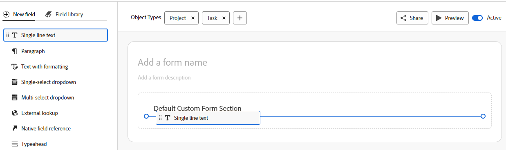

# Een aangepast formulier maken

 de benadrukte informatie op deze pagina verwijst naar functionaliteit nog niet algemeen beschikbaar. Deze optie is alleen beschikbaar in de voorvertoningsomgeving voor alle klanten. Na de maandelijkse versies aan Productie, zijn de zelfde eigenschappen ook beschikbaar in het milieu van de Productie voor klanten die snelle versies toeliet. 

 voor informatie over snelle versies, zie [ snelle versies voor uw organisatie ](/help/quicksilver/administration-and-setup/set-up-workfront/configure-system-defaults/enable-fast-release-process.md) toelaten of onbruikbaar maken.

U kunt een aangepast formulier ontwerpen met de formulierontwerper in Adobe Workfront. U kunt aangepaste formulieren aan verschillende Workfront-objecten koppelen om gegevens over die objecten vast te leggen.

## Toegangsvereisten

+++ Breid uit om de toegangseisen voor de functionaliteit in dit artikel weer te geven.

U moet het volgende hebben om de stappen in dit artikel uit te voeren:

<table style="table-layout:auto"> 
 <col> 
 <col> 
 <tbody> 
  <tr data-mc-conditions=""> 
   <td role="rowheader"> 
Adobe Workfront-plan
 </td> 
   <td>Alle</td> 
  </tr> 
  <tr> 
   <td role="rowheader">Adobe Workfront-licentie</td> 
   <td>
   
Nieuw: Standaard

   
of

   
Huidig: Plan
</td> 
  </tr> 
  <tr data-mc-conditions=""> 
   <td role="rowheader">Configuraties op toegangsniveau</td> 
   <td> 
Administratieve toegang tot aangepaste formulieren
 </td> 
  </tr>  
 </tbody> 
</table>

Voor meer detail over de informatie in deze lijst, zie [ vereisten van de Toegang in de documentatie van Workfront ](/help/quicksilver/administration-and-setup/add-users/access-levels-and-object-permissions/access-level-requirements-in-documentation.md).

+++

## Een aangepast formulier ontwerpen starten

{{step-1-to-setup}}

1. Klik **Forms van de Douane** in het linkerpaneel.

1. Klik **Nieuwe Vorm van de Douane.**
1. Selecteer welke objecten types u de douaneformulier aan wilt vastmaken, dan **blijven** klikken.

   

1. Op **Titel wordt vereist** gebied, typ de titel van de douanevorm.
1. (Facultatief) als u meer objecten types aan de vorm wilt toevoegen zodat het aan meer voorwerpen kan worden vastgemaakt, **** pictogram  na **de Types van Objecten** klikken, dan het type selecteert u in het menu wilt dat toont. U kunt dit herhalen om zoveel objecttypen toe te voegen als u wilt.

   U kunt ook op de X op een objecttype klikken om het uit het formulier te verwijderen.

   >[!CAUTION]
   >
   >Als u een aangepast formulier verwijdert, worden ook alle aangepaste gegevens verwijderd over de objecten die aan het formulier zijn gekoppeld. De verwijderde gegevens kunnen niet worden hersteld. U kunt in plaats daarvan een aangepast formulier deactiveren. Wanneer u een aangepast formulier deactiveert dat u niet meer gebruikt, behoudt u alle bijbehorende historische gegevens.
   >
   >Voor meer informatie, zie [ objecttypes van een bestaande douanevorm ](/help/quicksilver/administration-and-setup/customize-workfront/create-manage-custom-forms/form-designer/manage-a-form/add-or-remove-objects-from-a-form.md) toevoegen of schrappen en [ een douaneformulier ](/help/quicksilver/administration-and-setup/customize-workfront/create-manage-custom-forms/form-designer/manage-a-form/activate-deactivate-form.md) deactiveren of reactiveren.

1. Vervolgens kunt u velden toevoegen aan uw aangepaste formulier. Zie de volgende secties:
   * [Een bestaand veld of een bestaande widget opnieuw gebruiken die al in een ander aangepast formulier wordt gebruikt](#reuse-an-existing-field-or-widget-already-used-in-another-custom-form)
   * [Opmerkingen over veldnamen en labels](#notes-on-field-names-and-labels)
   * [Tekstvelden toevoegen](#add-text-fields)
   * [Berekende velden toevoegen](#add-calculated-fields)
   * [Keuzerondjes, groepen selectievakjes en vervolgkeuzelijsten toevoegen](#add-radio-buttons-checkboxes-and-dropdowns)
   * [Velden voor typekop en datum toevoegen](#add-typeahead-and-date-fields)
   * [Externe opzoekvelden toevoegen](#add-external-lookup-fields)
   * [Afbeeldingen, PDF en video&#39;s toevoegen](#add-images-pdfs-and-videos)
   * [Native Workfront-velden toevoegen](#add-workfront-native-fields)
   * [Adobe XD-bestanden toevoegen](#add-adobe-xd-files)
   * [ voeg de verbindingsgebieden van de Planning toe ](#add-planning-connection-fields)

## Nieuwe of bestaande velden toevoegen aan uw aangepaste formulier

U kunt nieuwe of bestaande velden gebruiken bij het ontwerpen van uw aangepaste formulier.

Aangepaste formulieren zijn beperkt tot 500 velden. Een teller linksonder geeft aan hoeveel velden er op het formulier worden gebruikt. De teller is altijd zichtbaar wanneer u schuift in de formulierontwerper.

### Een bestaand veld of een bestaande widget opnieuw gebruiken die al in een ander aangepast formulier wordt gebruikt

1. Op de top-linkerkant van het scherm, klik **bibliotheek van het Gebied**.

1. Sleep het veld of de widget naar de gewenste positie in het aangepaste formulier.
1. (Optioneel) Herhaal de vorige stap om andere velden of widgets toe te voegen.

   >[!NOTE]
   >
   >U kunt maximaal 500 velden en widgets toevoegen aan één aangepast formulier. De prestaties kunnen echter afnemen wanneer er meer dan 100 formulieren op een formulier staan, afhankelijk van de complexiteit ervan.
   >
   >
   >Voorbeelden van complexe formulieren zijn formulieren met trapsgewijze parameters, berekende aangepaste gegevensvelden en opties voor meerdere waarden in één veld.

1. Om uw veranderingen te bewaren, **van toepassing is** en zich op een andere sectie te bewegen om uw vorm verder te bouwen.

   of

   Klik **sparen en Sluiten**.

### Opmerkingen over veldnamen en labels {#notes-on-field-names-and-labels}

Het **etiket** is beschikbaar voor de meeste gebieden. Het is een beschrijvend label dat boven het veld of de widget op het aangepaste formulier wordt weergegeven. U kunt het label op elk gewenst moment wijzigen.

>[!NOTE]
>
>Gebruik geen speciale tekens in dit label. Ze worden niet correct weergegeven in rapporten.

A **naam** wordt vereist voor elk gebied. Met deze naam identificeert het systeem het aangepaste veld wanneer u het toevoegt aan verschillende gebieden in Workfront, zoals rapporten, Home- en API-interacties. Wanneer u het veld of de widget voor het eerst configureert en u typt het label, wordt het veld Naam automatisch aangepast. Maar de gebieden van het Etiket en van de Naam zijn niet gesynchroniseerd-dit geeft u de vrijheid om het etiket te veranderen dat uw gebruikers zien zonder het moeten de naam veranderen die het systeem ziet.

Elke aangepaste veldnaam moet uniek zijn in het Workfront-exemplaar van uw organisatie. Op deze manier kunt u een formulier hergebruiken dat al voor een ander aangepast formulier is gemaakt.

>[!NOTE]
>
>Hoewel dit mogelijk is, raden we u aan deze naam niet te wijzigen nadat u of andere gebruikers het aangepaste formulier in Workfront hebben gebruikt. Als u dat doet, herkent het systeem het aangepaste veld niet meer waar er nu naar wordt verwezen in andere gebieden van Workfront.
>Bijvoorbeeld, als u het douanegebied aan een rapport toevoegt en later zijn naam verandert, herkent Workfront het niet in het rapport en het zal daar ophouden correct te werken tenzij u het aan het rapport gebruikend de nieuwe naam opnieuw toevoegt.
>
>We raden u aan geen naam te typen die al wordt gebruikt voor ingebouwde Workfront-velden.
>
>We raden u aan het teken punt/punt niet te gebruiken in de aangepaste veldnaam om fouten te voorkomen bij het gebruik van het veld in verschillende gebieden van Workfront.

De volgende speciale tekens worden niet ondersteund in aangepaste veldlabels en -namen.

* \t
* \n
* \r
* \f
* `[`
* `]`
* (
* )
* :
* `{`
* `}`

### Tekstvelden toevoegen

U kunt verschillende tekstvelden toevoegen aan een aangepast formulier.

+++ **breid uit om beschrijvingen van beschikbare tekstgebieden** te zien

* **Enige gebied van de lijntekst**: Staat gebruikers toe om één enkele lijn van tekst op het gebied te typen.
* **gebied van de Paragraaf**: Staat gebruikers toe om veelvoudige lijnen van tekst op het gebied te typen.
* **gebied van de Tekst met het formatteren**: Staat gebruikers toe om veelvoudige lijnen van tekst op het gebied te typen en de tekst met vette, cursieve, onderstreepte, kogels, nummering, hyperlinks, en blokcitaten te formatteren. Een tekenlimiet van 15.000 staat voor veel tekst en opmaak toe.

  Dit aangepaste veldtype wordt niet ondersteund in filters in lijsten en rapporten.

  Voor informatie over de toegang tot van dit gebied door API, zie {de opslag van 0} Rich tekstgebied in API ](/help/quicksilver/administration-and-setup/customize-workfront/create-manage-custom-forms/rich-text-field-storage-in-the-api.md).[

  >[!NOTE]
  >
  >Tekstvelden met opmaak zijn niet beschikbaar voor mobiele Workfront-apps (beschikbaar in volgende versies).

* **Beschrijvende tekst**: Staat u toe om instructies en verbinding aan pagina&#39;s buiten Workfront te omvatten.

+++

Een tekstveld toevoegen:

1. Zoek links in het scherm een van de volgende tekstvelden en sleep deze naar een sectie op het canvas:

   * Tekst met één regel
   * Alinea
   * Tekst met opmaak
   * Beschrijvende tekst

   

1. Configureer rechts in het scherm de opties die beschikbaar zijn voor het type aangepast veld dat u toevoegt:

   <table>
    <tr>
    <td>Invoer naar</td>
    <td>Beschrijving</td>
    <td>Beschikbaar voor </td>
    </tr>
    <tr>
    <td>Grootte</td>
    <td>
Wijzig de grootte van de tekstvelden op het formulier.

   </td>
    <td><ul>
    <li>Tekst met één regel</li>
    <li>Alinea</li>
    <li>Tekst met opmaak</li>
    <li>Beschrijvende tekst</li>
    </ul></td>
    </tr>
    <tr>
    <td>Label</td>
    <td>
(Vereist)Typ een beschrijvend label dat boven het veld wordt weergegeven. U kunt het label op elk gewenst moment wijzigen.

    
BELANGRIJK: gebruik geen speciale tekens in dit label. Ze worden niet correct weergegeven in rapporten. Voor meer informatie, zie <a href="design-a-form.md#notes-on-field-names-and-labels"> Nota's op gebiedsnamen en etiketten </a>.
</td>
    <td><ul>
    <li>Tekst met één regel</li>
    <li>Alinea</li>
    <li>Tekst met opmaak</li>
    </ul></td>
    </tr>
    <tr>
     <td>Naam</td>
    <td>
(Vereist) Met deze naam geeft het systeem het veld aan. Wanneer u de widget voor het eerst configureert en u typt het label, wordt het veld Naam automatisch aangepast. Maar de gebieden van het Etiket en van de Naam zijn niet gesynchroniseerd-dit geeft u de vrijheid om het etiket te veranderen dat uw gebruikers zien zonder het moeten de naam veranderen die het systeem ziet.

    
Voor meer informatie, zie <a href="design-a-form.md#notes-on-field-names-and-labels"> Nota's op gebiedsnamen en etiketten </a>.

    </td>
    <td><ul>
    <li>Tekst met één regel</li>
    <li>Alinea</li>
    <li>Tekst met opmaak</li>
    <li>Beschrijvende tekst</li>
    </ul></td>
    </tr>
    <tr>
    <td>Instructies</td>
    <td>Typ eventuele aanvullende informatie over het veld. Wanneer gebruikers het aangepaste formulier invullen, kunnen ze de muisaanwijzer boven het pictogram van het vraagteken plaatsen om knopinfo weer te geven met de informatie die u hier typt.
    
    </td>
    <td><ul>
    <li>Tekst met één regel</li>
    <li>Alinea</li>
    <li>Tekst met opmaak</li>
    </ul></td>
    </tr>
    <tr>
    <td>Indeling</td>
    <td>
Selecteer het type gegevens dat in het aangepaste veld wordt vastgelegd.
 
<b> NOTA </b>:   
    <ul> 
    <li>Dit veld kan niet worden bewerkt nadat het formulier is opgeslagen. Als u het veld wilt gebruiken voor wiskundige berekeningen, selecteert u een getal- of valutanotatie.</li> 
    <li>Als u Getal of Valuta selecteert, wordt het systeem automatisch gebruikt voor het afkappen van getallen die met 0 beginnen.</li>
    <li>De tekenlimiet voor nummervelden is 16. U kunt ook een tekstveld gebruiken om getallen in te voeren en de limiet te vermijden.</li>
     </ul>
</td> </td>
    <td><ul>
    <li>Tekst met één regel</li>
    <li>Alinea</li>
    </ul></td>
    </tr>
    <tr>
    <td>Weergavetype</td>
    <td>Schakelen tussen tekstvelden met één regel en alineatekst.</td>
    <td><ul>
    <li>Tekst met één regel</li>
    <li>Alinea</li>
    </ul></td>
    </tr>
    <tr>
    <td>Hyperlink</td>
    <td> Als u een hyperlink wilt toepassen op de beschrijvende tekst die u hebt getypt, voegt u deze hier toe. De beschrijvende tekst wordt als een koppeling weergegeven op objecten waaraan het formulier is gekoppeld.</td>
    <td><ul><li>Beschrijvende tekst</li></ul></td>
    </tr>
   </table>

1. (Optioneel) Herhaal de vorige stap om andere velden of widgets toe te voegen.

   of

   Als u een veld wilt kopiëren, plaatst u de muis boven een veld en klikt u op het pictogram Kopiëren.

   

1. Om uw veranderingen te bewaren, **van toepassing is** en zich op een andere sectie te bewegen om uw vorm verder te bouwen.

   of

   Klik **sparen en Sluiten**.

### Berekende velden toevoegen

In een aangepast formulier kunt u een berekend aangepast veld toevoegen waarin bestaande gegevens worden gebruikt om nieuwe gegevens te genereren wanneer het aangepaste formulier aan een object wordt gekoppeld.

Om een berekend gebied toe te voegen, zie [ berekende gebieden met de vormontwerper ](/help/quicksilver/administration-and-setup/customize-workfront/create-manage-custom-forms/form-designer/design-a-form/add-a-calculated-field.md) toevoegen.

### Keuzerondjes, groepen selectievakjes en vervolgkeuzelijsten toevoegen

U kunt keuzerondjes, groepen selectievakjes, vervolgkeuzelijsten en meerkeuzevelden toevoegen aan een aangepast formulier.

+++ **breid uit om beschrijvingen van beschikbare gebieden** te zien

* **Keuzerondjes**: Vereist gebruikers om slechts één keus te selecteren.
* **Checkbox groep**: Staat gebruikers toe om veelvoudige keuzen te selecteren.
* **enig-uitgezochte dropdown**: Verstrekt een lijst van dropdown keuzen.
* **multi-uitgezochte dropdown**: Staat gebruikers toe om veelvoudige keuzen van een dropdown lijst te selecteren.

+++

>[!NOTE]
>
>Velden die meerdere selecties mogelijk maken, zoals Selectievakjesgroep en Multi-Select Dropdown, zijn moeilijk in te delen en te groeperen in rapporten. Om het makkelijker te maken om rapporten in te delen en te groeperen, kunt u afzonderlijke gebieden voor elke keus (bijvoorbeeld, een single-line tekstgebied) tot stand brengen.

Keuzerondjes, groepen selectievakjes en downloads toevoegen:

1. Zoek aan de linkerkant van het scherm een van de volgende velden en sleep deze naar een sectie op het canvas.

   * Keuzerondjes
   * Groep selectievakjes
   * Vervolgkeuzelijst met één keuze
   * Vervolgkeuzelijst met meerdere selecties

   

1. Configureer rechts in het scherm de opties die beschikbaar zijn voor het type aangepast veld dat u toevoegt:

   <table style="table-layout:auto"> 
    <tbody> 
    <tr>
    <td>Invoer naar</td>
    <td>Beschrijving</td>
    <td>Beschikbaar voor </td>
    </tr>
    <tr> 
     <td role="rowheader">Label</td> 
     <td> 
(Vereist) Typ een beschrijvend label dat boven het aangepaste veld wordt weergegeven. U kunt het label op elk gewenst moment wijzigen.
 
<b> BELANGRIJK </b>: Gebruik geen speciale karakters in dit etiket. Ze worden niet correct weergegeven in rapporten. Voor meer informatie, zie <a href="design-a-form.md#notes-on-field-names-and-labels"> Nota's op gebiedsnamen en etiketten </a>.
 </td> 
     <td><ul>
    <li>Keuzerondjes</li>
    <li>Groep selectievakjes</li>
    <li>Vervolgkeuzelijst met één keuze</li>
    <li>Vervolgkeuzelijst met meerdere selecties</li>
    </ul></td>
     </tr> 
     <tr> 
    <td role="rowheader">Naam</td> 
     <td> 
(Vereist) Met deze naam geeft het systeem het veld aan. Wanneer u de widget voor het eerst configureert en u typt het label, wordt het veld Naam automatisch aangepast. Maar de gebieden van het Etiket en van de Naam zijn niet gesynchroniseerd-dit geeft u de vrijheid om het etiket te veranderen dat uw gebruikers zien zonder het moeten de naam veranderen die het systeem ziet.
 
    
Voor meer informatie, zie <a href="design-a-form.md#notes-on-field-names-and-labels"> Nota's op gebiedsnamen en etiketten </a>.
 </td>
     <td><ul>
    <li>Keuzerondjes</li>
    <li>Groep selectievakjes</li>
    <li>Vervolgkeuzelijst met één keuze</li>
    <li>Vervolgkeuzelijst met meerdere selecties</li>
    </ul></td>
    </tr> 
    <tr> 
    <td role="rowheader">Instructies</td> 
    <td> 
Typ eventuele aanvullende informatie over het aangepaste veld. Wanneer gebruikers het aangepaste formulier invullen, kunnen ze de muisaanwijzer boven het pictogram van het vraagteken plaatsen om knopinfo weer te geven met de informatie die u hier typt.
 
    
   

    </td> 
    <td><ul>
    <li>Keuzerondjes</li>
    <li>Groep selectievakjes</li>
    <li>Vervolgkeuzelijst met één keuze</li>
    <li>Vervolgkeuzelijst met meerdere selecties</li>
    </ul></td>
    </tr> 
    <tr> 
    <td role="rowheader">Indeling</td> 
    <td> 
Selecteer het type gegevens dat in het aangepaste veld wordt vastgelegd.
 
<b> NOTA </b>:   
     <ul> 
    <li>Dit veld kan niet worden bewerkt nadat het formulier is opgeslagen. Als u het veld wilt gebruiken voor wiskundige berekeningen, selecteert u een getal- of valutanotatie. </li> 
    <li>Als u Getal of Valuta selecteert, wordt het systeem automatisch gebruikt voor het afkappen van getallen die met 0 beginnen.</li>
    <li>De tekenlimiet voor nummervelden is 16. U kunt ook een tekstveld gebruiken om getallen in te voeren en de limiet te vermijden.</li>
     </ul>
</td> 
     <td><ul>
    <li>Keuzerondjes</li>
    <li>Groep selectievakjes</li>
    <li>Vervolgkeuzelijst met één keuze</li>
    <li>Vervolgkeuzelijst met meerdere selecties</li>
    </ul></td>
    </tr> 
    <tr> 
     <td role="rowheader">Weergavetype</td> 
    <td>Schakel tussen keuzerondjes, groep selectievakjes, vervolgkeuzelijst met één keuze of vervolgkeuzelijst met meerdere keuzerondjes voor het veld.</td> 
    <td><ul>
    <li>Keuzerondjes</li>
    <li>Groep selectievakjes</li>
    <li>Vervolgkeuzelijst met één keuze</li>
    <li>Vervolgkeuzelijst met meerdere selecties</li>
    </ul></td>
    </tr> 
     <tr> 
    <td role="rowheader">Een vereist veld maken</td> 
    <td>Selecteer deze optie als u wilt dat het veld verplicht is zodat de gebruiker het aangepaste formulier kan invullen. </td> 
    <td><ul>
    <li>Keuzerondjes</li>
    <li>Groep selectievakjes</li>
    <li>Vervolgkeuzelijst met één keuze</li>
    <li>Vervolgkeuzelijst met meerdere selecties</li>
    </ul></td>
     </tr> 
    <tr> 
    <td role="rowheader">Keuzen </td> 
    <td> 
    <ol> 
    <li> 
Klik <b> Opties </b>, dan laat om het even welke volgend toe:
 
    <ul> 
    <li><strong> toon Waarden </strong>: Toont de waarden van elke keus op het gebied. Het label van elke keuze wordt standaard weergegeven.</li> 
     <li><strong> de Keuzen van de Soort A-z </strong>: Sorteert de keuzen u alfabetisch op het gebied toevoegt.</li> 
    </ul> 
    </li> 
    <li> 
Voor elke keuze die u voor de gebruiker toevoegt, klikt u op het tandwielpictogram  en selecteert u een van de volgende opties:
 
    <ul> 
    <li><strong> Uitgezocht door Gebrek </strong>: Selecteer de keus door gebrek op het gebied.</li> 
    <li> 
<strong> Keuze van de Huid </strong>: Verberg de keus op het gebied. Verborgen keuzen blijven beschikbaar in rapporten.
 </li> 
    <li> 
<strong> verwijder Keuze </strong>: Verwijder de keus uit het gebied.
 
<b> WAARSCHUWING </b>: Als u huidige voorwerpen gebruikend deze keus hebt, verwijder het niet uit het gebied. Als u deze regel verwijdert, gaan historische gegevens verloren. Selecteer in plaats daarvan de optie om deze te verbergen, zodat gebruikers deze optie in de toekomst niet meer kunnen selecteren.
 </li> 
    </ul> 
     </li> 
    </ol> </td> 
    <td><ul>
    <li>Keuzerondjes</li>
    <li>Groep selectievakjes</li>
    <li>Vervolgkeuzelijst met één keuze</li>
    <li>Vervolgkeuzelijst met meerdere selecties</li>
    </ul></td>
     </tr> 
    </tbody> 
    </table>

1. (Optioneel) Herhaal de vorige stap om andere velden of widgets toe te voegen.

   of

   Als u een veld wilt kopiëren, plaatst u de muis boven een veld en klikt u op het pictogram Kopiëren.

   

1. Om uw veranderingen te bewaren, **van toepassing is** en zich op een andere sectie te bewegen om uw vorm verder te bouwen.

   of

   Klik **sparen en Sluiten**.

### Velden voor typekop en datum toevoegen

U kunt datum- en tekstvelden toevoegen aan een aangepast formulier.

+++ **breid uit om beschrijvingen van beschikbare gebieden** te zien

* **Typeahead**: Staat gebruikers toe om de naam van een voorwerp te typen dat in Workfront bestaat. Er wordt een lijst met suggesties weergegeven wanneer de gebruiker begint te typen. Dit veldtype ondersteunt de volgende objecten:
   * Gebruiker
   * Groep
   * Functie
   * Portfolio
   * Programma
   * Project
   * Team
   * Sjabloon
   * Bedrijf
* **Datum**: Toont een kalender waar de gebruikers een datum en een tijd kunnen selecteren.

+++

U voegt als volgt velden voor typekop en datum toe:

1. Zoek aan de linkerkant van het scherm een van de volgende velden en sleep deze naar een sectie op het canvas.

   * Typeahead
   * Datum

   

1. Configureer rechts in het scherm de opties die beschikbaar zijn voor het type aangepast veld dat u toevoegt:

   <table style="table-layout:auto"> 
    <tbody> 
     <tr>
    <td>Veldinstelling</td>
    <td>Beschrijving</td>
    <td>Beschikbaar voor </td>
    </tr>
     <tr> 
      <td role="rowheader">Label</td> 
      <td> 
(Vereist) Typ een beschrijvend label dat boven het aangepaste veld wordt weergegeven. U kunt het label op elk gewenst moment wijzigen.
 
<b> BELANGRIJK </b>: Gebruik geen speciale karakters in dit etiket. Ze worden niet correct weergegeven in rapporten. Voor meer informatie, zie <a href="design-a-form.md#notes-on-field-names-and-labels"> Nota's op gebiedsnamen en etiketten </a>.
 </td> 
       <td><ul>
    <li>Typeahead</li>
    <li>Datum</li>
    </ul></td>
     </tr> 
     <tr> 
      <td role="rowheader">Naam</td> 
      <td> 
(Vereist) Met deze naam geeft het systeem het veld aan. Wanneer u de widget voor het eerst configureert en u typt het label, wordt het veld Naam automatisch aangepast. Maar de gebieden van het Etiket en van de Naam zijn niet gesynchroniseerd-dit geeft u de vrijheid om het etiket te veranderen dat uw gebruikers zien zonder het moeten de naam veranderen die het systeem ziet.
 
      
Voor meer informatie, zie <a href="design-a-form.md#notes-on-field-names-and-labels"> Nota's op gebiedsnamen en etiketten </a>.
 </td>
    <td><ul>
    <li>Typeahead</li>
    <li>Datum</li>
    </ul></td>
     </tr> 
     <tr> 
      <td role="rowheader">Instructies</td> 
      <td> 
Typ eventuele aanvullende informatie over het aangepaste veld. Wanneer gebruikers het aangepaste formulier invullen, kunnen ze de muisaanwijzer boven het pictogram van het vraagteken plaatsen om knopinfo weer te geven met de informatie die u hier typt.
 
      
  

      </td> 
         <td><ul>
    <li>Typeahead</li>
    <li>Datum</li>
    </ul></td>
     </tr> 
     <tr> 
      <td role="rowheader">Tijd van dag weergeven</td> 
      <td>Selecteer deze optie als u de tijd van dag samen met de datum in het gebied wilt tonen.</td> 
         <td><ul>
    <li>Datum</li>
    </ul></td>
     </tr> 
     <tr> 
      <td role="rowheader">Type object waarnaar wordt verwezen</td> 
      <td> 
Selecteer het objecttype dat u aan het veld wilt koppelen.
 
Nadat u op Toepassen of Opslaan+Sluiten hebt geklikt, kunt u het objecttype voor het veld niet meer wijzigen.
 
<b> NOTA </b>:   
        <ul> 
         <li>Als uw Workfront-beheerder de naam voor Portfolio's, Programma's of Projecten heeft aangepast in de Workfront-gebruikersinterface, wordt de standaardnaam voor Workfront voor het object weergegeven in deze vervolgkeuzelijst en niet de aangepaste naam. Raadpleeg uw Workfront-beheerder als u hier hulp bij nodig hebt. </li> 
         <li>De volgende objecttypen worden ondersteund in de mobiele apps van iOS en Android Workfront: Gebruiker, Bedrijf, Groep, Functie, Portfolio, Programma, Project en Sjabloon.</li> 
        </ul> 
 </td> 
         <td><ul>
    <li>Typeahead</li>
    </ul></td>
     </tr>
     <tr>
      <td role="rowheader">Filter toevoegen</td>
      <td>
Voeg een filter toe voor een objecttype om de objecten te beperken die gebruikers kunnen kiezen wanneer ze het veld gebruiken. 
 
U kunt bijvoorbeeld een veld zo instellen dat gebruikersnamen alleen kunnen worden geselecteerd als ze aan de volgende criteria voldoen:
 
       <ul> 
        <li>Ze behoren tot een of meer groepen die u opgeeft</li> 
        <li>Ze zijn gekoppeld aan een rol of functie die u opgeeft</li> 
        <li>Zij behoren tot dezelfde groep als de persoon die het veld gebruikt</li> 
       </ul> 
U moet het filter definiëren voor het objecttype dat u hebt geselecteerd met de syntaxis Tekstmodus. Voor informatie over het creëren van een filter gebruikend de Wijze van de Tekst, zie <a href="/help/quicksilver/reports-and-dashboards/reports/text-mode/edit-text-mode-in-filter.md"> een filter uitgeven gebruikend tekstwijze </a>.

       
<b> NOTA </b>:
       <ul> 
        <li>Als u een bestaand aangepast formulier bewerkt en u voegt een filter toe aan een Typeahead-veld, worden er geen objecten (buiten het bereik van het filter) verwijderd die gebruikers al met het veld hebben toegevoegd.</li> 
        <li>Dit filter is niet beschikbaar op mobiele apparaten. Als u het filter voor een Typeahead-veld gebruikt, wordt het veld weergegeven op mobiele apparaten van gebruikers waarop het filter geen invloed heeft.</li> 
        </ul>
</td> 
      <td>
       <ul>
       <li>Typeahead</li>
       </ul>
      </td>
     </tr>
     <tr> 
      <td role="rowheader">Een vereist veld maken</td> 
      <td>Selecteer deze optie als u wilt dat het veld verplicht is zodat de gebruiker het aangepaste formulier kan invullen. </td> 
       <td><ul>
    <li>Typeahead</li>
    <li>Datum</li>
    </ul></td>
     </tr> 
    </tbody> 
   </table>

1. (Optioneel) Herhaal de vorige stap om andere velden of widgets toe te voegen.

   of

   Als u een veld wilt kopiëren, plaatst u de muis boven een veld en klikt u op het pictogram Kopiëren.

   

1. Om uw veranderingen te bewaren, **van toepassing is** en zich op een andere sectie te bewegen om uw vorm verder te bouwen.

   of

   Klik **sparen en Sluiten**.

### Externe opzoekvelden toevoegen

Een extern opzoekveld roept een externe API aan en retourneert waarden als opties in een vervolgkeuzeveld. Gebruikers die werken met het object waaraan het aangepaste formulier is gekoppeld, kunnen een of meer van deze opties in het vervolgkeuzemenu selecteren. Het externe opzoekveld is ook beschikbaar in lijsten en rapporten.

Voor voorbeelden om het Externe raadplegingsgebied te gebruiken om de zelfde instantie van Workfront of openbare API te roepen, zie [ Voorbeelden van het Externe raadplegingsgebied in een douanevorm ](/help/quicksilver/administration-and-setup/customize-workfront/create-manage-custom-forms/form-designer/design-a-form/external-lookup-examples.md).

>[!NOTE]
>
>* Externe opzoekvelden worden niet ondersteund in de Outlook-insteekmodule.
>* Externe opzoekvelden zijn niet beschikbaar in lijsten als het veld afhankelijk is van een ander veld.

Een externe zoekopdracht toevoegen:

1. Op de linkerkant van het scherm, vind **Externe raadpleging** en sleep het aan een sectie op het canvas.
1. Configureer rechts in het scherm de opties voor het aangepaste veld:

   <table style="table-layout:auto"> 
    <col> 
    <col> 
    <tbody> 
     <tr> 
      <td role="rowheader">Label</td> 
      <td> 
(Vereist) Typ een beschrijvend label dat boven het aangepaste veld wordt weergegeven. U kunt het label op elk gewenst moment wijzigen.
 
<b> BELANGRIJK </b>: Gebruik geen speciale karakters in dit etiket. Ze worden niet correct weergegeven in rapporten. Voor meer informatie, zie <a href="design-a-form.md#notes-on-field-names-and-labels"> Nota's op gebiedsnamen en etiketten </a>.
 </td> 
     </tr> 
     <tr> 
      <td role="rowheader">Naam</td> 
      <td> 
(Vereist) Met deze naam geeft het systeem het veld aan. Wanneer u de widget voor het eerst configureert en u typt het label, wordt het veld Naam automatisch aangepast. Maar de gebieden van het Etiket en van de Naam zijn niet gesynchroniseerd-dit geeft u de vrijheid om het etiket te veranderen dat uw gebruikers zien zonder het moeten de naam veranderen die het systeem ziet.

      
Voor meer informatie, zie <a href="design-a-form.md#notes-on-field-names-and-labels"> Nota's op gebiedsnamen en etiketten </a>.
 </td>
     </tr> 
      <td role="rowheader">Instructies</td> 
      <td> 
Typ eventuele aanvullende informatie over het aangepaste veld. Wanneer gebruikers het aangepaste formulier invullen, kunnen ze de muisaanwijzer boven het pictogram van het vraagteken plaatsen om knopinfo weer te geven met de informatie die u hier typt.
 </td> 
     </tr> 
     <tr> 
      <td role="rowheader">Indeling</td>
      <td>
Selecteer het type gegevens dat in het aangepaste veld wordt vastgelegd.

      
<strong>OPMERKING:</strong>

      <ul><li>U kunt het indelingstype wijzigen nadat het formulier is opgeslagen, met één beperking: alle bestaande waarden op objecten moeten kunnen worden omgezet in het nieuwe type. (Als het indelingstype bijvoorbeeld Tekst is en een object de waarde "abc" opslaat, kunt u het veld niet converteren. Er treedt dan een fout op die het systeem niet kan converteren naar getal/valuta.) Als u het veld wilt gebruiken voor wiskundige berekeningen, selecteert u een getal- of valutanotatie.</li>
      <li>Als u Getal of Valuta selecteert, wordt het systeem automatisch gebruikt voor het afkappen van getallen die met 0 beginnen.</li>
      <li>De tekenlimiet voor nummervelden is 16. U kunt ook een tekstveld gebruiken om getallen in te voeren en de limiet te vermijden.</li>
      </ul></td>
     </tr> 
     <tr> 
      <td role="rowheader">Basis-API-URL</td> 
      <td>
Typ of plak de URL voor de API.

De API-URL moet een JSON-inhoud retourneren van de opties die u wilt weergeven in het vervolgkeuzemenu. U kunt het veld JSON-pad gebruiken om de specifieke waarden van de geretourneerde JSON-waarden te selecteren die vervolgkeuzemogelijkheden moeten zijn.

Wanneer u de API-URL invoert, kunt u optioneel de volgende waarden in de URL doorgeven:

      <ul>
      <li>$$HOST - Dit staat voor de huidige Workfront-host en kan worden gebruikt om API-aanroepen naar de Workfront API te maken. Wanneer dit jokerteken wordt gebruikt, wordt de authentificatie behandeld en de gebruikers te hoeven niet om authentificatiekopballen te verzenden. (Gebruikers kunnen bijvoorbeeld taken zoeken met de basis-URL <code>$$HOST/attask/api/task/search</code> , waarna ze zoektaken kunnen uitvoeren en waarden kunnen selecteren in een geretourneerde lijst met taken.)</li>
      <li>
$$QUERY - Dit vertegenwoordigt de onderzoekstekst die de eindgebruiker op het gebied typt en u toestaat om vraag het filtreren voor uw eind uit te voeren - gebruikers. (De gebruiker zoekt naar de waarde in de vervolgkeuzelijst.)

      
Als de API u van verwijzingen voorziet het toestaat, kunt u bepalingen in uw onderzoeksvraag ook omvatten om te identificeren hoe het onderzoek zou moeten werken. U kunt bijvoorbeeld het volgende gebruiken als basis-API-URL om mensen toe te staan te zoeken naar Workfront-projecten die specifieke tekst bevatten: <code>$$HOST/attask/api/v15.0/proj/search?name=$$QUERY&name_Mod=contains</code> .

Leer meer over de het onderzoeksbepalingen van Workfront in <a href="/help/quicksilver/wf-api/general/api-basics.md"> API Grondbeginselen </a>.

      
<strong> NOTA:</strong> als u $$QUERY niet gebruikt en de gebruikerstypes tekst in het onderzoeksvakje, zal het onderaan de keuzen versmallen u reeds hebt. Als u echter $$QUERY gebruikt en de gebruiker iets typt, wordt een nieuwe netwerkaanroep naar uw API uitgevoerd. Daarom als u meer dan 2000 waarden in uw API hebt, en API steunt het vragen, kunt u $$QUERY gebruiken om niet alleen van de bestaande waarden 2000, maar van originele API met de vernauwde benedenopties te zoeken.
</li>
      <li>
{fieldName} - Waar fieldName een aangepast of native veld in Workfront is. Op deze manier kunt u trapsgewijze dropdown-optiefilters implementeren wanneer u de waarde van een al geselecteerd veld doorgeeft aan het externe opzoekveld om opties omlaag te filteren. (Het veld Regio bestaat bijvoorbeeld al op het formulier en u versmalt een lijst met landen van de API naar landen die zich in een specifieke regio bevinden.)

      
Voor een extern opzoekveld dat afhankelijk is van andere velden (met de syntaxis {fieldName} ), zijn de opties die door de API worden geretourneerd, beperkt tot de opties die overeenkomen met tekenreeksen of waarden die in de andere velden zijn ingevoerd. (Deze functionaliteit wordt niet ondersteund in lijsten en rapporten.)
</li>
      <li>{referenceObject}.{fieldName} - Waar het veld deel uitmaakt van een object. Deze syntaxis is vergelijkbaar met aangepaste expressies. (Bijvoorbeeld, portfolioID= {project}.{portfolioID})</li></ul>
      
<strong> NOTA:</strong> herzie de documentatie voor API u met voor de specifieke vragen werkt u kunt bepalen.
</td>
     </tr>
     <tr> 
      <td role="rowheader">HTTP-methode</td> 
      <td>Selecteer <strong> krijgen </strong>, <strong> Post </strong>, of <strong> Gezet </strong> voor de methode.</td> 
     </tr>
     <tr> 
      <td role="rowheader">JSON-pad</td>
      <td>
Typ of plak het JSON-pad voor de API.
 
Met deze optie kunnen gegevens worden opgehaald uit de JSON die door de API-URL wordt geretourneerd. Hiermee kunt u selecteren welke waarden in de JSON-code worden weergegeven in de vervolgkeuzemogelijkheden.

Bijvoorbeeld, als uw API URL JSON in dit formaat terugkeert: 
      <pre>
      {
       data: {
         { name: "USA"},
         { name: "Canada"}
       }
      }
      </pre>
      

      
vervolgens kunt u "$.data[*].name" gebruiken om de VS en Canada te selecteren als vervolgkeuzemogelijkheden.
 
Voor meer informatie over de Weg JSON en het verzekeren u de correcte Weg JSON schrijft, verwijs naar <a href="https://jsonpath.com/"> https://jsonpath.com/ </a>.
</td>
     </tr>
     <tr> 
      <td role="rowheader">Kopteksten</td>
      <td>
Klik <strong> toevoegen Kopbal </strong>, en type of kleef het zeer belangrijk-waardepaar dat voor authentificatie met API wordt vereist.

<strong> NOTA:</strong> de gebieden van de Kopbal zijn geen veilige plaats om geloofsbrieven op te slaan, en u zou voorzichtig moeten zijn van wat u ingaat en bewaart.
</td>
     </tr>
     <tr> 
      <td role="rowheader">Meerdere selecties opheffen</td>
      <td>
Selecteer deze optie als de gebruiker meer dan één waarde in de vervolgkeuzelijst moet selecteren.
</td>
     </tr>
     </tr>
     <tr> 
      <td role="rowheader">Een vereist veld maken</td>
      <td>
Selecteer deze optie als u wilt dat het veld verplicht is zodat de gebruiker het aangepaste formulier kan invullen.
</td>
     </tr>       
    </tbody>
   </table>

1. Om uw veranderingen te bewaren, **van toepassing is** en zich op een andere sectie te bewegen om uw vorm verder te bouwen.

   of

   Klik **sparen en Sluiten**.

>[!NOTE]
>
>De volgende punten zijn technische beperkingen van de vraag aan externe API:
>
>* Maximumaantal opties: 2000 (alleen de eerste 2000 unieke opties van de geretourneerde JSON worden weergegeven)
>* Time-out: 3 seconden
>* Aantal pogingen: 3
>* Wacht een tijd tussen pogingen: 500 ms
>* Verwachte reactiestatus: 2xx

### Afbeeldingen, PDF en video&#39;s toevoegen

U kunt afbeeldingen, PDF en video&#39;s toevoegen aan een aangepast formulier. Gebruikers die werken met het object waaraan het aangepaste formulier is gekoppeld, kunnen de afbeelding, de PDF of de video alleen in de volgende gebieden bekijken:

* Het gebied van Details van het voorwerp (bijvoorbeeld, voor een project, het gebied van de Details van het Project)
* Het vak Bewerken voor het object als dit de nieuwe Adobe Workfront-ervaring bevat die er uitziet (bijvoorbeeld de vakken Project bewerken en Taak bewerken)

<!-- Do we need to tell them where they can't see it if we tell them where they can see it?
Currently, users cannot see the widget in the following areas:​
Lists and reports
Home and Summary
The Edit box for the object, if it doesn't have the new Adobe Workfront experience look and feel (for example, the Edit Expense box)
The Workfront Mobile app -->

+++ **breid uit om beschrijvingen van beschikbare gebieden** te zien

* **Beeld**: Staat gebruikers toe om beelddossiers toe te voegen.
* **PDF**: Staat gebruikers toe om PDF toe te voegen
* **Video&#39;s**: Staat gebruikers toe om videodossiers toe te voegen.

+++

Afbeeldingen, PDF of video&#39;s toevoegen:

1. Zoek aan de linkerkant van het scherm een van de volgende velden en sleep deze naar een sectie op het canvas.

   * Afbeelding
   * PDF
   * Video

   

1. Typ of bewerk een van de volgende eigenschappen voor de widget:

   <table style="table-layout:auto"> 
    <col> 
    <col> 
    <tbody> 
     <tr> 
      <td role="rowheader">Label</td> 
      <td> 
(Vereist) Typ een beschrijvend label dat boven de widget moet worden weergegeven. U kunt het label op elk gewenst moment wijzigen.
 
<b> BELANGRIJK </b>: Gebruik geen speciale karakters in dit etiket. Ze worden niet correct weergegeven in rapporten. Voor meer informatie, zie <a href="design-a-form.md#notes-on-field-names-and-labels"> Nota's op gebiedsnamen en etiketten </a>.
 </td> 
     </tr> 
     <tr> 
      <td role="rowheader">Naam</td> 
      <td> 
(Vereist) Met deze naam wordt de widget door het systeem geïdentificeerd. Wanneer u de widget voor het eerst configureert en u typt het label, wordt het veld Naam automatisch aangepast. Maar de gebieden van het Etiket en van de Naam zijn niet gesynchroniseerd-dit geeft u de vrijheid om het etiket te veranderen dat uw gebruikers zien zonder het moeten de naam veranderen die het systeem ziet.
 
Voor meer informatie, zie <a href="design-a-form.md#notes-on-field-names-and-labels"> Nota's op gebiedsnamen en etiketten </a>.
 </td> 
     </tr> 
     <tr> 
      <td role="rowheader">URL</td> 
      <td> 
(Vereist) Typ of plak de URL van de widget waar deze op internet is opgeslagen.
 
      
Als u een videowidget toevoegt, kunt u dit op dit moment doen door het volgende toe te voegen in het vak URL:
 
      <ul> 
      <li> 
YouTube- of Vimeo-koppeling
 </li> 
      <li> 
Video-koppeling Google Drive
 </li> 
      <li> 
Koppeling maken naar video met MP4- en MOV-extensie
 </li> 
      <li> 
Koppeling maken naar video die al is geüpload naar het gebied Documenten in uw Workfront-instantie. Voor instructies, zie <a href="#add-a-video-widget-to-a-custom-form-from-the-documents-area" class="MCXref xref"> een video widget aan een douanevorm van het gebied van Documenten </a> in dit artikel toevoegen.
 </li> 
      </ul> 
       </td> 
     </tr> 
     <tr> 
      <td role="rowheader">Instructies</td> 
      <td> 
Typ eventuele aanvullende informatie over de widget. Wanneer gebruikers het aangepaste formulier invullen, kunnen ze de muisaanwijzer boven het pictogram van het vraagteken plaatsen om knopinfo weer te geven met de informatie die u hier typt.
 </td> 
     </tr> 
     <tr> 
      <td role="rowheader">Grootte</td> 
      <td>Wijzig desgewenst de weergavegrootte van de widget.</td> 
     </tr> 
    </tbody> 
   </table>

1. (Optioneel) Herhaal de vorige stap om andere velden of widgets toe te voegen.

   of

   Als u een veld wilt kopiëren, plaatst u de muis boven een veld en klikt u op het pictogram Kopiëren.

   

1. Om uw veranderingen te bewaren, **van toepassing is** en zich op een andere sectie te bewegen om uw vorm verder te bouwen.

   of

   Klik **sparen en Sluiten**.

#### Een videowidget toevoegen aan een aangepast formulier vanuit het gebied Documenten{#add-a-video-widget-to-a-custom-form-from-the-documents-area}

>[!IMPORTANT]
>
>Wanneer u op deze manier een video toevoegt aan een aangepast formulier, gelden alleen de machtigingen die voor het aangepaste formulier zijn ingesteld voor de video wanneer gebruikers het formulier openen op een object, niet de machtigingen die voor de video in het gebied Documenten zijn ingesteld.

1. Ga naar de video in het gebied van Documenten en produceer een proef voor het, zoals die in [ wordt beschreven creeer een interactieve proef voor een website of andere Webinhoud ](/help/quicksilver/review-and-approve-work/proofing/creating-proofs-within-workfront/generate-interactive-proof-for-website-or-other-web-content.md).
1. Open de proefdruk.
1. Klik overal op de video met de rechtermuisknop aan, dan selecteer **VideoAdres van het Exemplaar**.
1. In de douanevorm waar u video widget toevoegt, kleef het gekopieerde adres in de **URL** doos.
1. Om uw veranderingen te bewaren, **van toepassing is** en zich op een andere sectie te bewegen om uw vorm verder te bouwen.

   of

   Klik **sparen en Sluiten**.

### Native Workfront-velden toevoegen

U kunt eigen Workfront-velden toevoegen aan uw aangepaste formulieren. Wanneer het aangepaste formulier aan een object is gekoppeld, wordt het veld gevuld met de objectgegevens. Het veld Beschrijving op een aangepast formulier dat aan een project is gekoppeld, wordt bijvoorbeeld toegevoegd aan de projectbeschrijving. (Het veld mag &quot;N.v.t.&quot; weergeven als er geen gegevens beschikbaar zijn.)

+++ **breid uit om de lijst van gesteunde inheemse gebieden** te zien

Deze tabel bevat een lijst met de beschikbare native velden voor specifieke Workfront-objecten in een aangepast formulier.

| Veldnaam | Project | Taak | Probleem | Sjabloon | Sjabloontaak | Portfolio | Programma | Groep |
|--------------------------- |-------- |------- |------- |--------- |-------------- | --------- |-------- |------ |
| Werkelijke afsluitdatum | ✓ | ✓ | ✓ |   |   |   |   |   |
| Werkelijke duur | ✓ |   |   |   |   |   |   |   |
| Werkelijke uren | ✓ |   | ✓ |   |   |   |   |   |
| Werkelijke begindatum | ✓ | ✓ | ✓ |   |   |   |   |   |
| Bedrijf | ✓ |   |   | ✓ |   |   |   |   |
| Voorwaarde | ✓ | ✓ | ✓ |   |   |   |   |   |
| Type voorwaarde | ✓ |   |   | ✓ |   |   |   |   |
| Beschrijving | ✓ | ✓ | ✓ | ✓ | ✓ | ✓ | ✓ | ✓ |
| Duur |   | ✓ |   |   | ✓ |   |   |   |
| Duur |   | ✓ |   |   | ✓ |   |   |   |
| Duur-eenheid |   | ✓ |   |   | ✓ |   |   |   |
| Ingevoerd door | ✓ | ✓ | ✓ | ✓ | ✓ |   |   | ✓ |
| Invoerdatum | ✓ | ✓ | ✓ | ✓ | ✓ |   |   | ✓ |
| Groep | ✓ |   |   | ✓ |   | ✓ | ✓ |   |
| Laatst bijgewerkt op | ✓ | ✓ | ✓ | ✓ | ✓ |   |   |   |
| Datum laatste update | ✓ | ✓ | ✓ | ✓ | ✓ |   |   |   |
| Naam | ✓ | ✓ | ✓ | ✓ | ✓ | ✓ | ✓ | ✓ |
| Eigenaar | ✓ |   |   | ✓ |   | ✓ | ✓ |   |
| Geplande afsluitdatum | ✓ | ✓ | ✓ |   |   |   |   |   |
| Geplande duur | ✓ |   |   | ✓ |   |   |   |   |
| Geplande uren | ✓ | ✓ | ✓ |   | ✓ |   |   |   |
| Geplande begindatum | ✓ |   |   |   |   |   |   |   |
| Portfolio | ✓ |   |   | ✓ |   |   | ✓ |   |
| Prioriteit | ✓ | ✓ | ✓ | ✓ | ✓ |   |   |   |
| Programma | ✓ |   |   | ✓ |   |   |   |   |
| Geprojecteerde afsluitdatum | ✓ | ✓ |   |   |   |   |   |   |
| Geprojecteerde tijdsminuten |   | ✓ |   |   |   |   |   |   |
| Geprojecteerde begindatum | ✓ | ✓ |   |   |   |   |   |   |
| Referentienummer | ✓ | ✓ | ✓ | ✓ | ✓ |   |   |   |
| Planningsmodus | ✓ |   |   | ✓ |   |   |   |   |
| Ernst |   |   | ✓ |   |   |   |   |   |
| Sponsor | ✓ |   |   | ✓ |   |   |   |   |
| Status | ✓ | ✓ |   |   |   |   |   |   |
| Artikelpunten |   | ✓ |   |   |   |   |   |   |
| Sjabloon | ✓ |   |   |   |   |   |   |   |
| URL | ✓ | ✓ |   | ✓ | ✓ |   |   |   |

{style="table-layout:auto"}

+++

1. Voor de linkerkant van het scherm, vind **Inheemse gebiedsverwijzing** en sleep het aan een sectie op het canvas.
1. Configureer rechts in het scherm de opties voor het aangepaste veld:

   <table style="table-layout:auto"> 
    <col> 
    <col> 
    <tbody> 
     <tr> 
      <td role="rowheader">Label</td> 
      <td> 
(Vereist) Typ een beschrijvend label dat boven het veld wordt weergegeven. U kunt het label op elk gewenst moment wijzigen.
 
<b> BELANGRIJK </b>: Gebruik geen speciale karakters in dit etiket. Ze worden niet correct weergegeven in rapporten. Voor meer informatie, zie <a href="design-a-form.md#notes-on-field-names-and-labels"> Nota's op gebiedsnamen en etiketten </a>.
 </td> 
     </tr> 
     <tr> 
      <td role="rowheader">Naam</td>
      <td> 
(Vereist) Met deze naam geeft het systeem het veld aan. Wanneer u het veld voor het eerst configureert en u typt het label, wordt het veld Naam automatisch aangepast. Maar de gebieden van het Etiket en van de Naam zijn niet gesynchroniseerd-dit geeft u de vrijheid om het etiket te veranderen dat uw gebruikers zien zonder het moeten de naam veranderen die het systeem ziet.

      
Voor meer informatie, zie <a href="design-a-form.md#notes-on-field-names-and-labels"> Nota's op gebiedsnamen en etiketten </a>.
</td> 
     </tr> 
     <tr> 
      <td role="rowheader">Instructies</td> 
      <td> 
Typ eventuele aanvullende informatie over het veld. Wanneer gebruikers het aangepaste formulier invullen, kunnen ze de muisaanwijzer boven het pictogram van het vraagteken plaatsen om knopinfo weer te geven met de informatie die u hier typt.</td> 
     </tr> 
     <tr> 
      <td role="rowheader">Referentieveld</td> 
      <td>
(Vereist) Selecteer een eigen Workfront-veld.

Alleen native velden voor de objecten van het formulier zijn beschikbaar. Als bijvoorbeeld de lijst Objecttypen boven aan de formulierontwerper Project weergeeft, kunt u native velden selecteren voor projecten, maar niet voor velden die specifiek zijn voor taken.
</td>
     </tr>
     <tr> 
      <td role="rowheader">Grootte</td> 
      <td>(Optioneel) Wijzig desgewenst de weergavegrootte van het veld.</td> 
     </tr> 
    </tbody> 
   </table>

1. Om uw veranderingen te bewaren, **van toepassing is** en zich op een andere sectie te bewegen om uw vorm verder te bouwen.

   of

   Klik **sparen en Sluiten**.

### Adobe XD-bestanden toevoegen

U kunt een Adobe XD-prototype rechtstreeks aan een aangepast formulier toevoegen. Gebruikers die werken met het object waaraan het aangepaste formulier is gekoppeld, kunnen het Adobe XD-bestand alleen in de volgende gebieden zien:

* Het gebied van Details van het voorwerp (bijvoorbeeld, voor een project, het gebied van de Details van het Project)
* Het vak Bewerken voor het object als dit de nieuwe Adobe Workfront-ervaring bevat die er uitziet (bijvoorbeeld de vakken Project bewerken en Taak bewerken)

Een Adobe XD-bestand toevoegen:

1. Op de linkerkant van het scherm, vind **Adobe XD** en sleep het aan een sectie op het canvas.
1. Typ of bewerk een van de volgende eigenschappen voor de widget:

   <table style="table-layout:auto"> 
    <col> 
    <col> 
    <tbody> 
     <tr> 
      <td role="rowheader">Label</td> 
      <td> 
(Vereist) Typ een beschrijvend label dat boven de widget moet worden weergegeven. U kunt het label op elk gewenst moment wijzigen.
 
<b> BELANGRIJK </b>: Gebruik geen speciale karakters in dit etiket. Ze worden niet correct weergegeven in rapporten. Voor meer informatie, zie <a href="design-a-form.md#notes-on-field-names-and-labels"> Nota's op gebiedsnamen en etiketten </a>.
 </td> 
     </tr> 
     <tr> 
      <td role="rowheader">Naam</td> 
      <td> 
(Vereist) Met deze naam wordt de widget door het systeem geïdentificeerd. Wanneer u de widget voor het eerst configureert en u typt het label, wordt het veld Naam automatisch aangepast. Maar de gebieden van het Etiket en van de Naam zijn niet gesynchroniseerd-dit geeft u de vrijheid om het etiket te veranderen dat uw gebruikers zien zonder het moeten de naam veranderen die het systeem ziet.

    
Voor meer informatie, zie <a href="design-a-form.md#notes-on-field-names-and-labels"> Nota's op gebiedsnamen en etiketten </a>.
</td> 
     </tr> 
     <tr> 
      <td role="rowheader">URL</td> 
      <td> 
(Vereist) Typ of plak een geldige XD prototypekoppeling.
 
      
Opmerking: de instelling Koppelingstoegang op het tabblad Delen in Adobe XD moet zijn ingesteld op Iedereen met de koppeling. Anders kunnen gebruikers het prototype niet bekijken. 
   </td> 
     </tr> 
     <tr> 
      <td role="rowheader">Instructies</td> 
      <td> 
Typ eventuele aanvullende informatie over de widget. Wanneer gebruikers het aangepaste formulier invullen, kunnen ze de muisaanwijzer boven het pictogram van het vraagteken plaatsen om knopinfo weer te geven met de informatie die u hier typt.
    
 </td> 
     </tr> 
     <tr> 
      <td role="rowheader">Grootte</td> 
      <td>(Optioneel) Wijzig desgewenst de weergavegrootte van de widget.</td> 
     </tr> 
    </tbody> 
   </table>

1. (Optioneel) Herhaal de vorige stap om andere velden of widgets toe te voegen.

   of

   Als u een veld wilt kopiëren, plaatst u de muis boven een veld en klikt u op het pictogram Kopiëren.

   

1. Om uw veranderingen te bewaren, **van toepassing is** en zich op een andere sectie te bewegen om uw vorm verder te bouwen.

   of

   Klik **sparen en Sluiten**.

### Verbindingsvelden voor planning toevoegen

>[!IMPORTANT]
>
>De informatie in deze sectie verwijst naar Adobe Workfront Planning, een extra mogelijkheid van Adobe Workfront.
>
>U moet het volgende hebben om tot de Planning van Workfront toegang te hebben:
>
>* Een nieuw Workfront-plan en -licentie. Workfront Planning is niet beschikbaar voor oudere Workfront-plannen of -licenties.
>* Een extra licentie voor Workfront Planning.
>* De instantie van uw organisatie van Workfront moet aan de Adobe Verenigde Ervaring worden genegeerd.
>
> Voor een volledige lijst van vereisten om tot de Planning van Workfront toegang te hebben, zie [ het toegangsoverzicht van de Planning van Adobe Workfront ](/help/quicksilver/planning/access/access-overview.md).
> 
>Voor meer informatie over de Planning van Workfront, zie [ het Overzicht van de Planning van Adobe Workfront ](/help/quicksilver/planning/general/planning-overview.md).

U kunt records die zijn verbonden via Workfront Planning weergeven in een aangepast veld op een Workfront-object door een aangepast veld voor de planningsverbinding toe te voegen aan het aangepaste formulier van een object.

U kunt het veld Verbinding plannen toevoegen aan aangepaste formulieren van alle objecten. U kunt gekoppelde records echter alleen weergeven op de aangepaste formulieren die zijn gekoppeld aan Workfront-objecten die kunnen worden verbonden via Workfront Planning.

>[!NOTE]
>
>Gebruikers die gegevens in het aangepaste veld weergeven, moeten toegang hebben tot de Workfront-planning en tot de werkruimten waarin de recordtypen staan die zijn verbonden met Workfront-objecten.

Een verbindingsveld voor planning toevoegen:

1. Op de linkerkant van het scherm, vind **Verbinding van de Planning** en sleep het aan een sectie op het canvas.
1. Configureer rechts in het scherm de opties voor het aangepaste veld:

   <table style="table-layout:auto"> 
    <col> 
    <col> 
    <tbody> 
     <tr> 
      <td role="rowheader">Label</td> 
      <td> 
(Vereist) Typ een beschrijvend label dat boven het veld wordt weergegeven. U kunt het label op elk gewenst moment wijzigen.
 
<b> BELANGRIJK </b>:
 
Gebruik geen speciale tekens in dit label.
 
      
Wij adviseren dat u een etiket kiest waardoor u gemakkelijk kunt identificeren waar het verslag van de Planning van herkomst is. Voeg informatie toe zoals de naam van de werkruimte of de naam van het recordtype. 
   </td> 
     </tr> 
     <tr> 
      <td role="rowheader">Naam</td>
      <td> 
(Vereist) De naam is hoe het systeem het veld identificeert. Wanneer u het veld voor het eerst configureert en u typt het label, wordt het veld Naam automatisch aangepast. Maar de gebieden van het Etiket en van de Naam zijn niet gesynchroniseerd-dit geeft u de vrijheid om het etiket te veranderen dat uw gebruikers zien zonder het moeten de naam veranderen die het systeem ziet.
</td> 
     </tr> 
     <tr> 
      <td role="rowheader">Instructies</td> 
      <td> 
(Aanbevolen) Typ aanvullende informatie over het veld. Wanneer gebruikers het aangepaste formulier invullen, kunnen ze de muisaanwijzer boven het pictogram van het vraagteken plaatsen om knopinfo weer te geven met de informatie die u hier typt.

      
Hier kunt u expliciete informatie toevoegen over de record en de objecten die u verbindt. 

      </td> 
     </tr> 
     <tr> 
      <td role="rowheader">Objecttype</td> 
      <td>
(Vereist) Selecteer een Workfront-objecttype dat is verbonden met een recordtype in Workfront Planning.

      U kunt de volgende objecttypen selecteren:
      <ul><li> Project</li>
      <li> Portfolio</li><li> Programma</li><li> Bedrijf</li><li> Groep</li></ul>
       
Alleen Workfront-objecttypen voor de objecttypen van het formulier zijn beschikbaar.
 
 Als de lijst Objecttypen bijvoorbeeld boven aan de formulierontwerper Project weergeeft, kunt u alleen Project in dit veld selecteren en kunt u geen Portfolio's selecteren, hoewel portfolio's ook kunnen worden verbonden met recordtypen.

      </td>
     </tr>
     <tr> 
      <td role="rowheader">Workspace</td> 
      <td> 
(Vereist) Selecteer de werkruimte Planning waar de records die u in Workfront wilt weergeven, vandaan komen.
 
 Alleen werkruimten die zijn verbonden met de objecttypen die u hebt geselecteerd in de weergave van het veld Objecttype. </td> 
     </tr> 
     <tr> 
      <td role="rowheader">Recordtype</td> 
      <td>
(Vereist) Selecteer het recordtype Workfront Planning dat een verbinding heeft met het objecttype Workfront.

Alleen recordtypen die verbindingen hebben met het objecttype dat u hebt geselecteerd in de weergave van het veld Objecttype. 
</td> 
     </tr>
     <tr> 
      <td role="rowheader">Verbindingsveld</td> 
      <td>
(Vereist) Selecteer het verbindingsveld tussen het geselecteerde Planningsrecordtype dat u wilt weergeven op de Workfront-objecten en het Workfront-objecttype. 
 
 <b> NOTA </b>

U kunt meerdere verbindingsvelden hebben tussen hetzelfde object en dezelfde recordtypen, maar u kunt slechts één veld selecteren.
  </td> 
     </tr>
    </tbody> 
   </table>

1. (Optioneel) Herhaal de vorige stappen om andere velden toe te voegen.

   of

   Als u een veld wilt kopiëren, plaatst u de muis boven een veld en klikt u op het pictogram Kopiëren.

   

1. Om uw veranderingen te bewaren, **van toepassing is** en zich op een andere sectie te bewegen om uw vorm verder te bouwen.

   of

   Klik **sparen en Sluiten**.

   U kunt het formulier nu koppelen aan een object dat is verbonden via Workfront Planning en een van de volgende handelingen uitvoeren:

   * Bekijk Workfront Planning-recordtypen die zijn verbonden met het Workfront-object, als er recordtypen zijn.
   * Verbind of maak verslagen van het voorwerp van Workfront los.

   Voor meer informatie, zie [ recordverbindingen van de voorwerpen van Workfront beheren ](/help/quicksilver/planning/records/manage-records-in-planning-section.md)

## Een formulier organiseren en een voorbeeld bekijken met de formulierontwerper

Voor informatie over hoe te om een douanevorm met sectieonderbrekingen te organiseren en een voorproef van de vorm te zien, zie [ een vorm met de vormontwerper organiseren en voorproef ](/help/quicksilver/administration-and-setup/customize-workfront/create-manage-custom-forms/form-designer/design-a-form/organize-a-form.md).
