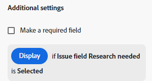
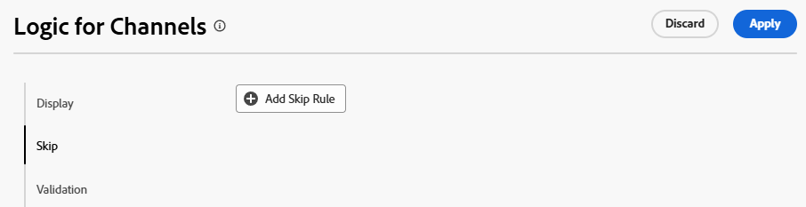
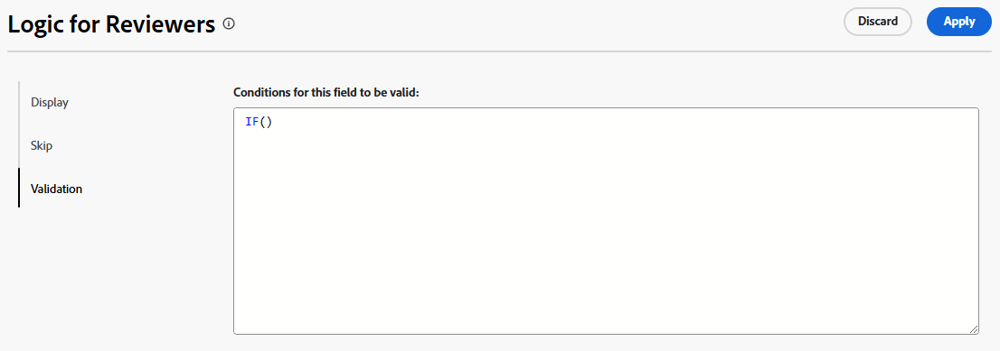
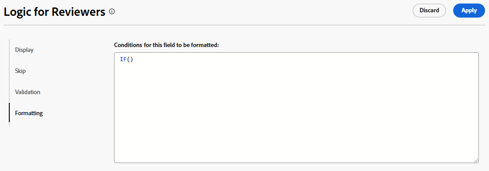

# Logische regels toevoegen aan aangepaste formulieren en velden

Met logische regels kunt u de velden op uw formulier verder aanpassen.

U kunt bijvoorbeeld velden of secties in een aangepast formulier weergeven of overslaan op basis van de keuzes die een gebruiker maakt bij het invullen.

>[!NOTE]
>
>De logica geldt alleen binnen één formulier en kan niet worden gebaseerd op selecties vanuit een ander formulier.

## Toegangsvereisten

+++ Breid uit om de toegangseisen voor de functionaliteit in dit artikel weer te geven.

U moet de volgende toegang hebben om de stappen in dit artikel uit te voeren:

<table style="table-layout:auto"> 
 <col> 
 <col> 
 <tbody> 
  <tr data-mc-conditions=""> 
   <td role="rowheader">Adobe Workfront-plan </td> 
   <td>Alle</td> 
  </tr> 
  <tr> 
   <td role="rowheader">Adobe Workfront-licentie</td> 
   <td>
   <p>Nieuw: Standaard</p>
   <p>of</p>
   <p>Huidig: Plan</p></td> 
  </tr> 
  <tr data-mc-conditions=""> 
   <td role="rowheader">Configuraties op toegangsniveau</td> 
   <td>Administratieve toegang tot aangepaste formulieren </td> 
  </tr>  
 </tbody> 
</table>

Voor meer detail over de informatie in deze lijst, zie [ vereisten van de Toegang in de documentatie van Workfront ](/help/quicksilver/administration-and-setup/add-users/access-levels-and-object-permissions/access-level-requirements-in-documentation.md).

+++

## Logische pictogrammen weergeven en overslaan

Op aangepaste formulieren worden pictogrammen weergegeven die aangeven wanneer de logica voor weergave of overslaan wordt toegepast op bepaalde velden. Pictogrammen op een veld in de formulierontwerper geven aan dat logica wordt toegepast op het veld.

| Pictogram | Locatie in veld in formulierontwerper | Definitie |
|--- |--- |--- |
|  | Linksonder | Het veld is het doelveld voor de weergavelogica. Als een specifieke selectie is aangebracht op het formulier, wordt dit veld weergegeven. |
|  | Rechtsonder | Het veld definieert weergavelogica. Een specifieke selectie of waarde in dit veld geeft het doelveld weer. |
|  | Linksonder | Het veld is het doelveld voor overslaan van logica. Als een specifieke selectie wordt gemaakt op het formulier, slaat het formulier door naar dit veld en worden de tussenliggende velden verborgen. |
|  | Rechtsonder | In dit veld wordt de logica voor overslaan gedefinieerd. Een specifieke selectie of waarde in dit veld slaat andere velden over en gaat rechtstreeks naar het doelveld. |


Selecteer een veld met toegepaste logica om de bestaande logische regels in de veldinstellingen weer te geven.



## Overwegingen bij het gebruik van weergavelogica en het overslaan van logica

* Als u weergavelogica wilt toevoegen aan een aangepast veld, een widget of een sectie-einde, moet ten minste één meerkeuzeveld (keuzerondjes, vervolgkeuzelijst of selectievakjes) vóór dit veld op het formulier worden geplaatst.
Voor informatie over douanegebieden en widgets in douanevormen, zie [ een douanevorm ](/help/quicksilver/administration-and-setup/customize-workfront/create-manage-custom-forms/form-designer/design-a-form/design-a-form.md) creëren.
* U kunt geen logica overslaan toevoegen aan een widget of sectie-einde. U kunt het alleen toevoegen aan een veld met meerdere keuzen (keuzerondjes, vervolgkeuzelijst of selectievakjes).
* U kunt geen weergave- of overslaan-logica toepassen om de keuzes van een veld met meerdere opties weer te geven of te verbergen. U kunt bijvoorbeeld geen beperkingen instellen voor de opties die worden weergegeven voor een vervolgkeuzelijst, een CheckBox-groep of een keuzerondje op basis van de weergave of de logica van een ander veld overslaan.
* U kunt zowel weergavelogica als logica overslaan aan een aangepast veld toevoegen als het volgende geldt voor het aangepaste veld:

   * Het is een meerkeuzeveld (keuzerondjes, vervolgkeuzelijst of selectievakjes)
   * Voorafgegaan door een veld met meerdere keuzen
   * Het wordt gevolgd door een ander aangepast veld

* Wanneer u formulieren kopieert met logica voor weergave of overslaan, wordt de logica gekopieerd naar het nieuwe aangepaste formulier.
* Wanneer u objecten bulksgewijs bewerkt, worden alle aangepaste velden weergegeven in het vak Objecten bewerken, inclusief de overgeslagen of verborgen velden.
* Houd rekening met het volgende wanneer u een weergaveregel voor een aangepast formulier maakt:

   * Aangepaste velden die niet zijn opgenomen in een logische weergave-instructie, worden standaard weergegeven op een aangepast formulier.
   * U kunt logische instructies voor weergave op meerdere velden maken.
   * Als voor alle velden onder een sectie-einde een weergavelogica is toegepast en alle velden zijn verborgen als gevolg van de logica, wordt de volledige sectie verborgen op het aangepaste formulier.

## Weergavelogica toevoegen aan een aangepast formulier

De logica van de vertoning bepaalt welke douanevelden op de vorm verschijnen wanneer de gebruiker een specifieke waarde op een meerkeuzeveld selecteert. De logica wordt toegevoegd aan het doelveld, dat alleen wordt weergegeven wanneer de waarde is geselecteerd.

<!--
>[!NOTE]
>
><span class="preview">This procedure describes the basic mode for display logic. Advanced display logic is also available. For more information, see [Add advanced display logic to a custom form](#add-advanced-display-logic-to-a-custom-form), in this article.</span>
-->

{{step-1-to-setup}}

1. Klik **Aangepaste Forms**.
1. Maak een nieuw aangepast formulier of open een bestaand formulier. Zie [ een douanevorm ](/help/quicksilver/administration-and-setup/customize-workfront/create-manage-custom-forms/form-designer/design-a-form/design-a-form.md) voor details creëren.
1. Voeg zo nodig velden toe aan het formulier. Er moet ten minste één meerkeuzeveld (keuzerondje, vervolgkeuzelijst of selectievakje) worden geplaatst vóór het doelveld dat wordt weergegeven.
1. Selecteer het doelgebied en klik **toevoegen Logica**.
1. Selecteer het **lusje van de Vertoning** op de logische bouwer.
1. Klik **toevoegen de Regel van de Vertoning**.

   

1. Voer de onderstaande stappen uit om de logische instructie in de builder te maken.

   1. De eerste optie is het kiezen van het definiërende veld. Dit is het veld met de selectiewaarde waarin het doel wordt weergegeven. Het moet een meerkeuzeveld zijn.
   1. De tweede optie is het kiezen van de selectiewaarde. Alleen de waarden die al voor dat veld zijn gedefinieerd, zijn beschikbaar.
   1. De derde optie is **Geselecteerd** of **niet Geselecteerd**. Het kiezen van **Geselecteerde** betekent dat wanneer de waarde wordt geselecteerd, het doelgebied wordt getoond. Het kiezen van **niet Geselecteerde** betekent dat wanneer een andere waarde op het definiërende gebied wordt geselecteerd, het doelgebied wordt getoond.
   1. Om een **en** regel aan de logische verklaring toe te voegen, klik **voegt Regel** direct onder de regel toe u enkel creeerde. Volg de zelfde herinneringen om de regel te bouwen. Aan alle regels en moet worden voldaan opdat het doelgebied wordt getoond.

      

   1. Om een **of** regel aan de logische verklaring toe te voegen, klik **voegt Regel** dichtbij de bodem van de logische bouwer toe. Dan, klik **voeg Regel** binnen toe of gebied en volg de zelfde herinneringen om de regel te bouwen. Wanneer één of regel wordt ontmoet, wordt het doelgebied getoond.

1. Klik **toepassen** wanneer u wordt gebeëindigd bouwend de logische verklaring.

   De pictogrammen voor de weergavelogica worden toegevoegd aan het doelveld en het definiërende veld in de formulierontwerper.

<!--
<div class="preview">

## Add advanced display logic to a custom form

The advanced display logic for custom form fields allows you to build complex logic using formulas. You can apply this logic to the following field types: drop-down, radio button, checkbox, typeahead, single line text, paragraph text, date field, text with formatting, and calculated fields.

### Examples

You can use advanced display logic to control the visibility of custom form sections based on user roles and the visibility of a field based on another field's status.

No logic is applied to the default section on the form, so it is always visible to all users.

Using the following condition, the Resources Required section is only displayed when a user with the job role of Resource Manager views the form.

```IF($$USER.{roleID}="123abc", true)```

Note that ```123abc``` represents the role ID of the Resource Manager.


The same condition with a different role ID is applied to the Project Financial KPIs section to define that  only the Financial Advisor role can view the section.

Using the following condition, the Sold KPI field only becomes visible when the project is complete. This logic is applied directly to the field instead of to a form section. There is no need to specify which role can view the field, because that is already defined in the section that the field is in.

```IF({status}="CPL", true)```


### Define advanced display logic

{{step-1-to-setup}}

1. Click **Custom Forms**.
1. Create a new custom form or open an existing form. See [Create a custom form](/help/quicksilver/administration-and-setup/customize-workfront/create-manage-custom-forms/form-designer/design-a-form/design-a-form.md) for details.
1. Add fields to the form as needed.
1. Select the field to apply logic to, and click **Add Logic**.
1. Select the **Display** tab on the logic builder.
1. Turn on **Advanced mode**.
   
   This option might be turned on automatically, for fields that do not support the simple mode of display logic.

   

1. Build the display condition in the editor.

   For more information about calculations and expressions, see [Add calculated fields to a form](/help/quicksilver/administration-and-setup/customize-workfront/create-manage-custom-forms/form-designer/design-a-form/add-a-calculated-field.md) and [Overview of calculated data expressions](/help/quicksilver/reports-and-dashboards/reports/calc-cstm-data-reports/calculated-data-expressions.md).

1. Click **Apply**.
   
   The logic is applied to the field and the display logic icon is added in the form designer.

</div>
-->

## Logica voor overslaan toevoegen aan een aangepast formulier

De logica Overslaan definieert aangepaste formuliervelden die worden overgeslagen wanneer de gebruiker een specifieke waarde in een veld met meerdere keuzes selecteert. Overgeslagen velden worden verborgen op het formulier. De logica wordt toegepast op het definiërende veld waar de selectie is gemaakt, niet op de velden die worden overgeslagen.

{{step-1-to-setup}}

1. Klik **Aangepaste Forms**.
1. Maak een nieuw aangepast formulier of open een bestaand formulier. Zie [ een douanevorm ](/help/quicksilver/administration-and-setup/customize-workfront/create-manage-custom-forms/form-designer/design-a-form/design-a-form.md) voor details creëren.
1. Voeg zo nodig velden toe aan het formulier. Het definiërende gebied voor overslaan logica moet een veelvoudige keuzeveld (radioknoop, dropdown, of controledoos) zijn.
1. Selecteer het definiërende gebied en klik **voegt Logica** op de lagere linkerzijde van het scherm toe.
1. Selecteer het **Skip** lusje op de logische bouwer.
1. Klik **toevoegen Skip Regel**.

   

1. Voer de onderstaande stappen uit om de logische instructie in de builder te maken.

   1. Het definiërende gebied wordt getoond op de bouwer. Het is het veld waarop u de logica voor overslaan hebt geselecteerd.
   1. De eerste optie is het kiezen van de selectiewaarde. Alleen de waarden die al voor het veld zijn gedefinieerd, zijn beschikbaar.
   1. De tweede optie is **Geselecteerd** of **niet Geselecteerd**. Het kiezen van **Geselecteerde** betekent dat wanneer de waarde wordt geselecteerd, het doelgebied wordt getoond en de gebieden binnen tussen worden overgeslagen. Het kiezen van **niet Geselecteerde** betekent dat wanneer een andere waarde op het definiërende gebied wordt geselecteerd, het doelgebied wordt getoond en de gebieden binnen tussen worden overgeslagen.
   1. De derde optie is het doelveld, of waar u wilt overslaan. Selecteer een gebiedsnaam of **Eind van vorm**. Mogelijk moet u eerst op het woord &quot;leeg&quot; klikken voordat u een optie selecteert.

      

   1. Om een **of** regel aan de logische verklaring toe te voegen, klik **voegt Regel** dichtbij de bodem van de logische bouwer toe. Selecteer vervolgens de opties volgens dezelfde aanwijzingen om de regel te maken. Wanneer één **of** regel wordt ontmoet, wordt het doelgebied getoond.

1. Klik **toepassen** wanneer u wordt gebeëindigd bouwend de logische verklaring.

   De pictogrammen voor logicaoverslaan worden toegevoegd aan het doelveld en het definiërende veld in de formulierontwerper.

## Validatielogica toevoegen aan een aangepast formulier

Validatielogica wordt samengesteld met behulp van formules en u kunt de logica zo eenvoudig of zo complex maken als u nodig hebt. De validatie kan worden gebaseerd op de waarden van andere velden of de status van objecten. U kunt een foutbericht weergeven wanneer de validatie mislukt.

Als het veld met de toegepaste logica voldoet aan de gedefinieerde validatievoorwaarden wanneer een gebruiker het aangepaste formulier invult, wordt het veld gemarkeerd en wordt het foutbericht weergegeven.

U kunt validatielogica toepassen op de volgende veldtypen: tekst op één regel, alinea, vervolgkeuzelijst met één regel, vervolgkeuzelijst met meerdere selecties, externe zoekopdracht, typekop, datum, groep selectievakjes en keuzerondjes.

### Voorbeelden

Gebruikend de volgende voorwaarde, toont het gebied van de Begroting een bericht onder het gebied wanneer de gebruiker een waarde ingaat die het bericht teweegbrengt. Als de ingevoerde waarde bijvoorbeeld negatief is, wordt het eerste bericht weergegeven. Als de gebruiker probeert om de projectstatus in Huidig te veranderen alvorens een begrotingswaarde in te gaan, wordt het tweede bericht getoond.

```
IF({DE:Budget Field} < 0,
     "Budget cannot be negative",
     IF({DE:Budget Field} == 0 && {status} == "CUR", "Budget must be specified before moving to Current status")
)
```

Een ander eenvoudig voorbeeld is dat een veld voor een telefoonnummer een bepaald aantal cijfers moet bevatten om geldig te zijn.

Een aanvullend voorbeeld voor validatie op basis van andere velden is een veld voor de grootte van de vergaderruimte (klein, gemiddeld of groot) en een apart veld voor het aantal deelnemers aan de vergadering. Het aantal personen voor elke grootte van de ruimte wordt geschreven in de validatieformule. Als het aantal deelnemers dat de gebruiker invoert, te groot is voor de gekozen vergaderruimte, wordt het foutbericht weergegeven.

Voor extra voorbeelden van bevestigingslogica, zie [ Voorbeelden van geavanceerde logica in douaneformulieren ](/help/quicksilver/administration-and-setup/customize-workfront/create-manage-custom-forms/form-designer/design-a-form/advanced-logic-examples.md).

### Validatielogica definiëren

{{step-1-to-setup}}

1. Klik **Aangepaste Forms**.
1. Maak een nieuw aangepast formulier of open een bestaand formulier. Zie [ een douanevorm ](/help/quicksilver/administration-and-setup/customize-workfront/create-manage-custom-forms/form-designer/design-a-form/design-a-form.md) voor details creëren.
1. Voeg zo nodig velden toe aan het formulier.
1. Selecteer het gebied om logica op toe te passen, en **te klikken voegt Logica** toe.
1. Selecteer het **lusje van de Bevestiging** op de logische bouwer.

   

1. Bouw de bevestigingsvoorwaarde in de redacteur, met inbegrip van het foutenmelding om te tonen wanneer de bevestiging niet wordt voldaan aan.

   Voor meer informatie over berekeningen en uitdrukkingen, zie [ berekende gebieden aan een vorm ](/help/quicksilver/administration-and-setup/customize-workfront/create-manage-custom-forms/form-designer/design-a-form/add-a-calculated-field.md) en [ Overzicht van berekende gegevensuitdrukkingen ](/help/quicksilver/reports-and-dashboards/reports/calc-cstm-data-reports/calculated-data-expressions.md) toevoegen.

1. Klik **toepassen**.

   De logica wordt toegepast op het veld in de formulierontwerper.

   >[!NOTE]
   >
   >Validatielogica wordt niet ondersteund in de voorbeeldmodus van de formulierontwerper.

<!--
<div class="preview">

## Add formatting logic to a custom form

Formatting logic highlights a field value when it meets the defined conditions. The applied formatting will work on multiple fields at once.

You can apply formatting logic to the following field types: single line text, paragraph, single-select dropdown, multi-select dropdown, external lookup, typeahead, calculated, date, checkbox group, and radio buttons.

Formatting applied to custom forms is separate from formatting applied to lists and reports. For information on report formatting, see [Use conditional formatting in views](/help/quicksilver/reports-and-dashboards/reports/reporting-elements/use-conditional-formatting-views.md).

### Example

Using the following condition, the Budget field appears red when the user enters a value of 1000 or more. The field appears yellow when the user enters a value of 500 or more.

To add a hover-over definition of the formatting, use the Instructions field in the custom form. For example, a message on the Budget field could say "Please enter a budget within a reasonable range. Values over 500 are a warning notice, and above 1000 is considered too high."

```
IF(
     {DE:Budget Field} >=1000,
     FORMAT($$NEGATIVE),
     IF({DE:Budget Field} >= 500, FORMAT($$NOTICE))
)
```

### Define formatting logic

{{step-1-to-setup}}

1. Click **Custom Forms**.
1. Create a new custom form or open an existing form. See [Create a custom form](/help/quicksilver/administration-and-setup/customize-workfront/create-manage-custom-forms/form-designer/design-a-form/design-a-form.md) for details.
1. Add fields to the form as needed.
1. Select the field to apply logic to, and click **Add Logic**.
1. Select the **Formatting** tab on the logic builder.

   

1. Build the formatting condition in the editor.

   You can add up to five formatting rules per field.

   The field highlighting color options are:

   * `$$POSITIVE (green)`
   * `$$INFORMATIVE (blue)`
   * `$$NEGATIVE (red)`
   * `$$NOTICE (orange)`
   
   The text formatting options are:
   
   * `$$BOLD`
   * `$$ITALIC`
   * `$$UNDERLINE`

   Only one color option may be used per function, along with up to three additional text formatting options. If no color option is specified, the system's default color is applied.

   For more information about calculations and expressions, see [Add calculated fields to a form](/help/quicksilver/administration-and-setup/customize-workfront/create-manage-custom-forms/form-designer/design-a-form/add-a-calculated-field.md) and [Overview of calculated data expressions](/help/quicksilver/reports-and-dashboards/reports/calc-cstm-data-reports/calculated-data-expressions.md).

1. Click **Apply**.
   
   The logic is applied to the field in the form designer.

</div>
-->
