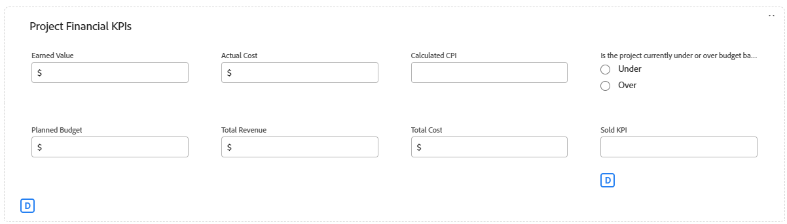
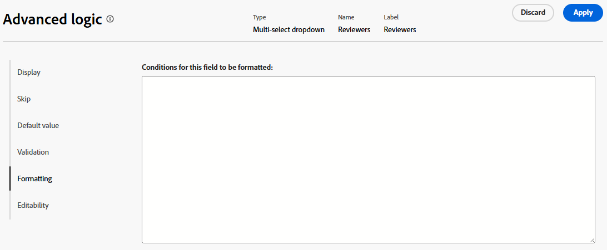

# Logische regels toevoegen aan aangepaste formulieren en velden

Met logische regels kunt u de velden op uw formulier verder aanpassen.

U kunt bijvoorbeeld velden of secties in een aangepast formulier weergeven of overslaan op basis van de keuzes die een gebruiker maakt bij het invullen.

>[!NOTE]
>
>De logica geldt alleen binnen één formulier en kan niet worden gebaseerd op selecties vanuit een ander formulier.

## Toegangsvereisten

+++ Breid uit om de toegangseisen voor de functionaliteit in dit artikel weer te geven.

<table style="table-layout:auto"> 
 <col> 
 <col> 
 <tbody> 
  <tr> 
   <td>Adobe Workfront-pakket</td> 
   <td> <p>Geavanceerde weergave-, standaardwaarde-, voorwaardelijke opmaak- of bewerkbaarheidslogica toepassen: Workflow Prime of hoger</p>
         <p>Alle andere typen logica toepassen: elk Workfront- of workflowpakket</p> </td> 
  </tr> 
  <tr> 
   <td>Adobe Workfront-licentie</td> 
   <td><p>Standard</p>
       <p>Plan</p></td>
  </tr> 
  <tr> 
   <td>Configuraties op toegangsniveau</td> 
   <td> <p>Administratieve toegang tot aangepaste formulieren</p> </td> 
  </tr>  
 </tbody> 
</table>

Voor informatie, zie [ vereisten van de Toegang in de documentatie van Workfront ](/help/quicksilver/administration-and-setup/add-users/access-levels-and-object-permissions/access-level-requirements-in-documentation.md).

+++

## Pictogrammen voor logische indicatoren

Op aangepaste formulieren worden pictogrammen weergegeven om aan te geven wanneer logica wordt toegepast op de velden.

Klik **tonen logica** in de kopbal van de vormontwerper om de pictogrammen voor de verschillende types van gebiedslogica te tonen of te verbergen.

| Pictogram | Definitie |
| --- | --- |
|  | Het veld is het doelveld waarop de weergaverelogica wordt toegepast. Als een specifieke selectie is aangebracht op het formulier, wordt dit veld weergegeven. |
|  | Het veld is het referentieveld voor de weergavelogica. Een specifieke selectie of waarde in dit veld geeft het doelveld weer. |
|  | Het veld is het doelveld waarin de logica voor overslaan wordt toegepast. Een specifieke selectie of waarde in dit veld slaat andere velden over en gaat rechtstreeks naar het verwijzingsveld. |
|  | Het veld is het referentieveld voor overslaan van logica. Als een specifieke selectie is gemaakt in het doelveld, slaat het formulier door naar dit veld en worden de tussenliggende velden verborgen. |
|  | Het veld is het doelveld waarin de validatielogica wordt toegepast. Een specifieke selectie of waarde in het referentieveld bepaalt of de validatie mislukt. Het doelveld en het referentieveld kunnen hetzelfde zijn voor validatielogica. |
|  | Het veld is het referentieveld voor validatielogica. Een specifieke selectie of waarde in dit veld bepaalt of de validatie in het doelveld mislukt. Het doelveld en het referentieveld kunnen hetzelfde zijn voor validatielogica. |
|  | Het veld is het doelveld waarop de logica voor de standaardwaarde wordt toegepast. De standaardwaarde wordt bepaald door een specifieke selectie of waarde in het referentieveld. Het doelveld en het referentieveld kunnen hetzelfde zijn voor de logica van de standaardwaarde. |
|  | Het veld is het referentieveld voor de logica van de standaardwaarde. Een specifieke selectie of waarde in dit veld bepaalt de standaardwaarde in het doelveld. Het doelveld en het referentieveld kunnen hetzelfde zijn voor de logica van de standaardwaarde. |
|  | Het veld is het doelveld waarop opmaaklogica wordt toegepast. De opmaak wordt bepaald door een specifieke selectie of waarde in het referentieveld. Het doelveld en het referentieveld kunnen hetzelfde zijn voor de opmaaklogica. |
|  | Het veld is het referentieveld voor de opmaaklogica. Een specifieke selectie of waarde in dit veld bepaalt de opmaak in het doelveld. Het doelveld en het referentieveld kunnen hetzelfde zijn voor de opmaaklogica. |
|  | Het veld is het doelveld waarop de bewerkbaarheidslogica wordt toegepast. Het veld kan bewerkbaar of alleen-lezen zijn als aan de gedefinieerde voorwaarden is voldaan. Het doelveld en het referentieveld kunnen hetzelfde zijn voor logica van bewerkbaarheid. |
|  | Het veld is het referentieveld voor bewerkbaarheidslogica. Wanneer aan de gedefinieerde voorwaarden op dit veld wordt voldaan, wordt de logica toegepast op het doelveld. Het doelveld en het referentieveld kunnen hetzelfde zijn voor logica van bewerkbaarheid. |

[Logische pictogrammen](assets/custom-form-logic-icon-samples.png)

Alleen voor weergave en logica overslaan selecteert u een veld waarin de bestaande logische regels in de veldinstellingen worden weergegeven.


## Overwegingen bij het gebruik van weergavelogica en het overslaan van logica

* Als u weergavelogica wilt toevoegen aan een aangepast veld, een widget of een sectie-einde, moet ten minste één meerkeuzeveld (keuzerondjes, vervolgkeuzelijst of selectievakjes) vóór dit veld op het formulier worden geplaatst.
Voor informatie over douanegebieden en widgets in douanevormen, zie [ een douanevorm ](/help/quicksilver/administration-and-setup/customize-workfront/create-manage-custom-forms/form-designer/design-a-form/design-a-form.md) creëren.
* U kunt geen logica overslaan toevoegen aan een widget of sectie-einde. U kunt het alleen toevoegen aan een veld met meerdere keuzen (keuzerondjes, vervolgkeuzelijst of selectievakjes).
* U kunt geen weergave- of overslaan-logica toepassen om de keuzes van een veld met meerdere opties weer te geven of te verbergen. U kunt bijvoorbeeld geen beperkingen instellen voor de opties die worden weergegeven voor een vervolgkeuzelijst, een CheckBox-groep of een keuzerondje op basis van de weergave of de logica van een ander veld overslaan.
* U kunt zowel weergavelogica als logica overslaan aan een aangepast veld toevoegen als het volgende geldt voor het aangepaste veld:

   * Het is een meerkeuzeveld (keuzerondjes, vervolgkeuzelijst of selectievakjes)
   * Voorafgegaan door een veld met meerdere keuzen
   * Het wordt gevolgd door een ander aangepast veld

* Wanneer u formulieren kopieert met logica voor weergave of overslaan, wordt de logica gekopieerd naar het nieuwe aangepaste formulier.
* Wanneer u objecten bulksgewijs bewerkt, worden alle aangepaste velden weergegeven in het vak Objecten bewerken, inclusief de overgeslagen of verborgen velden.
* Houd rekening met het volgende wanneer u een weergaveregel voor een aangepast formulier maakt:

   * Aangepaste velden die niet zijn opgenomen in een logische weergave-instructie, worden standaard weergegeven op een aangepast formulier.
   * U kunt logische instructies voor weergave op meerdere velden maken.
   * Als voor alle velden onder een sectie-einde een weergavelogica is toegepast en alle velden zijn verborgen als gevolg van de logica, wordt de volledige sectie verborgen op het aangepaste formulier.

## Weergavelogica toevoegen aan een aangepast formulier

De logica van de vertoning bepaalt welke douanevelden op de vorm verschijnen wanneer de gebruiker een specifieke waarde op een meerkeuzeveld selecteert. De logica wordt toegevoegd aan het doelveld, dat alleen wordt weergegeven wanneer de waarde is geselecteerd.

>[!NOTE]
>
>Deze procedure beschrijft de basiswijze voor vertoningslogica. De geavanceerde weergaverelogica is ook beschikbaar. Voor meer informatie, zie [ geavanceerde vertoningslogica aan een douanevorm ](#add-advanced-display-logic-to-a-custom-form) toevoegen, in dit artikel.

{{step-1-to-setup}}

1. Klik **Aangepaste Forms**.
1. Maak een nieuw aangepast formulier of open een bestaand formulier. Zie [ een douanevorm ](/help/quicksilver/administration-and-setup/customize-workfront/create-manage-custom-forms/form-designer/design-a-form/design-a-form.md) voor details creëren.
1. Voeg zo nodig velden toe aan het formulier. Er moet ten minste één meerkeuzeveld (keuzerondje, vervolgkeuzelijst of selectievakje) worden geplaatst vóór het doelveld dat wordt weergegeven.
1. Selecteer het doelgebied en klik **toevoegen Logica**.
1. Selecteer het **lusje van de Vertoning** op de logische bouwer.
1. Klik **toevoegen de Regel van de Vertoning**.

   

1. Voer de onderstaande stappen uit om de logische instructie in de builder te maken.

   1. De eerste optie is het kiezen van het definiërende veld. Dit is het veld met de selectiewaarde waarin het doel wordt weergegeven. Het moet een meerkeuzeveld zijn.
   1. De tweede optie is het kiezen van de selectiewaarde. Alleen de waarden die al voor dat veld zijn gedefinieerd, zijn beschikbaar.
   1. De derde optie is **Geselecteerd** of **niet Geselecteerd**. Het kiezen van **Geselecteerde** betekent dat wanneer de waarde wordt geselecteerd, het doelgebied wordt getoond. Het kiezen van **niet Geselecteerde** betekent dat wanneer een andere waarde op het definiërende gebied wordt geselecteerd, het doelgebied wordt getoond.
   1. Om een **en** regel aan de logische verklaring toe te voegen, klik **voegt Regel** direct onder de regel toe u enkel creeerde. Volg de zelfde herinneringen om de regel te bouwen. Aan alle regels en moet worden voldaan opdat het doelgebied wordt getoond.

      

   1. Om een **of** regel aan de logische verklaring toe te voegen, klik **voegt Regel** dichtbij de bodem van de logische bouwer toe. Dan, klik **voeg Regel** binnen toe of gebied en volg de zelfde herinneringen om de regel te bouwen. Wanneer één of regel wordt ontmoet, wordt het doelgebied getoond.

1. Klik **toepassen** wanneer u wordt gebeëindigd bouwend de logische verklaring.

   De logica wordt toegepast en de logische pictogrammen worden toegevoegd aan het doelveld en het verwijzingsveld in de formulierontwerper.

## Geavanceerde weergavelogica toevoegen aan een aangepast formulier

Met de geavanceerde weergaverelogica voor aangepaste formuliervelden kunt u complexe logica maken met behulp van formules. U kunt deze logica op de volgende gebiedstypes toepassen: enige lijntekst, paragraaf, tekst met het formatteren, enig-uitgezochte drop-down, multi-select drop-down, externe raadpleging, multi-select externe raadpleging, inheemse gebiedsverwijzing, typeahead, berekende, datum, checkbox groep, en radioknopen.

>[!NOTE]
>
>Deze procedure beschrijft de geavanceerde wijze voor vertoningslogica. De standaardweergaverogica is ook beschikbaar. Voor meer informatie, zie [ vertoningslogica aan een douanevorm ](#add-display-logic-to-a-custom-form), in dit artikel toevoegen.

### Voorbeelden

U kunt geavanceerde weergaverelogica gebruiken om de zichtbaarheid van aangepaste formuliersecties te bepalen op basis van gebruikersrollen en de zichtbaarheid van een veld op basis van de status van een ander veld.

Er wordt geen logica toegepast op de standaardsectie op het formulier, zodat deze altijd zichtbaar is voor alle gebruikers.

Met de volgende voorwaarde wordt de sectie Bronnen vereist alleen weergegeven wanneer een gebruiker met de taakrol van Resource Manager het formulier weergeeft.

```IF($$USER.{roleID}="123abc", true)```

Merk op dat ```123abc``` de rolidentiteitskaart van de Manager van het Middel vertegenwoordigt.


De zelfde voorwaarde met een verschillende rolidentiteitskaart wordt toegepast op de sectie van KPIs van het Project om te bepalen dat slechts de rol van de financieel adviseur de sectie kan bekijken.

Gebruikend de volgende voorwaarde, wordt het Verkocht KPI gebied slechts zichtbaar wanneer het project volledig is. Deze logica wordt rechtstreeks toegepast op het veld in plaats van op een formuliersectie. Het is niet nodig op te geven welke rol het veld kan worden weergegeven, omdat dat al is gedefinieerd in de sectie waarin het veld zich bevindt.

```IF({status}="CPL", true)```



### Geavanceerde weergavelogica definiëren

{{step-1-to-setup}}

1. Klik **Aangepaste Forms**.
1. Maak een nieuw aangepast formulier of open een bestaand formulier. Zie [ een douanevorm ](/help/quicksilver/administration-and-setup/customize-workfront/create-manage-custom-forms/form-designer/design-a-form/design-a-form.md) voor details creëren.
1. Voeg zo nodig velden toe aan het formulier.
1. Selecteer het gebied om logica op toe te passen, en **te klikken voegt Logica** toe.
1. Selecteer het **lusje van de Vertoning** op de logische bouwer.
1. Zet **Geavanceerde wijze** aan.

   Deze optie kan automatisch worden ingeschakeld voor veldtypen die de logica van de eenvoudige weergavemodus niet ondersteunen.

   

1. Bouw de vertoningsvoorwaarde in de redacteur.

   Voor meer informatie over berekeningen en uitdrukkingen, zie [ berekende gebieden aan een vorm ](/help/quicksilver/administration-and-setup/customize-workfront/create-manage-custom-forms/form-designer/design-a-form/add-a-calculated-field.md) en [ Overzicht van berekende gegevensuitdrukkingen ](/help/quicksilver/reports-and-dashboards/reports/calc-cstm-data-reports/calculated-data-expressions.md) toevoegen.

1. Klik **toepassen**.

   De logica wordt toegepast en de logische pictogrammen worden toegevoegd aan het doelveld en het verwijzingsveld in de formulierontwerper.

   >[!NOTE]
   >
   >Geavanceerde weergavelogica wordt niet ondersteund in de voorbeeldmodus van de formulierontwerper.

## Logica voor overslaan toevoegen aan een aangepast formulier

De logica Overslaan definieert aangepaste formuliervelden die worden overgeslagen wanneer de gebruiker een specifieke waarde in een veld met meerdere keuzes selecteert. Overgeslagen velden worden verborgen op het formulier. De logica wordt toegepast op het definiërende veld waar de selectie is gemaakt, niet op de velden die worden overgeslagen.

{{step-1-to-setup}}

1. Klik **Aangepaste Forms**.
1. Maak een nieuw aangepast formulier of open een bestaand formulier. Zie [ een douanevorm ](/help/quicksilver/administration-and-setup/customize-workfront/create-manage-custom-forms/form-designer/design-a-form/design-a-form.md) voor details creëren.
1. Voeg zo nodig velden toe aan het formulier. Het definiërende gebied voor overslaan logica moet een veelvoudige keuzeveld (radioknoop, dropdown, of controledoos) zijn.
1. Selecteer het definiërende gebied en klik **voegt Logica** op de lagere linkerzijde van het scherm toe.
1. Selecteer het **Skip** lusje op de logische bouwer.
1. Klik **toevoegen Skip Regel**.

   

1. Voer de onderstaande stappen uit om de logische instructie in de builder te maken.

   1. Het definiërende gebied wordt getoond op de bouwer. Het is het veld waarop u de logica voor overslaan hebt geselecteerd.
   1. De eerste optie is het kiezen van de selectiewaarde. Alleen de waarden die al voor het veld zijn gedefinieerd, zijn beschikbaar.
   1. De tweede optie is **Geselecteerd** of **niet Geselecteerd**. Het kiezen van **Geselecteerde** betekent dat wanneer de waarde wordt geselecteerd, het doelgebied wordt getoond en de gebieden binnen tussen worden overgeslagen. Het kiezen van **niet Geselecteerde** betekent dat wanneer een andere waarde op het definiërende gebied wordt geselecteerd, het doelgebied wordt getoond en de gebieden binnen tussen worden overgeslagen.
   1. De derde optie is het doelveld, of waar u wilt overslaan. Selecteer een gebiedsnaam of **Eind van vorm**. Mogelijk moet u eerst op het woord &quot;leeg&quot; klikken voordat u een optie selecteert.

      

   1. Om een **of** regel aan de logische verklaring toe te voegen, klik **voegt Regel** dichtbij de bodem van de logische bouwer toe. Selecteer vervolgens de opties volgens dezelfde aanwijzingen om de regel te maken. Wanneer één **of** regel wordt ontmoet, wordt het doelgebied getoond.

1. Klik **toepassen** wanneer u wordt gebeëindigd bouwend de logische verklaring.

   De logica wordt toegepast en de logische pictogrammen worden toegevoegd aan het doelveld en het verwijzingsveld in de formulierontwerper.

## Standaardwaardecultuur toevoegen aan een aangepast formulier

Met de logica van de standaardwaarde kunt u standaardwaarden voor aangepaste formuliervelden configureren met behulp van formules. De standaardwaarde wordt weergegeven wanneer aan de gedefinieerde voorwaarden wordt voldaan. Een standaardwaarde kan een statische waarde zijn of een dynamische waarde die naar andere velden in het object verwijst. Hoewel de standaardwaarde naar andere velden kan verwijzen, verandert deze waarde niet naarmate andere velden op het formulier veranderen.

U kunt geavanceerde logica voor de standaardwaarde op de volgende gebiedstypes toepassen: enige lijntekst, paragraaf, enig-uitgezochte dropdown, multi-uitgezochte dropdown, externe raadpleging, multi-uitgezochte externe raadpleging. Native veldverwijzing, typeahead, groep selectievakjes en keuzerondjes.

>[!TIP]
>
>Een standaardwaarde wordt slechts eenmaal toegepast op een aangepast veld, wanneer het aangepaste formulier aan het object wordt gekoppeld. Als de standaardwaardeformule afhankelijk is van de waarde van een ander veld, moet de waarde in het andere veld al bestaan wanneer het aangepaste formulier wordt bijgevoegd.

>[!NOTE]
>
>Standaard logica voor de standaardwaarde in de formulierontwerper bestaat nog steeds. Als beide typen op hetzelfde veld worden toegepast, krijgt de geavanceerde logica voorrang. Voor informatie over standaardwaardelogica, zie [ radioknopen, checkbox groepen, en drop-down ](/help/quicksilver/administration-and-setup/customize-workfront/create-manage-custom-forms/form-designer/design-a-form/design-a-form.md#add-radio-buttons-checkbox-groups-and-drop-downs) in [ een douaneformulier ](/help/quicksilver/administration-and-setup/customize-workfront/create-manage-custom-forms/form-designer/design-a-form/design-a-form.md) creëren.

### Voorbeeld

Gebruikend de volgende formule, zal het multi-uitgezochte dropdown gebied waarop de logica wordt toegepast zijn standaardwaarde van de projectbeschrijving trekken wanneer de projectstatus Planning is.

```
IF({status} = 'PLN', ARRAY({description}, ','))
```

Wanneer de douanevorm aan een project in bijlage is en de projectstatus Planning is, dan wordt de het gebiedswaarde van de projectbeschrijving gebruikt als standaardwaarde op multi-select gebied. Omdat het een multi-select gebied is, kunnen meer dan één waarde binnen worden getrokken wanneer de waarden aan de beschrijving aanpassen. Als de beschrijvingswaarde niet overeenkomt met een van de opties voor een multi-select-waarde, heeft het veld met meerdere selecties geen standaardwaarde en kan de gebruiker een waarde selecteren in het vervolgkeuzemenu.

### Definieer de logica voor de standaardwaarde

1. Klik **Aangepaste Forms**.
1. Maak een nieuw aangepast formulier of open een bestaand formulier. Zie [ een douanevorm ](/help/quicksilver/administration-and-setup/customize-workfront/create-manage-custom-forms/form-designer/design-a-form/design-a-form.md) voor details creëren.
1. Voeg zo nodig velden toe aan het formulier.
1. Selecteer het gebied om logica op toe te passen, en **te klikken voegt Logica** toe.
1. Selecteer het **Standaardwaarde** lusje op de logische bouwer.

   

1. Bouw de standaardwaardevoorwaarde in de redacteur.

   Voor meer informatie over berekeningen en uitdrukkingen, zie [ berekende gebieden aan een vorm ](/help/quicksilver/administration-and-setup/customize-workfront/create-manage-custom-forms/form-designer/design-a-form/add-a-calculated-field.md) en [ Overzicht van berekende gegevensuitdrukkingen ](/help/quicksilver/reports-and-dashboards/reports/calc-cstm-data-reports/calculated-data-expressions.md) toevoegen.

1. Klik **toepassen**.

   De logica wordt toegepast en de logische pictogrammen worden toegevoegd aan het doelveld en het verwijzingsveld in de formulierontwerper.

   >[!NOTE]
   >
   >De logica van de standaardwaarde wordt niet ondersteund in de voorbeeldmodus van de formulierontwerper.

## Validatielogica toevoegen aan een aangepast formulier

Validatielogica wordt samengesteld met behulp van formules en u kunt de logica zo eenvoudig of zo complex maken als u nodig hebt. De validatie kan worden gebaseerd op de waarden van andere velden of de status van objecten. U kunt een foutbericht weergeven wanneer de validatie mislukt.

Als het veld met de toegepaste logica voldoet aan de gedefinieerde validatievoorwaarden wanneer een gebruiker het aangepaste formulier invult, wordt het veld gemarkeerd en wordt het foutbericht weergegeven.

U kunt validatielogica toepassen op de volgende veldtypen: tekst op één regel, alinea, vervolgkeuzelijst met één regel, vervolgkeuzelijst met meerdere selecties, externe zoekopdracht, externe zoekopdracht met meerdere selecties, typekop, datum, groep selectievakjes en keuzerondjes.

### Voorbeelden

Gebruikend de volgende voorwaarde, toont het gebied van de Begroting een bericht onder het gebied wanneer de gebruiker een waarde ingaat die het bericht teweegbrengt. Als de ingevoerde waarde bijvoorbeeld negatief is, wordt het eerste bericht weergegeven. Als de gebruiker probeert om de projectstatus in Huidig te veranderen alvorens een begrotingswaarde in te gaan, wordt het tweede bericht getoond.

```
IF({DE:Budget Field} < 0,
     "Budget cannot be negative",
     IF({DE:Budget Field} == 0 && {status} == "CUR", "Budget must be specified before moving to Current status")
)
```

Een ander eenvoudig voorbeeld is dat een veld voor een telefoonnummer een bepaald aantal cijfers moet bevatten om geldig te zijn.

Een aanvullend voorbeeld voor validatie op basis van andere velden is een veld voor de grootte van de vergaderruimte (klein, gemiddeld of groot) en een apart veld voor het aantal deelnemers aan de vergadering. Het aantal personen voor elke grootte van de ruimte wordt geschreven in de validatieformule. Als het aantal deelnemers dat de gebruiker invoert, te groot is voor de gekozen vergaderruimte, wordt het foutbericht weergegeven.

Voor extra voorbeelden van bevestigingslogica, zie [ Voorbeelden van geavanceerde logica in douaneformulieren ](/help/quicksilver/administration-and-setup/customize-workfront/create-manage-custom-forms/form-designer/design-a-form/advanced-logic-examples.md).

### Validatielogica definiëren

{{step-1-to-setup}}

1. Klik **Aangepaste Forms**.
1. Maak een nieuw aangepast formulier of open een bestaand formulier. Zie [ een douanevorm ](/help/quicksilver/administration-and-setup/customize-workfront/create-manage-custom-forms/form-designer/design-a-form/design-a-form.md) voor details creëren.
1. Voeg zo nodig velden toe aan het formulier.
1. Selecteer het gebied om logica op toe te passen, en **te klikken voegt Logica** toe.
1. Selecteer het **lusje van de Bevestiging** op de logische bouwer.

   

1. Bouw de bevestigingsvoorwaarde in de redacteur, met inbegrip van het foutenmelding om te tonen wanneer de bevestiging niet wordt voldaan aan.

   Voor meer informatie over berekeningen en uitdrukkingen, zie [ berekende gebieden aan een vorm ](/help/quicksilver/administration-and-setup/customize-workfront/create-manage-custom-forms/form-designer/design-a-form/add-a-calculated-field.md) en [ Overzicht van berekende gegevensuitdrukkingen ](/help/quicksilver/reports-and-dashboards/reports/calc-cstm-data-reports/calculated-data-expressions.md) toevoegen.

1. Klik **toepassen**.

   De logica wordt toegepast en de logische pictogrammen worden toegevoegd aan het doelveld en het verwijzingsveld in de formulierontwerper.

   >[!NOTE]
   >
   >Validatielogica wordt niet ondersteund in de voorbeeldmodus van de formulierontwerper.

## Opmaaklogica toevoegen aan een aangepast formulier

Opmaaklogica markeert een veldwaarde wanneer deze aan de gedefinieerde voorwaarden voldoet. De toegepaste opmaak werkt op meerdere velden tegelijk.

U kunt opmaaklogica toepassen op de volgende veldtypen: tekst op één regel, alinea, vervolgkeuzelijst met één regel, vervolgkeuzelijst met meerdere selecties, externe zoekopdracht, externe zoekopdracht met meerdere selecties, typekop, berekend op datum, groep selectievakjes en keuzerondjes.

Opmaak die wordt toegepast op aangepaste formulieren staat los van opmaak die wordt toegepast op lijsten en rapporten. Voor informatie bij rapport het formatteren, zie [ Voorwaardelijk het gebruiken formatteren in meningen ](/help/quicksilver/reports-and-dashboards/reports/reporting-elements/use-conditional-formatting-views.md).

### Voorbeeld

Met de volgende voorwaarde wordt het veld Begroting rood weergegeven wanneer de gebruiker een waarde van 1000 of meer invoert. Het veld wordt geel weergegeven wanneer de gebruiker een waarde van 500 of meer invoert.

Gebruik het veld Instructies in het aangepaste formulier als u een overzwevende definitie van de opmaak wilt toevoegen. Een bericht op het veld Begroting zou bijvoorbeeld kunnen luiden: &quot;Voer binnen een redelijke marge een begroting in. Waarden hoger dan 500 zijn een waarschuwingsbericht en hoger dan 1000 wordt als te hoog beschouwd.&quot;

```
IF(
     {DE:Budget Field} >=1000,
     FORMAT($$NEGATIVE),
     IF({DE:Budget Field} >= 500, FORMAT($$NOTICE))
)
```

### Opmaaklogica definiëren

{{step-1-to-setup}}

1. Klik **Aangepaste Forms**.
1. Maak een nieuw aangepast formulier of open een bestaand formulier. Zie [ een douanevorm ](/help/quicksilver/administration-and-setup/customize-workfront/create-manage-custom-forms/form-designer/design-a-form/design-a-form.md) voor details creëren.
1. Voeg zo nodig velden toe aan het formulier.
1. Selecteer het gebied om logica op toe te passen, en **te klikken voegt Logica** toe.
1. Selecteer het **Formatterende** lusje op de logische bouwer.

   

1. Bouw de het formatteren voorwaarde in de redacteur.

   U kunt maximaal vijf opmaakregels per veld toevoegen.

   De volgende kleuropties voor de veldmarkering zijn beschikbaar:

   * `$$POSITIVE (green)`
   * `$$INFORMATIVE (blue)`
   * `$$NEGATIVE (red)`
   * `$$NOTICE (orange)`

   De opties voor tekstopmaak zijn:

   * `$$BOLD`
   * `$$ITALIC`
   * `$$UNDERLINE`

   Per functie mag slechts één kleuroptie worden gebruikt, samen met maximaal drie extra tekstopmaakopties. Als er geen kleuroptie is opgegeven, wordt de standaardkleur van het systeem toegepast.

   Voor meer informatie over berekeningen en uitdrukkingen, zie [ berekende gebieden aan een vorm ](/help/quicksilver/administration-and-setup/customize-workfront/create-manage-custom-forms/form-designer/design-a-form/add-a-calculated-field.md) en [ Overzicht van berekende gegevensuitdrukkingen ](/help/quicksilver/reports-and-dashboards/reports/calc-cstm-data-reports/calculated-data-expressions.md) toevoegen.

1. Klik **toepassen**.

   De logica wordt toegepast en de logische pictogrammen worden toegevoegd aan het doelveld en het verwijzingsveld in de formulierontwerper.

   >[!NOTE]
   >
   >Opmaaklogica wordt niet ondersteund in de voorbeeldmodus van de formulierontwerper.

## Bewerkbaarheidslogica toevoegen aan een aangepast formulier

Met de logica voor bewerkbaarheid wordt bepaald of een aangepast formulierveld kan worden bewerkt of alleen-lezen. Deze logica wordt gemaakt met formules en als het veld voldoet aan de gedefinieerde voorwaarden, kan het worden ingesteld als bewerkbaar of alleen-lezen.

U kunt bewerkbaarheidslogica toepassen op de volgende veldtypen: tekst op één regel, alinea, tekst met opmaak, vervolgkeuzelijst met één regel, vervolgkeuzelijst met meerdere selecties, externe zoekopdracht, externe zoekopdracht met meerdere selecties, typekop, datum, groep selectievakjes en keuzerondjes.

### Voorbeeld

Met de volgende formule is het veld met toegepaste logica alleen bewerkbaar wanneer in een ander veld met de naam Radio de optie Ingeschakeld is geselecteerd.

```
IF({DE:Radio} = "Enabled", true)
```

Met de volgende formule kan het veld Beschrijving alleen worden bewerkt als het leeg is. Zodra een waarde is ingegaan, dan wordt het read-only.

```
IF(ISBLANK({DE:Description}), true)
```

Met de volgende formule is het veld met toegepaste logica alleen bewerkbaar wanneer een gebruiker met de taakrol van Resource Manager het formulier weergeeft.

```
IF($$USER.{role}.{name}="Resource Manager", true)
```

### Logica voor bewerkbaarheid definiëren

{{step-1-to-setup}}

1. Klik **Aangepaste Forms**.
1. Maak een nieuw aangepast formulier of open een bestaand formulier. Zie [ een douanevorm ](/help/quicksilver/administration-and-setup/customize-workfront/create-manage-custom-forms/form-designer/design-a-form/design-a-form.md) voor details creëren.
1. Voeg zo nodig velden toe aan het formulier.
1. Selecteer het gebied om logica op toe te passen, en **te klikken voegt Logica** toe.
1. Selecteer het **Bewerkbaarheid** lusje op de logische bouwer.

   

1. Bouw de editability voorwaarde in de redacteur.

   Voor meer informatie over berekeningen en uitdrukkingen, zie [ berekende gebieden aan een vorm ](/help/quicksilver/administration-and-setup/customize-workfront/create-manage-custom-forms/form-designer/design-a-form/add-a-calculated-field.md) en [ Overzicht van berekende gegevensuitdrukkingen ](/help/quicksilver/reports-and-dashboards/reports/calc-cstm-data-reports/calculated-data-expressions.md) toevoegen.

1. Klik **toepassen**.

   De logica wordt toegepast en de logische pictogrammen worden toegevoegd aan het doelveld en het verwijzingsveld in de formulierontwerper.

   >[!NOTE]
   >
   >De logica voor bewerkbaarheid wordt niet ondersteund in de voorbeeldmodus van de formulierontwerper.
