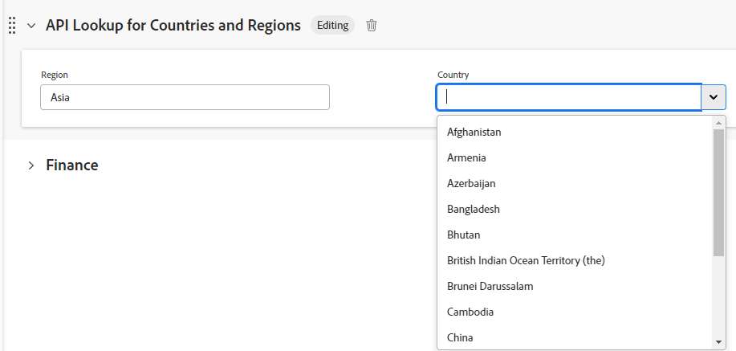

# Voorbeelden van het veld Externe opzoeken in een aangepast formulier

Een extern opzoekveld in een aangepast formulier roept een externe API aan en retourneert waarden als opties in een vervolgkeuzeveld. Gebruikers die werken met het object waaraan het aangepaste formulier is gekoppeld, kunnen een of meer van deze opties in het vervolgkeuzemenu selecteren.

Dit artikel bevat voorbeelden van het gebruik van het veld Externe opzoekopdracht om dezelfde instantie van Workfront of een openbare API aan te roepen. U kunt de Externe Opzoeken ook gebruiken om met een extern systeem zoals Jira, Salesforce, of ServiceNow te communiceren.

Zie voor meer informatie over het toevoegen van een extern opzoekveld aan een aangepast formulier en aanvullende definities van de externe opzoekcomponenten [Een formulier ontwerpen met de formulierontwerper](/help/quicksilver/administration-and-setup/customize-workfront/create-manage-custom-forms/form-designer/design-a-form/design-a-form.md).

## Een extern opzoekveld instellen voor dezelfde instantie van Workfront

U kunt de externe opzoekfunctie gebruiken om gegevens van uw Workfront-exemplaar over te brengen naar het aangepaste formulier.

In dit voorbeeld wordt getoond hoe u de Workfront API aanroept en gegevens uit het bestaande veld Statusquery naar uw externe opzoekveld overbrengt.

1. Open het aangepaste formulier.
1. Op de linkerkant van het scherm, vind **Externe zoekopdracht** en sleep het naar een sectie op het canvas.
1. Voer de **Label** en **Naam** voor het veld.
1. Selecteer de **Indeling** voor het veld.
1. Voer de API-URL-aanroep in het dialoogvenster **Basis-API-URL** veld.

   * U kunt $$HOST toevoegen om naar dezelfde instantie te verwijzen.
   * U kunt $$QUERY toevoegen om de resultaten te filteren op basis van het opvragen van een ander veld.

   **Voorbeeld**
   `$$HOST/attask/api/v15.0/project/search?status={DE:StatusQuery}&$$QUERY`

1. Controleer de **Afhankelijkheden** voor de velden waarnaar dit opzoekveld verwijst in de API.

   Een afhankelijkheidsveld kan elk aangepast of native veld zijn dat op de detailpagina van het object bestaat.

   In dit voorbeeld wordt `{DE:StatusQuery}` wordt vervangen door de waarde van het aangepaste veld StatusQuery.

1. Selecteer de **HTTP-methode**.

   Dit zal waarschijnlijk **Get**.

1. Voer de **JSON-pad** om de resultaten van uw API-aanroep op te halen.

   **Voorbeeld**
   `$.data[*].name`

   >[!NOTE]
   >
   >**Koptekst** Er is geen informatie vereist voor een aanroep naar hetzelfde Workfront-exemplaar.

1. Klikken **Toepassen**.

   

   Wanneer het aangepaste formulier wordt toegevoegd aan een Workfront-object (in dit voorbeeld een project), ziet het er ongeveer zo uit.

   

   

## Een extern opzoekveld instellen voor een openbare API

U kunt de Externe Opzoekfunctie gebruiken om een externe, openbare API aan te roepen en gegevens op te halen.

In dit voorbeeld wordt getoond hoe een API van landen (zoals <https://api.first.org/data/v1/countries>), zodat u niet alle landnamen in de vervolgkeuzemogelijkheden hoeft te coderen.

1. Open het aangepaste formulier.
1. Op de linkerkant van het scherm, vind **Externe zoekopdracht** en sleep het naar een sectie op het canvas.
1. Voer de **Label** en **Naam** voor het veld.
1. Selecteer de **Indeling** voor het veld.
1. Voer de API-URL-aanroep in het dialoogvenster **Basis-API-URL** veld.

   * U kunt $$QUERY toevoegen om vraag het filtreren voor uw eind uit te voeren - gebruikers.

   **Voorbeelden**
Vermeldt alle landen: <https://api.first.org/data/v1/countries>

   Hiermee kan de gebruiker naar een land in het vervolgkeuzeveld zoeken: <https://api.first.org/data/v1/countries?q=$$QUERY>

   Hiermee kan de gebruiker naar een land in een regio zoeken: <https://api.first.org/data/v1/countries?region={DE:Region}&q=$$QUERY>

   * De beschikbare gebieden worden gedefinieerd in een afzonderlijk aangepast veld in Workfront.
   * Wanneer de gebruiker een gebied op het formulier selecteert, worden in het veld Externe opzoekopdracht alleen de landen in dat gebied weergegeven (in welk land de regio is gedefinieerd in de API). De gebruiker kan ook naar een land in het geselecteerde gebied zoeken.

1. Controleer de **Afhankelijkheden** voor de velden waarnaar dit opzoekveld verwijst in de API.

   Een afhankelijkheidsveld kan elk aangepast of native veld zijn dat op de detailpagina van het object bestaat.

   In dit voorbeeld wordt `{DE:Region}` wordt vervangen door de waarde van het aangepaste veld Regio.

1. Selecteer de **HTTP-methode**.

   Dit zal waarschijnlijk **Get**.

1. Voer de **JSON-pad** om de resultaten van uw API-aanroep op te halen.

   Met deze optie kunnen gegevens worden opgehaald uit de JSON die door de API-URL wordt geretourneerd. Hiermee kunt u selecteren welke waarden in de JSON-code worden weergegeven in de vervolgkeuzemogelijkheden.

   **Voorbeeld**
   `$.data[*].country`

1. (Optioneel) Klik op **Koptekst toevoegen** en typ of plak het sleutelwaardepaar dat is vereist voor verificatie met de API.

   >[!NOTE]
   >
   >De gebieden van de Kopbal zijn geen veilige plaats om geloofsbrieven op te slaan, en u zou moeten zorgvuldig zijn wat u ingaat en bewaart.

1. (Optioneel) Selecteer **Meerdere selecties opheffen** om de gebruiker toe te staan meer dan één waarde in dropdown te selecteren.

1. Klikken **Toepassen**.

   

   Wanneer het aangepaste formulier wordt toegevoegd aan een Workfront-object (in dit voorbeeld een project), ziet het er ongeveer zo uit.

   

   

