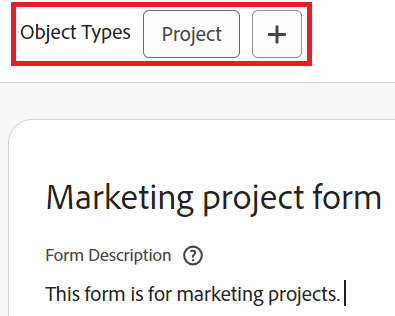

# Objecttypen toevoegen aan of verwijderen uit een bestaand aangepast formulier met de formulierontwerper

De gemarkeerde informatie op deze pagina verwijst naar functionaliteit die nog niet algemeen beschikbaar is. Deze functie is alleen beschikbaar in de voorvertoningsomgeving voor alle klanten of in de productieomgeving voor klanten die snelle releases hebben ingeschakeld.

Voor informatie over snelle versies raadpleegt u [Snelle releases voor uw organisatie in- of uitschakelen](/help/quicksilver/administration-and-setup/set-up-workfront/configure-system-defaults/enable-fast-release-process.md).

Voor informatie over de huidige versie raadpleegt u [Overzicht tweede release 2024, tweede kwartaal](/help/quicksilver/product-announcements/product-releases/24-q2-release-activity/24-q2-release-overview.md).

U kunt objecttypen toevoegen aan of verwijderen uit een bestaand aangepast formulier met de formulierontwerper.

## Toegangsvereisten

U moet het volgende hebben om de stappen in dit artikel uit te voeren:

<table style="table-layout:auto"> 
 <col> 
 <col> 
 <tbody> 
  <tr data-mc-conditions=""> 
   <td role="rowheader"> 
Adobe Workfront-plan
 </td> 
   <td>Alle</td> 
  </tr> 
  <tr> 
   <td role="rowheader">Adobe Workfront-licentie</td> 
   <td>
   
Nieuw: Standaard

   
of

   
Huidig: Plan
</td> 
  </tr> 
  <tr data-mc-conditions=""> 
   <td role="rowheader">Configuraties op toegangsniveau*</td> 
   <td>
Administratieve toegang tot aangepaste formulieren
</td> 
  </tr>  
 </tbody> 
</table>

Zie voor meer informatie over de informatie in deze tabel [Toegangsvereisten in Workfront-documentatie](/help/quicksilver/administration-and-setup/add-users/access-levels-and-object-permissions/access-level-requirements-in-documentation.md).

## Objecttypen toevoegen aan een bestaand aangepast formulier

U kunt aanvullende objecttypen aan het formulier toevoegen zodat het aan meerdere objecten kan worden gekoppeld.

>[!NOTE]
>
>Sectie-einden kunnen worden beïnvloed door het objecttype. De beperkte machtiging Bewerken voor afbrekingen van aangepaste formuliersecties is alleen beschikbaar voor de typen projecten, taken, problemen en gebruikersobjecten.
>
>Zie voor meer informatie [Hoe meerdere objecttypen de machtigingen voor secties kunnen beïnvloeden](/help/quicksilver/administration-and-setup/customize-workfront/create-manage-custom-forms/form-designer/design-a-form/organize-a-form.md#how-multiple-object-types-can-affect-section-break-permissions).

{{step-1-to-setup}}

1. Klikken **Aangepaste Forms** in het linkerdeelvenster.

   In de weergave die wordt weergegeven, kunt u alle aangepaste formulieren bekijken die voor uw organisatie zijn gemaakt. U kunt ook zien wie elk formulier heeft gemaakt, met welk objecttype het werkt en of het actief is.

1. Selecteer het aangepaste formulier waaraan u extra objecttypen wilt toevoegen en klik vervolgens op **Bewerken** of .

1. Klik boven aan het formulier op het plusteken + na **Objecttypen** Selecteer vervolgens de gewenste tekst in het menu dat wordt weergegeven. U kunt dit herhalen om zoveel objecttypen toe te voegen als u wilt.

   

1. Klikken **Opslaan en sluiten**.

   >[!TIP]
   >
   >U kunt op **Toepassen** op elk gewenst moment tijdens het maken van een aangepast formulier om uw wijzigingen op te slaan en het formulier open te houden.

## Objecttypen verwijderen op een aangepast formulier

U kunt objecttypen verwijderen uit een bestaand aangepast formulier. Een aangepast formulier moet ten minste één objecttype hebben.

>[!CAUTION]
>
>Als mensen het aangepaste formulier al hebben gekoppeld aan objecten van het type dat u wilt verwijderen, en er gegevens aan hebben toegevoegd, worden die gegevens permanent verwijderd wanneer u dat objecttype op het formulier verwijdert. Het zou historische informatie kunnen omvatten die de gebruikers later zullen vereisen.
>
>Over het algemeen raden we u aan om het aantal keren dat u een aangepast formulier bewerkt dat al in gebruik is, te minimaliseren. Er is geen meldingssysteem om mensen die het aangepaste formulier gebruiken te waarschuwen voor uw wijzigingen.

Een objecttype verwijderen:

{{step-1-to-setup}}

1. Klikken **Aangepaste Forms** in het linkerdeelvenster.
1. Selecteer het aangepaste formulier dat u wilt bewerken en klik op **Bewerken** of .
1. Klik op de X op een van de **Objecttypen** die u uit het formulier wilt verwijderen.

   

1. (Optioneel) Herhaal de vorige stap voor elk ander objecttype dat u uit het formulier wilt verwijderen.
1. Klikken **Gereed** en klik vervolgens op **Opslaan en sluiten**.
