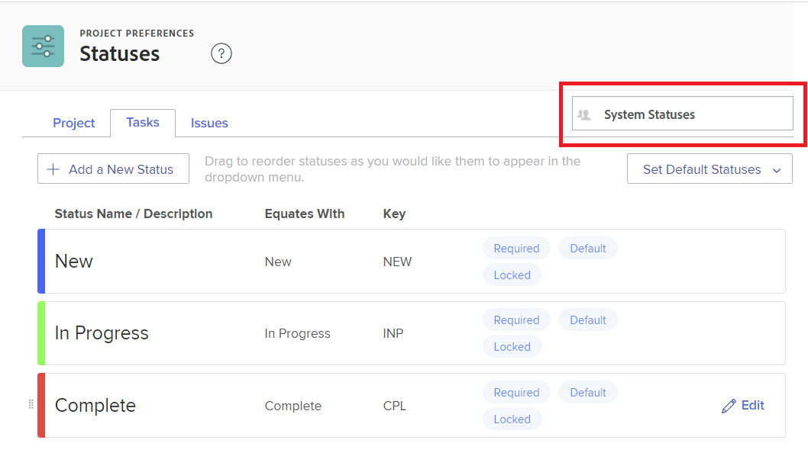

# Een status maken of bewerken

<!-- Audited: 1/2024 -->

<!--DON'T DELETE, DRAFT OR HIDE THIS ARTICLE. IT IS LINKED TO THE PRODUCT THROUGH CONTEXT SENSITIVE HELP LINKS.-->

Als beheerder van Adobe Workfront, kunt u douanestatus voor projecten, taken, en kwesties tot stand brengen. Dit kan voor gebruikers door het volledige systeem van Workfront, of voor specifieke groepen of subgroepen zijn. Voor meer informatie over statussen, zie [ Overzicht van Statussen ](../../../administration-and-setup/customize-workfront/creating-custom-status-and-priority-labels/statuses-overview.md).

>[!NOTE]
>
>Groepbeheerders kunnen ook hun eigen groepsstatussen maken, alleen voor gebruik door hun groepen. Voor meer informatie, zie [ creeer of geef een groepsstatus ](../../../administration-and-setup/manage-groups/manage-group-statuses/create-or-edit-a-group-status.md) uit.

## Toegangsvereisten

+++ Breid uit om de toegangseisen voor de functionaliteit in dit artikel weer te geven.

<table style="table-layout:auto"> 
 <col> 
 <col> 
 <tbody> 
  <tr> 
   <td>Adobe Workfront-pakket</td> 
   <td>
Alle
</td> 
  </tr> 
  <tr> 
   <td>Adobe Workfront-licentie</td> 
   <td>
Standard

       
Plan
</td>
  </tr> 
  <tr> 
   <td>Configuraties op toegangsniveau</td> 
   <td>Systeembeheerder</td> 
  </tr> 
 </tbody> 
</table>

Voor informatie, zie [ vereisten van de Toegang in de documentatie van Workfront ](/help/quicksilver/administration-and-setup/add-users/access-levels-and-object-permissions/access-level-requirements-in-documentation.md).

+++

## Een aangepaste status maken of bewerken

U kunt een aangepaste status toevoegen voor gebruik door uw volledige organisatie of door één groep.

Wanneer u een douanestatus voor de volledige organisatie creeert, kunt u het vormen zodat alle groepen in het systeem het kunnen gebruiken zonder het uit te geven. Of u kunt het vormen zodat de groepsbeheerders het voor hun groepen kunnen wijzigen, zoals verklaard in [ creeer of geef een groepsstatus ](../../../administration-and-setup/manage-groups/manage-group-statuses/create-or-edit-a-group-status.md) uit.

{{step-1-to-setup}}

1. In het linkerpaneel, klik **Voorkeur van het Project** > **Statussen**.

1. (Voorwaardelijk) als u creeert of een status voor gebruik systeembreed uitgeeft, zorg ervoor dat **de Statussen van het Systeem** in de doos in de hoger-juiste hoek wordt geselecteerd.

   

   of

   Als de status voor een groep of subgroep is, typt u de naam van de groep in de rechterbovenhoek en selecteert u de naam wanneer deze wordt weergegeven.

   

1. Selecteer het lusje van het objecten type (**Project**, **Taken**, of **Kwesties**) dat u met de status wilt associëren.

1. Als u een nieuwe status creeert, voegt de klik **een Nieuwe Status** toe.

   of

   Als u een bestaande status uitgeeft, beweegt over het, dan klik **** pictogram uitgeven dat aan uiterst rechts toont.

    uit

1. Configureer de status met behulp van de volgende opties:

   <table style="table-layout:auto"> 
    <col> 
    <col> 
    <tbody> 
     <tr> 
      <td role="rowheader">Statusnaam</td> 
      <td> 
Typ een naam voor de status. Dit is een verplicht veld.
 
Wanneer u een statusnaam maakt, moet u er rekening mee houden dat anderen in het systeem een status met dezelfde naam kunnen maken. We raden u aan een unieke naam te gebruiken om verwarring te voorkomen bij het selecteren van statussen in Workfront.
 </td> 
     </tr> 
     <tr> 
      <td role="rowheader">Beschrijving</td> 
      <td>(Optioneel) Typ een beschrijving van de status. Dit deelt zijn doel aan degenen mee die het gebruiken.</td> 
     </tr> 
     <tr> 
      <td role="rowheader">Kleur</td> 
      <td> 
Pas de kleur van de status aan door te klikken op het kleurveld en een kleur te selecteren in het deelvenster Stalen. U kunt ook een hexadecimaal getal in het veld invoeren.
 
De statuskleur wordt in de rechterbovenhoek van Workfront weergegeven wanneer een gebruiker het object bekijkt.
  
 </td> 
     </tr> 
     <tr> 
      <td role="rowheader">Vergelijkt met</td> 
      <td> 
Selecteer een van de opties in de lijst die de functie van de status het best beschrijft. Als de statusnaam bijvoorbeeld Gereed is, moet de optie waarmee deze overeenkomt voltooid zijn.
 
Elke status moet overeenkomen met een van deze opties, omdat dit bepaalt hoe de status werkt.
 
Deze optie kan niet worden gewijzigd nadat de status is gemaakt.
 </td> 
     </tr> 
     <tr> 
      <td role="rowheader">Sleutel</td> 
      <td> 
Als u een nieuwe status maakt, typt u een code of afkorting voor de status of gebruikt u de code die voor u is gegenereerd. Deze sleutel moet uniek zijn in Workfront omdat deze kan worden gebruikt voor rapportagedoeleinden. Als u een toets probeert op te geven die al in gebruik is in het systeem, wordt het veld rood.
 
Het zou nuttig kunnen zijn om een afkorting te gebruiken die voor degenen herkenbaar is die het zullen gebruiken.
 
Deze optie kan niet worden gewijzigd nadat de status is gemaakt.
 
U kunt de toetscode voor de statussen Planning, Huidig en Voltooid niet wijzigen. Dit is belangrijk als u een rapport opstelt in de tekstmodus.
 </td> 
     </tr> 
     <tr> 
      <td role="rowheader">Status verbergen</td> 
      <td> 
(Alleen status van project en taak)
 
Schakel deze optie in als u de status wilt verbergen voor gebruikers. Wanneer deze optie is uitgeschakeld (de standaardinstelling), kunnen alle gebruikers in het systeem de status gebruiken.
 
U kunt de status van een probleem verbergen door deze optie uit te schakelen voor alle vier de typen uitgaven (Foutenrapport, Wijzigingsvolgorde, Uitgave, Verzoek).
 </td> 
     </tr> 
     <tr> 
      <td role="rowheader">Vergrendelen voor alle groepen</td> 
      <td>
       
Wanneer een status is vergrendeld, kunnen gebruikers in het hele systeem deze bekijken en gebruiken en kunnen groepsbeheerders de status niet aanpassen voor hun groepen.
 
       
Wanneer een status is ontgrendeld, kunnen groepsbeheerders deze aanpassen voor hun afzonderlijke groepen.

   

       
U kunt zowel vergrendelde als ontgrendelde statussen gebruiken in een systeemgoedkeuringsproces. Als u een systeemgoedkeuringsproces met een ontgrendelde systeemstatus creeert, kunnen de gebruikers door het systeem het goedkeuringsproces aan om het even welk project, taak, of kwestie in het systeem vastmaken.

       
 In de volgende scenario's, tonen de waarschuwingsberichten om u en uw gebruikers te helpen resultaten begrijpen van het ontgrendelen van een status:

       <ul>
       <li>Een beheerder ontgrendelt een status op systeemniveau die in een goedkeuringsproces wordt gebruikt. Een bericht waarschuwt dat de ontgrendelde status voor hun groepen zou kunnen schrappen, die groepsleden zou verhinderen dat die goedkeuringsprocedure behoorlijk voor voorwerpen te gebruiken die aan hun groep worden toegewezen.</li>
       <li>Een gebruiker begint een goedkeuringsproces uit te geven dat een ontgrendelde status gebruikt. In een bericht wordt de gebruiker gewaarschuwd voor de ontgrendelde status, zodat deze kan beoordelen of het een goed idee is om de status opnieuw te vergrendelen of te vervangen.</li>
       <li>Een goedkeuringsproces op systeemniveau met een niet-vergrendelde status is gekoppeld aan een object en de status is verwijderd voor de groep die aan het object is toegewezen. Wanneer een groepslid naar de sectie van Goedkeuringen voor het voorwerp gaat, verklaart een bericht dat het goedkeuringsproces niet voor het voorwerp kan worden in werking gesteld.</li>
       </ul>
       
Voor meer informatie over het sluiten van statussen, zie <a href="../../../administration-and-setup/customize-workfront/creating-custom-status-and-priority-labels/lock-or-unlock-a-custom-system-level-status.md" class="MCXref xref"> Vergrendelde en ontgrendelde status op systeemniveau </a>.

       

      </td>
     </tr> 
    </tbody> 
   </table>

1. Klik **sparen**.

   Voor instructies bij het maken van deze status een standaardstatus, zie [ de douanestatus van het Gebruik als standaardstatussen ](../../../administration-and-setup/customize-workfront/creating-custom-status-and-priority-labels/use-custom-statuses-as-default-statuses.md).

Voor informatie over het opnieuw in orde brengen van groepsstatussen, zie [ systeem-niveau opnieuw ordenen en groepsstatussen ](../../../administration-and-setup/customize-workfront/creating-custom-status-and-priority-labels/reorder-system-statuses.md).
