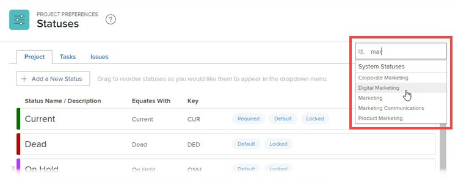

# Statussen op systeemniveau en groepen opnieuw ordenen

Als beheerder van Workfront, kunt u de orde van project, taak veranderen, en status voor iedereen in het systeem of voor één enkele groep uitgeven.

<!--The system version of this snippet mentions a single group because a sysadmin call also reorder statuses there. Group admin version of this article is still needed.-->

>[!NOTE]
>
>* Het opnieuw ordenen van de statussen op systeemniveau heeft geen invloed op de volgorde van statussen binnen groepen.
>
>  Nochtans, erven de statussen binnen een pas gecreëerde top-level groep de orde van de systeem-vlakke statussen. (Een nieuwe subgroep erft de volgorde van de statussen in de groep één niveau omhoog.)
>
>* U kunt vergrendelde statussen opnieuw ordenen. Voor informatie over gesloten statussen, zie [ een status ](../../../administration-and-setup/customize-workfront/creating-custom-status-and-priority-labels/create-or-edit-a-status.md) creëren of uitgeven.
>* De beheerders van de groep kunnen statussen ook herschikken die in hun groepen worden gebruikt. Voor meer informatie, zie [ groepsstatussen van de herschikking ](../../../administration-and-setup/manage-groups/manage-group-statuses/reorder-group-statuses-from-groups-area.md).
>

## Toegangsvereisten

+++ Breid uit om de toegangseisen voor de functionaliteit in dit artikel weer te geven.

<table style="table-layout:auto"> 
 <col> 
 <col> 
 <tbody> 
  <tr> 
   <td>Adobe Workfront-pakket</td> 
   <td>
Alle
</td> 
  </tr> 
  <tr> 
   <td>Adobe Workfront-licentie</td> 
   <td>
Standard

       
Plan
</td>
  </tr> 
  <tr> 
   <td>Configuraties op toegangsniveau</td> 
   <td>Systeembeheerder</td> 
  </tr> 
 </tbody> 
</table>

Voor informatie, zie [ vereisten van de Toegang in de documentatie van Workfront ](/help/quicksilver/administration-and-setup/add-users/access-levels-and-object-permissions/access-level-requirements-in-documentation.md).

+++

## Standaardvolgorde van statussen

Statussen worden standaard in de volgende volgorde weergegeven:

<table style="table-layout:auto"> 
 <col> 
 <col> 
 <col> 
 <thead> 
  <tr> 
   <th width="33.33%">Project</th> 
   <th width="33.33%">Taak</th> 
   <th width="33.33%">Probleem</th> 
  </tr> 
 </thead> 
 <tbody> 
  <tr> 
   <td> 
    <ul> 
     <li>Huidig</li> 
     <li>Dead</li> 
     <li> In de wachtstand </li> 
     <li> Planning </li> 
     <li> Voltooid </li> 
     <li> Gevraagd </li> 
     <li> Goedgekeurd </li> 
     <li> Geweigerd </li> 
     <li> Idea </li> 
    </ul> </td> 
   <td> 
    <ul> 
     <li>Nieuw</li> 
     <li>In uitvoering</li> 
     <li>Voltooid</li> 
    </ul> </td> 
   <td> 
    <ul> 
     <li>Nieuw</li> 
     <li>In uitvoering</li> 
     <li>Opnieuw geopend</li> 
     <li>Nog geen feedback</li> 
     <li>In de wachtstand</li> 
     <li>Kan niet dupliceren</li> 
     <li>Gesloten</li> 
     <li>Opgelost</li> 
     <li>Geverifieerd voltooid</li> 
     <li>Geen oplossing</li> 
    </ul> </td> 
  </tr> 
 </tbody> 
</table>

## Statussen opnieuw ordenen voor taken en projecten in het gehele systeem of voor een groep

{{step-1-to-setup}}

1. In het linkerpaneel, klik **Voorkeur van het Project > Statussen**.
1. (Voorwaardelijk) als u statussen voor een groep opnieuw rangschikt, begin de naam van de groep in het vakje in de hoger-juiste hoek te typen, dan klik de naam wanneer het verschijnt.

   

1. Boven de lijst van Statussen die toont, klik de **Projecten** of **Taken** tabel.

1. Sleep de statussen naar de gewenste volgorde.

   De nieuwe statusvolgorde wordt automatisch opgeslagen.

1. Om de nieuwe statusorde te testen, ga naar een taak of een project, klik de status in de hoger-juiste hoek, en zorg ervoor de statussen die vertoning in de orde zijn die u vormde.

## Statussen opnieuw ordenen voor problemen

1. Klik het **pictogram 1} van het Belangrijkste Menu** Belangrijkste menupictogram  de montages van de Opstelling **** Gear pictogram 

1. Klik **Voorkeur van het Project > Statussen.**
1. (Voorwaardelijk) als u statussen voor een groep opnieuw rangschikt, begin de naam van de groep in het vakje in de hoger-juiste hoek te typen, dan klik de naam wanneer het verschijnt.

   

1. Klik de **Kwesties** tabel.
1. (Facultatief) selecteer een type van kwestie (**Bug Rapport**, **de Orde van de Verandering**, **Uitgave**, of **Verzoek**).

   >[!NOTE]
   >
   >* U kunt de volgorde van statussen voor de hoofdlijst niet aanpassen.
   >* Wij adviseren dat u orde van statussen voor elke kwestie de zelfde manier typt. Voor meer informatie over kwesties types, zie [ aanvraagtypes ](../../../administration-and-setup/set-up-workfront/configure-system-defaults/configure-request-types.md) vormen.

1. Sleep de statussen naar de gewenste volgorde.

   De nieuwe statusvolgorde wordt automatisch opgeslagen.

1. Om de nieuwe statusorde te testen, ga naar een kwestie, klik de status in de hoger-juiste hoek, en zorg ervoor de statussen die vertoning in de orde zijn die u vormde.
