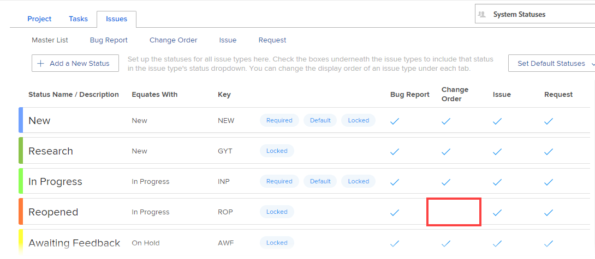

# Aangepaste statussen gebruiken als standaardstatussen

Wanneer een douanestatus als standaardstatus wordt geplaatst, wordt de nieuwe standaardstatus gebruikt door het systeem op diverse manieren. De manieren waarin het wordt gebruikt hangt af van of het als standaardsysteem-vlakke status, of een standaardgroep-vlakke status wordt geplaatst.

## Toegangsvereisten

+++ Breid uit om de toegangseisen voor de functionaliteit in dit artikel weer te geven.

<table style="table-layout:auto"> 
 <col> 
 <col> 
 <tbody> 
  <tr> 
   <td>Adobe Workfront-pakket</td> 
   <td>
Alle
</td> 
  </tr> 
  <tr> 
   <td>Adobe Workfront-licentie</td> 
   <td>
Standard

       
Plan
</td>
  </tr> 
  <tr> 
   <td>Configuraties op toegangsniveau</td> 
   <td>Systeembeheerder</td> 
  </tr> 
 </tbody> 
</table>

Voor informatie, zie [ vereisten van de Toegang in de documentatie van Workfront ](/help/quicksilver/administration-and-setup/add-users/access-levels-and-object-permissions/access-level-requirements-in-documentation.md).

+++

## Aangepaste statussen op systeemniveau

Wanneer u een aangepaste status instelt als een standaardsysteemstatus, nemen nieuwe groepen die in het systeem zijn gemaakt die status over.

Groepen die al bestonden toen u de nieuwe standaardsysteemstatus instelde, nemen deze niet automatisch over.

Stel dat er al twee groepen zijn gemaakt in uw Adobe Workfront-omgeving (marketing en verkoop). U maakt een nieuwe aangepaste status die gelijk is aan Huidig en roept de status In proces aan. U creeert nu een nieuwe groep genoemd Techniek. In dit scenario, erft de groep van de Techniek de nieuwe standaardstatus; de Marketing en de groepen van de Verkoop niet.

## Aangepaste standaardstatussen op groepsniveau

In de volgende omstandigheden wordt een aangepaste status gebruikt die u instelt als standaardgroepsstatus:

* **wanneer het systeem van Workfront automatisch een status kiest, wordt de standaardgroepsstatus gebruikt:** de douanestatus die u als standaardgroepsstatus plaatst wordt gebruikt wanneer het systeem van Workfront automatisch een status aan een voorwerp toewijst.

  Bijvoorbeeld, kan een taak worden gevormd om automatisch in Volledige status te veranderen wanneer het percentage voltooide 100% bereikt. Als u een aangepaste status maakt die gelijk is aan Voltooid en u die aangepaste status instelt als standaardstatus, wijzigt Workfront de status van de taak in de nieuwe standaardstatus.

  Aangepaste statussen worden op deze manier alleen gebruikt met groepsstatussen die zijn gekoppeld aan een taak of uitgave. Aangepaste statussen kunnen op deze manier niet worden gebruikt voor statussen die aan een project zijn gekoppeld.

* De **status van een project wordt bepaald door de groep verbonden aan het project**: Als de groep verbonden aan een bepaald project verandert, verandert de status van het project afhankelijk van de standaardstatussen die voor de groep worden bepaald. (Een groep kan met een project via het gebied van Groepen worden geassocieerd wanneer het uitgeven van het project.)

  Als die groep verandert, verandert het statuut van het project als de nieuwe groep een verschillende bepaalde standaardstatus heeft die met de huidige status van het project evenaart.

  Bijvoorbeeld, kan een project met de groep van de Marketing worden geassocieerd, en het statuut van het project wordt geplaatst aan Planning. Het project wordt uitgegeven zodat het nu met de groep van de Verkoop wordt geassocieerd. De groep van de Verkoop heeft een status van de douane standaardgroep genoemd Dinking (en deze status is met Planning gelijk). Omdat de Groep op het project werd veranderd, verandert het statuut van het project nu in het Dinken.

Als u een groepsbeheerder bent, zie [ Plaats een status als standaardstatus voor een groep ](/help/quicksilver/administration-and-setup/manage-groups/manage-group-statuses/use-custom-statuses-as-default-statuses-group.md).

## Uitgiftestatus

Als de aangepaste status de status Uitgave is, moeten alle vier de uitgiftetypen hiervoor zijn ingeschakeld (Foutenrapport, Wijzigingsvolgorde, Uitgave en Verzoek). In de onderstaande status van de uitgave kan de status Opnieuw geopend bijvoorbeeld niet als standaardstatus worden gebruikt omdat het type Uitgave volgorde wijzigen niet is geselecteerd:

## Een aangepaste status instellen als standaardstatus

{{step-1-to-setup}}

1. In het linkerpaneel, klik **Voorkeur van het Project** > **Statussen**.
1. (Voorwaardelijk) als u een standaardstatus voor een groep plaatst, begin het typen van de naam van de groep in het menu in de hoger-juiste hoek, dan selecteer het wanneer het verschijnt.
1. Open het **Project**, **Taken**, of **Kwesties** lusje, afhankelijk van het type van status u als standaardstatus wilt plaatsen.
1. Klik het **Vastgestelde StandaardStatussen** drop-down menu.
1. Selecteer in het vervolgkeuzemenu dat wordt weergegeven, naast de status waar u de standaardstatus wilt instellen, de gewenste standaardstatus.
1. Klik **sparen**.
1. Koppel het project aan de groep waar de status zich bevindt.

   >[!NOTE]
   >
   >Als u de douanestatus voor een groep plaatst, en u later het project aan een verschillende groep toewijst, zal de projectstatus opnieuw laden en kon veranderen.

   1. Ga naar het project waar u de douanestatus wilt gebruiken.
   1. Klik het Meer menu , dan klik **uitgeven**.
   1. In **geef de doos van het Project** uit die, op het **3} gebied van de Groep {onder** de vereniging van het Project **toont, selecteer de groep waar de status verblijft.**
   1. Klik **sparen Veranderingen**.
