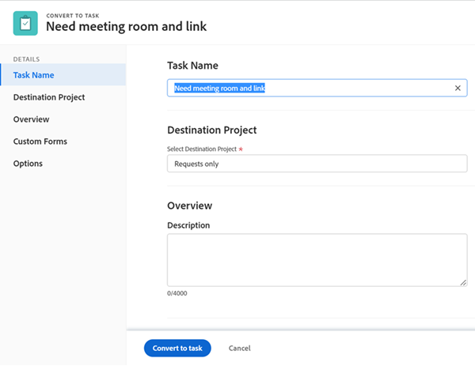

# De weergave Details aanpassen met een lay-outsjabloon

<!--The highlighted information on this page refers to functionality not yet generally available. It is available for all customers in the Preview environment and for a select group of customers in the Production environment.-->

Als Adobe Workfront-beheerder kunt u een lay-outsjabloon gebruiken om te bepalen welke informatie wordt weergegeven wanneer een gebruiker op het pictogram Details  in het linkerdeelvenster klikt terwijl een taak, uitgave, document, programma of portfolio wordt weergegeven.

<!--
or billing record
-->

U kunt ook de volgorde wijzigen van de gegevens waarin deze gegevens worden weergegeven. Voor alle taken die uw gebruikers bijvoorbeeld zien, kunt u de gegevens van Aangepaste Forms boven aan de weergave Details plaatsen voor alle taken die uw gebruikers zien.

Voor informatie over het creëren van lay-outmalplaatjes, zie [ lay-outmalplaatjes ](../use-layout-templates/create-and-manage-layout-templates.md) creëren en beheren.

Voor informatie over lay-outmalplaatjes voor groepen, zie [ tot stand brengen en wijzigen de lay-outmalplaatjes van een groep ](../../../administration-and-setup/manage-groups/work-with-group-objects/create-and-modify-a-groups-layout-templates.md).

Nadat u een lay-outmalplaatje hebt gevormd, moet u het aan gebruikers voor veranderingen toewijzen u aanbracht om aan anderen zichtbaar te zijn. Voor informatie over het toewijzen van een lay-outmalplaatje aan gebruikers, zie [ gebruikers aan een lay-outmalplaatje ](../use-layout-templates/assign-users-to-layout-template.md) toewijzen.

De wijzigingen die u aanbrengt in de weergave Details voor een object, bepalen ook de beschikbaarheid en volgorde van velden die gebruikers in de volgende gebieden zien:

* &quot;Object maken&quot;-vakken, zoals Taak maken

  

* Schermen &quot;Object bewerken&quot; tijdens het bewerken van een object, zoals Taak bewerken, Probleem bewerken en Project bewerken

  

* &quot;Objecten bewerken&quot; wordt weergegeven in schermen wanneer objecten bulksgewijs worden bewerkt. Momenteel wordt dit ondersteund voor het bulksgewijs bewerken van projecten.

  

* Het deelvenster Samenvatting  voor lijsten met taken en problemen

  

  >[!NOTE]
  >
  >Wijzigingen in de lay-outsjablonen zijn alleen van invloed op de volgorde en beschikbaarheid van velden in het deelvenster Samenvatting voor de taken en uitgaven die zijn toegewezen aan de aangemelde gebruiker.

* Conversievakken, zoals de kwestie van de Bekeerling aan taak of zet kwestie in projectvakjes om.

  

Voor informatie over lay-outmalplaatjes voor groepen, zie [ tot stand brengen en wijzigen de lay-outmalplaatjes van een groep ](../../../administration-and-setup/manage-groups/work-with-group-objects/create-and-modify-a-groups-layout-templates.md).

## Toegangsvereisten

+++ Breid uit om de toegangseisen voor de functionaliteit in dit artikel weer te geven.

U moet de volgende toegang hebben om de stappen in dit artikel uit te voeren:

<table style="table-layout:auto"> 
 <col> 
 <col> 
 <tbody> 
  <tr> 
   <td role="rowheader">Adobe Workfront-plan</td> 
   <td>Alle</td> 
  </tr> 
  <tr> 
   <td role="rowheader">Adobe Workfront-licentie*</td> 
   <td>
Nieuw: Standaard

  
 Huidig: Plan

   </td> 
  </tr> 
  <tr> 
   <td role="rowheader">Configuraties op toegangsniveau</td> 
   <td> 
Om deze stappen op systeemniveau uit te voeren, hebt u het toegangsniveau van de Beheerder van het Systeem nodig.
Om hen voor een groep uit te voeren, moet u een manager van die groep zijn.
 </td> 
  </tr> 
 </tbody> 
</table>

*Voor meer informatie, zie [ vereisten van de Toegang in de documentatie van Workfront ](/help/quicksilver/administration-and-setup/add-users/access-levels-and-object-permissions/access-level-requirements-in-documentation.md).

+++

## Aanpassen wat gebruikers zien in de weergave Details

1. Begin werkend aan een lay-outmalplaatje, zoals die in [ wordt beschreven creeer en beheer lay-outmalplaatjes ](../../../administration-and-setup/customize-workfront/use-layout-templates/create-and-manage-layout-templates.md).
1. Klik de benedenpijl  onder **aanpassen wat gebruikers** zien, dan klik **Project**, **Taak**, **Uitgave**, **Programma**, of **Portfolio.**
<!--
, or billing record
-->

1. In de **sectie van Details**, doe om het even welke volgend om aan te passen wat de gebruikers in de mening van Details zien:

   * Sleep sectiekoppen  om de volgorde te wijzigen.
   * Laat of maak opties onder de diverse gebieden (zoals **Overzicht**, **Financiën**, en **Douane Forms**) toe onbruikbaar om hen te tonen of te verbergen.

     Als u alle velden in een van deze secties verbergt, wordt de volledige sectie verborgen.

     Alle velden zijn standaard ingeschakeld. U kunt selecteren of ontruimen **alle** controledoos op een gebied selecteren om alle gebieden in dat gebied te tonen of te verbergen.

   

1. Blijf het lay-outmalplaatje aanpassen.

   of

   Als u wordt gebeëindigd aanpassend, klik **sparen**.

   >[!TIP]
   >
   >U kunt op elk gewenst moment op Opslaan klikken om de voortgang op te slaan en de sjabloon later blijven wijzigen.
