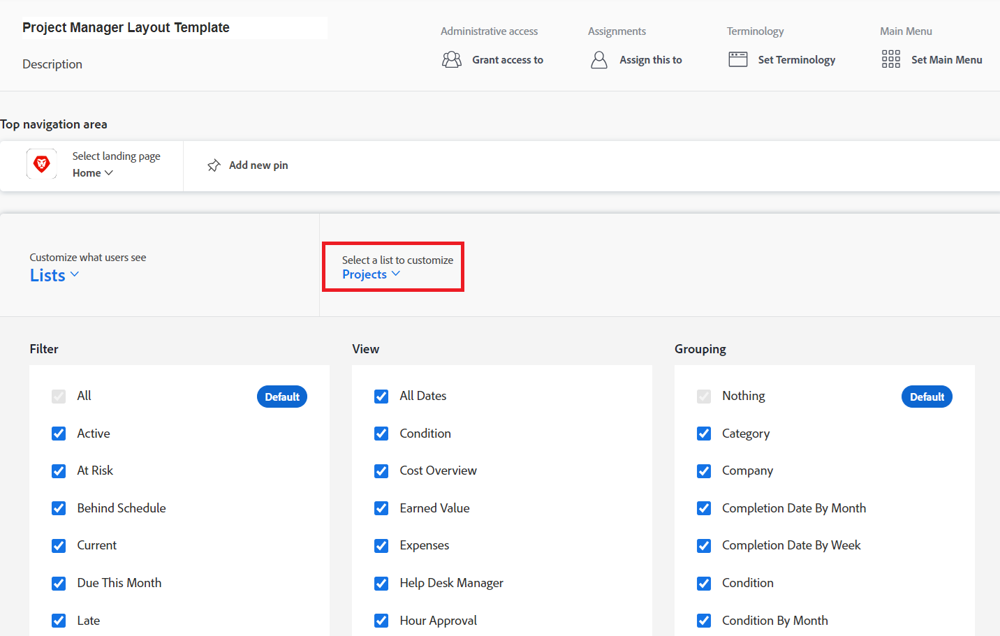

# Filters, weergaven en groepen aanpassen met een lay-outsjabloon

Als Adobe Workfront-beheerder kunt u een lay-outsjabloon gebruiken om op te geven welke lijstbesturingselementen worden weergegeven in de vervolgkeuzemenu&#39;s Filter, Weergave en Groeperen. Deze menu&#39;s worden boven op lijsten in Workfront weergegeven, zoals de lijst met taken voor een project:

Voor meer informatie over lay-outmalplaatjes, zie [&#x200B; lay-outmalplaatjes &#x200B;](../../../administration-and-setup/customize-workfront/use-layout-templates/create-and-manage-layout-templates.md) creëren en beheren.

Voor informatie over lay-outmalplaatjes voor groepen, zie [&#x200B; tot stand brengen en wijzigen de lay-outmalplaatjes van een groep &#x200B;](../../../administration-and-setup/manage-groups/work-with-group-objects/create-and-modify-a-groups-layout-templates.md).

Nadat u een lay-outmalplaatje hebt gevormd, moet u het aan gebruikers voor veranderingen toewijzen u aanbracht om aan anderen zichtbaar te zijn. Voor informatie over het toewijzen van een lay-outmalplaatje aan gebruikers, zie [&#x200B; gebruikers aan een lay-outmalplaatje &#x200B;](../use-layout-templates/assign-users-to-layout-template.md) toewijzen.

## Toegangsvereisten

+++ Breid uit om de toegangseisen voor de functionaliteit in dit artikel weer te geven.

<table style="table-layout:auto"> 
 <col> 
 <col> 
 <tbody> 
  <tr> 
   <td>Adobe Workfront-pakket</td> 
   <td>
Alle
</td> 
  </tr> 
  <tr> 
   <td>Adobe Workfront-licentie</td> 
   <td>
Standard

       
Plan
</td>
  </tr> 
  </tr> 
  <tr> 
   <td>Configuraties op toegangsniveau</td> 
   <td> 
Om deze stappen op systeemniveau uit te voeren, hebt u het toegangsniveau van de Beheerder van het Systeem nodig.

        
Om hen voor een groep uit te voeren, moet u een manager van die groep zijn.
 </td> 
  </tr> 
 </tbody> 
</table>

Voor informatie, zie [&#x200B; vereisten van de Toegang in de documentatie van Workfront &#x200B;](/help/quicksilver/administration-and-setup/add-users/access-levels-and-object-permissions/access-level-requirements-in-documentation.md).

+++

## Besturingselementen voor filters-, weergave- en groeperingslijsten aanpassen

1. Begin werkend aan een lay-outmalplaatje, zoals die in [&#x200B; wordt beschreven creeer en beheer lay-outmalplaatjes &#x200B;](../../../administration-and-setup/customize-workfront/use-layout-templates/create-and-manage-layout-templates.md).
1. Klik de benedenpijl  onder **aanpassen welke gebruikers** zien, dan klik **Lijsten** in het drop-down menu dat toont.

    zien

1. Klik de benedenpijl  onder **selecteer een lijst om** aan te passen, dan selecteer het type van voorwerp van Workfront waarvoor u de Filter, de Mening, en de de lijstcontroles van de Groepering wilt aanpassen.

    aan te passen

   >[!NOTE]
   >
   >Als u Projecten als lijst selecteert om aan te passen, dan Projecten onbruikbaar te maken ik of Projecten in de sectie van de Filter ben, zullen de gebruikers niet meer zien of die filter kunnen gebruiken:
   >
   >* In de lijst van filters die toont wanneer zij het pictogram van de filter  boven een lijst klikken:
   >   
   >   onbruikbaar
   >   
   >* In de koptekst van het gebied Projecten:
   >   
   >   onbruikbaar

1. (Facultatief) als u de standaardfilter, mening, of groepering voor het lay-outmalplaatje wilt veranderen, over de filter, de mening, of het groeperen, dan klik **Reeks als gebrek**.

   De standaardwaarden die u kiest, bepalen welke gebruikers voor Filter, Weergave en Groeperen in lijsten in Workfront worden weergegeven wanneer de lay-outsjabloon aan hen wordt toegewezen. Als u deze gebreken niet verandert, zien de gebruikers alle lijsten als volgt:

   * **Filters**: Alle
   * **Mening**: Norm (waar van toepassing; sommige lijsten hebben deze mening niet)
   * **Groepering**: niets

   U kunt de opties Alles, Standaard en Niets verbergen nadat u verschillende standaardinstellingen hebt geselecteerd (zie Stap 5), maar deze opties kunnen niet worden verwijderd.

   U kunt elke andere optie verwijderen die als standaard wordt gebruikt, maar u moet eerst een andere standaardinstelling selecteren.

   Voor informatie over het schrappen van filters, meningen, en groeperingen, zie [&#x200B; creeren, uitgeven, en aandeel standaardfilters, meningen, en groeperingen &#x200B;](../../../administration-and-setup/set-up-workfront/configure-system-defaults/create-and-share-default-fvgs.md).

1. Besturingselementen voor lijsten verbergen en toevoegen:

   <table style="table-layout:auto"> 
    <col> 
    <col> 
    <tbody> 
     <tr> 
      <td role="rowheader">Een besturingselement voor een lijst verbergen</td> 
      <td> 
Schakel het vakje naast het lijstbesturingselement dat u wilt verbergen of weergeven uit of uit.
 
Als een selectievakje grijs wordt weergegeven, kunt u het lijstbesturingselement niet verbergen. De instelling Standaard  voor elk besturingselement in de lijst wordt grijs weergegeven omdat u de instelling die momenteel als de standaardinstelling is geconfigureerd, niet kunt verbergen.
 </td> 
     </tr> 
     <tr> 
      <td role="rowheader">Een besturingselement voor een aangepaste lijst toevoegen</td> 
      <td> 
 
        <ol> 
         <li value="1"> Klik <strong> toevoegen Filter </strong>, <strong> toevoegen Mening </strong>, of <strong> voeg Groepering </strong> bij de bodem van de Filter, Mening, of het Groeperen lijst toe. In het vakje dat toont, begin de naam van een bestaand controle van de douanelijst te typen die eerder voor uw organisatie wordt gecreeerd, dan klik de naam wanneer het verschijnt.</li> 
         <li value="2"> Als u de nieuwe controle van de douanelijst als standaardfilter, mening, of groepering voor het lay-outmalplaatje wilt plaatsen, klik <strong> Reeks als Gebrek </strong>. </li> 
         <li value="3"> 
Klik <strong> toevoegen </strong> wanneer u wordt gebeëindigd.
 
<b> NOTA </b>: 
Gebruikers kunnen aangepaste lijstbesturingselementen toevoegen aan hun eigen lijsten. Als u besturingselementen voor aangepaste lijsten toevoegt aan een lay-outsjabloon, worden de besturingselementen voor lijsten toegevoegd en worden de besturingselementen onder aan het deelvenster geplaatst. De besturingselementen worden niet door u vervangen.
 
Dit is ook waar als u de gebruiker aan een nieuw lay-outmalplaatje toewijst dat de controles van de douanelijst heeft. 
 
Voor informatie over het aanpassen van lijstcontroles, zie <a href="../../../reports-and-dashboards/reports/reporting-elements/filters-overview.md" class="MCXref xref"> Overzicht van Filters </a>, <a href="../../../reports-and-dashboards/reports/reporting-elements/views-overview.md" class="MCXref xref"> Overzicht van Meningen in Adobe Workfront </a>, en <a href="../../../reports-and-dashboards/reports/reporting-elements/groupings-overview.md" class="MCXref xref"> Overzicht van Groepen in Adobe Workfront </a>.
 
 </li> 
        </ol> 
 </td> 
     </tr> 
    </tbody> 
   </table>

1. Blijf het lay-outmalplaatje aanpassen. U kunt **klikken** op elk ogenblik van toepassing zijn om uw vooruitgang te bewaren.

   of

   Als u wordt gebeëindigd aanpassend, klik **sparen en sluit**.
