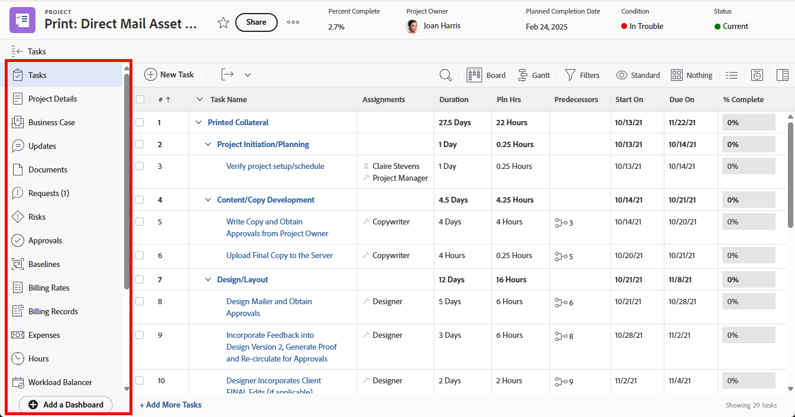

# Het linkerdeelvenster aanpassen met een lay-outsjabloon

<!--Audited: 10/2024-->

In een lay-outsjabloon kunt u aanpassen wat gebruikers in het linkerdeelvenstergebied in [!DNL Adobe Workfront] zien.

U kunt bijvoorbeeld bepalen welke van de volgende items gebruikers in het linkerdeelvenster zien wanneer ze een project bekijken:

>[!IMPORTANT]
>
>Wijzigingen die u aanbrengt in de volgorde en zichtbaarheid worden weerspiegeld in de mobiele app.

Voor informatie over het creëren van lay-outmalplaatjes, zie [ lay-outmalplaatjes ](../use-layout-templates/create-and-manage-layout-templates.md) creëren en beheren.

Voor informatie over lay-outmalplaatjes voor groepen, zie [ tot stand brengen en wijzigen de lay-outmalplaatjes van een groep ](../../../administration-and-setup/manage-groups/work-with-group-objects/create-and-modify-a-groups-layout-templates.md).

Nadat u een lay-outmalplaatje hebt gevormd, moet u het aan gebruikers voor veranderingen toewijzen u aanbracht om aan anderen zichtbaar te zijn. Voor informatie over het toewijzen van een lay-outmalplaatje aan gebruikers, zie [ gebruikers aan een lay-outmalplaatje ](../use-layout-templates/assign-users-to-layout-template.md) toewijzen.

## Toegangsvereisten

+++ Breid uit om de toegangseisen voor de functionaliteit in dit artikel weer te geven.

<table style="table-layout:auto"> 
 <col> 
 <col> 
 <tbody> 
  <tr> 
   <td>Adobe Workfront-pakket</td> 
   <td>
Alle

       
Het toevoegen van aangepaste toepassingen aan het hoofdmenu is alleen beschikbaar voor organisaties die een licentie hebben voor Adobe App Builder.
</td> 
  </tr> 
  <tr> 
   <td>Adobe Workfront-licentie</td> 
   <td>
Standard

       
Plan
</td>
  </tr> 
  </tr> 
  <tr> 
   <td>Configuraties op toegangsniveau</td> 
   <td> 
Om deze stappen op systeemniveau uit te voeren, hebt u het toegangsniveau van de Beheerder van het Systeem nodig.

        
Om hen voor een groep uit te voeren, moet u een manager van die groep zijn.
 </td> 
  </tr> 
 </tbody> 
</table>

Voor informatie, zie [ vereisten van de Toegang in de documentatie van Workfront ](/help/quicksilver/administration-and-setup/add-users/access-levels-and-object-permissions/access-level-requirements-in-documentation.md).

+++

## Pas het linkerdeelvenster aan voor een gebied in [!DNL Workfront] :

1. Begin werkend aan een lay-outmalplaatje, zoals die in [ wordt beschreven creeer en beheer lay-outmalplaatjes ](../../../administration-and-setup/customize-workfront/use-layout-templates/create-and-manage-layout-templates.md).
1. Klik de benedenpijl  onder **[!UICONTROL Customize what users see]**, dan klik de naam van een objecten type of een [!DNL Workfront] gebied waarvan linkerpaneel wilt aanpassen u.

   De objecttypen en [!DNL Workfront] -gebieden waarvan u het linkerdeelvenster kunt aanpassen, worden in de volgende tabel weergegeven:

   <table style="table-layout:auto"> 
    <col> 
    <col> 
    <col> 
    <thead> 
     <tr> 
      <th>Objecttype of [!DNL Workfront] -gebied</th> 
      <th>Wanneer gebruikers op het volgende klikken...</th> 
      <th>Secties in het linkerdeelvenster die gebruikers zien nadat u ze in de lay-outsjabloon weergeeft:</th> 
     </tr> 
    </thead> 
    <tbody> 
     <tr> 
      <td>[!UICONTROL Project]</td> 
      <td>De naam van een project</td> 
      <td>[!UICONTROL Tasks], [!UICONTROL Project Details], [!UICONTROL Business Case], [!UICONTROL Updates], [!UICONTROL Documents], [!UICONTROL Issues], [!UICONTROL Risks], [!UICONTROL Approvals], [!UICONTROL Baselines], [!UICONTROL Billing Rates], [!UICONTROL Billing Records], [!UICONTROL Expenses], [!UICONTROL Hours], [!UICONTROL Workload Balancer], [!UICONTROL People], [!UICONTROL Utilization], [!UICONTROL Queue Details], [!UICONTROL Routing Rules], [!UICONTROL Queue Topic], [!UICONTROL Topic Group], [!UICONTROL Metrics] , [!UICONTROL Planning]*, [!UICONTROL Custom application]**</td> 
     </tr> 
     <tr> 
      <td>[!UICONTROL Task]</td> 
      <td>De naam van een taak</td> 
      <td> [!UICONTROL Updates], [!UICONTROL Documents], [!UICONTROL Task Details], [!UICONTROL Subtask], [!UICONTROL Issues], [!UICONTROL Hours], [!UICONTROL Approvals], [!UICONTROL Expenses], [!UICONTROL Predecessors], [!UICONTROL Custom application]**</td> 
     </tr> 
     <tr> 
      <td>[!UICONTROL Issue]</td> 
      <td>De naam van een uitgave</td> 
      <td> [!UICONTROL Updates], [!UICONTROL Documents], [!UICONTROL Issue Details], [!UICONTROL Hours], [!UICONTROL Approvals], [!UICONTROL Custom application]**</td> 
     </tr> 
     <tr> 
      <td>[!UICONTROL Portfolio]</td> 
      <td>De naam van een portfolio</td> 
      <td>[!UICONTROL Projects], [!UICONTROL Programs], [!UICONTROL Portfolio Details], [!UICONTROL Portfolio] [!UICONTROL Optimization], [!UICONTROL Documents], [!UICONTROL Updates], [!UICONTROL Planning]*, [!UICONTROL Custom application]**</td> 
     </tr> 
     <tr> 
      <td>[!UICONTROL Program]</td> 
      <td>De naam van een programma</td> 
      <td>[!UICONTROL Projects], [!UICONTROL Program Details], [!UICONTROL Updates], [!UICONTROL Documents], [!UICONTROL Planning]*, [!UICONTROL Custom application]**</td> 
     </tr> 
     <tr> 
      <td>[!UICONTROL Template]</td> 
      <td>De naam van een projectsjabloon</td> 
      <td>[!UICONTROL Template Tasks], [!UICONTROL Template Details], [!UICONTROL Updates], [!UICONTROL Documents], [!UICONTROL Risks], [!UICONTROL Expenses], [!UICONTROL People], [!UICONTROL Approvals], [!UICONTROL Billing Rates], [!UICONTROL Queue Details], [!UICONTROL Routing Rules], [!UICONTROL Queue Topic], [!UICONTROL Topic Group]</td> 
     </tr> 
     <tr> 
      <td>[!UICONTROL Template Task]</td> 
      <td>De naam van een sjabloontaak</td> 
      <td>[!UICONTROL Updates], [!UICONTROL Documents], [!UICONTROL Template Task Details], [!UICONTROL Subtasks], [!UICONTROL Expenses], [!UICONTROL Approvals], [!UICONTROL Predecessors]</td>
     </tr>
     <!--
      <tr> 
       <td>Document</td> 
       <td>Document Details (for a document uploaded to Workfront)</td> 
       <td>Updates, Approvals, All Versions, Custom Forms</td> 
      </tr>
     --> 
     <tr> 
      <td> [!UICONTROL Billing Record]</td> 
      <td>De naam van een factureringsrecord voor een project</td> 
      <td>[!UICONTROL Billing Record Details], [!UICONTROL Billable Hours], [!UICONTROL Billable Expenses] , [!UICONTROL Fixed Revenues]</td> 
     </tr> 
     <tr> 
      <td>[!UICONTROL Projects]</td> 
      <td>Projecten  in de [!UICONTROL Main menu] </td> 
      <td>[!UICONTROL Projects]</td> 
     </tr> 
     <tr> 
      <td>[!UICONTROL Requests]</td> 
      <td>De naam van een aanvraag</td> 
      <td>[!UICONTROL New Request], [!UICONTROL Submitted requests], [!UICONTROL All Requests] , [!UICONTROL Drafts]</td> 
     </tr> 
     <tr> 
      <td>[!UICONTROL Dashboards]</td> 
      <td>De naam van een dashboard</td> 
      <td>[!UICONTROL My Dashboards], [!UICONTROL Shared Dashboards], [!UICONTROL All Dashboards]</td> 
     </tr> 
     <tr> 
      <td>[!UICONTROL Scrum Team]</td> 
      <td>De naam van een scrum-team</td> 
      <td>
[!UICONTROL Iterations], [!UICONTROL Current iteration], [!UICONTROL Backlog], [!UICONTROL Workload Balancer], [!UICONTROL Updates], [!UICONTROL Team Settings]
 
<strong> NOTA:</strong> het <strong>[!UICONTROL Current iteration]</strong> punt toont slechts in het linkerpaneel wanneer er minstens één taak of kwestie op de herhaling is.
</td> 
     </tr> 
     <tr> 
      <td>[!UICONTROL Kanban Team]</td> 
      <td>De naam van een Kanban-team</td> 
      <td>[!UICONTROL Workload Balancer], [!UICONTROL Kanban board], [!UICONTROL Backlog], [!UICONTROL Updates] , [!UICONTROL Team Settings]</td> 
     </tr> 
     <tr> 
      <td>[!UICONTROL Waterfall Team]</td> 
      <td>De naam van een Watervalteam</td> 
      <td>[!UICONTROL Workload Balancer], [!UICONTROL Updates], [!UICONTROL Team Requests] , [!UICONTROL Team Settings]</td> 
     </tr> 
     <tr> 
      <td>[!UICONTROL Iteration]</td> 
      <td>De naam van een herhaling</td> 
      <td>[!UICONTROL Stories], [!UICONTROL Issues], [!UICONTROL Story Board], [!UICONTROL Overview], [!UICONTROL Custom Forms], [!UICONTROL Updates] </td> 
     </tr> 
     <!--
      <tr> 
       <td>Company</td> 
       <td>The name of the company</td> 
       <td> 
People (cannot be hidden), Billing Rates, Custom Forms 
 </td> 
      </tr>
     --> 
     <!--
      <tr> 
       <td>Timesheets</td> 
       <td>The name of the timesheet</td> 
       <td>My Timesheets, Timesheets I Approve, All Timesheets (cannot be hidden) </td> 
      </tr>
     --> 
     <!--
      <tr> 
       <td>Resourcing</td> 
       <td>The name of the resource</td> 
       <td>Planner (cannot be hidden), Workload Balancer, Utilization, Resource Pools </td> 
      </tr>
     --> 
     <!--
      <tr> 
       <td>User Details</td> 
       <td>____________</td> 
       <td>Details (cannot be hidden), Org Chart, Time Off, Custom Forms </td> 
      </tr>
     --> 
    </tbody> 
   </table>

   *Uw bedrijf moet een extra licentie voor Workfront Planning aanschaffen om dit gebied toe te voegen aan het linkerdeelvenster met projecten, portfolio&#39;s en programma&#39;s. Voor meer informatie, zie [ begonnen worden met de Planning van Adobe Workfront ](/help/quicksilver/planning/general/planning-overview.md)

   **Aangepaste toepassingen moeten afzonderlijk worden gemaakt voordat ze beschikbaar komen als opties in het hoofdmenu. Voor meer informatie, zie [ een douanetoepassing voor Workfront met Adobe App Builder ](/help/quicksilver/app-builder/app-builder.md) creëren.

1. Voer in de lijst **[!UICONTROL Left panel]** een van de volgende handelingen uit om te bepalen welke gebruikers in het linkerdeelvenster zien voor het [!DNL Workfront] -gebied of objecttype dat u hebt geselecteerd:

   * Klik **tonen**  of **Verbergen**  pictogrammen om secties in het linkerpaneel te tonen of te verbergen. U kunt geen punten verbergen die a **hebben tonen** of **** pictogram verbergen.

   * De punten van de belemmering  om hun orde op het linkerpaneel te veranderen.

   >[!NOTE]
   >
   >De volgende items in de vervolgkeuzelijst **[!UICONTROL Customize what users see]** verwijzen naar andere gebieden dan het linkerdeelvenster:
   >* [!UICONTROL Lists]
   >* [!UICONTROL Summary panel]
   >* [!UICONTROL Home]
   >* [!UICONTROL Branding]
   > 
   >Raadpleeg de volgende artikelen voor informatie over het aanpassen van de extra gebieden:
   >
   >* [ pas Filters, Weergaven, en Groepen aan gebruikend een lay-outmalplaatje ](../../../administration-and-setup/customize-workfront/use-layout-templates/customize-fvg-list-controls-layout-template.md)
   >* [ pas [!UICONTROL Summary panel] aan gebruikend een lay-outmalplaatje ](/help/quicksilver/administration-and-setup/customize-workfront/use-layout-templates/customize-home-summary-layout-template.md)
   >* [ pas Huis aan gebruikend een lay-outmalplaatje ](/help/quicksilver/administration-and-setup/customize-workfront/use-layout-templates/customize-new-home-layout-template.md)
   >* [ merk Adobe  [!DNL Workfront]  gebruikend een lay-outmalplaatje ](../../../administration-and-setup/customize-workfront/use-layout-templates/brand-wf-using-a-layout-template.md)

1. (Optioneel) Als u een item uit het linkerdeelvenster wilt toevoegen dat is gekoppeld aan een van de dashboards van uw organisatie, klikt u op **[!UICONTROL Add dashboard]** , typt u de **[!UICONTROL Quick link name]** voor het item en kiest u het dashboard.

   U moet het dashboard bouwen alvorens het in de lijst verschijnt.

   De dashboarditems worden onder in het linkerdeelvenster weergegeven.

   >[!NOTE]
   >
   >Gebruikers kunnen aangepaste dashboarditems aan hun linkerdeelvenster toevoegen. Wanneer u aangepaste dashboarditems toevoegt aan een lay-outsjabloon, worden de items naast de items weergegeven die ze toevoegen, zonder ze te overschrijven of opnieuw in te stellen. Dit geldt ook als u gebruikers toewijst aan een nieuwe lay-outsjabloon met aangepaste dashboarditems. Voor informatie over hoe de gebruikers het linkerpaneel kunnen aanpassen, zie [ een dashboard in het linkerpaneel van een voorwerp of een gebied van Workfront ](../../../workfront-basics/manage-your-account-and-profile/configuring-your-user-profile/create-custom-tabs.md) toevoegen.
   >
   >Voor informatie over dashboards, zie [ dashboards ](../../../reports-and-dashboards/dashboards/dashboards-overview.md).

1. Blijf het lay-outmalplaatje aanpassen. U kunt **klikken** op elk ogenblik van toepassing zijn om uw vooruitgang te bewaren.

   of

   Als u wordt gebeëindigd aanpassend, klik **sparen en sluit**.
