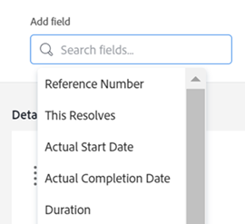

# Objectkoppen aanpassen met een lay-outsjabloon

Als Adobe Workfront-beheerder of groepsbeheerder kunt u een lay-outsjabloon gebruiken om de velden te configureren die gebruikers in de objectkoptekst zien wanneer ze de pagina van een object openen.

>[!IMPORTANT]
>
>Het aanpassen van objecten kopballen is momenteel beschikbaar voor projecten, taken, en kwesties.

Voor informatie over het maken van lay-outsjablonen raadpleegt u [Lay-outsjablonen maken en beheren](../use-layout-templates/create-and-manage-layout-templates.md).

Voor informatie over lay-outsjablonen voor groepen raadpleegt u [De lay-outsjablonen van een groep maken en wijzigen](../../../administration-and-setup/manage-groups/work-with-group-objects/create-and-modify-a-groups-layout-templates.md).

Nadat u een lay-outmalplaatje hebt gevormd, moet u het aan gebruikers voor veranderingen toewijzen u aanbracht om aan anderen zichtbaar te zijn. Voor informatie over het toewijzen van een lay-outsjabloon aan gebruikers raadpleegt u [Gebruikers toewijzen aan een lay-outsjabloon](../use-layout-templates/assign-users-to-layout-template.md).

## Toegangsvereisten

U moet de volgende toegang hebben om de stappen in dit artikel uit te voeren:

<table>
  <tr>
   <td><strong>Adobe Workfront-plan</strong>
   </td>
   <td>Alle
   </td>
  </tr>
  <tr>
   <td><strong>Adobe Workfront-licentie</strong>
   </td>
   <td>Plan
   </td>
  </tr>
  <tr>
   <td><strong>Configuraties op toegangsniveau</strong>
   </td>
   <td>U moet Workfront of een groepsbeheerder zijn.

   </td>
  </tr>
</table>

Als u nog steeds geen toegang hebt, vraagt u de Workfront-beheerder of deze aanvullende beperkingen op uw toegangsniveau instelt. Voor informatie over hoe een beheerder van Workfront uw toegangsniveau kan wijzigen, zie [Aangepaste toegangsniveaus maken of wijzigen](../../add-users/configure-and-grant-access/create-modify-access-levels.md).

## Objectkoppen aanpassen

1. Beginnen met het werken aan een lay-outsjabloon, zoals beschreven in [Lay-outsjablonen maken en beheren](../../customize-workfront/use-layout-templates/create-and-manage-layout-templates.md).
1. In de **Aanpassen wat gebruikers zien** vervolgkeuzelijst, selecteert u **Projecten**, **Taken**, of **Problemen**.

   <!--when this will be possible for more than 3 objects, at production, make this more general: update the sentence above to say "select an object you want to customize in the Customize what users see drop-down menu). -->

1. In de [!UICONTROL Header fields] te klikken, de muis over de weergegeven velden te verplaatsen en een van de volgende handelingen uit te voeren:
   * Klik op de knop **x** pictogram om een veld te verwijderen

     of

   * Klik en houd het **grijpen** om het veld naar een nieuwe locatie te slepen.

   <!--(NOTE: make sure the default names of these fields have not changed; otherwise, update screen shot)-->

   

1. U kunt maximaal vijf velden in de koptekst van een object opnemen.
Als u al vijf velden hebt geselecteerd, moet u een veld verwijderen voordat u een nieuw veld kunt toevoegen.
1. In de **Veld toevoegen** typt u de naam van een niet-bewerkbaar Workfront-veld dat u wilt toevoegen en selecteert u het veld wanneer het in de lijst wordt weergegeven. Het veld wordt direct rechts van het veld Toevoegen toegevoegd en wordt weergegeven als het eerste veld in de linkerbovenhoek van de koptekst van het object.

   >[!TIP]
   >
   >* U kunt alleen velden toevoegen die worden weergegeven in het gedeelte Overzicht van de sectie Details van het object en die niet kunnen worden bewerkt. Niet-bewerkbare velden zijn velden die gebruikers niet handmatig kunnen bewerken. Ze worden automatisch berekend door Workfront.
   >
   >* U kunt bewerkbare velden toevoegen die al deel uitmaken van de standaardkoppen (bijvoorbeeld Projecteigenaar, Status, Percentage voltooid, Toewijzingen).
   >
   >* Wanneer u het veld &quot;Opgelost door&quot; toevoegt aan de koptekst van een probleem, verandert het veld in &quot;Probleem oplossen, Taak of Project&quot; wanneer er een object is dat is gekoppeld aan het probleem.

   

1. (Optioneel) Sleep de toegevoegde velden in een andere volgorde.

1. Blijf het lay-outmalplaatje aanpassen.

   of

   Als u klaar bent met aanpassen, klikt u op **Opslaan**.

   >[!TIP]
   >
   >U kunt op elk gewenst moment op Opslaan klikken om de voortgang op te slaan en de sjabloon later blijven wijzigen.
