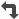

# Definieer tariefkenmerken

Met tariefkenmerken kunt u de functionaliteit van een Adobe Workfront-tariefkaart en -tarieven uitbreiden door extra dimensies toe te voegen aan snelheden die verder gaan dan de functie. Dit is van essentieel belang voor agentschappen en bedrijven waar de tarieven variëren, niet alleen naar functie, maar ook naar factoren zoals agentschap, locatie, merk, kostenplaats of andere.
Door deze kenmerken te combineren, kan Workfront automatisch het juiste percentage voor toewijzingen selecteren, waardoor de financiële nauwkeurigheid en consistentie in de verschillende projecten worden gewaarborgd.

>[!IMPORTANT]
>
>Snelheidskenmerken zijn een eenmalige basisinstelling.

Zodra attributen worden toegelaten en toegepast op tarief kaarten en tarieven, die later veranderen kan gegevensintegriteit over uw volledige financiële opstelling compromitteren.

## Overzicht van tariefkenmerken

Snelheidskenmerken worden beschouwd als een eenmalige instelling omdat:

* Kenmerken worden onderdeel van het financiële gegevensmodel zodra ze zijn ingeschakeld.
* Tarieven, toewijzingen, geplande waarden en werkelijke waarden zijn allemaal afhankelijk van de gekozen kenmerkwaarden.
* Als u kenmerken later wijzigt (naam wijzigen, verwijderen of opnieuw ordenen), kan dit leiden tot:

   * Verlies van koppeling tussen tarieven en kenmerken
   * Ongeldige of &#39;zwevende&#39; tarieven
   * Onjuiste afstemming op facturering en rapportage

Daarom moeten kenmerken zorgvuldig worden ontworpen tijdens de eerste Workfront-implementatie en nadien ongewijzigd blijven.

### Objecten die worden gebruikt als tariefkenmerken

Workfront biedt momenteel ondersteuning voor drie systeemobjecten die kunnen worden gebruikt als snelheidskenmerken:

* **Groep**: Vaak anders genoemd als _Agentschap_ of _BedrijfsEenheid_.
* **Bedrijf**: Kan _Merk_ vertegenwoordigen, _Cliënt_, of _Klant_.
* **Plaats**: Typisch gebruikt als _Markt_, _Gebied_, of _Bureau_.

  De locatie is hiërarchisch gedefinieerd tot 3 niveaus. (Voorbeeld: als u &quot;Locatie&quot; definieert als Los Angeles, worden Californië en de VS ook gebruikt voor tariefovereenkomsten.)

U kunt de naam van elk object aanpassen aan de terminologie van uw organisatie wanneer u uw kenmerken instelt.
Bijvoorbeeld:

* Label &quot;Agency&quot; = objectreferentie groep
* Label &quot;Cost Center&quot; = verwijzing naar object Subgroup
* &quot;Location&quot; label = Locatieobjectverwijzing

Hierdoor kan de configuratie de bedrijfsstructuur weerspiegelen en tegelijk de integriteit van het Workfront-gegevensmodel behouden.

### Opmerkingen over tariefkenmerken in Workfront

* Workfront ondersteunt maximaal 5 kenmerkniveaus. Het systeem volgt altijd de kenmerkhiërarchie, die de meest specifieke beschikbare gelijke selecteert.

   * 0 = algemeen basispercentage
   * 1 - 5 = geleidelijk specifiekere tarieven

* U kunt de namen van kenmerken wijzigen om uw bedrijf weer te geven (Bureau, Merk, Markt, Kostenplaats, enz.).
* Installatie is slechts eenmalig: als u de kenmerken wijzigt, bestaat het risico dat de integriteit van de financiële gegevens wordt aangetast.
* Kenmerken waarnaar nergens in het systeem wordt verwezen, kunnen veilig worden verwijderd.

  Nochtans, als een attribuut reeds in gebruik is (van verwijzingen voorzien in tariefkaarten, gebruikersprofielen, middelen, of taken), wordt de schrapping geblokkeerd om gegevensintegriteit te beschermen. In deze gevallen leidt het verwijderen van het kenmerk, met name via een API-aanroep, tot een fout.

* Test voor go-live: maak een proeftariefkaart en controleer of de juiste snelheden in toewijzingen worden opgelost.
* Documenteer uw opstelling: Deel uw opstelling van tariefattributen met uw teams zodat begrijpen zij hoe de tarieven werken.

### Waar tariefkenmerken kunnen worden toegepast

Snelheidskenmerken worden ondersteund op alle gebieden waar snelheden bestaan in Workfront:

* Rate cards: Definieer de tarieven op basis van de rol plus kenmerken van de taak.
* Overschrijvingen op projectniveau: pas attributen toe wanneer het met voeten treden van tarieven op het projectniveau.
* Functierollen (in Setup): standaardtaakrolsnelheden instellen met kenmerken.
* Gebruikers (gebruikersprofielen): wijs native kenmerken toe aan individuele gebruikers, zodat hun toewijzingen automatisch worden omgezet in de juiste snelheden.

<!--
BULLET POINT Staffing plan resources
BULLET POINT Non-labor resources: Attributes can also be defined on resources such as equipment or services.-->

<!--Non-labor resource categories and -->Taakrollen ondersteunen tariefkenmerken niet rechtstreeks op objectniveau. Ze zijn verbonden met tariefkenmerken via de op deze kenmerken gedefinieerde snelheden.

Wanneer u plaatsaanduidingstoewijzingen kunt maken die zijn gekoppeld aan de juiste kenmerkwaarden, worden de tarieven dienovereenkomstig ingevuld.

* Wanneer u de tijdelijke aanduiding later vervangt door een echte gebruiker, worden voor taakrollen de kenmerken van de toewijzing automatisch opnieuw ingesteld op de kenmerken die zijn gedefinieerd in het profiel van die gebruiker. Op dit punt kunnen kenmerken niet meer worden bewerkt op toewijzingsniveau. Zij erven van de gebruiker om consistentie te bewaren en wanverhouding tussen gebruikersattributen en toegepaste tarieven te verhinderen.

<!-- BULLET POINT For non-labor resource categories, placeholder assignments can be used similarly: You assign the category through a placeholder that carries the required attributes. Once the actual non-labor resource is substituted, the attributes are automatically pulled from the resource's profile. Just like with users, these attributes cannot be overridden manually at the assignment level, ensuring financial data integrity and preventing accidental mismatches between resources and their designated attributes.-->

## Toegangsvereisten

+++ Breid uit om de toegangseisen voor de functionaliteit in dit artikel weer te geven.

<table style="table-layout:auto"> 
 <col> 
 <col> 
 <tbody> 
  <tr> 
   <td>[!DNL Adobe Workfront] package</td> 
   <td>Workflow Ultimate</td> 
  </tr> 
  <tr> 
   <td>[!DNL Adobe Workfront] licentie</td> 
   <td>
[!UICONTROL Standard]
</td>
  </tr> 
  <tr> 
   <td>Configuraties op toegangsniveau</td> 
   <td>[!UICONTROL System Administrator]</td> 
  </tr> 
 </tbody> 
</table>

Voor informatie, zie [&#x200B; vereisten van de Toegang in de documentatie van Workfront &#x200B;](/help/quicksilver/administration-and-setup/add-users/access-levels-and-object-permissions/access-level-requirements-in-documentation.md).

+++

## Snelheidskenmerken configureren

Elk kenmerk heeft een set configureerbare opties, waaronder algemene eigenschappen en filters.
Filters bepalen hoe kenmerkwaarden worden voorgesteld en gevalideerd bij het definiëren van frequenties. Ze zijn essentieel voor het consistent houden van kenmerkselecties, het sturen van gebruikers naar geldige opties en het voorkomen van ongeldige combinaties.

{{step-1-to-setup}}

1. In het linkerpaneel, klik **Attributen van het Tarief**.
1. Klik een plusteken pictogram in het diagram om een attribuut toe te voegen.

   >[!NOTE]
   >
   >U kunt tot vijf attributen in het diagram hebben. De volgorde van boven naar beneden definieert de hiërarchie van de manier waarop de kenmerken worden toegepast. Klik **roteren** pictogram  om het diagram van links naar rechts te tonen. U kunt ook in- of uitzoomen en het diagram aan het scherm aanpassen.

1. Selecteer een kenmerk om het configuratievenster rechts van het scherm te openen.

   

1. Wijzig de naam van de objecten (Groep, Bedrijf, Locatie) in de termen die nodig zijn voor uw bedrijf (zoals Bureau, Locatie, Kostenplaats).
1. Klik **sparen** op elk attribuut om uw noemende overeenkomst te bewaren.

   De namen van deze kenmerken worden weergegeven op alle tariefkaarten en -snelheden in het systeem.

1. Stel de eigenschappen voor elk kenmerk in het configuratievenster in:

   * **Vereist**: Selecteer of het attribuut een vereist gebied op tarieven is.
   * **dat in opbrengstberekening** moet worden gebruikt: Omvat dit attribuut in het factureren tariefberekeningen.
   * **dat in kostenberekening** moet worden gebruikt: Omvat deze eigenschap in kostentariefberekeningen.

     >[!NOTE]
     >
     >Ten minste een van de berekeningsopties moet worden geselecteerd om de eigenschap in financiële berekeningen te laten functioneren.

   * (Facultatief) **Hiërarchisch**: Staat de attributen toe om ouder-kind verhoudingen, zoals Stad > Staat > Land te respecteren.

     Deze eigenschap is alleen beschikbaar voor het object Location.

### Filters definiëren voor de kenmerken

Er zijn twee typen filters beschikbaar voor de kenmerken:

* Suggestiefilters beperken de lijst met beschikbare opties op basis van systeemlogica of eerdere kenmerkselecties. Ze maken dropdowns context-bewust en gemakkelijk te gebruiken.

  Voorbeeld: Bureau > Locatie > Kostenplaats

  In deze opstelling, zou de attributen van het Centrum van Kosten een Filter van de Suggestie moeten hebben die zowel Agentschap als Plaats van verwijzingen voorziet.

  Als u een tarief toevoegt, als u eerst Agentschap = &quot;Ster,&quot;selecteert, dan zal de drop-down plaats slechts Plaatsen voorstellen die tot &quot;Ster behoren.&quot;

  Als u dan Plaats = Chicago op het tarief selecteert, zal het drop-down Kostencentrum slechts kostenplaatsen voorstellen verbonden aan &quot;Ster&quot;en Chicago.

* Relatiefilters bepalen de afhankelijkheidsketen tussen kenmerken. Zij zorgen ervoor dat het systeem begrijpt hoe de attributen op elkaar betrekking hebben en dwingen geldige gebiedsdelen af.

  Voorbeeld: Bureau > Locatie > Kostenplaats

  In deze opstelling, zou het attribuut van het Agentschap een Filter van de Verhouding moeten hebben die het aan geldige Plaatsen en Kostenplaatsen bindt.

Filters moeten altijd in beide richtingen worden geconfigureerd. Als Attribuut A een Filter van de Verhouding met Attribuut B heeft, dan zou Attribuut B een Filter van de Suggestie terug naar Attribuut A moeten hebben. Dit zorgt voor gegevensintegriteit en een schone gebruikerservaring.

1. Selecteer opties om de Filters van de Suggestie en de Filters van de Verhouding voor het attribuut in het configuratievenster te bepalen:

   * **type van Filter**:

      * A **Standaard** filter past een universele voorwaarde op het attributenvoorwerp toe. Bijvoorbeeld, is de Plaats > Actief = Waar (slechts de actieve Plaatsen zullen worden getoond).

        Het filter Standaard wordt altijd toegepast, ongeacht of andere kenmerken zijn geselecteerd.

      * Een **filter van Attributen** verbindt één attribuut aan een andere in de ketting. Bijvoorbeeld Locatie > Referentie = Agentschap (alleen locaties die aan het geselecteerde Agentschap zijn gekoppeld, worden weergegeven).

        Het filter Kenmerk wordt alleen toegepast als het kenmerk waarnaar wordt verwezen een waarde heeft. Als bijvoorbeeld Agency is geselecteerd, worden alleen geldige locaties voorgesteld. Als Agency leeg is, worden alle Locaties weergegeven (maar zijn mogelijk beperkt door standaardfilters die op de Locatie worden toegepast).

   * **Gebied**: Het directe gebied van het attributenvoorwerp, zoals identiteitskaart van de Plaats of Actieve Vlag.
   * **Exploitant**: Deze opties hangen van het geselecteerde type van Gebied af. Voorbeelden zijn Gelijk, niet gelijk aan, Is leeg, Waar/Onwaar.
   * (Standaard filtertype slechts) **Waarde**: Bijvoorbeeld, is Actief = Waar.
   * (Het filtertype van Attributen slechts) **Verwijzing**: De attributen die dit filter van, zoals Agentschap afhangt.
   * (Het filtertype van Attributen slechts) **Gebied van de Verwijzing**: Het gebied op de referenced attributen die, zoals identiteitskaart van het Agentschap moeten aanpassen.

1. Klik **sparen** op elk attribuut om de eigenschappen en de filters te bewaren.
