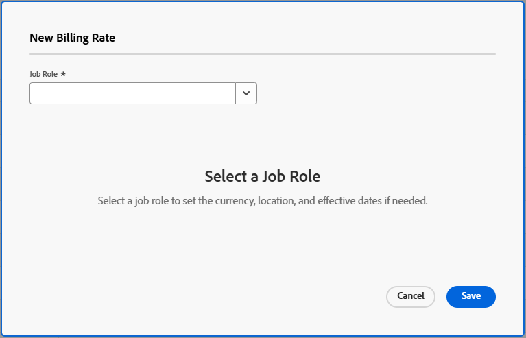

# Creditcards beheren

{{highlighted-preview-article-level}}

Een tariefkaart vertegenwoordigt de contractuele overeenkomst met uw cliënt waarin uurtarieven voor de baanrollen worden bepaald die het werk zullen voltooien. In een tariefkaart, kunt u veelvoudige factureringstarieven per baanrol bepalen, die op attributen zoals agentschap, plaats, of kostenplaats wordt gebaseerd. Uw unieke tariefattributen worden gevormd in het gebied van de Opstelling. Voor meer informatie, zie [ tariefattributen ](/help/quicksilver/administration-and-setup/manage-enterprise-operations/define-rate-attributes.md) bepalen.

U zou bijvoorbeeld een functie van Designer kunnen hebben die in Parijs gevestigd is voor Bureau A, een andere Designer die in Parijs gevestigd is voor Bureau B, en een derde Designer die in New York gevestigd is en niet aan een agentschap toegewezen is, elk met verschillende factureringstarieven. Kenmerken zijn echter niet vereist voor taakrollen op een tariefkaart. De kenmerken dienen als gereedschappen voor het vaststellen van kortere snelheden. Een factureringstarief op een tariefkaart kan ook datatarakter effectief zijn, zodat het tarief begint en op gespecificeerde data eindigt.

U kunt tarieven op een tariefkaart ook sluiten om hen te verhinderen op het project of taakniveau worden met voeten getreden. Vergrendelde snelheden zijn de hoogste in de hiërarchie van factureringssnelheden, behalve voor behouden tarieven voor een project. Voor meer informatie, zie [ Overzicht van opbrengst en kostenhiërarchie ](/help/quicksilver/manage-work/projects/project-finances/overview-revenue-cost-hierarchy.md).

## Toegangsvereisten

+++ Breid uit om de toegangseisen voor de functionaliteit in dit artikel weer te geven.

<table style="table-layout:auto"> 
 <col> 
 <col> 
 <tbody> 
  <tr> 
   <td>[!DNL Adobe Workfront] package</td> 
   <td>Workflow Ultimate</td> 
  </tr> 
  <tr> 
   <td>[!DNL Adobe Workfront] licentie</td> 
   <td>[!UICONTROL Standard]</td>
  </tr> 
  <tr> 
   <td>Configuraties op toegangsniveau</td> 
   <td>Toegang bewerken tot [!UICONTROL Rate Cards]</td> 
  </tr> 
  <tr> 
   <td>Objectmachtigingen</td> 
   <td>Als u een tariefkaart wilt bewerken die met u wordt gedeeld, moet u beheerdersmachtigingen voor de tariefkaart hebben.</td> 
  </tr> 
 </tbody> 
</table>

Voor informatie, zie [ vereisten van de Toegang in de documentatie van Workfront ](/help/quicksilver/administration-and-setup/add-users/access-levels-and-object-permissions/access-level-requirements-in-documentation.md).

+++

## Creditcard toevoegen

{{step-1-to-setup}}

1. In het linkerpaneel, klik [!UICONTROL **kaarten van het Tarief**].
1. Klik [!UICONTROL **Nieuwe tariefkaart**], dan klik [!UICONTROL **creeer nieuwe tariefkaart**].
1. Typ een naam en een beschrijving voor de tariefkaart in de [!UICONTROL **Nieuwe tariefkaart**] doos.

   De naam moet uniek zijn.

   

1. (Facultatief) selecteer a [!UICONTROL **Groep**] voor de tariefkaart. Dit is het bureau dat de tariefkaart bepaalt.
1. (Facultatief) selecteer a [!UICONTROL **Bedrijf**] voor de tariefkaart. Dit is de cliënt waarvoor de tarieven worden gecontracteerd.

   >[!NOTE]
   >
   >De Groep en het Bedrijf worden gebruikt niet alleen in de kaartdetails van het tarief, maar ook als filters wanneer het vastmaken van een tariefkaart aan een project.

1. Klik **creëren**.

   Het scherm Rate Card > Job Roles and Rates wordt weergegeven.

1. Klik [!UICONTROL **toevoegt baanrol**].
1. In het [!UICONTROL **Nieuwe het FactureringsTarief**] vakje, selecteer de Rol van de a [!UICONTROL **Baan**] om het factureren tarieven voor te bepalen.

   

1. (Optioneel) Selecteer kenmerken voor de factureringssnelheid, zoals Bureau, Locatie of Kostenplaats.

   >[!NOTE]
   >
   >Deze eigenschappen worden afzonderlijk gedefinieerd en kunnen de opbrengsten- en kostprijsberekeningen beïnvloeden. Voor meer informatie, zie [ tariefattributen ](/help/quicksilver/administration-and-setup/manage-enterprise-operations/define-rate-attributes.md) bepalen.

1. Selecteer a [!UICONTROL **Valuta**] voor het het factureren tarief.
1. (Facultatief) ga alias van de a [!UICONTROL **rol van de Baan**] voor de baanrol in.

   Als de aliasnaam die u typt nog niet bestaat, kunt u deze toevoegen.

   Wanneer de tariefkaart aan een project in bijlage is, verschijnt de alias op informatie zoals placeholder taken, uitgaven, en rapporten, in plaats van de interne naam van de baanrol.

   >[!NOTE]
   >
   >* Er kan slechts één alias bestaan voor elke taakrol en kenmerkcombinatie binnen één tariefkaart.
   >* Een alias moet op de tariefkaart worden bijgewerkt en kan niet op een project worden uitgegeven.

1. Op het [!UICONTROL **FactureringsTarief**] gebied, ga het factureringstarief voor deze baanrol en zijn attributen in.
1. (Facultatief) selecteer [!UICONTROL **tarief van het Slot**] om dit tarief te sluiten en het niet toe te staan om op het project of taakniveau worden veranderd. U kunt deze indien nodig later ontgrendelen.
1. (Facultatief) klik [!UICONTROL **toevoegen datadeffect**] om efficiënte datums op het het factureren tarief toe te passen.
1. (Facultatief) klik [!UICONTROL **toevoegen datageffect**] opnieuw om meer het factureringspercentages met efficiënte data voor deze baanrol en zijn attributen toe te voegen.
1. (Voorwaardelijk) Als u meer dan één factureringstarief voor deze baanrol toevoegt, ga de volgende informatie in:

   * [!UICONTROL **het Facturerings Tarief**]: De waarde van het facturerings tarief voor de tijdspanne.
   * [!UICONTROL **Datum van het Begin**]: De datum wanneer het tarief begint.
   * [!UICONTROL **Datum van het Eind**]: De datum wanneer het tarief beëindigt.

     De eerste factureringssnelheid is niet vereist om een begindatum te hebben en de laatste factureringssnelheid hoeft geen einddatum te hebben. Tussenruimten zijn toegestaan tussen de snelheidsdatums, maar overlappende datums zijn niet toegestaan. Tijdens een hiaat, worden andere gebieden van de het facturerings tariefhiërarchie gebruikt om het het factureren tarief te bepalen, dat op het opbrengsttype van een taak wordt gebaseerd. Voor meer informatie, zie [ Overzicht van opbrengst en kostenhiërarchie ](/help/quicksilver/manage-work/projects/project-finances/overview-revenue-cost-hierarchy.md).

1. Klik [!UICONTROL **sparen**].
1. (Facultatief) om een ander het facturerings tarief toe te voegen, of voor de zelfde baanrol met verschillende attributen of voor een afzonderlijke baanrol, klik [!UICONTROL **toevoegt baanrol**].

   De tarieven voor elke rol worden toegevoegd aan de tariefkaart aangezien u hen creeert. Het momenteel efficiënte tarief, dat op de data wordt gebaseerd, wordt vermeld met een pictogram .

   

## Creditcardgegevens en tarieven bewerken

{{step-1-to-setup}}

1. In het linkerpaneel, klik [!UICONTROL **kaarten van het Tarief**].
1. Als u een bestaande tariefkaart wilt bewerken, klikt u op de naam van de tariefkaart in de lijst Rate Cards.
1. Om de details van de tariefkaart bij te werken, klik [!UICONTROL **Details**] in het linkerpaneel.
1. (Facultatief) om een douaneformulier aan de tariefkaart vast te maken, klik [!UICONTROL **voeg douaneformulier**] gebied in de hoger-juiste hoek van de pagina van Details toe, en selecteer een douaneformulier van de lijst die toont.

   Voor meer informatie bij het vastmaken van een douanevorm, zie [ een douanevorm aan een voorwerp ](/help/quicksilver/workfront-basics/work-with-custom-forms/add-a-custom-form-to-an-object.md) toevoegen.

1. Klik [!UICONTROL **sparen Veranderingen**] na het uitgeven van de details van de tariefkaart.
1. Klik [!UICONTROL **Rollen en Tarieven van de Baan**] in het linkerpaneel om de het factureren tarieven uit te geven.
1. Om een tarief uit te geven, selecteer het controlevakje naast het tarief en klik [!UICONTROL **geef**] in de actiebar bij de bodem van het scherm uit.

   Voor meer informatie over de actiebar, zie [ Gebruik verbeterde lijsten ](/help/quicksilver/workfront-basics/navigate-workfront/use-lists/enhanced-lists.md).

   >[!NOTE]
   >
   >Omdat elke snelheid is gekoppeld aan de combinatie van de rol en kenmerken om een uniek tarief te maken, kunnen de rol en de kenmerken niet worden gewijzigd wanneer u een tarief bewerkt.

1. Om een het factureren tarief van de tariefkaart te schrappen, selecteer de controledoos naast het tarief en klik [!UICONTROL **Schrapping**] op de actiebar.
1. Om een tarief te sluiten, selecteer het controlevakje naast het tarief en klik [!UICONTROL **Slot**] op de actiebar.

   Vergrendelde snelheden kunnen niet worden gewijzigd op project- of taakniveau. Er verschijnt een vergrendelingspictogram naast vergrendelde snelheden in de lijst.

   U kunt ook een vergrendelde snelheid ontgrendelen via de actiebalk.

1. Ga als volgt te werk om de percentages met een percentage aan te passen:

   1. Selecteer alle tarieven u op de Kaart van het Tarief > de Rollen van de Baan en het scherm van Tarieven wilt aanpassen.

      U kunt één of meerdere tarieven kiezen. Alles zal met hetzelfde percentage worden aangepast.

   1. Klik [!UICONTROL **aanpassen tarieven**] op de actiebar.
   1. In [!UICONTROL **pas de doos van de de baanrol van de Taak**] aan, kies of u de tariefaanpassing tijdens de geselecteerde tijdspanne (de bestaande efficiënte data) of een waaier van de douanedatum wilt gebeuren die u bepaalt.

      

   1. Voer de aanpassingswaarde voor de snelheden in.

      Deze waarde wordt toegepast als een percentage. Als u bijvoorbeeld 10 invoert, worden de geselecteerde percentages met 10% verhoogd.

   1. Klik [!UICONTROL **Tarieven van de Update**].
   1. Klik [!UICONTROL **Update**] op het bevestigingsbericht.

      De geselecteerde percentages worden verhoogd met het percentage.

## Een tariefkaart importeren

Zie de artikel [ kaarten van het het tarief van de Invoer van een malplaatje ](/help/quicksilver/administration-and-setup/manage-enterprise-operations/import-rate-cards.md).

## Een creditcard kopiëren

{{step-1-to-setup}}

1. In het linkerpaneel, klik [!UICONTROL **kaarten van het Tarief**].
1. Selecteer de controledoos naast de tariefkaart in de lijst en klik het **pictogram van het Exemplaar** pictogram van het Exemplaar 
1. Typ een naam voor de nieuwe tariefkaart in het [!UICONTROL **tariefkaart van het Exemplaar**] vakje. Dan, klik [!UICONTROL **creëren**].

   De nieuwe tariefkaart wordt opgeslagen. Bewerk indien nodig de gegevens van de tariefkaart, de taakrollen en de tarieven.

## Een volledige tariefkaart verwijderen

{{step-1-to-setup}}

1. In het linkerpaneel, klik [!UICONTROL **kaarten van het Tarief**].
1. Selecteer de controledoos naast de tariefkaart in de lijst, en klik het **pictogram van de Schrapping** .

   >[!NOTE]
   >
   >Een aan een project gekoppelde tariefkaart wordt uit het project verwijderd.

