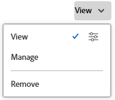

# Een creditcard delen

{{highlighted-preview-article-level}}

U kunt een tariefkaart met gebruikers, baanrollen, groepen, teams, bedrijven, en bedrijfsprofielen delen.

## Toegangsvereisten

+++ Breid uit om de toegangseisen voor de functionaliteit in dit artikel weer te geven.

<table style="table-layout:auto"> 
 <col> 
 <col> 
 <tbody> 
  <tr> 
   <td>[!DNL Adobe Workfront] package</td> 
   <td>Workflow Ultimate</td> 
  </tr> 
  <tr> 
   <td>[!DNL Adobe Workfront] licentie</td> 
   <td>[!UICONTROL Standard]</td>
  </tr> 
  <tr> 
   <td>Configuraties op toegangsniveau</td> 
   <td>Toegang weergeven of vergroten tot [!UICONTROL Rate Cards]</td> 
  </tr> 
  <tr> 
   <td>Objectmachtigingen</td> 
   <td>Machtigingen of hoger weergeven voor de tariefkaart die u wilt delen</td> 
  </tr> 
 </tbody> 
</table>

Voor informatie, zie [ vereisten van de Toegang in de documentatie van Workfront ](/help/quicksilver/administration-and-setup/add-users/access-levels-and-object-permissions/access-level-requirements-in-documentation.md).

+++

## Een creditcard delen

{{step-1-to-setup}}

1. In het linkerpaneel, klik [!UICONTROL **kaarten van het Tarief**].
1. Selecteer de controledoos naast één of meerdere tariefkaarten in de lijst, en klik het **pictogram van het Aandeel** pictogram .
1. In de doos die toont, onder [!UICONTROL **toegang van de het tariefkaart van de Verlening tot**], begin de naam van de entiteit te typen u de tariefkaart met wilt delen, dan het van de lijst van opties selecteren.
1. Klik op de vervolgkeuzelijst rechts van de naam van de entiteit en selecteer het desbetreffende machtigingsniveau voor deze tariefkaart:

   * Weergeven: kan de tariefkaart weergeven en delen.
   * Beheren: kan de tariefkaart bewerken.

1. Om toegang aan te passen, klik het geavanceerde optiepictogram naast het toestemmingsniveau u hebt verleend om specifieke toestemmingen op de tariefkaart te vormen.

   

1. Klik [!UICONTROL **sparen**].

   Voor meer informatie bij het delen, zie [ een voorwerp ](/help/quicksilver/workfront-basics/grant-and-request-access-to-objects/share-an-object.md) delen.

