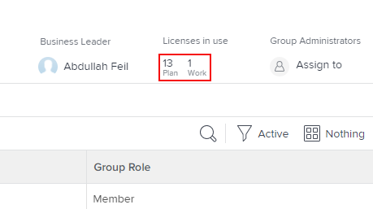

# Het aantal licenties weergeven dat is toegewezen en gebruikt in een groep

Als beheerder van Adobe Workfront, kunt u tellingen van de individuele types van vergunningen bekijken die momenteel in uw groep en zijn subgroups worden gebruikt. Dit is nuttig wanneer u moet beoordelen of om vergunningen opnieuw te verdelen.

Als er groepen zijn boven de groep die u beheert, kunnen hun beheerders dit ook voor uw groep doen. Hetzelfde geldt voor Workfront-beheerders (voor elke groep).

>[!IMPORTANT]
>
>De licentie van een gebruiker wordt alleen in een bepaalde groep geteld als de groep de thuisgroep van de gebruiker is.

## Toegangsvereisten

+++ Breid uit om de toegangseisen voor de functionaliteit in dit artikel weer te geven.

<table style="table-layout:auto"> 
 <col> 
 <col> 
 <tbody> 
  <tr> 
   <td>Adobe Workfront-pakket</td> 
   <td>
Alle
</td> 
  </tr> 
  <tr> 
   <td>Adobe Workfront-licentie</td> 
   <td>
Standard

       
Plan
</td>
  </tr>
  <tr> 
   <td>Configuraties op toegangsniveau</td> 
   <td>U moet een groepsbeheerder van de groep of een systeembeheerder zijn.</td>
  </tr>
 </tbody> 
</table>

Voor informatie, zie [&#x200B; vereisten van de Toegang in de documentatie van Workfront &#x200B;](/help/quicksilver/administration-and-setup/add-users/access-levels-and-object-permissions/access-level-requirements-in-documentation.md).

+++

## Het aantal licenties weergeven dat in een groep wordt gebruikt

{{step-1-to-setup}}

1. In het linkerpaneel, klik **Groepen** .

1. Klik op de naam van de groep.
1. Op de pagina die, in het kopbalgebied dichtbij de hoger-juiste hoek toont, bekijk de **Vergunningen in gebruik** gebied om het aantal **Plan** en **het werk** vergunningen te zien momenteel worden gebruikt.

   Als u een groep op hoofdniveau bekijkt en de beheerder van Workfront een maximumaantal van elk vergunningstype voor de groep bepaalde, worden deze aantallen ook getoond. In de onderstaande groep kunnen maximaal 10 gebruikers bijvoorbeeld een licentie voor een abonnement hebben en 15 gebruikers kunnen een werkvergunning hebben:

   

   Voor informatie over hoe een beheerder van Workfront een maximumaantal toegewezen vergunningen voor een groep bepaalt, zie de sectie [&#x200B; de maximumvergunningstelling voor een Groep van het Huis &#x200B;](../../../administration-and-setup/get-started-wf-administration/manage-available-licenses-in-your-system.md#set) in het artikel [&#x200B; beheert beschikbare vergunningen in uw systeem &#x200B;](../../../administration-and-setup/get-started-wf-administration/manage-available-licenses-in-your-system.md).

   >[!NOTE]
   >
   >Als de groep die u bekijkt een subgroep is, kunt u alleen het aantal gebruikte licenties weergeven en niet het maximumaantal licenties dat voor de groep is toegewezen. Workfront-beheerders definiëren namelijk geen maximumaantal licenties voor een subgroep.
   >
   >
   >

1. Voor afzonderlijke tellingen van elk type van vergunning momenteel gebruikt in de groep (met inbegrip van Overzicht en Verzoek), klik het tekstgebied direct onder **Vergunningen in gebruik:**

    te zien

   Het vak dat wordt weergegeven, bevat dezelfde informatie voor alle vier de Workfront-licentietypen: Overzicht, Werkplan, Revisie en Verzoek. Onder aan het vak ziet u het totale aantal licenties dat door leden van deze groep of een van de subgroepen wordt gebruikt:

   

   Voor Revisie- en Request-licenties wordt in de kolom Max altijd Onbeperkt weergegeven.
