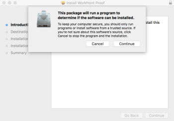

# Installeer de Desktop Proofing Viewer voor uw organisatie

De Desktop Proofing Viewer, die voornamelijk is ontworpen voor het controleren van interactieve inhoud, is een toepassing die op de lokale computer van elke gebruiker moet worden geïnstalleerd. Als Adobe Workfront-beheerder of Workfront Proof-beheerder kunt u deze installatie uitvoeren.

## Toegangsvereisten

U moet het volgende hebben:

<table style="table-layout:auto"> 
 <col> 
 <col> 
 <tbody> 
  <tr> 
   <td role="rowheader">Adobe Workfront-abonnement*</td> 
   <td> 
Huidig plan: Pro of hoger
 
of
 
Ouder plan: Premium of Selecteren
 
Voor meer informatie over het proefdrukken van toegang met de verschillende plannen, zie <a href="../../../administration-and-setup/manage-workfront/configure-proofing/access-to-proofing-functionality.md" class="MCXref xref">Toegang tot proefdrukfunctionaliteit in Workfront</a>.
 </td> 
  </tr> 
  <tr> 
   <td role="rowheader">Adobe Workfront-licentie*</td> 
   <td> 
Huidig plan: Werken of plannen
 
Ouder plan: Willekeurig (proefdrukken moet zijn ingeschakeld voor de gebruiker)
 </td> 
  </tr> 
  <tr> 
   <td role="rowheader">Configuraties op toegangsniveau*</td> 
   <td> 
Beheerder moet zijn geselecteerd in het machtigingsprofiel voor proefdrukken. Zie voor meer informatie <a href="../../../administration-and-setup/manage-workfront/configure-proofing/configure-a-users-proofing-access.md" class="MCXref xref">De proefdruktoegang van een gebruiker configureren</a>.
 </td> 
  </tr> 
 </tbody> 
</table>

&#42;Neem contact op met uw Workfront-beheerder om te weten te komen welk plan, licentietype of toegang u hebt.

## Systeemvereisten

De Desktop Proofing Viewer wordt ondersteund op de volgende besturingssystemen:

* Windows 7 en hoger, 32-bits en 64-bits
* Mac OS X 10.9 en hoger, 64-bits

## Vereisten

Als u gebruikers de Desktop Proofing Viewer wilt laten gebruiken, moet u

* Configureer het systeem om de Desktop Proofing Viewer te starten als de standaardweergave voor interactieve proefdrukken vóór de installatie.

## De Desktop Proofing Viewer configureren als standaard voor interactieve proefdrukken

Nadat u de Desktop Proofing Viewer voor uw organisatie hebt geïnstalleerd, kunt u deze instellen als de standaardviewer voor interactieve proefdrukken.

1. Vanuit Workfront klikt u op het hoofdmenu en klik vervolgens op Proofing  om toegang te krijgen tot Workfront Proof.

1. Klikken **Accountinstellingen** in de rechterbovenhoek van Workfront Proof en klik vervolgens op de knop **Instellingen** tab.

1. Onder **Standaardwaarden proefdrukken** aan het einde van de **Desktop Proofing Viewer voor interactieve proefdrukken** rij, klik **Instellen**.

   

1. Klikken **Ingeschakeld en standaard** en klik vervolgens op **Opslaan**.

## De Desktop Proofing Viewer installeren voor uw gebruikers

* [De Desktop Proofing Viewer installeren op Mac](#installing-the-desktop-proofing-viewer-on-mac)
* [De Desktop Proofing Viewer installeren in Windows](#installing-the-desktop-proofing-viewer-on-windows)

### De Desktop Proofing Viewer installeren op Mac {#installing-the-desktop-proofing-viewer-on-mac}

1. Voer op de computer van de gebruiker een van de volgende handelingen uit om de app te downloaden:

   * Als u de productieomgeving gebruikt, klikt u op  [Mac Production Download voor de Desktop Proofing Viewer.](https://assets.proofhq.com/nativeviewer/desktop_viewer/Workfront+Proof-2.1.19.pkg)
   * Als u de voorvertoningsomgeving gebruikt, klikt u op  [Mac Preview Download voor de Desktop Proofing Viewer.](https://assets.preview.proofhq.com/nativeviewer/desktop_viewer/Workfront+Proof+Preview-2.1.19.pkg)
)

1. Open het bestand dat u zojuist hebt gedownload om de installatie te starten.
1. Klik in het installatievak dat wordt weergegeven op **Doorgaan** en klik vervolgens op **Installeren**.

   

1. Zorg ervoor dat elke gebruiker de installatie voltooit door een interactieve proefdruk te openen vanuit het gebied Documenten in Workfront.

### De Desktop Proofing Viewer installeren in Windows {#installing-the-desktop-proofing-viewer-on-windows}

1. Voer op de computer van de gebruiker een van de volgende handelingen uit om de app te downloaden:

   * Klik in de productieomgeving op [Windows Production-download voor de Desktop Proofing Viewer.](https://assets.proofhq.com/nativeviewer/desktop_viewer/Workfront+Proof+Setup+2.1.19.exe)
   * Klik in de voorvertoningsomgeving op [Windows Preview-download voor de Desktop Proofing Viewer](https://assets.preview.proofhq.com/nativeviewer/desktop_viewer/Workfront+Proof+Preview+Setup+2.1.19.exe).

1. Open het bestand dat u zojuist hebt gedownload om de installatie te starten.
1. Klik in het beveiligingswaarschuwingsvenster dat wordt weergegeven op **Uitvoeren**.

   

   De Desktop Proofing Viewer wordt geïnstalleerd en uitgevoerd.

1. (Voorwaardelijk) Als u de toepassing installeert met Internet Explorer, vernieuwt u de startpagina in de browser nadat de toepassing is geïnstalleerd.
1. Zorg ervoor dat elke gebruiker de installatie voltooit door een interactieve proefdruk te openen vanuit het gebied Documenten in Workfront.
