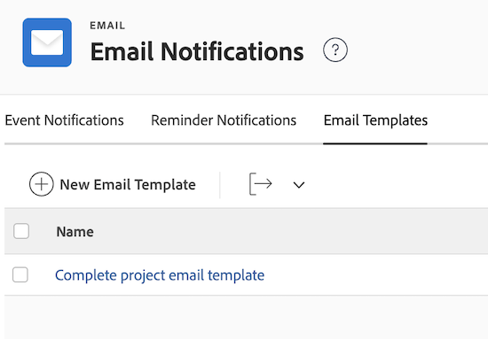
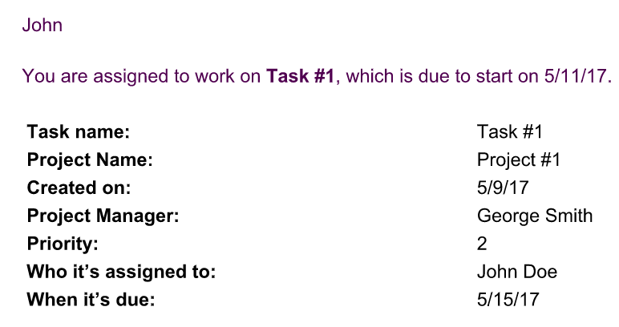

# E-mailsjablonen configureren

Als Adobe Workfront-beheerder kunt u e-mailsjablonen configureren ter ondersteuning van herinneringsberichten.

E-mailsjablonen bevatten het bericht dat naar gebruikers wordt verzonden wanneer een herinneringsmelding wordt gestart.\
Zonder een e-mailsjabloon wordt de herinneringsmelding als lege inhoud in de tekst van de e-mail verzonden.

E-mailsjablonen kunnen worden gekoppeld aan herinneringsmeldingen voor problemen, taken, projecten en tijdbladen. Wanneer u e-mailsjablonen maakt, kan uw Workfront-beheerder inhoud voor de e-mail en een onderwerpregel opgeven.

## Toegangsvereisten

U moet de volgende toegang hebben om de stappen in dit artikel uit te voeren:

<table style="table-layout:auto"> 
 <col> 
 <col> 
 <tbody> 
  <tr> 
   <td role="rowheader">Adobe Workfront-plan</td> 
   <td>Alle</td> 
  </tr> 
  <tr> 
   <td role="rowheader">Adobe Workfront-licentie</td> 
   <td>Plan</td> 
  </tr> 
  <tr> 
   <td role="rowheader">Configuraties op toegangsniveau</td> 
   <td> <p>Systeembeheerder</p> </td> 
  </tr> 
 </tbody> 
</table>

## Een nieuwe e-mailsjabloon maken {#create-a-new-email-template}

1. Klik op de knop **Hoofdmenu** pictogram  in de rechterbovenhoek van Adobe Workfront klikt u op **Instellen** .

1. Klik in het linkerdeelvenster op **E-mail** > **Meldingen**> **E-mailsjablonen**.

<!--hidden for tab redesign - August 2023: 
  
  -->

1. Klikken **Nieuwe e-mailsjabloon**.

1. In de **Nieuwe e-mailsjabloon** Geef de volgende informatie op in het vak dat wordt weergegeven:

   <table style="table-layout:auto"> 
    <col> 
    <col> 
    <tbody> 
     <tr> 
      <td role="rowheader">Naam</td> 
      <td>Titel van de e-mailsjabloon (vereist).</td> 
     </tr> 
     <tr> 
      <td role="rowheader">Objecttype</td> 
      <td>Geef het objecttype op waarmee u de sjabloon wilt koppelen (verplicht; standaard wordt dit ingesteld op 'Issue').</td> 
     </tr>
     <tr> 
      <td role="rowheader">Beschrijving</td> 
      <td>Beschrijving van de sjabloon.</td> 
     </tr>

   <tr> 
      <td role="rowheader">Onderwerp </td> 
      <td>Onderwerp dat wordt getoond wanneer het e-mailbericht wordt verzonden (vereist).</td> 
     </tr> 
     <tr> 
      <td role="rowheader">Lichaam </td> 
      <td> <p>Inhoud die wordt weergegeven wanneer het e-mailbericht wordt verzonden.</p> <p>U kunt HTML-opmaak gebruiken voor de e-mailinhoud, zoals beschreven in <a href="#add-html-formatting-to-an-email-template" class="MCXref xref">HTML-opmaak toevoegen aan een e-mailsjabloon</a> in dit artikel.</p> </td> 
     </tr> 
    </tbody> 
   </table>

1. Klikken **Opslaan**.

## HTML-opmaak toevoegen aan een e-mailsjabloon {#add-html-formatting-to-an-email-template}

U kunt HTML-tags toevoegen aan e-mailsjablonen om aangepaste meldingen te maken.\
Beginnen met het maken van de e-mailsjabloon zoals beschreven in [Een nieuwe e-mailsjabloon maken](#create-a-new-email-template).

Met HTML-opmaak kunt u uw e-mailsjablonen verrijken, zoals in de volgende secties wordt getoond.

* [Koppeling naar Workfront-objecten](#link-to-workfront-objects)
* [Koppelen naar aangepaste velden met HTML](#link-to-custom-fields-with-html)
* [E-mailvoorbeelden HTML](#html-email-examples)

### Koppeling naar Workfront-objecten {#link-to-workfront-objects}

U kunt koppelingen naar Workfront-velden opnemen met de `$$` jokerteken om de e-mailgenerator te vertellen naar waarden van het gegevensbestand te zoeken verbonden aan een specifiek voorwerp.

De hoofdtekst van de e-mail voor een melding waarin de taakontvanger wordt gewaarschuwd voor de taak die op het punt staat te worden gestart, kan bijvoorbeeld de volgende structuur volgen:

```html
<html>
<p>$$assignedTo:firstName$$</p>
<p>You are assigned to work on <b><a href="https://<your domain>.my.workfront.com/task/view?ID=$$ID$$">$$name$$</a></b>, which is due to start on $$plannedStartDate$$.</p>
<table width="350" style="font-size:12px;">
<tr>
<td><b><strong>HEADING</b></td>
<td>$$WILDCARD$$</td>
</tr>
<tr>
<td><b>HEADING</b></td>
<td>$$WILDCARD$$</td>
</tr>
<tr>
<td><b>HEADING</b></td>
<td>$$WILDCARD$$</td></tr>
</table>
</html>
```

Voer een van de volgende handelingen uit om de waarde &quot;jokerteken&quot; voor een object op te halen:

<!-- Refer to the API Explorer and select the names of your objects from the Fields tab of any object. For more information about the API Explorer, see [Adobe Workfront API](../../../wf-api/workfront-api.md).-->

* Gebruik de waarde &quot;valueField&quot; die u vindt in een weergave in de tekstmodus van een rapport. Zie voor meer informatie over waarden voor de tekstmodus [Overzicht van de tekstmodus](../../../reports-and-dashboards/reports/text-mode/understand-text-mode.md).

  De waarde &#39;kop&#39; kan de naam van het object zijn, zoals u wilt dat het in de hoofdtekst van de e-mail wordt weergegeven.

### Koppelen naar aangepaste velden met HTML {#link-to-custom-fields-with-html}

U kunt koppelingen naar gebruikers en aangepaste velden opnemen met de **$$** jokerteken om de e-mailgenerator te vertellen naar waarden van het gegevensbestand te zoeken verbonden aan het voorwerp. Ze moeten aan beide zijden van de verwijzing naar databasekenmerken aanwezig zijn.

Als u bijvoorbeeld de volgende tekst toevoegt als HTML, wordt de voornaam van de toegewezen gebruiker toegevoegd aan het herinneringsbericht dat aan een taak is gekoppeld:

`assignedTo:firstName`

Als u aangepaste velden wilt toevoegen met dezelfde opmaak, kunt u het volgende toevoegen in uw e-mailbericht:

`DE:Custom Field As It Appears in Workfront`

Dit is bijvoorbeeld een e-mailsjabloon met een verwijzing naar een aangepast veld met de naam Datum van levering. Hierbij wordt ervan uitgegaan dat het veld Datum van levering tot een taak behoort.

Vervangen `<your domain>` met het Workfront-domein van uw bedrijf, zonder de vierkante haakjes:

```html
<html>
<p>$$assignedTo:firstName$$</p>
<p>You are assigned to work on <b><a href="https://<your domain>.my.workfront.com/task/view?ID=$$ID$$">$$name$$</a></b>, which has a Delivery Date of $$DE:Task:Delivery Date$$.</p>
<table width="350" style="font-size:12px;">
<tr>
<td><b>Project Name:</b></td>
<td>$$project:name$$</td>
</tr>
<tr>
<td><b>Description:</b></td>
<td>$$description$$</td>
<tr>
<td><b>Estimated Effort:</b></td>
<td>$$work$$ hours</td>
</tr>
<tr>
<td><b>Planned Completion Date:</b></td>
<td>$$plannedCompletionDate$$</td>
<td><b>Delivery Date:</b></td>
<td>$$DE:Task:Delivery Date$$</td>
</tr>
</table>
</html>
```

>[!NOTE]
>
>Als het gebied tot een project behoort, vervang taak met project:
>
>`DE:Project:Delivery Date`

### E-mailvoorbeelden HTML {#html-email-examples}

* [Melding van laatste herinnering voor project (voorbeeld)](#late-project-reminder-notification-example)
* [Herinnering voor taak of probleem bij Start (voorbeeld)](#task-or-issue-about-to-start-reminder-example)

#### Melding van laatste herinnering voor project (voorbeeld) {#late-project-reminder-notification-example}

Als u een e-mailsjabloon wilt bewerken voor een herinnering voor een laat project, moet u rekening houden met deze informatie voor de velden Onderwerp en Inhoud.

Vervangen `<your domain>` met het Workfront-domein van uw bedrijf, zonder de vierkante haakjes.

**Betreft:**

Een project dat u beheert is te laat geworden

**Inhoud:**

```html
<html>
<p>The <b><a href="https://<your domain>.my.workfront.com/project/view?ID=$$ID$$">$$name$$</a></b> project you are assigned as the owner of just became late.</p>
<table width="350" style="font-size:12px;">
<tr>
<td><b>Project Name:</b></td>
<td>$$project:name$$</td>
</tr>
</tr>
<tr>
<td><b>Planned Completion Date:</b></td>
<td>$$plannedCompletionDate$$</td>
</tr>
</table>
<p>Please review the task plan and bring it up to date to reflect the progress made so far. If it is necessary to update the plan to bring it reflect reality going forward, be sure to speak to $$sponsor:name$$ for approval before make these changes to the work breakdown structure.</p>
</html>
```

Dit produceert een e-mail gelijkend op het volgende:


#### Herinnering voor taak of probleem bij starten {#task-or-issue-about-to-start-reminder-example}

U kunt ook een herinneringsbericht voor een volgende taak of kwestie tot stand brengen.

De volgende code kan worden opgenomen in een e-mailsjabloon dat moet worden gebruikt voor taak- en uitgifteherinneringsberichten die een willekeurig aantal dagen vóór de geplande begindatum van de taak of uitgave worden verzonden.

Vervangen `<your domain>` met het Workfront-domein van uw bedrijf, zonder de vierkante haakjes.

Als u dit voor een e-mailbericht over een uitgave wilt gebruiken, wijzigt u de optie `/task/view.` waarde in de koppeling naar het werkitem `/issue/view`.

**Betreft:**

`$$name$$ to start on $$plannedStartDate$$`

**Inhoud:**

```html
<html>
<p>$$assignedTo:firstName$$</p>
<p>You are assigned to work on <b><ahref=https://<your domain>.my.workfront.com/task/view?ID=$$ID$$">$$name$$</a></b>, which is due to start on $$plannedStartDate$$.</p>
<tablewidth=350"style=font-size:12px;">
<tr>
<td><b>Task Name:</b></td>
<td>$$name$$</td>
</tr>
<td><b>Project Name:</b></td>
<td>$$project:name$$</td>
</tr>
</tr>
<td><b>Created on:</b></td>
<td>$$entryDate$$</td>
</tr>
<tr>
<td><b>Project Manager:</b></td>
<td>$$project:owner:name$$</td>
<tr>
<td><b>Priority:</b></td>
<td>$$priority$$</td>
</tr>
<tr>
<td><b>Who is assigned to:</b></td>
<td>$$assignedTo:name$$</td>
</tr>
<tr>
<td><b>When it's due:</b></td>
<td>$$estCompletionDate$$</td>
</tr>
</table>
</html>
```



Nadat een e-mailsjabloon is gemaakt, kunnen gebruikers deze koppelen aan herinneringsberichten, zoals beschreven in [Herinneringsmeldingen instellen](../../../administration-and-setup/manage-workfront/emails/set-up-reminder-notifications.md).
