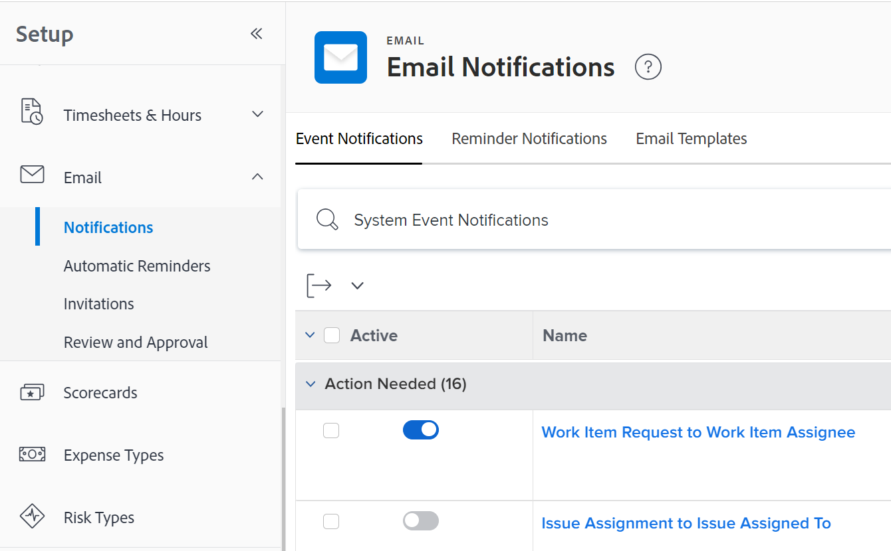

# Gebeurtenismeldingen configureren voor iedereen in het systeem

<!-- Audited: 1/2024 -->

<!--DON'T DELETE, DRAFT OR HIDE THIS ARTICLE. IT IS LINKED TO THE PRODUCT, THROUGH THE CONTEXT SENSITIVE HELP LINKS-->

Gebeurtenismeldingen activeren e-mails naar gebruikers wanneer een bepaalde gebeurtenis plaatsvindt. Als Adobe Workfront-beheerder of gebruiker met een Planner-toegangsniveau kunt u een gebeurtenismelding configureren voor alle gebruikers in het systeem. Configuratie van een gebeurtenismelding bestaat uit het activeren of deactiveren ervan.

<!--Alina annotation on the word "all" in 2nd sentence: abive, drafted and remains QS only-->

Afhankelijk van de gebeurtenis die u inschakelt en de gebruiker ingeschakeld blijft op zijn eigen profiel, ontvangen gebruikers direct, dagelijks of zowel instant- als dagelijkse e-mailberichten wanneer een gebeurtenis plaatsvindt.

U moet eerst opgeven welke meldingen alle gebruikers moeten ontvangen in het gedeelte Setup van uw Workfront-exemplaar. Nadat u een melding hebt geactiveerd in het gedeelte Setup, wordt het voor elke gebruiker op de profielpagina weergegeven.

Nadat meldingen zijn geactiveerd in het gedeelte Setup en worden weergegeven op de pagina&#39;s met gebruikersprofielen, kunnen afzonderlijke gebruikers of een andere gebruiker met een licentie voor het abonnement de geactiveerde meldingen ook configureren in een gebruikersprofiel om te bepalen welke meldingen specifieke gebruikers ontvangen en hoe vaak. Zie voor meer informatie [Uw eigen e-mailmeldingen wijzigen](../../../workfront-basics/using-notifications/activate-or-deactivate-your-own-event-notifications.md).

Ga voor een lijst met alle gebeurtenismeldingen die u kunt activeren en deactiveren naar [Gebeurtenismeldingen beschikbaar in Adobe Workfront](../../../administration-and-setup/manage-workfront/emails/event-notifications-available-in-wf.md).

Voor informatie over het ontgrendelen van een gebeurtenisbericht zodat de groepsbeheerders het voor hun groepen kunnen vormen, zie [Configuratie van gebeurtenismeldingen voor alle groepen ontgrendelen of vergrendelen](../../../administration-and-setup/manage-workfront/emails/unlock-configuration-of-event-notifications-for-groups.md) en [Gebeurtenismeldingen voor een groep weergeven en configureren](../../../administration-and-setup/manage-groups/create-and-manage-groups/view-and-configure-event-notifications-group.md).

## Toegangsvereisten

U moet de volgende toegang hebben om de stappen in dit artikel uit te voeren:

<table style="table-layout:auto"> 
 <col> 
 <col> 
 <tbody> 
  <tr> 
   <td role="rowheader">Adobe Workfront-abonnement*</td> 
   <td>Alle</td> 
  </tr> 
  <tr> 
   <td role="rowheader">Adobe Workfront-licentie*</td> 
   <td> 
Nieuw: Standaard

 
of
 

Huidig: Plan
 
</td> 
  </tr> 
  <tr> 
   <td role="rowheader">Configuraties op toegangsniveau*</td> 
   <td> 
Planner of hoger, met administratieve toegang tot herinneringsmeldingen
 
Voor informatie over het geven van een de gebruikers administratieve toegang van het Plan, zie <a href="../../../administration-and-setup/add-users/configure-and-grant-access/grant-users-admin-access-certain-areas.md" class="MCXref xref">Gebruikers administratieve toegang verlenen tot bepaalde gebieden</a>.
 </td> 
  </tr> 
 </tbody> 
</table>

&#42;Neem contact op met uw Workfront-beheerder om te weten te komen welk plan, licentietype of toegang u hebt.

## Gebeurtenismeldingen configureren voor alle gebruikers

U moet meldingen inschakelen in het gedeelte Setup van Workfront voordat gebruikers de meldingen in hun afzonderlijke profielen kunnen in- of uitschakelen.

>[!TIP]
>
>U kunt geen berichten voor de Doelen van Workfront van het gebied van de Opstelling activeren. Gebruikers kunnen deze meldingen alleen activeren in hun profielen. Gebruikers met een abonnement kunnen deze activeren voor andere gebruikers. Voor informatie over het inschakelen van Workfront Goals-meldingen voor gebruikers raadpleegt u [Meldingen: Doelstellingen](../../../workfront-basics/using-notifications/notifications-goals.md).

{{step-1-to-setup}}

1. Klikken **E-mail** > **Meldingen**.

   

1. Zorg ervoor dat de **Gebeurtenismeldingen** is geopend.
1. Schakel de schakelaar links van de naam van de gebeurtenis in of uit.

   Zie de standaardmeldingsstatus voor een gebeurtenis [Gebeurtenismeldingen](../../../workfront-basics/using-notifications/event-notifications.md).

1. (Optioneel) Klik op de naam van een gebeurtenismelding om de onderwerpregel van het e-mailbericht aan te passen.

   Zie voor meer informatie over het aanpassen van de onderwerpregel van e-mailberichten [E-mailonderwerpen aanpassen voor gebeurtenismeldingen](../../../administration-and-setup/manage-workfront/emails/custom-email-subjects-event-notification.md).

1. (Optioneel) Als u de configuratie voor een e-mailbericht wilt ontgrendelen zodat groepsbeheerders de configuratie voor hun groepen afzonderlijk kunnen configureren, klikt u op de knop  rechts van het bericht om het over te schakelen naar de ontgrendelde positie .

   >[!NOTE]
   >
   >Deze functionaliteit is in eerste instantie alleen beschikbaar voor klanten met Cluster 4 als onderdeel van een gefaseerde uitrol. Het zal kort daarna beschikbaar worden voor andere clusters. Dit artikel wordt bijgewerkt naarmate dit gebeurt.

   Zie voor meer informatie [Configuratie van gebeurtenismeldingen voor alle groepen ontgrendelen of vergrendelen](../../../administration-and-setup/manage-workfront/emails/unlock-configuration-of-event-notifications-for-groups.md).
