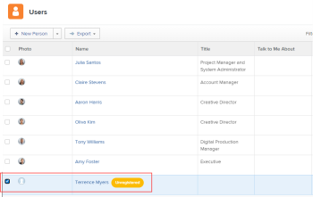

# E-mailuitnodigingen beheren voor nieuwe gebruikers

<!--

*** DON'T DELETE, DRAFT OR HIDE THIS ARTICLE. IT IS LINKED TO THE PRODUCT, THROUGH THE CONTEXT SENSITIVE HELP LINKS. **

-->

>[!IMPORTANT]
>
>De op deze pagina beschreven procedure is alleen van toepassing op organisaties die nog niet aan boord van de Admin Console zijn. Als uw organisatie is aangemeld bij de Adobe Admin Console, moet u deze handeling uitvoeren via de Adobe Admin Console.
>
>Voor een lijst van procedures die verschillen gebaseerd op of uw organisatie aan Adobe Admin Console is genegeerd, zie [ Op platform-gebaseerde beleidsverschillen (Adobe Workfront/Adobe Bedrijfsplatform) ](../../../administration-and-setup/get-started-wf-administration/actions-in-admin-console.md).

Als Adobe Workfront-beheerder kunt u gebruikers toevoegen aan Workfront en ze laten weten dat ze zijn toegevoegd door e-mailuitnodigingen te gebruiken.

Met de e-mailuitnodiging kunnen nieuwe gebruikers een koppeling volgen waarin ze een wachtwoord voor hun Workfront-account kunnen kiezen. Ze kunnen dan hun accountinstellingen voltooien.

Voor de beveiliging van de nieuwe accounts raden we u aan e-mailuitnodigingen te gebruiken voor nieuwe gebruikers, zodat deze hun eigen wachtwoord kunnen kiezen. U kunt ook een wachtwoord voor een nieuwe gebruiker selecteren wanneer u een account maakt. Voor meer informatie over het toevoegen van nieuwe gebruikers aan Workfront, zie [ gebruikers ](../../../administration-and-setup/add-users/create-and-manage-users/add-users.md) toevoegen.

U kunt de e-mails voor nieuwe gebruikers configureren voor:

* Nieuwe gebruiker toegevoegd aan Workfront
* Gebruikers die aan Workfront zijn toegevoegd met een licentie voor aanvragers

Alle nieuwe gebruikers zien hetzelfde e-mailbericht wanneer een e-mailuitnodiging wordt verzonden.

Voor informatie over het ontvangen van e-mailuitnodigingen, zie [ e-mailuitnodigingen ontvangen en een wachtwoord voor Adobe Workfront ](../../../workfront-basics/manage-your-account-and-profile/managing-your-workfront-account/receive-email-invitations.md) creëren.

## Toegangsvereisten

+++ Breid uit om de toegangseisen voor de functionaliteit in dit artikel weer te geven.

U moet de volgende toegang hebben om de stappen in dit artikel uit te voeren:

<table style="table-layout:auto"> 
 <col> 
 <col> 
 <tbody> 
  <tr> 
   <td role="rowheader">Adobe Workfront-plan</td> 
   <td>Alle</td> 
  </tr> 
  <tr> 
   <td role="rowheader">Adobe Workfront-licentie</td> 
   <td>Plan</td> 
  </tr> 
  <tr> 
   <td role="rowheader">Configuraties op toegangsniveau</td> 
   <td> 
Systeembeheerder
 </td> 
  </tr> 
 </tbody> 
</table>

+++

## E-mailuitnodigingen opnieuw verzenden naar bestaande niet-geregistreerde gebruikers

E-mailuitnodigingen worden gegenereerd in de volgende scenario&#39;s:

* Wanneer u een nieuwe gebruiker creeert en u **selecteert verzend een uitnodigingsE-mail naar deze persoon** op de **Nieuwe Gebruiker** vorm. Voor meer informatie over het creëren van nieuwe gebruikers, zie [ gebruikers ](../../../administration-and-setup/add-users/create-and-manage-users/add-users.md) toevoegen.
* Wanneer u veelvoudige nieuwe gebruikers invoert en u **selecteert verzend uitnodigt e-mail aan deze mensen** optie. Voor meer informatie over het invoeren van verscheidene nieuwe gebruikers, zie [ de gebruikers van de Invoer ](../../../administration-and-setup/add-users/create-and-manage-users/import-users.md).
* Nadat de gebruikers zijn gemaakt, kunt u de uitnodigingen handmatig genereren voor gebruikers die hun account nog niet bij Workfront hebben geregistreerd en die nog geen Workfront-wachtwoord hebben ingesteld.\
  De gebruikers die een gecreeerde rekening hebben maar nog niet hun rekening hebben geregistreerd zijn duidelijk als **Niet geregistreerd** in Workfront.

  >[!NOTE]
  >
  >Als u **schrapt verzend een e-mailuitnodiging naar deze persoon** doos wanneer u de gebruiker creeert, kan de e-mailuitnodiging niet manueel worden geproduceerd. Het handmatig doorsturen van de e-mailuitnodigingen is alleen mogelijk voor gebruikers die de oorspronkelijke e-mailuitnodiging hebben ontvangen toen hun account werd gemaakt. Voor meer informatie over het creëren van nieuwe gebruikers, zie [ gebruikers ](../../../administration-and-setup/add-users/create-and-manage-users/add-users.md) toevoegen.

E-mailuitnodigingen handmatig opnieuw verzenden naar bestaande niet-geregistreerde gebruikers:

{{step-1-to-users}}

1. Selecteer de gebruiker die het **Niet geregistreerde** etiket na hun naam toont.

   

1. Klik het Meer pictogram , dan klik **herinnering gebruiker om** te registreren.

   Er wordt een e-mailuitnodiging verzonden naar de nieuwe gebruiker met een nieuwe koppeling waarmee deze zijn Workfront-wachtwoord kan maken.

   >[!NOTE]
   >
   >Als uw organisatie is aangemeld bij de Admin Console en u een gebruiker toevoegt via Workfront, kunt u geen e-mailuitnodiging verzenden naar nieuwe gebruikers.
   >
   >Nieuwe Adobe-gebruikers worden toegevoegd aan de Admin Console en de Admin Console stuurt een e-mail om hen uit te nodigen het registratieproces te voltooien. Alle gebruikers moeten het registratieproces voltooien om toegang te krijgen tot een Adobe-systeem.
   >
   >Voor bestaande Adobe-gebruikers kan de gebruiker al dan niet een e-mail ontvangen over de beschikbaarheid van Workfront. Deze voorkeur wordt door de Adobe-beheerder voor het product bepaald.

## E-mailuitnodigingen configureren {#configure-email-invitations}

Als Workfront-beheerder kunt u het bericht dat u opneemt, configureren met de e-mailuitnodigingen voor nieuwe gebruikers.

{{step-1-to-setup}}

1. In de lijst op de linkerzijde, klik **E-mail** > **Uitnodigingen**.

1. In de **Algemene sectie van Opties**, maak om het even welke volgende wijzigingen:

   <table style="table-layout:auto"> 
    <col> 
    <col> 
    <tbody> 
     <tr> 
      <td role="rowheader"><strong> Deactivate uitnodigingsverbindingen na ... dagen </strong> </td> 
      <td> 
Kies de tijdsduur waarna de e-mailuitnodigingen geen geldige koppeling naar Workfront meer bevatten. Het standaardaantal dagen is 45.
 </td> 
     </tr> 
     <tr> 
      <td role="rowheader"><strong> omvat een bericht en/of termijn van de dienst </strong> </td> 
      <td> 
Selecteer deze optie als u de e-mailuitnodiging wilt wijzigen voor alle nieuwe gebruikers die aan Workfront zijn toegevoegd. Dit geldt niet voor gebruikers met een licentie voor aanvragers.
 
       <ul> 
        <li><strong> Bericht </strong>: Als u selecteert om de e-mailuitnodiging voor alle nieuwe gebruikers te wijzigen, specificeer de tekst die u in uw e-mailuitnodigingen als e-maillichaam wilt omvatten.</li> 
        <li><strong> Voorwaarden </strong>: Als u uitgezocht om de e-mailuitnodiging voor alle nieuwe gebruikers te wijzigen, specificeer de tekst die u in uw e-mailuitnodigingen als voorwaarden wilt omvatten. </li> 
        <li><strong> omvat een bericht en/of termijn van de dienst voor helpdeskgebruikers </strong>: Selecteer deze optie als u de e-mailuitnodiging voor alle nieuwe gebruikers wilt wijzigen die aan Workfront worden toegevoegd die een vergunning van de Aanvrager hebben.</li> 
        <li><strong> Bericht </strong>: Als u selecteert om de e-mailuitnodiging voor alle nieuwe gebruikers met een vergunning van de Aanvrager te wijzigen, specificeer de tekst die u in uw e-mailuitnodigingen als e-maillichaam wilt omvatten.</li> 
        <li><strong> Voorwaarden </strong>: Als u uitgezocht om de e-mailuitnodiging voor alle nieuwe gebruikers met een vergunning van de Aanvrager te wijzigen, specificeer de tekst die u in uw e-mailuitnodigingen als voorwaarden wilt omvatten. </li> 
        <li> 
In de <strong> sectie van de Voorproef van de Uitnodiging </strong>, kunt u een voorproef van uw e-mailuitnodiging zien. Als u hebt opgegeven dat u een aangepast bericht wilt opnemen in uw e-mailuitnodiging, wordt het aangepaste bericht in dit gebied weergegeven.
 
  
 </li> 
       </ul> </td> 
     </tr> 
    </tbody> 
   </table>

1. Klik **sparen**.
