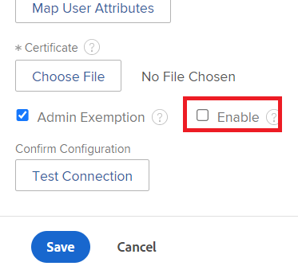

# API-sleutels beheren

<!--DON'T DELETE, DRAFT OR HIDE THIS ARTICLE. IT IS LINKED TO THE PRODUCT, THROUGH THE CONTEXT SENSITIVE HELP LINKS.

-->

>[!IMPORTANT]
>
>Workfront raadt niet langer het gebruik van de `/login` eindpunt- of API-toetsen aan. Gebruik in plaats daarvan een van de volgende verificatiemethoden:
>
>* Serververificatie met JWT
>* Gebruikersverificatie met OAuth2
>
>Voor instructies bij vestiging deze authentificatiemethodes, zie [ tot toepassingen OAuth2 voor de integratie van Workfront leiden ](/help/quicksilver/administration-and-setup/configure-integrations/create-oauth-application.md)
>
>Voor instructies bij het gebruiken van serverauthentificatie in Workfront, zie [ vormen en gebruiken de douaneOAuth 2 van uw organisatie toepassingen gebruikend stroom JWT ](/help/quicksilver/wf-api/api/oauth-app-jwt-flow.md)
>
>Voor instructies bij het gebruiken van gebruikersauthentificatie in Workfront, zie [ vormen en gebruiken de douane OAuth 2 van uw organisatie toepassingen gebruikend de stroom van de vergunningscode ](/help/quicksilver/wf-api/api/oauth-app-code-token-flow.md)

Adobe Workfront-beheerders kunnen de API-sleutels beheren die worden gebruikt om toepassingen in staat te stellen om namens een gebruiker toegang te krijgen tot Workfront, om zo kwetsbaarheden op het gebied van API-beveiliging tot een minimum te beperken.

U kunt de huidige API-sleutel voor beheerders opnieuw instellen of verwijderen, API-sleutels configureren voor verlopen en de API-sleutels voor alle gebruikers verwijderen.

Voorbeelden van toepassingen die gebruikmaken van de Workfront API zijn:

* Documentintegratie zoals Dropbox, Google Drive en Workfront DAM
* Workfront mobiele toepassingen

>[!IMPORTANT]
>
>Wanneer u een API-sleutel opnieuw instelt of verwijdert, moet elke toepassing die gebruikmaakt van de Workfront API en die via deze API-sleutel voor verificatie bij Workfront zorgt, opnieuw worden geconfigureerd om toegang tot Workfront te herstellen.

## Toegangsvereisten

+++ Breid uit om de toegangseisen voor de functionaliteit in dit artikel weer te geven.

<table style="table-layout:auto"> 
 <col> 
 <col> 
 <tbody> 
  <tr> 
   <td role="rowheader">Adobe Workfront-pakket</td> 
   <td>
Alle
</td> 
  </tr> 
  <tr> 
   <td role="rowheader">Adobe Workfront-licentie</td> 
   <td>
Standard

Plan
</td> 
  </tr> 
  <tr> 
   <td role="rowheader">Configuraties op toegangsniveau</td> 
   <td> 
U moet een Workfront-beheerder zijn.
 
 </td> 
  </tr> 
 </tbody> 
</table>

Voor informatie, zie [ vereisten van de Toegang in de documentatie van Workfront ](/help/quicksilver/administration-and-setup/add-users/access-levels-and-object-permissions/access-level-requirements-in-documentation.md).

+++

## Workfront API-toetsen

Elke gebruiker in Workfront heeft een unieke API-sleutel. Deze sleutel wordt per gebruiker gegenereerd op het moment dat de gebruiker toegang krijgt tot een integratie die gebruikmaakt van de Workfront API (zoals de mobiele Workfront-app of documentintegratie).

>[!NOTE]
>
> API-sleutels die u genereert in de productieomgeving, worden tijdens de wekelijkse vernieuwing gekopieerd naar de voorbeeldomgeving. Alle API-sleutels die u genereert in de voorvertoningsomgeving, worden tijdens de wekelijkse vernieuwing overschreven met uw productie-API-sleutels.

Workfront-beheerders hebben ook een unieke API-sleutel. Wanneer een toepassing een beheerder-API-sleutel gebruikt om toegang te krijgen tot Workfront, heeft de toepassing beheerderstoegang tot Workfront.

## De API-sleutel voor beheerders beheren

U kunt de API-sleutel voor uw beheerdersgebruikersaccount genereren, opnieuw instellen of verwijderen.

{{step-1-to-setup}}

1. Klik **Systeem >** **Info van de Klant.**
1. (Voorwaardelijk) Voer een van de volgende handelingen uit:

   Om een API Sleutel te produceren: In de **API Zeer belangrijke sectie van Montages**, klik **produceert API Sleutel**.

   of\
   Om een API Sleutel terug te stellen: In de **API Zeer belangrijke sectie van Montages**, klik **Terugstellen**, dan **Teruggesteld.**

   of

   Om de API Sleutel te verwijderen: In de **API Zeer belangrijke sectie van Montages**, **verwijdert**, dan **verwijdert**.

## Een API-sleutel genereren voor gebruikers die geen beheerder zijn

U kunt API-sleutels voor gebruikers in andere rollen dan Workfront-beheerders genereren en beheren.

>[!NOTE]
>
>Dit is niet beschikbaar als het Workfront-exemplaar van uw organisatie is ingeschakeld met Adobe IMS. Zie uw netwerk of beheerder van IT als u meer informatie nodig hebt.

1. (Voorwaardelijk) als uw organisatie Single Sign-On (SSO) toegangsbeheer gebruikt, maak tijdelijk de optie onbruikbaar die authentificatie SSO vereist.

   {{step-1-to-setup}}

   1. Breid **Systeem** uit, dan klik **Enige Sign-On (SSO)**.
   1. Op het **gebied van het Type**, selecteer het type van SSO uw organisatiegebruik.
   1. Met het geselecteerde type, scrol neer en ontruim **** checkbox toelaten.
       toe
   1. Klik **sparen**.

1. Voer in de adresbalk van een browser de volgende API-aanroep in:

   `<domain>` .my.workfront.com/attask/api/v7.0/user?action=generateApiKey&amp;username=**gebruikersbenaming** &amp;password= **wachtwoord** &amp;method=PUT

   Vervang `<domain>` door uw Workfront-domeinnaam, gebruikersnaam en wachtwoord door de Workfront-gebruikersgegevens van de gebruiker.

1. (Voorwaardelijk) laat de optie toe die authentificatie vereist SSO als u het in Stap 1 onbruikbaar maakte.

   {{step-1-to-setup}}

   1. Breid **Systeem** uit, dan klik **Enige Sign-On (SSO)**.

   1. Selecteer uw methode SSO in het **Type** drop-down menu.
   1. Schakel het selectievakje in waarvoor SSO-verificatie is vereist.

## Configureren wanneer API-sleutels verlopen

U kunt API Toetsen vormen om voor alle gebruikers in uw systeem te verlopen. Wanneer de API-sleutel van een gebruiker vervalt, moet de gebruiker opnieuw worden geverifieerd voor toepassingen die de Workfront API gebruiken om toegang te krijgen tot Workfront. U kunt de frequentie wijzigen waarmee de API-toetsen verlopen. U kunt ook configureren of API-sleutels verlopen wanneer het wachtwoord van een gebruiker verloopt.

{{step-1-to-setup}}

1. Klik **Systeem** > **Info van de Klant**.
1. In het **Belangrijkste gebied van Montages API**, in **na verwezenlijking**, **API sleutels verlopen in** drop-down lijst, selecteer timeframe wanneer u de API sleutels wilt verlopen.

   Wanneer u deze optie wijzigt, begint de nieuwe tijdlijn vanaf het moment dat u de wijziging aanbracht. Bijvoorbeeld, als u deze optie van *1 maand* in *6 maanden* verandert, verlopen de API Sleutels 6 maanden vanaf de tijd u de verandering aanbrengt.

   API-sleutels verlopen standaard elke maand.

1. Om API Sleutels te vormen om in de tijd te verlopen de wachtwoorden van de gebruikers verlopen, laat **toe verwijder API sleutel wanneer het wachtwoord van een gebruiker** verloopt.

   Deze optie is standaard niet ingeschakeld.

   Voor informatie over hoe te om gebruikerswachtwoorden te vormen om te verlopen, zie [ de voorkeur van de systeemveiligheid ](../../../administration-and-setup/manage-workfront/security/configure-security-preferences.md) vormen.

1. Klik **sparen**.

## De API-sleutels voor alle gebruikers verwijderen

Als u zich zorgen maakt over een bepaalde inbreuk op de beveiliging van uw Workfront-systeem, kunt u de API-sleutels voor alle gebruikers tegelijk verwijderen.

>[!IMPORTANT]
>
>Als u API-sleutels verwijdert voor alle gebruikers, worden ALLE API-sleutels voor alle gebruikers in het systeem ongeldig. Hierdoor zullen al uw integraties in Workfront mislukken totdat u een nieuwe API-sleutel genereert in Workfront en al uw integraties bijwerkt.

{{step-1-to-setup}}

1. Breid **Systeem** uit, dan klik **Info van de Klant**.

1. In het **Belangrijkste gebied van Montages API**, verwijdert de klik **alle API sleutels**, dan klikt **verwijdert** **allen**.

## API-aanmeldingen beperken met een X.509-certificaat

>[!IMPORTANT]
>
>De in dit gedeelte beschreven procedure is alleen van toepassing op organisaties die nog niet aan boord zijn gegaan bij het Adobe Business Platform. Aanmelden bij Workfront via de Workfront API is niet beschikbaar als uw organisatie is aangemeld bij het Adobe Business Platform.
>
>Voor een lijst van procedures die verschillen gebaseerd op of uw organisatie aan het Van Bedrijfs Adobe Platform is genegeerd, zie [ Op platform-gebaseerde beleidsverschillen (Adobe Workfront/Adobe Bedrijfs Platform) ](../../../administration-and-setup/get-started-wf-administration/actions-in-admin-console.md).

>[!NOTE]
>
>Dit is niet beschikbaar als het Workfront-exemplaar van uw organisatie is ingeschakeld met Adobe IMS. Zie uw netwerk of beheerder van IT als u meer informatie nodig hebt.

Toepassingen van derden kunnen met Workfront communiceren via de API. Om de beveiliging van uw Workfront-site te verhogen, kunt u Workfront zodanig configureren dat de aanmeldingsaanvragen voor de API worden beperkt door een X.509-certificaat naar Workfront te uploaden. Als deze optie is ingeschakeld, moeten alle aanmeldingsaanvragen via de API naast gebruikersnaam en wachtwoord ook een clientcertificaat bevatten.

* [ verkrijg het X.509- certificaat ](#obtain-the-x-509-certificate)
* [ upload het certificaat aan Workfront ](#upload-the-certificate-to-workfront)
* [Verifieer API login vraag wordt beperkt](#verify-api-login-calls-are-restricted)

### Het X.509-certificaat ophalen {#obtain-the-x-509-certificate}

Vraag een geldig X.509-certificaat aan bij een vertrouwde certificeringsinstantie (zoals Verisign) en sla dit op een tijdelijke locatie op uw werkstation op.

### Het certificaat uploaden naar Workfront {#upload-the-certificate-to-workfront}

Nadat u het X.509-certificaat van uw certificeringsinstantie hebt ontvangen, moet u het uploaden naar Workfront.

1. Klik het **pictogram 1} van het Belangrijkste Menu** Belangrijkste menupictogram  de montages van de Opstelling **** Gear pictogram 

1. Breid **Systeem** uit, dan klik **Info van de Klant**.

1. In het **Belangrijkste gebied van Montages API**, uitgezochte **vereist X.509 Certificaat voor API logins**.
1. Klik **Certificaat van de Verandering**.
1. Blader op uw werkstation naar het X.509-certificaat dat u eerder hebt gedownload en selecteer dit certificaat.
1. (Facultatief) klik **Details van de Mening** naast de certificaatnaam om de volgende details over het certificaat te bekijken:

   * Onderwerpnaam
   * Onderwerp Organisatie
   * Onderwerpeenheid
   * Algemene naam van uitgever
   * Uitgevende organisatie
   * Eenheid emittentenorganisatie
   * Serienummer
   * Datum van afgifte
   * Vervaldatum

1. Klik **sparen**.

### Verifieer API login vraag wordt beperkt {#verify-api-login-calls-are-restricted}

Voordat u uw instantie van Workfront configureert om een X.509-certificaat te vereisen, moet u een API-aanvraag uitvoeren naar het `/login` -eindpunt met behulp van geldige gebruikersnaam- en wachtwoordparameters. U zult een 200 reactie ontvangen die een sessionID bevat.

Nadat u van het X.509-certificaat een vereiste hebt gemaakt via de pagina met klantgegevens in uw exemplaar van Workfront, probeert u zich opnieuw aan te melden. Dit keer ontvangt u een 500-foutreactie met het volgende bericht: &quot;Niet-vertrouwd verzoek. Neem contact op met de systeembeheerder en voeg het certificaat bij.&quot;

Nadat u hebt bevestigd dat het X.509-certificaat vereist is, voert u hetzelfde aanmeldingsverzoek uit met een extra parameter voor apiCertificate die is ingesteld op de waarde van het certificaat. Als deze verrichting correct werd uitgevoerd zult u een 200 reactie ontvangen die geldige sessionID bevat.
