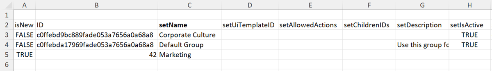

# Gegevens naar Workfront importeren met een Kick-startsjabloon

<!--Audited: 12/2023-->

Kick-start zijn speciaal opgemaakte Excel-werkboeken die u kunt vullen met gegevens die u in Workfront wilt importeren. Adobe Workfront verstrekt een Kick-Begin malplaatje u kunt gebruiken om dit te doen, zoals verklaard in [ Kick-Begint gegevensimporteur ](../../../administration-and-setup/manage-workfront/using-kick-starts/kick-starts-data-importer.md).

Dit proces wordt opgedeeld in drie hoofdtaken:

* Eerst exporteert u een Kick-Start-sjabloon als een spreadsheetbestand
* Ten tweede vult u het werkblad met uw gegevens
* Tot slot importeert u de gevulde spreadsheet in Workfront

Elk van deze procedures wordt geschetst in de juiste orde in dit artikel.

## Toegangsvereisten

+++ Breid uit om de toegangseisen voor de functionaliteit in dit artikel weer te geven.

U moet de volgende toegang hebben om de stappen in dit artikel uit te voeren:

<table style="table-layout:auto"> 
 <col> 
 <col> 
 <tbody> 
  <tr> 
   <td role="rowheader">Adobe Workfront-plan</td> 
   <td>Alle</td> 
  </tr> 
  <tr> 
   <td role="rowheader">Adobe Workfront-licentie</td> 
   <td>
   
 Nieuw: Standaard

   of
   
Huidig: Plan
</td> 
  </tr> 
  <tr> 
   <td role="rowheader">Configuraties op toegangsniveau</td> 
   <td>[!UICONTROL System Administrator]</td> 
  </tr> 
 </tbody> 
</table>

Voor meer detail over de informatie in deze lijst, zie [ vereisten van de Toegang in de documentatie van Workfront ](/help/quicksilver/administration-and-setup/add-users/access-levels-and-object-permissions/access-level-requirements-in-documentation.md).

+++

## Beperkingen

U kunt grote aantallen voorwerpen in Workfront invoeren gebruikend een Kick-Begin malplaatje. Houd echter rekening met de volgende beperkingen:

* Als u gegevens op deze manier importeert, wordt er geen informatie bijgewerkt over records die al in Workfront bestaan.
* U kunt alleen nieuwe records en de bijbehorende gegevens importeren.
* Er kunnen niet meer dan 2000 records tegelijk worden geïmporteerd om ervoor te zorgen dat er geen time-out optreedt bij het importeren

## Een Kick-startsjabloon exporteren als een spreadsheetbestand

Wanneer u een malplaatje van het Kick-Begin uitvoert ontvangt u een leeg werkboek van het spreadsheet van Excel. Nadat de spreadsheet aan uw computer wordt gedownload, kunt u het gebruiken om het met uw informatie te bevolken en dan het terug in Workfront invoeren.

Een Kick-Start-sjabloon exporteren:

{{step-1-to-setup}}

<!--
1. Click the **Main Menu** icon  in the upper-right corner of Adobe Workfront, then click **Setup** .  -->

1. Klik **Systeem** > **de Gegevens van de Invoer (Kick-Begint)**.

1. Selecteer de soorten informatie die u wilt opnemen.

   Elke optie die u selecteert, vertegenwoordigt een verzameling meerdere tabbladen in het geëxporteerde werkblad. Bijvoorbeeld, als u de **optie van het Rapport** selecteert, zullen alle noodzakelijke voorwerpen voor het creëren van een rapport in spreadsheet (meningen, filters, groeperingen, rapporten) worden omvat.

   U kunt alle hieronder vermelde objecttypen gebruiken om gegevens te importeren in Workfront. (De enige uitzondering is de optie Toegangsniveaus. Het gegevensblad van Niveaus van de Toegang in de uitvoer wordt verstrekt voor verwijzingsdoeleinden-het staat u toe om een toegangsniveau aan een nieuw gebruikersrekening door identiteitskaart toe te wijzen.)

   De sjabloon voor elk objecttype kan in de volgende bestandsindelingen worden geëxporteerd en bevat de volgende bladen:

   <table style="table-layout:auto"> 
    <col> 
    <col> 
    <col> 
    <thead> 
     <tr> 
      <th> 
<strong> Voorwerp </strong> 
 </th> 
      <th> 
<strong> voert uit als </strong> 
 </th> 
      <th> 
<strong> Bladen in de uitgevoerde spreadsheet </strong> 
 </th> 
     </tr> 
    </thead> 
    <tbody> 
     <tr> 
      <td scope="col"> 
Dashboard
 
Alle dashboards in het systeem zijn beschikbaar om te exporteren. U kunt maximaal 100 specifieke dashboards selecteren in één export.
 </td> 
      <td scope="col">Exporteren als ZIP-bestand</td> 
      <td scope="col"> 
Parameter
 
Beschrijvende tekst

Parameteroptie
 
Parametergroep
 
Categorieparameter
 
Categorie
 
Rapport
 
Sectie tabblad Portal
 
Dashboard
 
Voorkeuren
 </td> 
     </tr> 
     <tr> 
      <td scope="col"> 
Rapport
 
Alle rapporten in het systeem zijn beschikbaar om te exporteren. U kunt maximaal 100 specifieke rapporten selecteren in één exportbewerking.
 
Kick-Starts ondersteunt geen tekstmodusfilters. Voor een correct exporteren moeten de rapportfilters worden overgeschakeld op de standaardmodus.
 </td> 
      <td scope="col">Exporteren als ZIP-bestand </td> 
      <td scope="col"> 
Parameter
 
Beschrijvende tekst
 
Parameteroptie
 
Parametergroep
 
Categorieparameter
 
Categorie
 
Rapport
 
Voorkeuren
 </td> 
     </tr> 
     <tr> 
      <td scope="col"> 
Goedkeuring
 </td> 
      <td scope="col"> 
Exporteren als Excel-bestand
 </td> 
      <td scope="col"> 
Stage-fiatteur
 
Goedkeuringsfase
 
Goedkeuring
 
Goedkeuringsproces
 
Voorkeuren
 </td> 
     </tr> 
     <tr> 
      <td scope="col"> 
Aangepaste gegevens
 </td> 
      <td scope="col"> 
Exporteren als Excel-bestand
 </td> 
      <td scope="col"> 
Parameter
 
Beschrijvende tekst
  
Parameteroptie
 
Parametergroep
 
Categorieparameter
 
Categorie
 
Voorkeuren
 </td> 
     </tr> 
     <tr> 
      <td scope="col"> 
Type uitgave
 </td> 
      <td scope="col"> 
Exporteren als Excel-bestand
 </td> 
      <td> 
Type uitgave
 
Voorkeuren
 </td> 
     </tr> 
     <tr> 
      <td> 
Uurtype
 </td> 
      <td scope="col"> 
Exporteren als Excel-bestand
 </td> 
      <td> 
Uurtype
 
Voorkeuren
 </td> 
     </tr> 
     <tr> 
      <td> 
Team
 </td> 
      <td scope="col"> 
Exporteren als Excel-bestand
 </td> 
      <td> 
 Teamlid
 
Team
 
Voorkeuren 
 </td> 
     </tr> 
     <tr> 
      <td> 
Gebruiker
 </td> 
      <td> 
Exporteert als Excel-bestand. Om de volledige lijst van opties te zien, klik <strong> Meer Opties </strong>.
 </td> 
      <td> 
Gebruiker
 
Voorkeuren
 </td> 
     </tr> 
     <tr> 
      <td>Toegangsniveau</td> 
      <td>Exporteren als Excel-bestand</td> 
      <td> 
Toegangsniveau
 
Voorkeuren
 </td> 
     </tr> 
     <tr> 
      <td>Toewijzing</td> 
      <td>Exporteren als Excel-bestand</td> 
      <td> 
Toewijzing
 
Voorkeuren
 </td> 
     </tr> 
     <tr> 
      <td>Bedrijf</td> 
      <td>Exporteren als Excel-bestand</td> 
      <td> 
 Bedrijf
 
Voorkeuren 
 </td> 
     </tr> 
     <tr> 
      <td>E-mailsjabloon</td> 
      <td>Exporteren als Excel-bestand</td> 
      <td> 
E-mailsjabloon
 
Voorkeuren 
 </td> 
     </tr> 
     <tr> 
      <td>Kosten</td> 
      <td>Exporteren als Excel-bestand</td> 
      <td> 
 Kosten"
 
Voorkeuren 
 </td> 
     </tr> 
     <tr> 
      <td>Externe pagina</td> 
      <td>Exporteren als Excel-bestand</td> 
      <td> 
 Externe pagina
 
Voorkeuren 
 </td> 
     </tr> 
     <tr> 
      <td>Filter</td> 
      <td>Exporteert als een ZIP-bestand</td> 
      <td> 
 Filter
 
Voorkeuren 
 </td> 
     </tr> 
     <tr> 
      <td>Groep</td> 
      <td>Exporteren als Excel-bestand</td> 
      <td> 
 Groep
 
Voorkeuren 
 </td> 
     </tr> 
     <tr> 
      <td>Groepering</td> 
      <td>Exporteert als een ZIP-bestand</td> 
      <td> 
 Groepering
 
Voorkeuren 
 </td> 
     </tr> 
     <tr> 
      <td>Uur</td> 
      <td>Exporteren als Excel-bestand</td> 
      <td> 
 Uur
 
Voorkeuren 
 </td> 
     </tr> 
     <tr> 
      <td>Probleem</td> 
      <td>Exporteren als Excel-bestand</td> 
      <td> 
 Probleem
 
Voorkeuren 
 </td> 
     </tr> 
     <tr> 
      <td>Functie</td> 
      <td>Exporteren als Excel-bestand</td> 
      <td> 
 Functie
 
Voorkeuren 
 </td> 
     </tr>

   <tr> 
      <td>Mijlpad</td> 
      <td> Exporteren als Excel-bestand</td> 
      <td> 
 Mijlsteen
 
Mijlpad
 
Voorkeuren 
 </td> 
     </tr>

   <tr> 
      <td>Opmerking</td> 
      <td>Exporteren als Excel-bestand</td> 
      <td> 
 Opmerking
 
Voorkeuren 
 </td> 
     </tr> 
     <tr> 
      <td>Portfolio</td> 
      <td>Exporteren als Excel-bestand</td> 
      <td> 
 Portfolio
 
Voorkeuren 
 </td> 
     </tr> 
     <tr> 
      <td>Project</td> 
      <td>Exporteren als Excel-bestand</td> 
      <td> 
 Wachtrij
 
Project
 
Routeringsregel
 
Onderwerp van wachtrij
 
Voorkeuren 
 </td> 
     </tr> 
     <tr> 
      <td>Bronschatting</td> 
      <td>Exporteren als Excel-bestand</td> 
      <td> 
 Bronschatting
 
Voorkeuren 
 </td> 
     </tr> 
     <tr> 
      <td>Risico</td> 
      <td>Exporteren als Excel-bestand</td> 
      <td> 
 Risico
 
Voorkeuren 
 </td> 
     </tr> 
     <tr> 
      <td>Type risico</td> 
      <td> Exporteren als Excel-bestand</td> 
      <td> 
 Type risico
 
Voorkeuren
 </td> 
     </tr> 
     <tr> 
      <td>Scorecard</td> 
      <td>Exporteren als Excel-bestand</td> 
      <td> 
Scorecard-vraag
 
Scorecard-optie
 
Scorecard
 
Voorkeuren 
 </td> 
     </tr> 
     <tr> 
      <td>Taak</td> 
      <td>Exporteren als Excel-bestand</td> 
      <td> 
 Taak
 
Voorkeuren 
 </td> 
     </tr> 
     <tr> 
      <td>Sjabloon</td> 
      <td> Exporteren als Excel-bestand</td> 
      <td> 
 Wachtrij
 
Sjabloon
 
Routeringsregel
 
Onderwerp van wachtrij
 
Voorkeuren 
 </td> 
     </tr> 
     <tr> 
      <td>Sjabloontoewijzing</td> 
      <td>Exporteren als Excel-bestand</td> 
      <td> 
 Sjabloontoewijzing
 
Voorkeuren 
 </td> 
     </tr> 
     <tr> 
      <td>Sjabloontaak</td> 
      <td>Exporteren als Excel-bestand</td> 
      <td> 
 Sjabloontaak
 
Voorkeuren 
 </td> 
     </tr> 
     <tr> 
      <td>Tijdschema</td> 
      <td> Exporteren als Excel-bestand</td> 
      <td> 
 Tijdbladprofiel
 
Tijdschema
 
Voorkeuren 
 </td> 
     </tr> 
     <tr> 
      <td>Weergave </td> 
      <td> 
Exporteren als ZIP-bestand
 </td> 
      <td> 
 Weergave
 
Voorkeuren 
 </td> 
     </tr> 
    </tbody> 
   </table>

1. Klik **Download**.
1. Ga met [ verder bevolken het spreadsheetmalplaatje met uw gegevens ](#populate-the-spreadsheet-template-with-your-data) om het lege malplaatjespreadsheet met uw informatie te bevolken.

## De spreadsheetsjabloon vullen met uw gegevens {#populate-the-spreadsheet-template-with-your-data}

* [Overzicht van de tabbladen (gegevensbladen) in het werkblad](#overview-of-the-tabs-data-sheets-included-in-the-spreadsheet)
* [ de Invoer een verslag ](#import-a-record)
* [ omvat data ](#include-dates)
* [ vervangingen van het Gebruik ](#use-wildcards)
* [Vervanging van kenmerknaam voor id&#39;s](#attribute-name-substitution-for-ids)

### Overzicht van de tabbladen (gegevensbladen) in het werkblad

>[!TIP]
>
>Om beter te begrijpen hoe u de informatie in elke kolom zult moeten formatteren wanneer u het Kick-Begin malplaatje bevolkt, denk na handelend een praktijk door een Kick-Begin met bestaande gegevens van Workfront over de voorwerpen uit te voeren u probeert om in te voeren. Voor instructies, zie [ gegevens van de Uitvoer van Adobe Workfront via Kick-Begint ](../../../administration-and-setup/manage-workfront/using-kick-starts/export-data-from-wf-via-kick-starts.md).

Wanneer u een leeg Kick-Begint malplaatje opent, zijn een aantal lusjes (gegevensbladen) beschikbaar. Ze zijn afhankelijk van de objecten die u hebt geselecteerd om te downloaden. Elk object vertegenwoordigt een object in de toepassing, zoals project, taken, uren, dashboard en gebruikers:

Wanneer u een van deze tabbladen opent, worden in rij 2 de velden weergegeven voor elk object dat tijdens het importeren kan worden ingesteld. In een kolomkop wordt na het woord &quot;set&quot; de naam van het veld weergegeven zoals deze in de database wordt weergegeven. Deze velden fungeren als kolomkoppen.

>[!IMPORTANT]
>
>Zorg voor het volgende om fouten te voorkomen:
>
>* Verwijder de lege eerste rij van een werkblad niet.
>* Verwijder deze velden (kolomkoppen) op geen enkele manier en wijzig de volgorde ervan. Wijzig bijvoorbeeld hun volgorde of naam niet.
>* Voeg waarden toe aan elk veld dat in de kolomkop vet wordt weergegeven. Deze vertegenwoordigen vereiste velden.
>
>     Als een vereist veld echter een standaardwaarde bevat die is ingesteld in de systeemvoorkeuren, hoeft u deze waarde niet in te vullen.
>
>     Bijvoorbeeld, op het **lusje van het Project van 0} PROJ, kunnen de** setCondition **en** setConditionType **gebieden leeg worden verlaten, maar** setGroupID **en** setName **kolommen kunnen niet.**
>
>* Bepaalde gebieden, met inbegrip van **setResourceRevenue** en **setEnteredByID**, worden automatisch geproduceerd door het systeem. Als u gegevens voor deze velden in het werkblad invoert, wordt deze genegeerd tijdens het uploaden van het werkblad.

### Een record importeren  {#import-a-record}

Elke rij van het blad komt overeen met een uniek object.

1. Voeg informatie in **isNew** kolom toe:

   * Als het voorwerp u invoert nieuw is, type **WAAR** om de gegevens in de rij in te voeren. Deze waarde is hoofdlettergevoelig en moet altijd in hoofdletters staan
   * Als het voorwerp reeds in Workfront is, type **VALS** in **isNew** kolom om de rij te negeren. Deze waarde is hoofdlettergevoelig en moet altijd in hoofdletters staan

      * Records die al in Workfront bestaan, worden niet bijgewerkt.
      * Als u een malplaatje met gegevens van Workfront downloadde, zijn de bestaande voorwerpen reeds duidelijk met **VALS**.
      * Als u een lege sjabloon hebt gedownload, hoeft u geen nieuwe rijen voor bestaande objecten toe te voegen.

1. Voeg informatie in de **identiteitskaart** kolom in één van de volgende manieren toe:

   * Als het voorwerp u invoert nieuw is (en u **WAAR** in **isNew** kolom) typt, type om het even welk aantal voor identiteitskaart. Dit nummer moet uniek zijn in het werkblad. Als u bijvoorbeeld drie objecten importeert, kunt u deze de id 1, 2 of 3 geven.

   * Als het voorwerp reeds in Workfront (en **VALS** is in **isNew** kolom) bestaat, en u voert nieuwe informatie over bestaande voorwerpen in, moet identiteitskaart de alpha-numerieke GUID zijn die in Workfront voor dat voorwerp bestaat.

   >[!TIP]
   >
   > Om unieke GUID van een voorwerp in Workfront te weten te komen, kunt u een rapport voor dat voorwerp tot stand brengen en de kolom van identiteitskaart aan het rapport toevoegen. De waarde voor elk voorwerp in die kolom is GUID van de voorwerpen.

   * Records die al in Workfront bestaan, worden niet bijgewerkt.
   * Als u een malplaatje met gegevens downloadde, bevatten de bestaande voorwerpen reeds GUID als identiteitskaart
   * U kunt een nieuw voorwerp invoeren dat op een bestaand voorwerp wordt gebaseerd door **VALS** te veranderen **WAAR** in de **isNew** kolom, die identiteitskaart veranderen, en de noodzakelijke gegevensaanpassingen alvorens in te voeren.

   

   * Wanneer u een project invoert, moet u op een identiteitskaart van de Groep wijzen.

      * Als de groep reeds in Workfront bestaat, moet u zijn unieke identiteitskaart aan het **setGroupID** gebied voor het project toevoegen.
      * Als de groep niet in Workfront bestaat, kunt u het **blad van de Groep van de 0} GROEP aan uw het invoeren dossier toevoegen, plaats het** isNew **gebied aan** WAAR **op het blad van de Groep, en wijs op een numerieke identiteitskaart voor de nieuwe groep in de** identiteitskaart **kolom.** Het **setGroupID** gebied voor het nieuwe project moet numerieke **identiteitskaart** voor de nieuwe groep aanpassen.

     **Voorbeeld:** voor een project, moet de waarde die in de **wordt getoond setGroupID** kolom één van het volgende:

      * GUID voor een bestaande Groep in uw instantie van Workfront
      * De waarde (aantal) in de kolom van identiteitskaart op het **blad van de Groep van de GROEP** als u een nieuwe Groep tijdens de invoer creeert

1. Voer waarden in voor de vereiste velden en alle andere velden die u tijdens het importeren wilt vullen.
1. (Optioneel) Aangepaste gegevens toevoegen:

   * Maak een nieuwe kolom voor elk aangepast veld dat u wilt opnemen in het importproces.
   * Naam elke nieuwe kolom voor zijn overeenkomstig douanegebied als volgt: **DE:[ Naam van het douanegebied aangezien het in Workfront]** verschijnt. U kunt bijvoorbeeld het volgende aangepaste veld maken: &quot;DE: Afdelingen&quot;.
   * In de kolom **setCategoryID**, typ GUID van de bestaande douanevorm waarop dit douanegebied verblijft. Dit veld is vereist bij het importeren van aangepaste gegevens.
   * Als u meerdere gegevenswaarden in het aangepaste veld wilt toevoegen (zoals keuzerondjes, selectievakjes of lijsten), gebruikt u het verticale scheidingsteken voor aangepaste gegevens op de balk &quot;|&quot; in het tabblad Voorkeuren om de waarden van elkaar te scheiden.

     **Voorbeeld:** Type A|D onder DE:De kolom van Departementen om afdeling A en afdeling D in uw douaneformulier te bevolken.

### Datums opnemen  {#include-dates}

Workfront kan de meeste datumnotaties verwerken. U moet er echter voor zorgen dat de datumkolom in het spreadsheet is opgemaakt als een datum. Het importeren mislukt als de kolom is opgemaakt als algemeen, een getal of tekst.

>[!TIP]
>
>De populairste indeling is de indeling MM/DD/JJJJ.
>
>Bijvoorbeeld: 10-07-2023.

Workfront accepteert ook tijdwaarden als onderdeel van de datum.

Bijvoorbeeld: 07/10/2022 01:30 of 07/10/2022 1:00 PM.

Als u een tijd in de datum weglaat, voert Workfront een van de volgende handelingen uit:

* Veronderstelt dat de tijd 12:00 is. Om het datumresultaat te zien u verwacht, moet de systeemtijdzone uw tijdzone aanpassen.
* Als het zich op een voorwerp bevindt dat met een programma wordt geassocieerd, verschuift de tijd aan de vroegste tijd dat het programma toestaat.

>[!NOTE]
>
>Wanneer u een UNIX-tijdstempel gebruikt, moet u nog drie nullen aan het einde van de waarde toevoegen.
>
>Als uw tijdstempel bijvoorbeeld 7336899000 is, zou u 7336899000000 invoeren in de cel.

### Jokertekens gebruiken {#use-wildcards}

U kunt de volgende vervangingen gebruiken wanneer het bevolken van uw Kick-Begin malplaatjespreadsheet:

<table style="table-layout:auto"> 
 <col> 
 <col> 
 <thead> 
  <tr> 
   <th> 
<strong> Jokerteken </strong> 
 </th> 
   <th> 
<strong> Gedrag </strong> 
 </th> 
  </tr> 
 </thead> 
 <tbody> 
  <tr> 
   <td> 
$$TODAY
 </td> 
   <td> 
Wanneer gebruikt op a <strong> setDate </strong> gebied, plaatst dit vervangingsplaatsen de datum als middernacht op de dag wanneer u Kick-Begin invoert.
 
U kunt het jokerteken wijzigen met de standaardsyntaxis die is toegestaan met het jokerteken op een filter.
 
Example: </b>"><b> Voorbeeld: </b> als u een project op de Maandag van de week wilt beginnen wordt het ingevoerd, ongeacht de dag u daadwerkelijk de invoer uitvoert, kon u <strong> $$TODAYbw </strong> gebruiken. Hierdoor wordt de geplande startdatum van uw project ingesteld op zondag 12:00 uur. Aangezien het programma voor het project op dat moment waarschijnlijk geen werk toelaat, zal het om 9:00 beginnen maandagochtend.
 </td> 
  </tr> 
  <tr> 
   <td> 
$$NOW
 </td> 
   <td> 
Wanneer gebruikt op a <strong> setDate </strong> gebied, plaatst dit vervangingsplaatsen de datum volgens het moment wanneer u het verslag tijdens de Kick-Begin invoer creeert.
 
U kunt het jokerteken wijzigen met de standaardsyntaxis die is toegestaan met het jokerteken op een filter.
 
Example: </b>"><b> Voorbeeld: </b> als u een project 3 uren wilt beginnen nadat het wordt ingevoerd, kon u <strong> $$NOW+3h </strong> gebruiken.
 </td> 
  </tr> 
  <tr> 
   <td> 
$$USER.ID
 </td> 
   <td> 
Wanneer gebruikt op a <strong> setAssignedToID </strong> of ander userID gebaseerd gebied, wijst dit vervangingstoe het werk of anders associeert het verslag met het individu dat de invoer uitvoert.
 </td> 
  </tr> 
  <tr> 
   <td> 
$$CUSTOMER
 </td> 
   <td> 
Dit jokerteken is speciaal toegevoegd voor Kick-Start-invoer van gebruikers. Wanneer een Workfront-account wordt gemaakt, wordt een gebruiker met het toegangsniveau Systeembeheerder gemaakt. De gebruikersnaam die aan de standaardbeheerder is toegewezen, kan als voorvoegsel worden gebruikt bij het maken van andere gebruikers in de account.
 
Omdat gebruikersnamen in alle klanten uniek moeten zijn, is dit nuttig wanneer u verscheidene individuen met zeer gemeenschappelijke gebruikersnamen zoals John Smith hebt, die een gebruikersbenaming "jsmith."zouden kunnen hebben Door de gebruikersnaamtoewijzing met de standaardbeheerdersgebruikersnaam voor te bereiden, garandeert u dat elke gebruikersnaam uniek is (bijvoorbeeld: <strong>$$CUSTOMER.jsmith </strong> ).
 
Tip: Een elegantere manier om ervoor te zorgen dat de gebruikersnamen uniek systeem wijd zijn moet het e-mailadres van het individu in het <strong> setGebruikersnaam </strong> gebied invoeren.
 </td> 
  </tr> 
 </tbody> 
</table>

### Vervanging van kenmerknaam voor id&#39;s  {#attribute-name-substitution-for-ids}

Hoewel het een beste praktijk is om IDs te gebruiken waar mogelijk, soms is het ongelegen aan verwijzing IDs van één blad aan een andere wanneer het plaatsen van a **setAttributeID** waarde. U kunt eenvoudig naar waarden verwijzen door de kolomkop te wijzigen.

**Voorbeelden:**

* **de invoer van het Project**

  Wanneer het invoeren van projecten, plaats **setGroupID** van de projecten door naar het **blad van de Groep van de GROEP** te gaan, nota te nemen van respectieve Groep IDs, en hen te kleven in de correcte cellen (**setGroupID** kolom) op het **7} blad van het Project van de PROJ.**

  Dit is mogelijk wanneer u met slechts een paar groepen en projecten werkt, maar als u met verschillende groepen werkt, is het niet praktisch.

  Om de Vervanging van de Naam van Attributen voor het hierboven beschreven voorbeeld te doen, verandert u **setGroupID** kolomkopbal in **#setGroupID GROUP naam**. U kunt dan de groep van elk project door naam van verwijzingen voorzien.

  >[!NOTE]
  >
  >De optie om Vervanging van de Naam van Attributen te gebruiken is beperkt tot verwijzingen voor bestaande slechts verslagen. U kunt naamvervanging niet gebruiken voor objecten die u in dezelfde importbewerking maakt.

* **de invoer van de Gebruiker**

  Wanneer het invoeren van gebruikers, vul **setRoleID** van een lijst van rollen op de **Rol van de ROL** tabel in.

  Sommige rol-id&#39;s zijn bedoeld voor records die al in de account staan, terwijl andere id&#39;s tijdens het importeren worden gemaakt.

  Voor de nieuwe gebruikersverslagen die aan bestaande rollen worden toegewezen, kunt u naamvervanging gebruiken. Voor de nieuwe gebruikersverslagen die aan onlangs ingevoerde rollen worden toegewezen, kunt u niet.

  Op deze manier kunt u beide methoden gebruiken voor hetzelfde importbestand:

   * Voeg een kolom in spreadsheet links van de **setRoleID** kolom toe.
   * Noem de nieuwe kolom **#setRoleID ROLE naam**.
   * Voor roltoewijzingen aan bestaande verslagen, input de rolnamen in **#setRoleID ROLE naamkolom**.

     Voor roltoewijzingen aan nieuwe rolverslagen, input identiteitskaart u op het blad van de Rol van de ROL in setRoleID toewees.

     

## De spreadsheetgegevens importeren in Workfront

Nadat u de Excel-sjabloon met uw gegevens hebt gevuld, kunt u de bijbehorende gegevens uploaden naar Workfront.

Het importeren Kick-Start ondersteunt de volgende bestandstypen:

* Excel (.xls of .xlsx)
* Zipped-bestand (.ZIP) (dat alleen .xlsx- of .xls-bestanden bevat)

  >[!NOTE]
  >
  >U moet een .ZIP dossier gebruiken wanneer het invoeren van de spreadsheets van Excel die de volgende voorwerpen van verwijzingen voorzien:
  >
  >* Rapporten
  >* Documenten
  >* Avatars
  >* Eigenschapbestanden weergeven, filteren of groeperen
  >
  >Wanneer u een gecomprimeerd importbestand gebruikt, moet het ZIP-bestand dezelfde naam hebben als het XSL- of XLS-bestand en moeten alle bestanden op hetzelfde structuurniveau staan (geen mappen).

De sjabloonspreadsheetgegevens importeren in Workfront:

<!--1. Click the **Main Menu** icon  in the upper-right corner of Adobe Workfront, then click **Setup** .-->

{{step-1-to-setup}}

1. Klik **Systeem** > **de Gegevens van de Invoer (Kick-Begint)**.

1. In **uploadt gegevens met Kick-Begin spreadsheet** sectie, klik **kies Dossier**, dan doorblader aan en selecteer de bevolkte spreadsheet.

1. Klik **uploaden.**

   Als het Excel-bestand langer dan 5 minuten duurt om naar Workfront te uploaden, worden de time-out van de toepassing en kan Workfront het bestand niet uploaden.

   Importeer de gegevens in kleinere batches met objecten.

1. (Voorwaardelijk) Als u Workfront Fusion gebruikt, kunt u nu FLO&#39;s of scenario&#39;s inschakelen.
