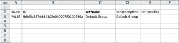

# Kick-start-scenario: Bedrijf, Groep, Rol, en Gebruiker Kick-Begint Voorbereiding

Wanneer u begint met het implementeren van Adobe Workfront, in plaats van handmatig gegevens in te voeren, kunt u uw lijst met klanten, interne afdelingen, taakrollen en gebruikersgegevens importeren.

## Toegangsvereisten

U moet de volgende toegang hebben om de stappen in dit artikel uit te voeren:

<table style="table-layout:auto"> 
 <col> 
 <col> 
 <tbody> 
  <tr> 
   <td role="rowheader">Adobe Workfront-plan</td> 
   <td>Alle</td> 
  </tr> 
  <tr> 
   <td role="rowheader">Adobe Workfront-licentie</td> 
   <td>Plan</td> 
  </tr> 
  <tr> 
   <td role="rowheader">Configuraties op toegangsniveau</td> 
   <td> 
U moet een Workfront-beheerder zijn.
 
<b>OPMERKING</b>: Als u nog steeds geen toegang hebt, vraagt u de Workfront-beheerder of deze aanvullende beperkingen op uw toegangsniveau instelt. Voor informatie over hoe een beheerder van Workfront uw toegangsniveau kan wijzigen, zie <a href="../../../administration-and-setup/add-users/configure-and-grant-access/create-modify-access-levels.md" class="MCXref xref">Aangepaste toegangsniveaus maken of wijzigen</a>.
 </td> 
  </tr> 
 </tbody> 
</table>

## Wat u kunt importeren

In de volgende tabel worden de te importeren bedrijven, groepen en rollen weergegeven:

<table style="table-layout:auto"> 
 <col> 
 <col> 
 <col> 
 <thead> 
  <tr> 
   <th><strong>Bedrijven</strong> </th> 
   <th><strong>Groepen</strong> </th> 
   <th><strong>Rollen</strong> </th> 
  </tr> 
 </thead> 
 <tbody> 
  <tr> 
   <td valign="top"> 
Acme, Co
 
Workfront, Inc.
 
<em>Uw bedrijf</em> 
 
XYZ, Inc.
 </td> 
   <td valign="top"> 
Financiën
 
IT 
 
Marketing 
 
Verkoop
 </td> 
   <td valign="top"> 
Zakelijke analist
 
Controller, creatief
 
Designer
 
Resource Manager
 
Master scrubben
 
Technisch schrijver
 
Webontwikkelaar
 </td> 
  </tr> 
 </tbody> 
</table>

Rolnamen moeten uniek zijn en bestaande taakrollen kunnen niet worden geïmporteerd.

In de volgende tabellen worden de te importeren gebruikers en diverse gebruikerskenmerken voor elke tabel weergegeven:

### Gebruiker 1

| **Voornaam** | Chris |
|---|---|
| **Achternaam** | Manning |
| **Gebruikersnaam/e-mail** | mailto:cmanning@foo.com |
| **Wachtwoord** | updateMe |
| **Toegang** | Teamlid |
| **Bedrijf** | &lt;*Uw bedrijf>* |
| **Thuisgroep** | Marketing |
| **Functie** | Zakelijke analist |

{style=&quot;table-layout:auto&quot;}

### Gebruiker 2

| **Voornaam** | Jennifer |
|---|---|
| **Achternaam** | Campbell |
| **Gebruikersnaam/e-mail** | jcampbell@foo.com |
| **Wachtwoord** | updateMe |
| **Toegang** | Projectmanager |
| **Bedrijf** | &lt;*Uw bedrijf>* |
| **Thuisgroep** | Marketing |
| **Functie** | Projectmanager |

{style=&quot;table-layout:auto&quot;}

### Gebruiker 3

| **Voornaam** | Jill |
|---|---|
| **Achternaam** | Sullivan |
| **Gebruikersnaam/e-mail** | jsullivan@foo.com |
| **Wachtwoord** | updateMe |
| **Toegang** | Helpdesk |
| **Bedrijf** | &lt;*Uw bedrijf>* |
| **Thuisgroep** | Verkoop |
| **Functie** | Verkoopvertegenwoordiger |

{style=&quot;table-layout:auto&quot;}

### Gebruiker 4

| **Voornaam** | Marc |
|---|---|
| **Achternaam** | Lewis |
| **Gebruikersnaam/e-mail** | mlewis@foo.com |
| **Wachtwoord** | updateMe |
| **Toegang** | Portfolio Manager |
| **Bedrijf** | &lt;*Uw bedrijf>* |
| **Thuisgroep** | Financiën |
| **Functie** | Controller |

{style=&quot;table-layout:auto&quot;}

### Gebruiker 5

| **Voornaam** | Pam |
|---|---|
| **Achternaam** | Reynolds |
| **Gebruikersnaam/e-mail** | preynolds@foo.com |
| **Wachtwoord** | updateMe |
| **Toegang** | Projectmanager |
| **Bedrijf** | *Uw bedrijf>* |
| **Thuisgroep** | Marketing |
| **Functie** | IT |

{style=&quot;table-layout:auto&quot;}

### Gebruiker 6

| **Voornaam** | Ray |
|---|---|
| **Achternaam** | Andrews |
| **Gebruikersnaam/e-mail** | randrews@foo.com |
| **Wachtwoord** | updateMe |
| **Toegang** | Beheerder |
| **Bedrijf** | *Uw bedrijf>* |
| **Thuisgroep** | Resource Manager |
| **Functie** | none |

{style=&quot;table-layout:auto&quot;}

## Een Kick-Start-sjabloon downloaden

1. Klik op de knop **Hoofdmenu** pictogram  in de rechterbovenhoek van Adobe Workfront klikt u op **Instellen** .

1. Klikken **Systeem** > **Kick-start** > **Gegevens importeren.**

1. Klikken **Meer opties** voor een volledige lijst met importopties.
1. Selecteer het Niveau van de Toegang, Bedrijf, Groep, de Rol van de Baan, en de voorwerpen van de Gebruiker die u wilt invoeren.

## Informatie over invoerbedrijf

1. Open de **Workfront.xlsx** bestand dat u zojuist hebt gedownload.

   >[!TIP]
   >
   >Als u met zeer brede gegevensbladen werkt, kunt u het gereedschap Venster vastzetten (of equivalent) van de werkbladeditor gebruiken om het werkblad gemakkelijker te maken.

1. Ga naar het blad &#39;CMPY Company&#39;.

   Het zou leeg moeten zijn tenzij de bedrijven reeds in het systeem zijn. 

   

1. Geef TRUE op in het dialoogvenster **isNew** kolom.
1. Herhaal deze handeling voor elk bedrijf dat wordt toegevoegd. (In dit voorbeeld voert u deze handeling uit voor de rijen 3-6, omdat er vier bedrijven worden toegevoegd.)

   

1. Geef een unieke id op.

   Dit moet voor elke rij voor de kolom van identiteitskaart worden gedaan. Gehele getallen die bij 1 beginnen, werken goed bij het maken van nieuwe records.

   

1. Stel een naam in.

   Geef de namen van elke klant op in het dialoogvenster **setName** kolom.

   

1. Ga naar het groepsblad van de GROEP.

   Tenzij u al groepen hebt gemaakt in Workfront, wordt op dit blad alleen de standaardgroep weergegeven die is ingericht voor elke account van Workfront.

    

1. Stel de **isNew** column.Volgens het scenario, zullen 4 groepen worden ingevoerd, zo specificeer WAAR in rijen 4 door 7 voor de &quot;isNew&quot;kolom.
1. Geef een unieke id op.

   Dit moet voor elke rij voor de kolom van identiteitskaart worden gedaan. Gehele getallen die bij 1 beginnen, werken goed bij het maken van nieuwe records.

   

1. Stel een naam in.

   Geef de namen op van elke afdeling in het dialoogvenster **setName** kolom.

   

   Rolgegevens opgeven. Ga naar het Rolblad van de ROL.

1. Tenzij u al rollen in uw account hebt gemaakt of verwijderd, moet dit blad 8 rollen weergeven die zijn ingericht voor elke account van Workfront.

   

1. True instellen, instructie.

   Zeven de Rollen van de Baan invoeren, input WAAR in rijen 12 door 18 voor de &quot;isNew&quot;kolom.

   

1. Geef een unieke id op.

   Dit moet voor elke rij voor de kolom van identiteitskaart worden gedaan. Gehele getallen die bij 1 beginnen, werken goed bij het maken van nieuwe records.

   

   

1. Geef een naam voor elke rol op door deze in de kolom setName te typen.

   

1. Geef zo nodig aanvullende gegevens op.

   Neem indien nodig factureringssnelheden, kostentarieven en beschrijvingen op voor de rollen die u maakt.

1. Ga naar het Gebruikersblad van de GEBRUIKER om de Informatie van de Gebruiker in te voeren.

   Tenzij u al gebruikers in uw account hebt gemaakt, wordt op dit blad alleen de Admin-gebruiker weergegeven die voor elke account van Workfront is ingericht.

    

1. Stel de waarde True in door TRUE op te geven in de rijen 4 tot en met 9 voor de kolom &#39;isNew&#39;, aangezien er 6 gebruikers worden geïmporteerd.

   

1. Stel een unieke id in door in elke rij een unieke id voor de kolom Id op te geven. Gewoonlijk werken gehele getallen vanaf 1 goed voor nieuwe records.

   

1. Voer de namen van elke gebruiker in de kolommen &#39;setFirstName&#39; en &#39;setLastName&#39; in.

   

1. Stel detailwaarden in door waarden op te geven in de kolommen &#39;setEmail&#39;, &#39;setPassword&#39; en &#39;setGebruikersnaam&#39;.

   

1. Geef waarden op voor Toegangsniveau.

   Bijvoorbeeld, Chris Manning, die een Lid van het Team is, kijkt omhoog identiteitskaart op het blad van het Niveau van de Toegang van ACSLVL voor het de toegangsniveau van het Lid van het Team. Kopieer de id naar het klembord en plak deze op het gebruikersblad in de **setAccessLevelID** kolom op Chris&#39; rij.

   Herhaal deze stap voor elke gebruiker en toegangsniveau.

    

1. Geef details voor de thuisgroep op.

   Volgens het scenario behoort Chris Manning tot de marketinggroep. Zoek in het groepsblad GROUP de id voor de marketinggroep, kopieer deze naar het klembord en plak deze op het gebruikersblad in de **setHomeGroupID** kolom op Chris&#39; rij. &#x200B;Herhaal deze stap voor elke gebruiker en groepstoewijzing.

    

1. Geef bedrijfsgegevens op.

   Alle gebruikers in dit scenario behoren tot hetzelfde bedrijf. Voor het blad van het Bedrijf CMPY, bepaal de plaats van identiteitskaart voor *Your Ewn Bedrijf *company, kopieer identiteitskaart in het klembord, en op het lusje van de Gebruiker van de GEBRUIKER, kleef deze waarde in elke rij van de kolom &quot;setCompanyID&quot;&#x200B;

   Herhaal deze stap voor elke gebruiker en groepstoewijzing.

   

   

1. Geef taakroldetails op.

   Volgens het scenario, zal Chris Manning de rol van BedrijfsAnalyst hebben. Voor het blad van de Rol van de ROL van de ROL, bepaal de plaats identiteitskaart voor de rol BedrijfsAnalyst, kopieer het in het klembord, en op het blad van de Gebruiker kleef het in de kolom &quot;setRoleID&quot;op Chris&#39; rij. &#x200B;Herhaal deze stap voor elke gebruiker en groepstoewijzing.

   

   

1. Vul desgewenst andere gebruikersgegevens in en sla het bestand op.
1. Importeer het Excel-bestand.

   Volg de aanwijzingen in het dialoogvenster **Kick Start-bestanden importeren** van dit artikel.
