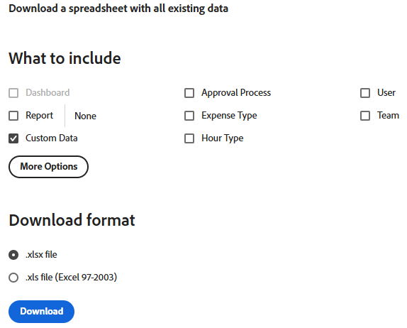

# Kick-startscenario: aangepaste velden met meerdere opties importeren in Workfront

{{highlighted-preview}}

U kunt aangepaste velden met meerdere opties in Adobe Workfront importeren met de functie Kick-Start.

Voorbeelden van aangepaste velden met meerdere opties zijn:

* Meerdere selecties opheffen
* Vervolgkeuzelijst
* Selectievakjes
* Keuzerondjes

Deze velden kunnen soms veel (soms honderden) opties bevatten. Als u ze importeert met de functie Kick-Start, kunt u als Workfront-beheerder veel tijd besparen en fouten voorkomen.

>[!IMPORTANT]
>
>U moet de stappen volgen die in de onderstaande secties worden beschreven, in deze volgorde, om aangepaste velden met meerdere opties te importeren met behulp van een trap-start:
>
>1. Bestaande aangepaste gegevens exporteren uit Workfront (optionele stap)
>1. Het snelstartsjabloon exporteren voor aangepaste gegevens
>1. Piek Excel Kick-Begint spreadsheet
>1. Het Excel-werkblad uploaden naar Workfront

## Toegangsvereisten

+++ Breid uit om de toegangseisen voor de functionaliteit in dit artikel weer te geven.

U moet de volgende toegang hebben om de stappen in dit artikel uit te voeren:

<table style="table-layout:auto"> 
 <col> 
 <col> 
 <tbody> 
  <tr> 
   <td role="rowheader">Adobe Workfront-plan</td> 
   <td>Alle</td> 
  </tr> 
  <tr> 
   <td role="rowheader">Adobe Workfront-licentie</td> 
   <td>
   
 Nieuw: Standaard

   of
   
Huidig: Plan
</td> 
  </tr> 
  <tr> 
   <td role="rowheader">Configuraties op toegangsniveau</td> 
   <td>[!UICONTROL System Administrator]</td> 
  </tr> 
 </tbody> 
</table>

Voor meer detail over de informatie in deze lijst, zie [ vereisten van de Toegang in de documentatie van Workfront ](/help/quicksilver/administration-and-setup/add-users/access-levels-and-object-permissions/access-level-requirements-in-documentation.md).

+++

## Bestaande aangepaste gegevens exporteren uit Workfront (optionele stap)

Als u niet bekend bent met de Workfront-databasestructuur of als u niet bekend bent met het bestand voor startende bestanden dat Workfront nodig heeft voor het importeren van informatie, raden we u aan eerst een bestand met startpunten te exporteren uit Workfront met bestaande informatie, vergelijkbaar met de velden die u wilt importeren.

Als u bijvoorbeeld aangepaste formulieren of aangepaste velden wilt importeren, moet u eerst een bestand met een beginnaam exporteren met bestaande aangepaste gegevens.

Wanneer u bestaande gegevens exporteert, kunt u deze eerst scannen en zien hoe de nieuwe gegevens moeten worden opgemaakt.

Als u de Workfront-databaseobjecten en -structuur goed begrijpt, kunt u verdergaan met de onderstaande sectie.

Bestaande gegevens exporteren uit Workfront:

{{step-1-to-setup}}

1. Breid **Systeem** in het linkermenu uit, dan klik **Gegevens van de Uitvoer (Kick-Begint)**.

1. Selecteer **Gegevens van de Douane** in **wat om** sectie te omvatten.

   

1. Kies **.xlsx- dossier** in de **3&rbrace; sectie van het formaat van de Download &lbrace;.**

   >[!TIP]
   >
   >Afhankelijk van hoeveel aangepaste gegevens u in uw systeem hebt, kan dit lang duren.

1. Klik **Download**. Een .xlsx-bestand wordt naar de computer gedownload. Navigeer ernaar en open het.

   

1. Onderzoek het gedownloade dossier en neem nota van de volgende details:

   * Het bestand bevat verschillende bladen. Mogelijk hoeft u de informatie op elk blad niet op de hoogte te zijn, maar u gebruikt een aantal bladen om uw gegevens te importeren. Neem de tijd om uzelf vertrouwd te maken met de inhoud en vooral met de indeling van de inhoud in elk vel.
   * Let vooral op de kolomnamen en de notatie waarin de gegevens in elke kolom worden weergegeven.
   * U mag de namen of de volgorde van de kolommen in geen van de bladen wijzigen. De kolomkoppen geven in elke rij de velden aan die u met uw gegevens moet invullen. Als de kolomkop vet wordt weergegeven, is dit een verplicht veld. U moet dus informatie in die kolom hebben.

   >[!IMPORTANT]
   >
   >Sommige kolomkoppen worden mogelijk niet vet weergegeven, maar zijn wel verplicht.

   * Houd het gedownloade bestand ter referentie en ga verder met de volgende sectie.

## De sjabloon Kick-start exporteren voor aangepaste gegevens

Nadat u de informatie over bestaande aangepaste velden in uw systeem hebt gescand, kunt u een nieuwe sjabloon voor het starten van de site voor het importeren downloaden.

{{step-1-to-setup}}

1. Vouw **Systeem** in het linkermenu uit.

1. Klik **de Gegevens van de Invoer (Kick-Begint)**.

1. In het **Download een leeg Kick-Begin spreadsheet** gebied, selecteer het **de controlevakje van Gegevens van de Douane**, en klik **Download**.

   

   Een leeg bestand met de startfunctie wordt naar de computer gedownload.

   >[!NOTE]
   >
   >Het aantal bladen in het bestand, de namen ervan en het aantal kolommen en de namen van de kolommen in elk blad moeten gelijk zijn aan het aantal bladen in de bovenstaande sectie waarin de bestaande aangepaste gegevens staan.

## Piek Excel Kick-Begint spreadsheet

Download de sjabloon voor het starten van de bestanden zoals beschreven in de bovenstaande sectie voordat u het Excel-werkblad vult.

>[!IMPORTANT]
>
>Probeer geen gegevens te importeren met een speciaal Excel-werkblad. Alle spreadsheets voor het importeren van informatie naar Workfront met de functie voor het starten van de toepassing moeten overeenkomen met de inhoud van de bestanden die u downloadt van Workfront en die in dit artikel worden beschreven.

Om het spreadsheet van Excel met informatie voor de nieuwe douanevelden te bevolken:

1. Open het Excel-werkblad dat u in de vorige sectie hebt gedownload en bekijk een aantal bladen. Elk blad vertegenwoordigt een object in de toepassing.

   >[!INFO]
   >
   >Bijvoorbeeld, **Parameter** (die naar het Gewas van de Douane verwijst), **Optie van de Parameter** (die naar de optie van het Gebied van de Douane verwijst), **Categorie** (die naar de Vorm van de Douane verwijst).
   >
   >U moet de namen van de objecten en hun kenmerken schrijven in de indeling die wordt ondersteund door de Workfront-database.
   >
   >Voor informatie over de betekenis van deze voorwerpen, zie de [ Verklarende woordenlijst van  [!DNL Adobe Workfront]  terminologie ](../../../workfront-basics/navigate-workfront/workfront-navigation/workfront-terminology-glossary.md).
   >
   >Voor informatie over de namen van de voorwerpen in het gegevensbestand van Workfront, zie de [ API Ontdekkingsreiziger ](../../../wf-api/general/api-explorer.md).
   >
   >

1. Zorg ervoor dat de volgende informatie correct is opgemaakt:

   * De eerste rij van elk blad moet leeg blijven, anders genereert het importeren een fout.
   * De kolomkoppen in elk blad vertegenwoordigen kenmerken van de objecten die tijdens het importeren kunnen worden ingesteld. Alle kolomkoppen moeten in de zelfde orde blijven u hen vindt wanneer u het blad uitvoert en zij kunnen niet worden anders genoemd.
   * De kolomkoppen in vet zijn verplichte velden en moeten een waarde hebben.

     >[!TIP]
     >
     >Sommige kolommen zijn vereist, maar niet vet. De kolommen `isNew` en `ID` worden bijvoorbeeld niet vet weergegeven, maar zijn verplichte velden.

1. Selecteer het `**PARAM Parameter`**-werkblad en voeg in de volgende vereiste kolommen informatie toe over de nieuwe aangepaste velden:

   * **`isNew`** = ga **`TRUE`** in deze kolom voor elke lijn in die een nieuw douanegebied vertegenwoordigt. Dit geeft aan dat het veld nieuw is en niet bestaat in Workfront.

     >[!TIP]
     >
     >Als een regel een bestaand veld vertegenwoordigt dat al in Workfront voorkomt, voert u **`isNew`** = **`FALSE`** in.

   * **`ID`** = moet een uniek getal zijn voor elke regel die een nieuw veld vertegenwoordigt. U kunt elk nummer gebruiken dat begint met 1, zolang elk nieuw veld een uniek nummer heeft.
   * **`setDataType`** = voor elke regel die een nieuw veld vertegenwoordigt, voert u het gegevenstype in dat het veld ondersteunt. Het gegevenstype moet worden ingevoerd zoals het in de database wordt weergegeven. Selecteer een van de volgende gegevenstypen:
      * **`NMBR`** for Number
      * **`CURC`** voor Valuta
      * **`TEXT`** voor tekst
   * `**setDisplaySize**`= de vertoningsgrootte (&#39;**setDisplaySize**&#39;) voor om het even welke veelvoudige gebieden van de optiesdouane is altijd 0.
   * **`setDisplayType`** = voor elke lijn die een nieuw gebied vertegenwoordigt, ga het vertoningstype van het gebied in. Het weergavetype moet worden ingevoerd zoals het in de database wordt weergegeven.

     Selecteer een van de volgende opties voor aangepaste velden met meerdere opties:

      * **`MULT`** voor Meerdere selecties > Vervolgkeuzelijst
      * **`SLCT`** voor vervolgkeuzelijst
      * **`RDIO`** voor keuzerondjes
      * **`CHCK`** voor selectievakjes

     >[!TIP]
     >
     >Om het Type van Gegevens en de informatie van het Type van Vertoning te vinden, verwijs naar [ API Ontdekkingsreiziger ](../../../wf-api/general/api-explorer.md), breid het **voorwerp van de Parameter** uit, en zoek deze attributen onder de **gebieden** tabel.

   * **`setName`** = voer de naam in van de aangepaste velden zoals u deze in Workfront wilt weergeven.

     >[!INFO]
     >
     >Bijvoorbeeld, zouden wij twee douanegebieden, genoemd _Merk_, een checkbox gebied, en _Media_, een radioknoopgebied kunnen invoeren.

   * De kolommen **`setName`** en **`setValue`** bevatten gewoonlijk dezelfde informatie en ze moeten de namen weerspiegelen die in de Workfront-interface voor uw nieuwe veld worden gewenst.

   De waarde van een veld is de naam die wordt weergegeven in rapporten, terwijl de naam wordt weergegeven in de aangepaste formulieren die aan objecten zijn gekoppeld.

   Voor meer informatie, zie [ een douaneformulier ](/help/quicksilver/administration-and-setup/customize-workfront/create-manage-custom-forms/form-designer/design-a-form/design-a-form.md) creëren.

   

1. Selecteer het **`POPT Parameter Options`** -werkblad en voeg in de volgende vereiste kolommen informatie toe over de opties van elk aangepast veld:

   * **`isNew`** = ga **`TRUE`** in deze kolom voor elke lijn in die een nieuwe gebiedsoptie vertegenwoordigt.

     >[!TIP]
     >
     >    Als een lijn een bestaande optie vertegenwoordigt, zou u **`isNew`** = **`FALSE`** ingaan.

   * **`ID`** = moet een uniek getal zijn voor elke regel die een nieuwe optie vertegenwoordigt. U kunt elk nummer gebruiken dat begint met 1, zolang elke nieuwe optie een uniek nummer heeft.
   * **`setIsDefault`** = ga `TRUE` voor de opties in die u door gebrek wilt tonen, en `FALSE` voor alle andere opties, voor elk gebied.  Bijvoorbeeld, willen wij _Nike_ de standaardoptie voor _Merk_ en _Druk_ zijn om de standaardoptie voor _Media_ te zijn.

     >[!TIP]
     >
     >Er kan slechts één standaardoptie voor elk veld zijn.

   * **`setParameterID`** = de opties die aan het _Merk_ douanegebied beantwoorden hebben a **`setParameterID`** van 1, en de opties die aan de _Media_ beantwoorden hebben een **&#x200B; `setParameterID` &#x200B;** van 2. De vellen `PARAM` en `POPT` verwijzen naar elkaar om aan te geven welke opties behoren tot welk aangepast veld.
   * **`setDisplayOrder`**= de kolom van de vertoningsorde wijst op de orde waarin de opties op uw douanegebied zullen tonen. U kunt beginnen met 1 en in oplopende volgorde verdergaan voor alle opties, ongeacht tot welke velden ze behoren. Het is belangrijk dat er voor elke optie unieke nummers zijn.
   * De kolommen **`setLabel`** en `**setValue`** bevatten doorgaans dezelfde informatie en moeten de namen weerspiegelen die u in de gebruikersinterface van Workfront wilt gebruiken. De waarde van een optie is de naam die in rapporten wordt weergegeven, terwijl het label in de aangepaste formulieren wordt weergegeven wanneer het aan een object is gekoppeld. Voor meer informatie, zie [ een douaneformulier ](/help/quicksilver/administration-and-setup/customize-workfront/create-manage-custom-forms/form-designer/design-a-form/design-a-form.md) creëren.
   * **`setIsHidden`** = ga `TRUE` in als u om het even welke opties wilt worden verborgen.

   

1. (Optioneel) Als u ook een aangepast formulier wilt maken waarin u de nieuwe velden later kunt toevoegen, selecteert u het **`CTGY Category`** -werkblad en werkt u de volgende vereiste kolommen bij voor de aangepaste formuliergegevens:

   * **`isNew`** = ga **`TRUE`** in deze kolom voor elke lijn in die een nieuw douaneformulier vertegenwoordigt.
   * **`ID`** = voer een uniek getal in voor elke regel die een nieuw formulier vertegenwoordigt. U kunt elk nummer gebruiken dat begint met 1, zolang elke nieuwe optie of regel een uniek nummer heeft.
   * **`setGroupID`** = voeg identiteitskaart van de Groep voor uw Groep van het Huis, of een andere groep in het systeem toe waarvan leden u toegang tot dit formulier wilt hebben. Dit is een verplicht veld.

   Als u `ID` van een groep wilt achterhalen, maakt u een groepsrapport en voegt u het veld `ID` toe in de weergave of navigeert u naar een groep en zoekt u de URL voor de groep. De groep-id staat in de URL van de pagina van de groep. Als de URL van de groep bijvoorbeeld `https://companyName.my.workfront.com/group/575b000800467a6f66e747932c807464/members` is, is de groep-id `575b000800467a6f66e747932c807464` .

   * **`setCatObjCode`**= dit is de objectcode voor het objecttype waarvoor u het formulier wilt maken. Voer een code uit de volgende opties in:
      * **`CMPY`** voor bedrijf
      * **`TASK`** voor taak
      * **`PROJ`** voor project
      * **`PORT`** voor Portfolio
      * **`PRGM`** voor programma
      * **`USER`** voor gebruiker
      * **`DOCU`** voor document
      * **`OPTASK`** for Issue
      * **`EXPNS`** voor kosten
      * **`ITRN`** voor herhaling
      * **`BILL`** voor factureringsrecords
      * **`GROUP`** voor groep

     >[!NOTE]
     >
     >Voor formulieren met meerdere objecten voert u het eerste object in dat u zou selecteren bij het maken van een formulier in de gebruikersinterface. Stel de waarde `setCatObjCode` bijvoorbeeld in op `TASK` als u Taak selecteert in de Workfront-interface en vervolgens op Issue, Portfolio, enzovoort, maar u wilt niet dat het formulier beschikbaar is voor Projecten.

   * **`setName`** = dit is de naam van het aangepaste formulier zoals u het wilt weergeven in de Workfront-interface.

     

1. Sla het spreadsheet op als een .xls- of .xlsx-bestand op uw computer. Uw Excel-werkblad is ingevuld en kan nu worden geïmporteerd in Workfront.

## Het Excel-werkblad uploaden naar Workfront

Nadat u de in de vorige secties beschreven stappen hebt uitgevoerd, gaat u als volgt verder om de nieuwe velden en formulieren te uploaden naar Workfront:

{{step-1-to-setup}}

1. Klik **Systeem > de Gegevens van de Invoer (Kick-Begint)**.

1. Klik **kiezen dossier** onder de sectie **gegevens met Kick-Begin spreadsheet** uploadt.

1. Blader naar het Excel-werkblad dat u hebt voorbereid, op uw computer en selecteer het werkblad wanneer u het hebt gevonden.

   

   Het bestand wordt automatisch geüpload en er verschijnt een bericht dat het importeren is gelukt. Afhankelijk van hoeveel informatie u invoert, zou deze stap een paar seconden aan een minuut kunnen vergen.

   De nieuwe aangepaste velden en formulieren staan nu in uw Workfront-systeem. U kunt ze vinden in het gedeelte Aangepaste Forms van Setup.

   >[!NOTE]
   >
   >De nieuwe formulieren en de geïmporteerde velden hebben nog geen verbinding. Het formulier wordt geïmporteerd zonder aangepaste velden. U moet de velden handmatig toevoegen aan het nieuwe aangepaste formulier of aan een ander bestaand aangepast formulier.

   Voor informatie over het toevoegen van gebieden aan douaneformulieren, zie [ een douaneformulier ](/help/quicksilver/administration-and-setup/customize-workfront/create-manage-custom-forms/form-designer/design-a-form/design-a-form.md) creëren.

   

1. (In het milieu van de Productie slechts) klik **uploaden**.

   Er wordt een melding weergegeven dat het importeren is gelukt. Afhankelijk van hoeveel informatie u invoert, zou deze stap een paar seconden aan een minuut kunnen vergen.

   De nieuwe aangepaste velden en formulieren staan nu in uw Workfront-systeem. U kunt ze vinden in het gedeelte Aangepaste Forms van Setup.

   >[!NOTE]
   >
   >De nieuwe formulieren en de geïmporteerde velden hebben nog geen verbinding. Het formulier wordt geïmporteerd zonder aangepaste velden. U moet de velden handmatig toevoegen aan het nieuwe aangepaste formulier of aan een ander bestaand aangepast formulier.

   Voor informatie over het toevoegen van gebieden aan douaneformulieren, zie [ een douaneformulier ](/help/quicksilver/administration-and-setup/customize-workfront/create-manage-custom-forms/form-designer/design-a-form/design-a-form.md) creëren.

1. (Voorwaardelijk) Als het importeren niet is gelukt, wordt een foutbericht weergegeven waarin wordt aangegeven wat het probleem is. Probeer het veld, het blad en het rijnummer te identificeren waarin het probleem is aangetroffen en corrigeer de gegevens in het Excel-bestand. Probeer het bestand vervolgens nog een keer te importeren.

1. (Voorwaardelijk) Afhankelijk van wat het probleem is, zoals vermeld in het foutbericht, kunnen sommige gegevens al worden geïmporteerd. U moet een van de volgende handelingen uitvoeren voordat u het blad opnieuw kunt importeren:

   * Verwijder de informatie die uit Workfront is geïmporteerd uit het gebied Aangepaste Forms en breng de correctie aan die wordt aangegeven door het foutbericht.
   * Geef aan dat er al een veld of formulier in het systeem staat voor de velden of formulieren die al zijn geïmporteerd, en breng vervolgens de correctie aan.
Als u wilt aangeven dat een veld of een aangepast formulier al in Workfront is, moet u ervoor zorgen dat het veld `inNew` wordt gemarkeerd als `FALSE` in bladen die informatie bevatten over het formulier (`CTGY`) of het veld (`PARAM`) op het importblad met de startfunctie.
