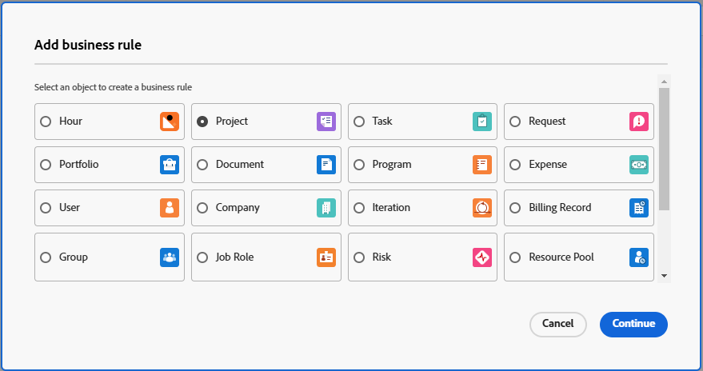

# Zakelijke regels maken en bewerken

{{preview-fast-release-general}}

Met een bedrijfsregel kunt u validatie toepassen op Workfront-objecten en voorkomen dat gebruikers een object maken, bewerken of verwijderen als aan bepaalde voorwaarden is voldaan. De bedrijfsregels helpen gegevenskwaliteit en operationele efficiency te verbeteren door acties te verhinderen die gegevensintegriteit in gevaar zouden kunnen brengen.

Eén bedrijfsregel kan slechts aan één object worden toegewezen. Bijvoorbeeld, als u een bedrijfsregel creeert voor het niet uitgeven van projecten onder bepaalde voorwaarden, kunt u niet de zelfde regel op taken toepassen. U zou een afzonderlijke bedrijfsregel met de zelfde voorwaarden voor taken moeten tot stand brengen.

Toegangsniveaus en het delen van objecten hebben een hogere prioriteit dan bedrijfsregels wanneer een gebruiker met een voorwerp in wisselwerking staat. Bijvoorbeeld, als een gebruiker een toegangsniveau of een toestemming heeft die het uitgeven van een project niet toestaat, dan zouden die belangrijkheid over een bedrijfsregel nemen die het uitgeven van een project onder bepaalde voorwaarden toestaat.

Wanneer meer dan één bedrijfsregel op een voorwerp van toepassing is, dan worden de regels allen gevolgd maar niet in een bepaalde orde toegepast. U hebt bijvoorbeeld twee bedrijfsregels. Eén beperkt het maken van kosten in de maand februari. Het tweede verhindert het uitgeven van een project wanneer de projectstatus Voltooid is. Als een gebruiker probeert om een uitgave aan een voltooid project in juni toe te voegen, kan de uitgave niet worden toegevoegd omdat het de tweede regel heeft teweeggebracht.

De bedrijfsregels zijn van toepassing op het creëren van, het uitgeven van, en het schrappen van voorwerpen door API evenals in de interface van Workfront.

>[!NOTE]
>
>Omdat de bedrijfsregels bepaalde acties blokkeren, zou u uw bedrijfsregels eerst in een zandbak of voorproefmilieu moeten vormen en hen grondig testen alvorens hen in productie toe te laten.

## Toegangsvereisten

+++ Breid uit om de toegangseisen voor de functionaliteit in dit artikel weer te geven.

U moet het volgende hebben om de stappen in dit artikel uit te voeren:

<table style="table-layout:auto"> 
 <col> 
 <col> 
 <tbody> 
  <tr> 
   <td>Adobe Workfront-plan</td> 
   <td>Ultimate</td> 
  </tr> 
  <tr> 
   <td>Adobe Workfront-licentie</td> 
   <td>Standaard</td> 
  </tr> 
  <tr> 
   <td>Configuraties op toegangsniveau</td> 
   <td>Systeembeheerder</td> 
  </tr>  
 </tbody> 
</table>

Voor meer detail over de informatie in deze lijst, zie [ vereisten van de Toegang in de documentatie van Workfront ](/help/quicksilver/administration-and-setup/add-users/access-levels-and-object-permissions/access-level-requirements-in-documentation.md).

+++

## Scenario&#39;s voor bedrijfsregels

De indeling van een bedrijfsregel is &quot;ALS aan de gedefinieerde voorwaarde is voldaan, is de gebruiker niet in staat tot de actie op het object en wordt het bericht weergegeven.&quot;

De syntaxis voor de eigenschappen en andere functies in een bedrijfsregel is hetzelfde als de syntaxis voor een berekend veld in een aangepast formulier. Voor meer informatie over de syntaxis, zie [ berekende gebieden met de vormontwerper ](/help/quicksilver/administration-and-setup/customize-workfront/create-manage-custom-forms/form-designer/design-a-form/add-a-calculated-field.md) toevoegen.

Voor informatie over IF- verklaringen, zie [ &quot;IF&quot;verklaringenoverzicht ](/help/quicksilver/reports-and-dashboards/reports/calc-cstm-data-reports/if-statements-overview.md) en [ de exploitanten van de Voorwaarde in berekende douanevelden ](/help/quicksilver/reports-and-dashboards/reports/calc-cstm-data-reports/condition-operators-calculated-custom-expressions.md).

Voor informatie over op gebruiker-gebaseerde vervangingen, zie [ Op gebruiker-gebaseerde vervangingen van het Gebruik om rapporten ](/help/quicksilver/reports-and-dashboards/reports/reporting-elements/use-user-based-wildcards-generalize-reports.md) te generaliseren.

Voor informatie over op datum-gebaseerde vervangingen, zie [ Op datum-gebaseerde vervangingen van het Gebruik om rapporten ](/help/quicksilver/reports-and-dashboards/reports/reporting-elements/use-date-based-wildcards-generalize-reports.md) te generaliseren.

Een API-jokerteken is ook beschikbaar in bedrijfsregels. Gebruik `$$ISAPI` om de regel alleen in de API te activeren. Gebruik `!$$ISAPI` om de regel alleen in de gebruikersinterface af te dwingen en gebruikers toe te staan de regel via de API te omzeilen.

* Deze regel verbiedt gebruikers bijvoorbeeld voltooide projecten te bewerken via de API. Als het jokerteken niet werd gebruikt, zou de regel de actie in zowel het gebruikersinterface als API blokkeren.
  `IF({status} = "CPL" && $$ISAPI, "You cannot edit completed projects through the API.")`

De jokertekens `$$BEFORE_STATE` en `$$AFTER_STATE` worden in expressies gebruikt om de veldwaarden van het object te benaderen voor en na elke bewerking.

* Deze jokertekens zijn beide beschikbaar voor de bewerktrigger. De standaardstatus voor de bewerktrigger (als er geen status is opgenomen in de expressie) is `$$AFTER_STATE` .
* De trigger voor het maken van objecten staat alleen de instructie `$$AFTER_STATE` toe, omdat de status before niet bestaat.
* De trigger voor het verwijderen van objecten staat alleen de instructie `$$BEFORE_STATE` toe, omdat de status after niet bestaat.

Sommige eenvoudige bedrijfsregelscenario&#39;s zijn:

* De gebruikers kunnen geen nieuwe uitgaven tijdens de laatste week van Februari toevoegen. Deze formule kan worden weergegeven als: `IF(MONTH($$TODAY) = 2 && DAYOFMONTH($$TODAY) >= 22, "You cannot add new expenses during the last week of February.")`
* De gebruikers kunnen niet de projectnaam van een project in Volledige status uitgeven. Deze formule kan worden weergegeven als: `IF({status} = "CPL" && {name} != $$BEFORE_STATE.{name}, "You cannot edit the project name.")`

Een scenario met geneste IF-instructies is:

De gebruikers kunnen voltooide projecten niet uitgeven en kunnen geen projecten met een Geplande Datum van de Voltooiing in Maart uitgeven. Deze formule kan als volgt worden omschreven:

```
IF(
    $$AFTER_STATE.{status}="CPL",
    "You cannot edit a completed project",
    IF(
        MONTH({plannedCompletionDate})=3,
        "You cannot edit a project with a planned completion date in March")
)
```

## Voeg een nieuwe bedrijfsregel toe

{{step-1-to-setup}}

1. Klik **BedrijfsRegels** in het linkerpaneel.
1. Klik **Nieuwe bedrijfsregel**.
1. Selecteer het objecten type om de bedrijfsregel aan toe te wijzen, dan klik **verdergaan**.

   

1. Typ de **Naam** voor de bedrijfsregel.
1. Op **is Actief** gebied, selecteer of de regel actief zou moeten zijn wanneer u het bewaart.

   Als u **Nr** selecteert, wordt de regel bewaard als inactief, en u kunt het later activeren.

1. Selecteer a **Trekker** voor de bedrijfsregel. De opties zijn:

   * **op objecten verwezenlijking:** de regel wordt toegepast wanneer een gebruiker probeert om een voorwerp tot stand te brengen.
   * **op voorwerp uitgeven:** de regel wordt toegepast wanneer een gebruiker probeert om een voorwerp uit te geven.
   * **op voorwerp schrapt:** de regel wordt toegepast wanneer een gebruiker probeert om een voorwerp te schrappen.

1. (Facultatief) ga a **Beschrijving** van de bedrijfsregel in en wat gebeurt wanneer het wordt toegepast.
1. Bouw de formule in de formules redacteur, in het centrum van de dialoog van de bedrijfsregel.

   De indeling van een bedrijfsregel is &quot;ALS aan de gedefinieerde voorwaarde is voldaan, is de gebruiker niet in staat tot de actie op het object en wordt het bericht weergegeven.&quot;

   In het formuleringsgebied, zijn de delen van de bedrijfsregel u bouwt de voorwaarde, en het bericht dat in Workfront toont wanneer aan de voorwaarde wordt voldaan.

   * Het &quot;object&quot; is het objecttype dat u hebt geselecteerd bij het maken van de bedrijfsregel. Deze wordt weergegeven in de kop van het dialoogvenster.
   * De &quot;actie&quot; is de trigger die u voor de regel hebt geselecteerd: maak, bewerk of verwijder het object.
   * Omdat het object en de actie al zijn gedefinieerd, neemt u ze niet op in de formule.
   * Het aangepaste foutbericht wordt aan de gebruiker weergegeven wanneer deze de bedrijfsregel activeert. Het zou duidelijke instructies moeten geven over wat er mis ging en hoe de kwestie te verhelpen.

     <span class="preview"> u kunt statische URL in het foutenbericht omvatten, om aan documentatie of andere nuttige pagina&#39;s te verbinden om de gebruiker op te begeleiden hoe te om hun actie binnen de beperking van de regel te wijzigen.</span>

     <span class="preview"> in dit voorbeeld, &quot;leer meer&quot;zal met URL verbinden. `"You are not allowed to add a new project in November.[Learn more](http://url)"` De URL moet tussen haakjes staan, maar koppelingstekst tussen haakjes is niet vereist. U kunt volledige URL tonen en het zal een klikbare verbinding zijn.</span>

    toe

   Dit voorbeeld is een bedrijfsregel voor projecten. Als de huidige maand November is, dan worden de gebruikers toegelaten om geen nieuwe projecten tot stand te brengen, en het bericht verklaart dit.

   Voor meer voorbeelden van bedrijfsregels, zie [ Scenario&#39;s voor bedrijfsregels ](#scenarios-for-business-rules) in dit artikel.

1. (Facultatief) gebruik de formule **Uitdrukkingen** en **Gebieden** in het juiste paneel om bij de bouw van de regel bij te wonen.

   Zoeken naar een expressie of veld om de lijst met beschikbare items te beperken.

   De lijst met beschikbare velden is beperkt tot velden die betrekking hebben op het objecttype voor de bedrijfsregel.

1. Klik **sparen** wanneer u klaar bent met het bouwen van de bedrijfsregel.

>[!NOTE]
>
>Nadat u een bedrijfsregel hebt toegevoegd, moet u deze testen door het bijbehorende object toe te voegen, te bewerken of te verwijderen om ervoor te zorgen dat de regel correct wordt toegepast.

## Een bedrijfsregel activeren

Wanneer een bedrijfsregel inactief is, is Actief gebied in de lijst van bedrijfsregels vals toont. U kunt de status van de regel niet bijwerken in de lijstweergave.

Een bedrijfsregel activeren:

1. Selecteer de bedrijfsregel in de lijst van regels en klik het Edit pictogram.
1. Selecteer **ja** voor **is Actief** in de dialoog van de bedrijfsregel.
1. Klik **sparen**.
