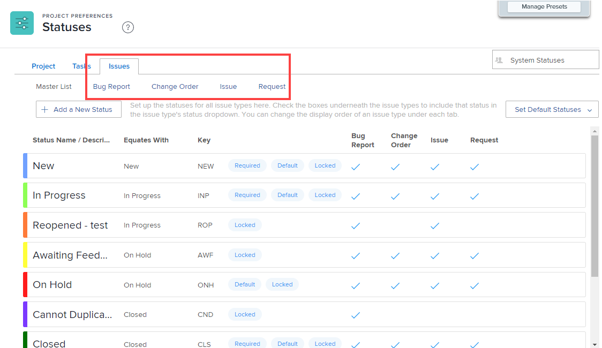

# Standaardobjecttypen aanpassen

Typen problemen zijn handig in de volgende omstandigheden:

* Wanneer het aanpassen van uitgiftestatussen, zoals die in [&#x200B; worden beschreven creeer of geef een status &#x200B;](../../../administration-and-setup/customize-workfront/creating-custom-status-and-priority-labels/create-or-edit-a-status.md) uit.
* Wanneer het creëren van een verzoekrij, zoals die in [&#x200B; wordt beschreven creeer een Rij van het Verzoek &#x200B;](../../../manage-work/requests/create-and-manage-request-queues/create-request-queue.md).

U kunt de labels voor elk standaarduitgavetype aanpassen zodat deze beter overeenkomen met de terminologie die in uw organisatie wordt gebruikt.

## Toegangsvereisten

+++ Breid uit om de toegangseisen voor de functionaliteit in dit artikel weer te geven.

U moet de volgende toegang hebben om de stappen in dit artikel uit te voeren:

<table style="table-layout:auto"> 
 <col> 
 <col> 
 <tbody> 
  <tr> 
   <td role="rowheader">[!DNL Adobe Workfront] plan</td> 
   <td>Alle</td> 
  </tr> 
  <tr> 
   <td role="rowheader">[!DNL Adobe Workfront] licentie</td> 
   <td>
Nieuw: [!UICONTROL Standard]

   of
   
Huidige: [!UICONTROL Plan]

   </td> 
  </tr>
  <tr>
   <td role="rowheader">Configuraties op toegangsniveau</td> 
   <td>[!UICONTROL System Administrator]</td>
  </tr> 
 </tbody> 
</table>

Voor meer detail over de informatie in deze lijst, zie [&#x200B; vereisten van de Toegang in de documentatie van Workfront &#x200B;](/help/quicksilver/administration-and-setup/add-users/access-levels-and-object-permissions/access-level-requirements-in-documentation.md).

+++

## Standaardtypen problemen

Als u toegang hebt tot [!DNL Adobe Workfront] [!UICONTROL administrator] , zijn er vier standaardtypen voor uitgaven die u kunt configureren en hernoemen:

* **[!UICONTROL Bug Report]** Wordt gebruikt om gerapporteerde fouten in het systeem bij te houden.
* **[!UICONTROL Change Order]** Wordt gebruikt om problemen bij te houden die moeten worden bijgewerkt of herzien.
* **[!UICONTROL Issue]** Een object in [!DNL Workfront] dat ongeplande werkzaamheden communiceert, een probleem dat optreedt of iets dat moet worden opgelost om een taak voort te zetten.
* **[!UICONTROL Request]** Een type uitgave dat van toepassing is op een aanvraagwachtrij waar gebruikers aanvragen indienen in Workfront.

## Een type uitgave aanpassen

Overweeg het volgende over het aanpassen van types van kwesties:

* U kunt het label voor een type uitgave wijzigen, maar u kunt de functie ervan niet wijzigen.
* U kunt geen extra typen uitgaven maken.
* U kunt de filterwaarden voor de naam van een type uitgave niet wijzigen. Als u dus een filter op een uitgiftenrapport maakt, geeft de waarde van het filter (sleutel) niet de aangepaste naam van het type uitgave weer.
* Er zijn drie standaardstatussen gekoppeld aan elk type uitgave: [!UICONTROL New], [!UICONTROL In Progress] en [!UICONTROL Closed] . U kunt deze statussen niet verwijderen of ze uit een type uitgave verwijderen, maar u kunt ze wel een andere naam geven.
* U kunt de volgorde van de opties in het vervolgkeuzemenu voor elk type uitgave wijzigen.

U kunt als volgt een type uitgave aanpassen:

{{step-1-to-setup}}

1. Klik op **[!UICONTROL Project Preferences]** > **[!UICONTROL Statuses]** .

1. Klik op de tab **[!UICONTROL Issues]** .
1. Voer een van de volgende handelingen uit:

   * Beweeg over het uitgevende type u wilt aanpassen, [!UICONTROL Edit] pictogram  uit dat aan uiterst rechts verschijnt, dan een nieuwe naam voor het uitgevende type.

      aan

   * Klik op een [!UICONTROL issue type] om de bijbehorende status weer te geven en sleep vervolgens de grepen die worden weergegeven wanneer u de muisaanwijzer op de status plaatst. Zet deze vervolgens neer in de volgorde waarin u ze wilt weergeven in de vervolgkeuzelijst met uitgaven van uw gebruikers **[!UICONTROL Status]** .
