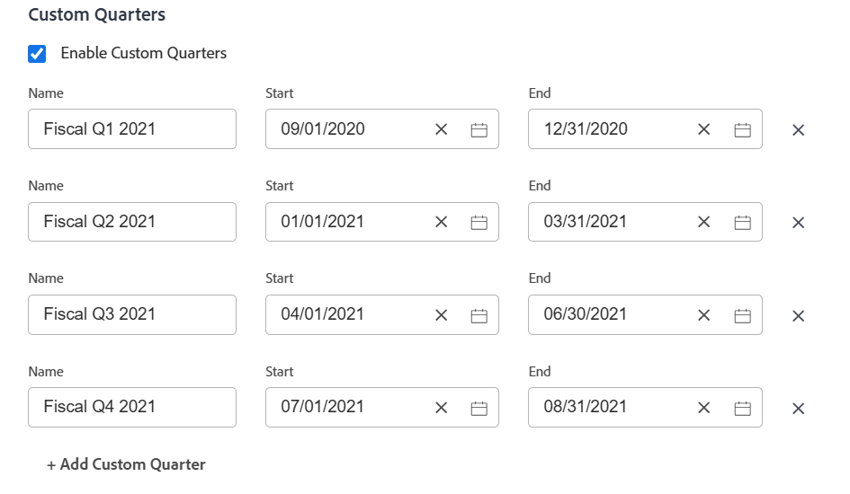

# Aangepaste kwarten inschakelen

<!--Audited: 03/2026-->

<!--
The highlighted information on this page refers to functionality not yet generally available. It is available only in the Preview environment for all customers. After the monthly releases to Production, the same features are also available in the Production environment for customers who enabled fast releases.    

For information about fast releases, see [Enable or disable fast releases for your organization](/help/quicksilver/administration-and-setup/set-up-workfront/configure-system-defaults/enable-fast-release-process.md). 
-->

Voor rapportagedoeleinden kunt u aangepaste kwartalen maken als de kwartalen van uw organisatie zijn gebaseerd op andere criteria dan kalenderdatums (zoals werkdagen of winkeldagen).

Afhankelijk van welke producten uw bedrijf heeft gekocht, kunt u het volgende aantal kwartalen in uw gebied van de Opstelling van Workfront vormen:

* Klanten die alleen [!DNL Workfront] hebben aangeschaft, kunnen maximaal acht aangepaste kwartalen configureren voor hun [!DNL Adobe Workfront] -systeem.
* Klanten die [!DNL Workfront] en [!DNL Workfront Planning] hebben aangeschaft, kunnen maximaal 100 kwartalen configureren voor hun [!DNL Workfront] -systeem. Deze zijn ook beschikbaar in [!DNL Planning] .

## Toegangsvereisten

+++ Breid uit om de toegangseisen voor de functionaliteit in dit artikel weer te geven.

<table style="table-layout:auto"> 
 <col> 
 <col> 
 <tbody> 
  <tr> 
   <td>[!DNL Adobe Workfront] package</td> 
   <td>
Alle
</td> 
  </tr> 
  <tr> 
   <td>[!DNL Adobe Workfront] licentie</td> 
   <td>
[!UICONTROL Standard]

       
[!UICONTROL Plan]
</td>
  </tr> 
  <tr> 
   <td>Configuraties op toegangsniveau</td> 
   <td>[!UICONTROL System Administrator]</td> 
  </tr> 
 </tbody> 
</table>

Voor informatie, zie [ vereisten van de Toegang in de documentatie van Workfront ](/help/quicksilver/administration-and-setup/add-users/access-levels-and-object-permissions/access-level-requirements-in-documentation.md).

+++

## Aangepaste kwarten instellen voor uw [!DNL Workfront] -systeem

{{step-1-to-setup}}

1. Klik op **[!UICONTROL Custom Quarters]**.

1. Selecteer **[!UICONTROL Enable Custom Quarters]**.

1. Typ een naam voor het aangepaste kwartaal, bijvoorbeeld &quot;Fiscaal Q1 2021&quot;.
1. Selecteer de begin- en einddatum voor het aangepaste kwartaal.

   

1. (Optioneel) Klik op **[!UICONTROL Add Custom Quarter]** om extra aangepaste vierkanten aan het systeem toe te voegen.

   >[!IMPORTANT]
   >
   > Als uw bedrijf [!DNL Workfront Planning] heeft aangeschaft, kunt u uw aangepaste kwartalen niet opslaan als er tussenruimten of overlappingen zijn tussen de kwartalen.
   >
   >Tussenruimten en overlappingen tussen de kwartalen zijn alleen toegestaan voor [!DNL Workfront] -klanten.

1. (Optioneel en voorwaardelijk) Als uw bedrijf alleen [!DNL Workfront] zonder [!DNL Workfront Planning] heeft aangeschaft, maakt u een rapporteringselement dat naar de fiscale kwartalen verwijst.

   **Voorbeeld:** creeer een filter voor een [!UICONTROL project] lijst en omvat de Geplande Datum van de Voltooiing van een project dat van de douanekwartalen van verwijzingen voorziet.

   

   De verwijzingen naar &quot;Dit Kwartaal&quot;, &quot;Volgende Kwartaal&quot; en &quot;Laatste Kwartaal&quot; worden vervangen door nieuwe verwijzingen naar de aangepaste kwartalen.

   Voor informatie over het melden van elementen, zie [ Rapporterende elementen: filters, meningen, en groeperingen ](../../../reports-and-dashboards/reports/reporting-elements/reporting-elements-filters-views-groupings.md).

   Voor informatie over het creëren van filters, zie [ filters in  [!DNL Adobe Workfront]](../../../reports-and-dashboards/reports/reporting-elements/create-filters.md) creëren of uitgeven.
1. (Optioneel en voorwaardelijk) Als uw bedrijf Workfront Planning heeft aangeschaft en u toegang hebt tot [!DNL Workfront Planning] , gaat u naar een pagina met recordtypen en opent u een tijdlijnweergave. In de weergave worden de nieuwe aangepaste kwartalen weergegeven.
Voor informatie, zie [ de chronologiemening ](/help/quicksilver/planning/views/manage-the-timeline-view.md) leiden.
