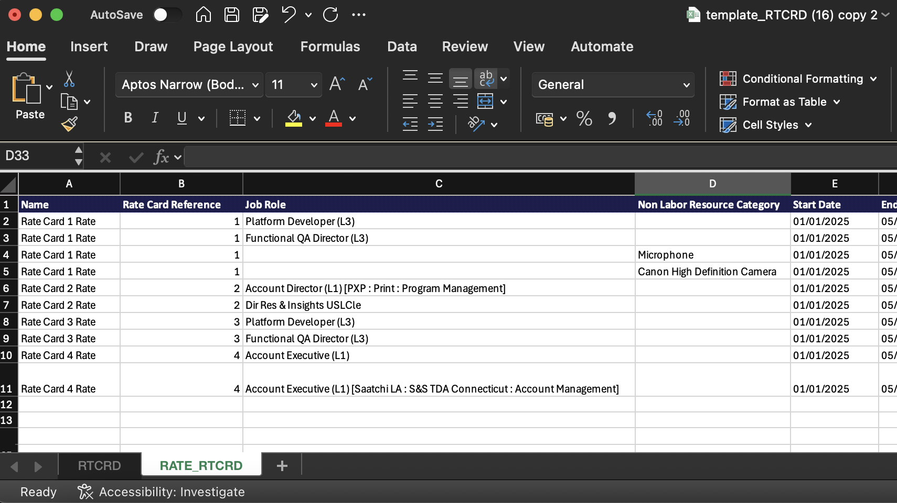

# Tariefkaarten importeren uit een sjabloon

U kunt een sjabloonbestand gebruiken om uw tariefkaarten te maken in Excel en deze te importeren in Adobe Workfront, in plaats van alle functies en tarieven handmatig toe te voegen.

Om de kaarten van het voorbeeldtarief te zien die in dit artikel worden beschreven, download het [&#x200B; steekproefdossier &#x200B;](assets/rate-cards-sample.zip).

## Belangrijke regels voor het werken met het sjabloonbestand

* Voer de taakrol OF de categorie Niet-arbeidsmiddelen in, maar niet beide.
* De reeks van de Kaart van het Tarief op het lusje RATE_RTCRD moet de orde van kaarten op het RTCRD lusje (1 voor eerste, 2 voor tweede, enz.) aanpassen.
* De begindatum en einddatum moeten de toegestane notaties volgen.
* Snelheidskaarten kunnen zonder snelheden worden geïmporteerd en later worden bijgewerkt.
* Aangepaste kenmerken (Bureau, Kostenplaats, enz.) kunnen variëren. Neem contact op met de systeembeheerder voor de exacte vereisten.
* Rijen die in de sjabloon zijn verwijderd, verwijderen de bestaande records in het systeem niet.

## Toegangsvereisten

+++ Breid uit om de toegangseisen voor de functionaliteit in dit artikel weer te geven.

<table style="table-layout:auto"> 
 <col> 
 <col> 
 <tbody> 
  <tr> 
   <td>[!DNL Adobe Workfront] package</td> 
   <td>Alle</td> 
  </tr> 
  <tr> 
   <td>[!DNL Adobe Workfront] licentie</td> 
   <td>
[!UICONTROL Standard]

   
[!UICONTROL Plan]

   </td> 
  </tr> 
  <tr> 
   <td>Configuraties op toegangsniveau</td> 
   <td>Toegang bewerken tot [!UICONTROL Rate Cards]</td> 
  </tr> 
 </tbody> 
</table>

Voor informatie, zie [&#x200B; vereisten van de Toegang in de documentatie van Workfront &#x200B;](/help/quicksilver/administration-and-setup/add-users/access-levels-and-object-permissions/access-level-requirements-in-documentation.md).

+++

## Het sjabloonbestand invullen

{{step-1-to-setup}}

1. In het linkerpaneel, klik [!UICONTROL **kaarten van het Tarief**].
1. Klik **Nieuwe tariefkaart**, dan klik **het malplaatje van Excel van de Download**.
1. Volg de aanwijzingen van de browser om het sjabloonbestand op uw computer op te slaan.
1. Open het sjabloonbestand in Excel.

   >[!TIP]
   >
   > Sla het bestand op onder een andere naam als u het lege sjabloonbestand wilt behouden en het later opnieuw wilt gebruiken.

   De sjabloon heeft twee tabbladen. Beide tabbladen moeten de juiste informatie hebben om de tariefkaarten te kunnen importeren.

   * RTCRD: De tariefkaarten definiëren (basisinformatie)
   * RATE_RTCRD: Definieer de gedetailleerde tarieven verbonden aan elke tariefkaart

### Het tabblad RTCRD (Rate Card Setup) invullen

Maak en maak een lijst van alle tariefkaarten op dit tabblad. Elke rij vertegenwoordigt één tariefkaart.

1. Voer de gegevens voor een tariefkaart op elke rij in:

   * **Naam** (vereist): De naam van de tariefkaart, zoals &quot;Globale Facturering 2025.&quot;

     Deze naam is de belangrijkste id voor de tariefkaart. Elke tariefkaart moet een unieke naam hebben.

   * **Beschrijving** (facultatief): Een vrije-vormtekstbeschrijving van de tariefkaart. Gebruik dit om doel, werkingsgebied, of geldigheid te beschrijven, bijvoorbeeld, &quot;van toepassing is op Noord-Amerikaanse projecten.&quot;
   * **Bedrijf** (facultatief): Dit kan of de bedrijfsnaam of bedrijfsidentiteitskaart zijn. Beide worden herkend.

     Voorbeeld: Coffesta, of _68c0234e00000541dd8c0757723daa68_

   * **Groep** (facultatief): Dit kan of de groepsnaam of groep identiteitskaart zijn Beide worden herkend.

     Voorbeeld: Marketing, of _68c0234e00000541dd8c0757723daa68_

   * **de gebieden van de Douane** (facultatief): U kunt extra kolommen met de namen van douanegebieden toevoegen als uw milieu specifieke vereisten heeft.

   >[!NOTE]
   >
   >* U moet ten minste de naam voor elke tariefkaart invoeren.
   >* Elke tariefkaart krijgt automatisch een opeenvolgingsaantal dat op zijn rijpositie wordt gebaseerd. De eerste tariefkaart die u definieert (in rij 2) is bijvoorbeeld reeks 1, de volgende is 2, enzovoort. Deze opeenvolgingsaantallen worden gebruikt op het lusje RATE_RTCRD om tarieven vast te maken.

### Vul het tabblad RATE_RTCRD (Rates Setup) in

Definieer alle snelheden die bij de tariefkaarten op dit tabblad horen.

Elke rij op het tabblad definieert één specifieke snelheid. U kunt veelvoudige tarieven onder de zelfde tariefkaart tot stand brengen door de opeenvolging van de tariefkaart te herhalen.

Zorg ervoor dat datums elkaar niet overlappen, tenzij dat de bedoeling is.

1. Voer de gegevens in voor een frequentie op elke rij:

   * **Naam** (vereist): Een etiket voor de tariefrij.

     De beste praktijken moeten de naam van de tariefkaart voor duidelijkheid, zoals &quot;Globale Facturering 2025 - het Tarief van de Ontwikkelaar opnieuw gebruiken.&quot;

   * **Verwijzing van de Kaart van het Tarief** (vereist): Het opeenvolgingsaantal van de tariefkaart dat dit tarief tot behoort.

     Als de tariefkaart de eerste was die u op het tabblad RTCRD (rij 2) hebt vermeld, voert u 1 in. Als het de tweede was, voer 2 in, enzovoort.

   * **Rol van de Baan** (vereist als de Categorie van het Middel van de Niet-Arbeid niet wordt gebruikt): De baanrol die het tarief op van toepassing is. Dit kan de naam van de taakrol of de functie-id zijn. Beide worden herkend.

     Voorbeeld: Designer of _68c0234e00000541dd8c075723daa68_

   * **Categorie van het Middel van het Middel van de Niet-Arbeid** (wordt vereist als de Rol van de Baan niet wordt gebruikt): De categorie van het niet-arbeidsmiddel die het tarief op van toepassing is. Dit kan de categorienaam of de categorie-id zijn. Beide worden herkend.

     Voorbeeld: Camera of _68c0234e0000541dd8c0757723daa68_

     >[!IMPORTANT]
     >
     >U kunt geen gegevens in zowel de **Rol van de Baan** als de **niet-Arbeidskercategorie van het Middel** kolommen ingaan. Er is een vereist.

   * **Datum van het Begin** (facultatief): De datum wanneer het tarief effectief wordt.

     De datum moet een van de ondersteunde notaties volgen (afhankelijk van uw locatie): MM/dd/jjjj, dd/MM/jjjj, MM/DD/YY, DD/MM/YY, M/d/jj, d/M/jj, jjjj/MM/dd, jjjj/dd/dd/MM, jjjj-MM-dd, jjjj-dd-MM

     Voorbeeld: 01-01-2025

     Voor meer informatie, zie [&#x200B; het formatteren van de Datum vereisten &#x200B;](#date-formatting-requirements), hieronder.

   * **Datum van het Eind** (facultatief): De datum wanneer het tarief ophoudt effectief te zijn.

     Deze datum moet dezelfde ondersteunde notaties hebben als de begindatum.

     Voor meer informatie, zie [&#x200B; het formatteren van de Datum vereisten &#x200B;](#date-formatting-requirements), hieronder.

   * **Waarde** (facultatief): De numerieke tariefwaarde, bijvoorbeeld 150. De standaardwaarde is 0.
   * **Valuta** (facultatief): De munt voor het tarief, bijvoorbeeld USD, EUR, GBP. De standaardwaarde is de systeemvaluta.
   * **Vergrendeld** (facultatief): Wijst op als het tarief gesloten is. Geldige waarden zijn True of False.
   * **Attributen** (facultatief/douane): De laatste kolommen (Agentschap, Plaats, Kostenplaats, enz.) zijn de Attributen van het Tarief die door klantenconfiguratie verschillen. Dit zijn aanpasbare velden die per omgeving van de klant kunnen verschillen.

     Voorbeeld: Agentschap = &quot;1: Agentschap,&quot; locatie = &quot;Chicago,&quot; kostenplaats = &quot;22: kostenplaats&quot;

### Opmaakvereisten voor datum

Wanneer het voorbereiden van de gegevens van de tariefkaart voor het invoeren, moet u ervoor zorgen dat de datumkolommen als **Algemeen**, niet als **Datum** worden geformatteerd.

Als de kolommen zijn ingesteld op de Datumnotatie, kan het systeem waarden tijdens het importproces verkeerd interpreteren, wat tot fouten of mislukte uploads kan leiden. Als u de indeling Algemeen gebruikt, blijft de onbewerkte numerieke of tekstrepresentatie van de datum behouden, zodat het systeem de waarden correct kan valideren en toepassen.

Met deze stappen voorkomt u onnodige problemen en zorgt u voor een soepele en nauwkeurige invoer van tariefgegevens.

1. Selecteer de datumkolommen in het werkblad voordat u het bestand opslaat of uploadt.
1. Verander het kolomformaat in **Algemeen**.
1. Controleer of de waarden nog steeds correct worden weergegeven (bijvoorbeeld 01/01/2025 of 2025-01-01).

## Het sjabloonbestand importeren

{{step-1-to-setup}}

1. In het linkerpaneel, klik [!UICONTROL **kaarten van het Tarief**].
1. Klik **Nieuwe tariefkaart**, dan klik **de nieuwe tariefkaarten van de Invoer**.
1. Sleep het bestand naar het dialoogvenster of klik op Een Excel-bestand selecteren om naar het bestand op de computer te bladeren.
1. Klik **Begin invoerend**.

   Als er geen problemen zijn met het bestand, verschijnt er een bevestigingsbericht en verschijnen de nieuwe tariefkaarten in de lijst.

1. Als het bestand problemen bevat, verschijnt er een foutbericht. Klik **zie kwesties** om de kwesties op een afzonderlijk scherm te bekijken.

   U moet de problemen in het Excel-bestand verhelpen en het bestand opnieuw importeren voordat de tariefkaarten in Workfront bestaan.
